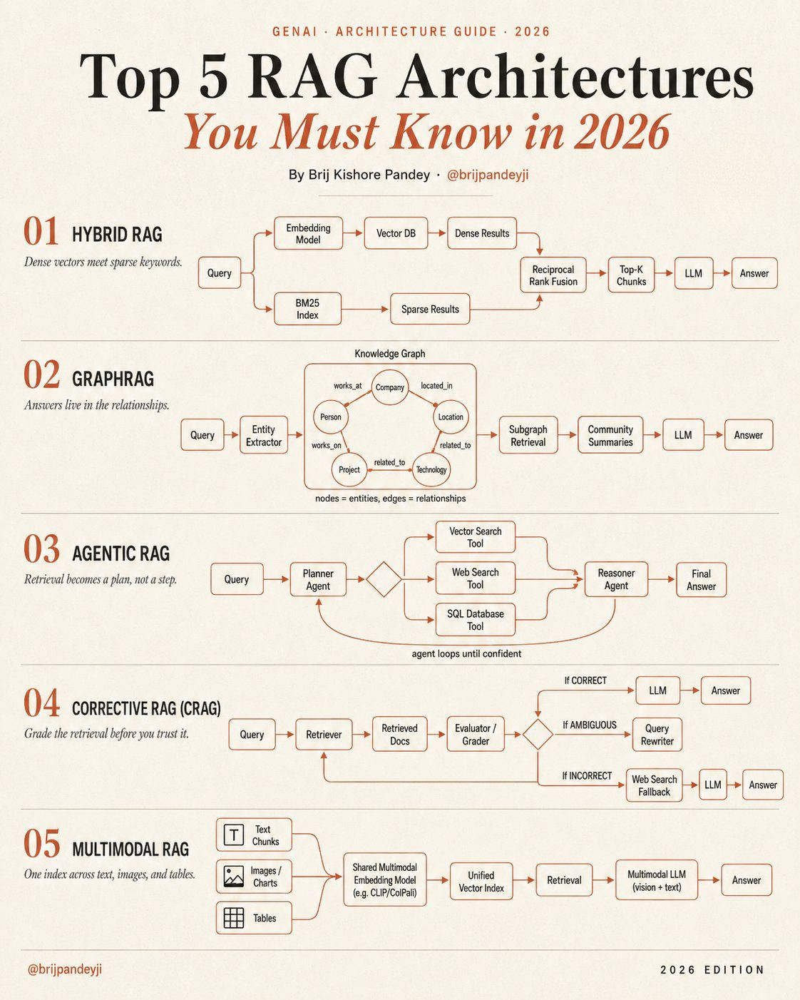
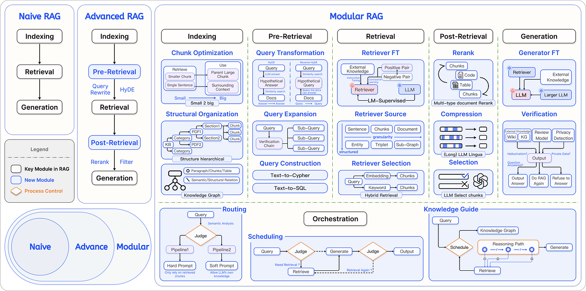

# Kiến trúc RAG
intro:>





# Tổng quát RAG base

## 1. RAG là gì?

**RAG (Retrieval-Augmented Generation)** là một kỹ thuật kết hợp giữa **truy xuất thông tin** (retrieval) và **mô hình sinh văn bản** (generation) nhằm cải thiện chất lượng câu trả lời của các mô hình ngôn ngữ lớn (LLM). Thay vì chỉ dựa vào kiến thức có sẵn trong tham số mô hình, RAG cho phép mô hình truy cập vào một kho tài liệu bên ngoài (knowledge base) để lấy thông tin liên quan đến câu hỏi, sau đó sinh ra câu trả lời dựa trên cả ngữ cảnh vừa truy xuất.

## 2. Tại sao cần RAG?

- **Giảm ảo giác (hallucination)**: Mô hình dựa vào dữ liệu thực tế thay vì "bịa" ra thông tin.
- **Cập nhật kiến thức dễ dàng**: Chỉ cần thay đổi kho tài liệu, không cần retrain mô hình.
- **Tăng tính minh bạch**: Có thể trích dẫn nguồn gốc thông tin.
- **Tiết kiệm chi phí**: Không cần fine-tune mô hình lớn cho mọi miền dữ liệu.

## 3. Cấu trúc chung của một hệ thống RAG

Một pipeline RAG điển hình gồm 3 giai đoạn chính:

1. **Indexing (Lập chỉ mục)**
   - Chia tài liệu thành các đoạn nhỏ (chunk).
   - Tạo embedding (vector) cho từng đoạn.
   - Lưu trữ các vector vào cơ sở dữ liệu vector (vector database).

2. **Retrieval (Truy xuất)**
   - Nhận câu hỏi từ người dùng, tạo embedding cho câu hỏi.
   - Tìm kiếm các đoạn tài liệu có embedding tương tự nhất (thường dùng cosine similarity).
   - Trả về top‑k đoạn liên quan nhất.

3. **Generation (Sinh câu trả lời)**
   - Kết hợp câu hỏi và các đoạn tài liệu truy xuất được thành một prompt.
   - Đưa prompt vào mô hình sinh (LLM) để tạo ra câu trả lời hoàn chỉnh.

---

## 4. Các mức độ phát triển của RAG

### 4.1. Naive RAG (RAG cơ bản)

Đây là phiên bản đơn giản nhất, thực hiện đúng ba bước trên mà không có bất kỳ tối ưu hay xử lý phức tạp nào.

- **Indexing**: Chia tài liệu cố định (thường dựa trên số từ hoặc câu), dùng embedding model đơn giản (ví dụ `all-MiniLM-L6-v2`), lưu vector bằng in‑memory hoặc FAISS.
- **Retrieval**: Embed câu hỏi, tìm top‑k đoạn gần nhất, trả về nguyên văn các đoạn đó.
- **Generation**: Ghép các đoạn tìm được vào prompt (thường là dạng `Context: ... Question: ... Answer:`), sinh câu trả lời.

**Hạn chế**:
- Chất lượng phụ thuộc nhiều vào kích thước chunk (nếu chunk quá ngắn thì thiếu ngữ cảnh, quá dài thì gây nhiễu).
- Không xử lý câu hỏi mơ hồ, không tái lập chỉ mục hay lọc kết quả.
- Dễ bị ảnh hưởng bởi các đoạn nhiễu.

### 4.2. Advanced RAG (RAG cải tiến)

Advanced RAG bổ sung các kỹ thuật **trước truy xuất (pre‑retrieval)** và **sau truy xuất (post‑retrieval)** để nâng cao độ chính xác.

#### Tiền xử lý trước khi truy xuất
- **Chunk Optimization**: Điều chỉnh kích thước chunk một cách thông minh (dựa trên ngữ nghĩa, ranh giới đoạn văn).
- **Query Rewrite**: Viết lại câu hỏi của người dùng thành nhiều biến thể hoặc dạng dễ truy xuất hơn.
- **HyDE (Hypothetical Document Embeddings)**: Mô hình sinh ra một đoạn văn giả định câu trả lời, sau đó dùng embedding của đoạn giả định đó để tìm kiếm.

#### Hậu xử lý sau khi truy xuất
- **Filter & Rerank**: Lọc bỏ các đoạn có điểm tương tự thấp, sắp xếp lại các đoạn theo mức độ liên quan hoặc đa dạng.
- **Context Compression**: Nén các đoạn truy xuất để loại bỏ thông tin trùng lặp hoặc không cần thiết trước khi đưa vào mô hình sinh.

> **Mục tiêu**: Giảm nhiễu, tăng độ chính xác và khả năng mở rộng.

### 4.3. Modular RAG (RAG mô‑đun hóa)

Modular RAG là kiến trúc linh hoạt nhất, cho phép thay thế, sắp xếp hoặc bổ sung các mô‑đun chuyên biệt tùy theo yêu cầu bài toán. Các mô‑đun có thể hoạt động tuần tự, song song hoặc có vòng lặp điều khiển.

#### Các mô‑đun điển hình

| Mô‑đun | Chức năng |
|--------|------------|
| **Query Router** | Phân tích câu hỏi, quyết định có cần truy xuất hay không, và nếu cần thì truy xuất từ đâu (ví dụ: từ vector store, knowledge graph, SQL, API). |
| **Query Scheduler** | Lên lịch và điều phối các bước truy xuất (ví dụ: truy xuất tuần tự hay song song, gọi retriever nhiều lần với các chiến lược khác nhau). |
| **Knowledge Graph Retriever** | Truy xuất thông tin từ đồ thị tri thức (knowledge graph) thay vì chỉ từ văn bản. Trả về các thực thể, quan hệ, hoặc đường dẫn suy luận. |
| **Reasoning Path Generator** | Tạo ra các bước suy luận trung gian dựa trên thông tin thu thập được, sau đó dùng để sinh câu trả lời cuối cùng. |
| **Judge / Evaluator** | Đánh giá chất lượng câu trả lời hoặc tính hợp lệ của các đoạn truy xuất; có thể kích hoạt lại quá trình truy xuất nếu cần. |
| **Orchestrator** | Điều phối toàn bộ quy trình, quyết định thứ tự thực hiện các mô‑đun, quản lý vòng lặp và luồng dữ liệu. |

#### Ví dụ một pipeline Modular RAG
1. **Routing**: Xác định câu hỏi cần truy xuất từ knowledge graph hay từ vector store (hoặc cả hai).
2. **Scheduling**: Gọi retriever văn bản và retriever đồ thị song song.
3. **Reasoning**: Kết hợp các kết quả, xây dựng một đường dẫn suy luận.
4. **Judge**: Kiểm tra xem đường dẫn có đủ cơ sở để trả lời không; nếu chưa, quay lại bước truy xuất thêm.
5. **Generation**: Sinh câu trả lời dựa trên đường dẫn suy luận đã được phê duyệt.

**Ưu điểm của Modular RAG**:
- Tái sử dụng và hoán đổi mô‑đun dễ dàng.
- Có thể kết hợp nhiều nguồn tri thức khác nhau (văn bản, đồ thị, cơ sở dữ liệu).
- Hỗ trợ các vòng lặp suy luận phức tạp, cải thiện khả năng lý luận của LLM.

---

## 5. Tổng kết

| Cấp độ         | Thành phần chính                                      | Độ phức tạp | Ứng dụng phổ biến                       |
|----------------|-------------------------------------------------------|-------------|------------------------------------------|
| **Naive RAG**  | Index → Retrieve → Generate                           | Thấp        | Chatbot đơn giản, Q&A trên văn bản nhỏ   |
| **Advanced RAG** | Thêm Query Rewrite, HyDE, Filter, Rerank            | Trung bình  | Hệ thống tư vấn, tìm kiếm chuyên sâu     |
| **Modular RAG**  | Router, Scheduler, KG Retriever, Reasoning, Judge   | Cao         | Trợ lý ảo doanh nghiệp, nghiên cứu khoa học |

RAG đang ngày càng trở thành kiến trúc chuẩn cho các ứng dụng dựa trên LLM, đặc biệt khi cần truy cập tri thức ngoài và cập nhật thường xuyên. Tùy vào nguồn lực và yêu cầu về độ chính xác, bạn có thể chọn một mức độ phù hợp từ Naive đến Modular.

> **Ghi chú**: Các module trong Advanced RAG và Modular RAG có thể được xây dựng dần dần từ code Naive RAG đã có, bằng cách bổ sung các lớp xử lý trước và sau mà không làm thay đổi pipeline cốt lõi.

# Tổng quát RAG Architecture Nâng cao 2026

## Giới thiệu chung
**Retrieval-Augmented Generation (RAG)** đã phát triển vượt xa mô hình “truy xuất đơn thuần + sinh văn bản”. Năm 2026, các kiến trúc RAG được tối ưu hóa theo từng mục tiêu riêng: tăng độ chính xác bằng cách kết hợp nhiều phương pháp truy xuất (hybrid), khai thác mối quan hệ thực thể (GraphRAG), biến việc truy xuất thành kế hoạch có suy luận (Agentic RAG), tự đánh giá và sửa lỗi (Corrective RAG), và hỗ trợ đa phương thức (Multimodal RAG). Dưới đây là giải thích chi tiết từng kiến trúc.

## 01. HYBRID RAG – Kết hợp vector mật độ và từ khóa thưa

```
Hybrid RAG: Dense Vector Search + Sparse BM25 → Reciprocal Rank Fusion → LLM
```

### Khái niệm
__Hybrid RAG__ kết hợp __dense retrieval__ (dùng embedding vector) với __sparse retrieval__ (dùng BM25 / TF‑IDF) để tận dụng ưu điểm của cả hai: dense hiểu ngữ nghĩa, sparse bắt chính xác từ khóa. Kết quả từ hai nhánh được gộp bằng __Reciprocal Rank Fusion__ (RRF) để chọn ra top‑K chunk tốt nhất.


### Pipeline chi tiết
```
Query → Dense Retrieval ─┐
      → BM25 Retrieval  ─┴→ RRF → Top-K chunks → LLM → Answer
```

#### 1. Nhập câu hỏi (Query)

Người dùng nhập câu hỏi bằng ngôn ngữ tự nhiên.

#### 2. Nhánh Dense (Vector)
- __Embedding Model__: Dùng mô hình như `sentence-transformers/all‑mpnet‑base‑v2` hoặc `BAAI/bge‑large‑en` để biến câu hỏi thành vector mật độ (thường 384‑1024 chiều).

- __Vector DB__: Lưu trữ các chunk tài liệu dưới dạng vector (ví dụ: FAISS, Qdrant, Pinecone).

- __Truy xuất dense__: Tính cosine similarity giữa vector câu hỏi và tất cả vector chunk, trả về danh sách `dense_results` kèm độ tương tự.

#### 3. Nhánh Sparse (Keyword)

- __BM25 Index__: Một chỉ mục dạng inverted index (từ → danh sách tài liệu) dùng công thức __BM25__ (phiên bản cải tiến của TF‑IDF), đo lường mức độ liên quan dựa trên tần suất từ khóa.

- __Truy xuất sparse__: Câu hỏi được tách từ, tìm trong index, trả về `sparse_results` với điểm BM25.

#### 4. Reciprocal Rank Fusion (RRF)

- **Mục đích**: Gộp hai danh sách kết quả (mỗi danh sách có thứ hạng riêng) mà không bị thiên lệch về giá trị tuyệt đối.

- **Công thức**:
    - Với mỗi chunk xuất hiện trong ít nhất một danh sách, điểm **RRF = ∑( 1 / (k + rank))** , trong đó k là hằng số (thường 60), rank là vị trí của chunk trong danh sách (bắt đầu từ 1).

- **Kết quả**: Danh sách chunk được sắp xếp theo điểm __RRF giảm dần → top‑K chunk__.

#### 5. LLM sinh câu trả lời
Các chunk được đưa vào context của __LLM__ (ví dụ GPT‑4, Llama 3) cùng câu hỏi để sinh câu trả lời cuối cùng.

### Chú thích nhỏ
- __Dense vector__: Biểu diễn ngữ nghĩa của câu, có thể bắt được các từ đồng nghĩa, ngữ cảnh.

- __Sparse vector (BM25)__: Dựa trên sự xuất hiện chính xác của từ; rất mạnh khi câu hỏi chứa tên riêng, mã số, thuật ngữ chuyên ngành hiếm.

- __RRF__: Giải quyết vấn đề chuẩn hóa thang điểm (dense dùng cosine 0..1, sparse dùng điểm BM25 không giới hạn), đồng thời ưu tiên các chunk xuất hiện ở thứ hạng cao ở cả hai nhánh.

### Ưu điểm
- Tăng độ chính xác và recall so với chỉ dùng một loại truy xuất.

- Chống lại các trường hợp embedding hiểu sai ngữ nghĩa nhưng từ khóa đúng.

### Nhược điểm
- Tốn tài nguyên lưu cả vector index và BM25 index.

- Cần tinh chỉnh tham số __RRF__ (hằng số k) và trọng số giữa hai nhánh.

## 02. GRAPHRAG – Câu trả lời nằm trong các mối quan hệ

### Khái niệm
__GraphRAG__ thay vì tìm đoạn văn bản, xây dựng __đồ thị tri thức__ từ tài liệu. Các thực thể (người, công ty, dự án, công nghệ) là các nút (node), các __quan hệ__ (làm việc cho, liên quan đến, đặt tại) là các cạnh (edge). Khi có câu hỏi, hệ thống trích xuất thực thể, truy xuất subgraph liên quan, tóm tắt các cộng đồng (community summaries) rồi sinh câu trả lời.

### Pipeline chi tiết
```
Query → Entity Extraction → KG Subgraph Retrieval → Community Summary → LLM → Answer
```

#### 1. Xây dựng Knowledge Graph (offline)

-Từ bộ tài liệu, dùng __Entity Extractor__ (có thể dựa trên NLP hoặc LLM) để nhận diện các thực thể và quan hệ giữa chúng.

Đồ thị kết quả: ví dụ `Person -[works_at]-> Company`, `Company -[located_in]-> City`, `Project -[related_to]-> Technology`.

#### 2. Truy vấn
- __Query__: Nhập câu hỏi “Những công nghệ nào được dùng trong dự án X?”

#### 3. Subgraph Retrieval

- Trích xuất các thực thể từ câu hỏi (ví dụ: dự án X).

- Duyệt đồ thị để lấy các nút và cạnh liên quan đến thực thể đó (có thể theo độ sâu 2‑3 bước).

- Trả về một __subgraph__ (đồ thị con) chứa thông tin cần thiết.

#### 4. Community Summaries

- Để tránh quá tải thông tin, __GraphRAG__ chia đồ thị thành các “cộng đồng” (cụm thực thể liên kết chặt chẽ).

- Mỗi cộng đồng được tóm tắt bằng một đoạn văn ngắn (dùng LLM). Các tóm tắt này được lưu cache.

- Khi truy xuất, chỉ cần lấy tóm tắt của cộng đồng chứa subgraph thay vì toàn bộ đồ thị.

#### 5. LLM sinh câu trả lời

- Prompt bao gồm câu hỏi + các tóm tắt cộng đồng + subgraph quan trọng (dạng văn bản hoặc danh sách `(entity, relation, entity)`).

- LLM trả lời dựa trên các mối quan hệ có cấu trúc.

### Chú thích nhỏ
- __Entity Extractor__: Có thể dùng mô hình NER (Spacy, Stanza) hoặc LLM với few‑shot prompting để trích xuất (người, tổ chức, địa điểm, công nghệ…).

- __Knowledge Graph__: Lưu trữ dạng RDF, Property Graph (Neo4j) hoặc in‑memory.

- __Subgraph Retrieval__: Kỹ thuật truy xuất dựa trên khớp thực thể và mở rộng lan truyền (BFS/DFS).

- __Community Summaries__: Phương pháp phát hiện cộng đồng (Louvain, Leiden) sau đó sinh tóm tắt cho từng cụm, giúp giảm kích thước context và tăng tốc.

### Ưu điểm
- Trả lời các câu hỏi cần suy luận qua nhiều bước quan hệ (ví dụ “Tìm các dự án do người A làm việc ở công ty B thực hiện”).

- Tận dụng cấu trúc tri thức chính xác, giảm ảo giác.

### Nhược điểm
- Xây dựng đồ thị từ văn bản phi cấu trúc rất tốn kém và dễ sai.

- Khó cập nhật động khi có tài liệu mới.

## 03. AGENTIC RAG – Truy xuất trở thành một kế hoạch

### Khái niệm

Agentic RAG biến quy trình truy xuất thành một __kế hoạch do tác tử lập kế hoạch (Planner Agent)__. Thay vì gọi một lần retriever, một __Planner Agent__ quyết định nên gọi tool nào (vector search, web search, SQL database, …) và thứ tự gọi, lặp lại nhiều bước. Sau mỗi bước, __Reasoner Agent__ đánh giá thông tin đã đủ chưa; nếu chưa, quay lại Planner để lấy thêm dữ liệu. Cuối cùng ra câu trả lời.

### Pipeline chi tiết
```
Query → Planner → [Tool Loop: Vector / Web / SQL] → Reasoner → Answer
```

#### 1. Nhập câu hỏi
Ví dụ: “So sánh giá cổ phiếu của __Nvidia và AMD__ trong tháng qua, đồng thời cho biết tin tức mới nhất về sản phẩm AI của họ.”


#### 2. Planner Agent

- Dùng một LLM (GPT‑4, Claude) được prompt để lập kế hoạch với các tool có sẵn:

    - `Vector Search Tool`: tìm kiếm trong tài liệu nội bộ (báo cáo tài chính).

    - `Web Search Tool`: tìm kiếm tin tức mới trên web.

    - `SQL Database Tool`: truy vấn cơ sở dữ liệu bảng giá lịch sử.

- Planner tạo ra một chuỗi các bước:
    - _Bước 1_: Gọi SQL DB lấy giá Nvidia, AMD.
    - _Bước 2_: Gọi Web Search để lấy tin tức.
    - _Bước 3_: Gọi Vector Search lấy tài liệu so sánh kiến trúc.

#### 3. Thực thi và Reasoner Agent

- Sau mỗi tool, kết quả được gửi vào Reasoner Agent (cũng là LLM).

- Reasoner đánh giá: “Đã có giá cổ phiếu? Đã có tin tức? Còn thiếu báo cáo phân tích không?”

- Nếu thiếu, Reasoner gợi ý cho Planner bổ sung bước mới (ví dụ cần tìm thêm doanh thu quý).

- Vòng lặp __agent loops until confident__ tiếp tục cho đến khi Reasoner cho rằng đủ thông tin.

#### 4. Sinh câu trả lời cuối cùng

- Tất cả kết quả từ các tool được tổng hợp, Reasoner (hoặc một Generator riêng) viết câu trả lời hoàn chỉnh.

### Chú thích nhỏ
- __Planner Agent__: LLM được cung cấp danh sách tool (tên, mô tả, input/output). Planner sinh ra lệnh gọi tool (function calling) dạng JSON.

- __Tool__: Mỗi tool là một hàm cụ thể (gọi API, truy vấn DB, search web). Có thể có tool “tổng hợp kết quả” hoặc tool “tính toán”.

- __Reasoner Agent__: LLM khác (hoặc cùng nhưng với role khác) có nhiệm vụ đánh giá mức độ hoàn chỉnh của thông tin. Có thể sử dụng một hệ thống điểm tin cậy.

-__Vòng lặp agent__: Đây là điểm khác biệt chính so với RAG thường; không cố định số bước mà dừng khi đủ tự tin.

### Ưu điểm
- Rất linh hoạt, có thể kết hợp vô số nguồn dữ liệu khác nhau.

- Giải quyết được câu hỏi phức hợp cần nhiều bước truy xuất và suy luận.

- Tự điều chỉnh kế hoạch khi thiếu thông tin.

### Nhược điểm
- Chi phí token cao vì phải gọi LLM nhiều lần (Planner, Reasoner, Generation).

- Có thể rơi vào vòng lặp vô hạn nếu không giới hạn số bước.

- Độ phức tạp lập trình cao.

## 04. CORRECTIVE RAG (CRAG) – Đánh giá chất lượng truy xuất trước khi tin tưởng

### Khái niệm
__CRAG__ thêm một bước __Evaluator / Grader__ sau khi truy xuất. Bộ đánh giá sẽ xếp hạng các tài liệu được retrieve thành ba loại: __CORRECT__ (đúng và liên quan), __AMBIGUOUS__ (mơ hồ, không rõ ràng), __INCORRECT__ (sai hoặc không liên quan). Tùy theo loại mà có hành động:

- __CORRECT__: Dùng ngay để sinh câu trả lời.

- __AMBIGUOUS__: Có thể thử truy xuất lại với truy vấn được viết lại hoặc kết hợp thêm nguồn khác.

- __INCORRECT__: Bỏ qua kết quả này, thực hiện __Web Search Fallback__ (tìm kiếm web thay thế).

### Pipeline chi tiết
```
Query → Retriever → Evaluator ──CORRECT──→ LLM → Answer
                             ├─AMBIGUOUS─→ Rewriter → Re-retrieve → LLM → Answer
                             └─INCORRECT─→ Web Search → LLM → Answer
```

#### 1. Retriever (có thể là dense, sparse hoặc hybrid) lấy ra N tài liệu (chunk).

#### 2. Evaluator / Grader

- Là một mô hình phân loại nhẹ (có thể dùng LLM hoặc mô hình fine‑tune như `cross‑encoder/ms‑marco‑MiniLM‑L‑6‑v2`).

- Đầu vào: cặp (câu hỏi, mỗi tài liệu). Đầu ra: điểm từ 0 đến 1 hoặc nhãn `CORRECT`/`AMBIGUOUS`/`INCORRECT`.

- Ví dụ: Dùng LLM với prompt “_Hãy đánh giá mức độ liên quan của tài liệu sau đối với câu hỏi. Trả lời **CORRECT** nếu trực tiếp trả lời, **AMBIGUOUS** nếu mơ hồ, **INCORRECT** nếu không liên quan._”

#### 3. Phân nhánh theo kết quả

- __CORRECT__: Các tài liệu này được giữ nguyên.

- __AMBIGUOUS__: Kích hoạt module __Query Rewrite__ (dùng LLM viết lại câu hỏi theo cách khác) và chạy lại retriever, sau đó đánh giá lại.

- __INCORRECT__: Loại bỏ tài liệu đó. Nếu toàn bộ tài liệu đều INCORRECT, chuyển sang __Web Search Fallback__ (gọi API tìm kiếm web, lấy top‑K kết quả, sau đó sinh câu trả lời từ web).

#### 4. LLM sinh câu trả lời với các tài liệu đã được xác nhận là CORRECT.

### Chú ý nhỏ
- __Grader__: Có thể là một mô hình nhị phân (liên quan/không liên quan) hoặc ba lớp. Độ chính xác của grader quyết định hiệu quả của CRAG.

- __Query Rewrite__: Khi tài liệu bị gán nhãn AMBIGUOUS, có thể do câu hỏi quá mơ hồ; viết lại câu hỏi thành các câu cụ thể hơn.

- __Web Search Fallback__: Cơ chế dự phòng khi retriever nội bộ thất bại hoàn toàn. Gọi Google Search API, Bing Search, hoặc DuckDuckGo, lấy nội dung từ web.

### Ưu điểm
- Giảm thiểu ảo giác do sử dụng tài liệu sai.

- Tự động phục hồi khi không tìm thấy thông tin trong kho lưu trữ.

- Có thể kết hợp với bất kỳ retriever nào.

### Nhược điểm
- Tốn thêm một bước suy luận (grader), tăng độ trễ.

- Nếu grader kém, có thể loại bỏ nhầm tài liệu hữu ích hoặc giữ lại tài liệu xấu.

- Web search fallback có thể mang thông tin không chính xác từ web.

## 05. MULTIMODAL RAG – Một chỉ mục xuyên suốt văn bản, hình ảnh và bảng biểu

### Khái niệm
Multimodal RAG cho phép truy xuất và sinh câu trả lời dựa trên nhiều loại dữ liệu: văn bản, hình ảnh, biểu đồ, bảng số liệu. Điểm then chốt là dùng một mô hình embedding __đa phương thức__ (ví dụ CLIP, CoPali, ImageBind) để chiếu cả text và ảnh vào cùng một không gian vector. Khi truy vấn, câu hỏi văn bản cũng được chiếu vào không gian đó, tìm ra cả chunk văn bản và ảnh gần nhất. Cuối cùng dùng một __Multimodal LLM__ (có khả năng nhìn và đọc, như GPT‑4V, LLaVA, Gemini) để sinh câu trả lời có thể mô tả cả nội dung ảnh.

### Pipeline chi tiết
```
Text Chunks ─┐
Images      ─┼→ Multimodal Embedder → Unified Index → Retrieval → Boost → MLLM → Answer
Tables      ─┘
```

#### 1. Tiền xử lý dữ liệu đa phương thức

- __Text Chunks__: Tài liệu văn bản được chia nhỏ thành các đoạn.

- __Images / Charts__: Các hình ảnh, biểu đồ, bảng biểu (có thể được chuyển thành text mô tả bằng OCR hoặc captioning, nhưng cách tối ưu là giữ nguyên ảnh).

- Đối với bảng (table), có thể lưu cả dạng ảnh và dạng markdown.

#### 2. Shared Multimodal Embedding Model

- Dùng một mô hình như __CLIP__ (Contrastive Language-Image Pre-training) hoặc __CoPali__ (hỗ trợ tài liệu có bảng, biểu đồ).

- Mô hình này nhận đầu vào là cặp (văn bản, ảnh) và tạo ra vector sao cho ảnh và mô tả văn bản tương ứng có vector gần nhau.

- __Quy trình__: Mỗi chunk văn bản và mỗi ảnh (hoặc bảng dạng ảnh) được chạy qua mô hình embedding để tạo vector. Tất cả vector được lưu vào __Unified Vector Index__ (một cơ sở dữ liệu vector duy nhất).

#### 3. Retrieval

- Câu hỏi (text) được biến thành vector bằng cùng mô hình embedding đa phương thức.

- Truy vấn vector index để tìm top‑K đối tượng gần nhất. Kết quả có thể là một hỗn hợp: một số văn bản, một số hình ảnh, thậm chí bảng.

#### 4. Multimodal LLM Generation

- Các đối tượng retrieved (cả text và ảnh) được đưa vào một __Multimodal LLM (VLM)__. LLM này có thể xử lý token ảnh (vision token) song song với token text.

- Prompt có thể dạng: “_Dựa trên các đoạn văn bản và hình ảnh sau, hãy trả lời câu hỏi: ..._”.

- Mô hình sinh ra câu trả lời, có thể nhắc đến chi tiết trong ảnh (ví dụ “biểu đồ cho thấy doanh thu tăng 20%”).

### Chú ý nhỏ
- __Multimodal Embedding Model__: CLIP (do OpenAI) là phổ biến, nhưng các mô hình mới như __ImageBind__ (Meta) hỗ trợ thêm âm thanh, video. __CoPali__ (của Google) tối ưu cho tài liệu có bảng biểu phức tạp.

- __Unified Vector Index__: Cần lưu trữ vector của các loại dữ liệu khác nhau. Vì cùng không gian embedding, có thể dùng một index duy nhất __(FAISS, Vespa, Qdrant)__. Phải lưu kèm loại dữ liệu __(text/image)__ để sau gửi đúng kiểu cho Multimodal LLM.

- __Multimodal LLM__: Khác với LLM thuần text, các mô hình này (GPT‑4V, Gemini Pro Vision, LLaVA‑1.6) nhận đầu vào là interleaved image-text. Cần có khả năng “hiểu” được bố cục hình ảnh, biểu đồ.

### Ưu điểm
- Trả lời các câu hỏi liên quan đến biểu đồ, hình ảnh minh họa (ví dụ: “Hãy mô tả biểu đồ tăng trưởng của công ty”).

- Tận dụng được dữ liệu đa dạng trong doanh nghiệp (báo cáo có ảnh, slide thuyết trình, sơ đồ kiến trúc).

### Nhược điểm
- Chi phí lưu trữ cao (ảnh chiếm nhiều bộ nhớ, vector cho ảnh cũng có chiều lớn).

- Multimodal LLM thường đắt hơn và chậm hơn LLM text thuần.

- Chất lượng embedding đa phương thức chưa hoàn hảo, đặc biệt với biểu đồ trừu tượng.

## 06. Tổng kết 
| Kiến trúc          | Điểm mạnh chính                                   | Hạn chế chính                                     | Ứng dụng điển hình                          |
|--------------------|----------------------------------------------------|----------------------------------------------------|----------------------------------------------|
| **Hybrid RAG**     | Kết hợp ngữ nghĩa + từ khóa, tăng độ chính xác     | Tốn tài nguyên lưu hai index, cần điều chỉnh RRF   | Search doanh nghiệp, QA kỹ thuật             |
| **GraphRAG**       | Suy luận qua các mối quan hệ, cấu trúc hóa tri thức| Xây dựng KG khó và tốn kém                         | Hệ thống tri thức, khám phá dược phẩm        |
| **Agentic RAG**    | Linh hoạt, dùng nhiều tool, giải quyết bài toán phức| Chi phí token cao, có thể loop vô hạn              | Trợ lý ảo đa nhiệm, nghiên cứu thị trường    |
| **Corrective RAG** | Tự đánh giá và sửa lỗi, có fallback web search     | Phụ thuộc vào độ chính xác của grader, tăng độ trễ | Chatbot an toàn cao, hỗ trợ khách hàng       |
| **Multimodal RAG** | Xử lý được văn bản, ảnh, bảng cùng lúc             | Chi phí cao, model đa phương thức chưa hoàn hảo    | Phân tích báo cáo tài chính có biểu đồ, giáo dục |