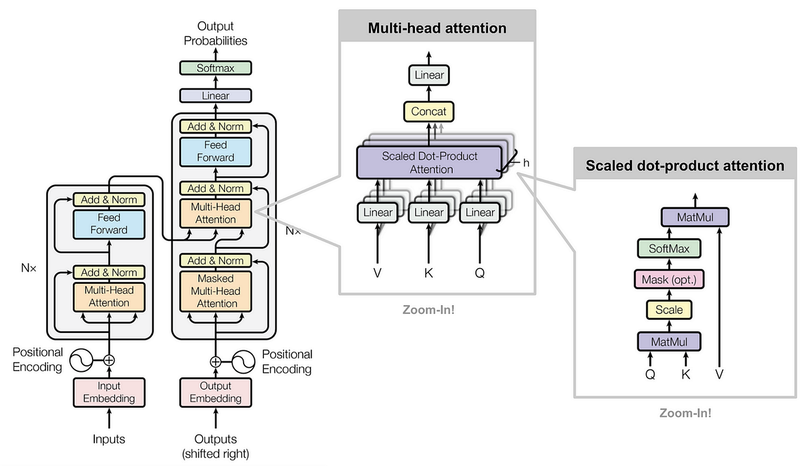
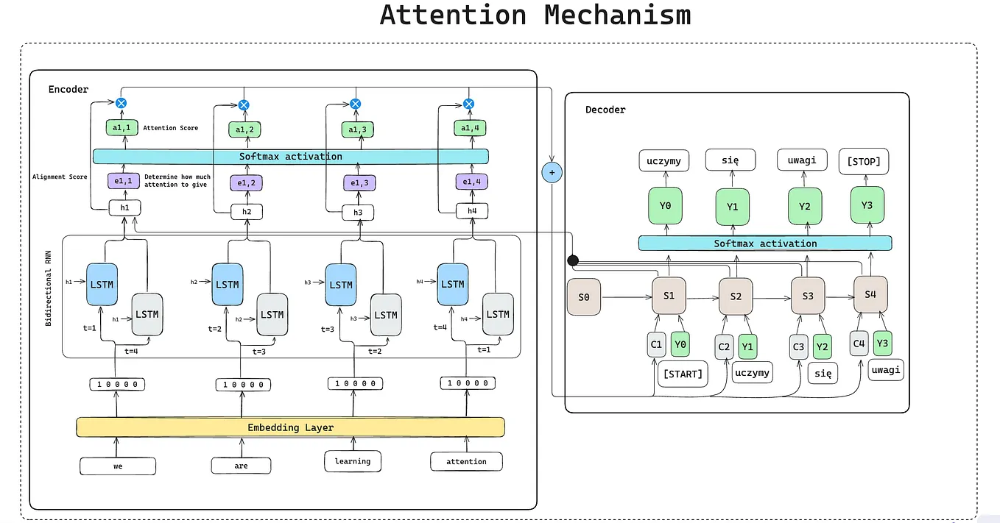
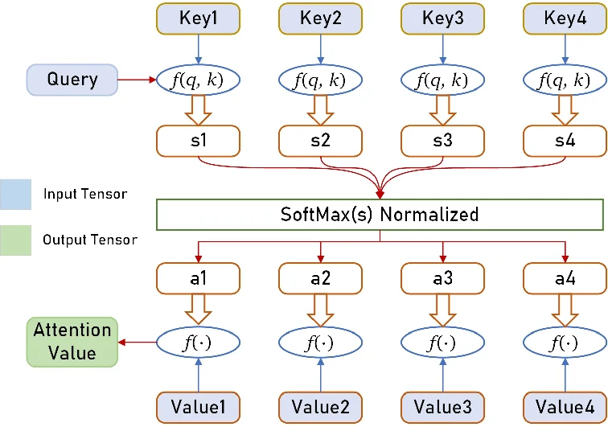
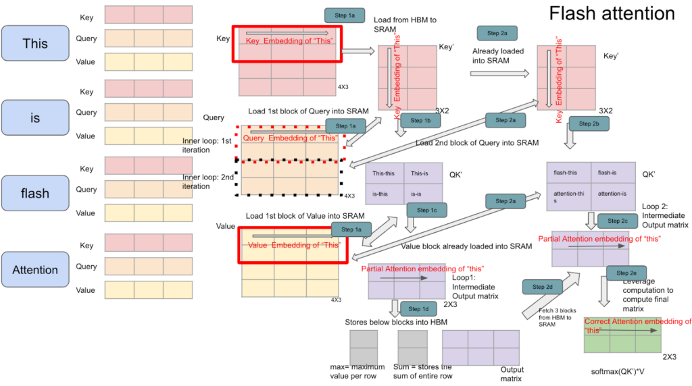

# Attention Mechanism, Transformer và FlashAttention



---

# 1. Tổng quan

Attention Mechanism là một trong những phát minh quan trọng nhất của Deep Learning hiện đại, giải quyết hạn chế của RNN/LSTM trong việc biểu diễn các phụ thuộc dài hạn (long-range dependencies).

Ý tưởng cốt lõi:

> Khi xử lý một token, mô hình không cần ghi nhớ toàn bộ chuỗi trong một vector duy nhất, mà có thể "chú ý" trực tiếp tới những token quan trọng nhất trong ngữ cảnh.

Attention trở thành nền tảng cho:

- Seq2Seq + Attention
- Transformer
- BERT
- GPT
- LLaMA
- Claude
- Gemini
- Mọi Large Language Model hiện đại

---

# 2. Từ Seq2Seq đến Attention

## Seq2Seq cổ điển

Kiến trúc ban đầu:

```text
Input Sentence
      ↓
 Encoder RNN/LSTM
      ↓
 Context Vector
      ↓
 Decoder RNN/LSTM
      ↓
 Output Sentence
```

Encoder phải nén toàn bộ câu thành một vector duy nhất:

```math
c = h_T
```

với:

- \(h_T\): hidden state cuối cùng

Vấn đề:

- Câu càng dài càng mất thông tin
- Gradient khó lan truyền
- Hiệu suất dịch giảm mạnh với chuỗi dài

---

# 3. Attention Mechanism

## Ý tưởng

Thay vì dùng duy nhất:

```math
h_T
```

Decoder sẽ truy cập toàn bộ:

```math
h_1,h_2,...,h_n
```

của Encoder.

---



---

Tại mỗi bước giải mã:

```math
s_t
```

Decoder tính mức độ liên quan giữa:

```math
s_t
```

và từng:

```math
h_i
```

---

# 4. Alignment Score

Tính điểm phù hợp:

```math
e_{t,i}
=
score(s_t,h_i)
```

Một số hàm score phổ biến:

## Dot Product

```math
e_{t,i}
=
s_t^T h_i
```

---

## General

```math
e_{t,i}
=
s_t^T W h_i
```

---

## Additive Attention (Bahdanau)

```math
e_{t,i}
=
v^T
\tanh(W_s s_t + W_h h_i)
```

---

# 5. Attention Weights

Chuẩn hóa bằng Softmax:

```math
\alpha_{t,i}
=
\frac{
\exp(e_{t,i})
}
{
\sum_j \exp(e_{t,j})
}
```

Tính chất:

```math
\sum_i \alpha_{t,i}=1
```

---

# 6. Context Vector

Context vector:

```math
c_t
=
\sum_i
\alpha_{t,i} h_i
```

Ý nghĩa:

- Token quan trọng nhận trọng số lớn
- Token ít liên quan nhận trọng số nhỏ

---

# 7. Decoder Prediction

Decoder kết hợp:

```math
c_t
```

và:

```math
s_t
```

để dự đoán token tiếp theo:

```math
y_t
=
Softmax(W_o[s_t;c_t])
```

---

# 8. Self-Attention

Attention truyền thống:

```text
Decoder
    ↓
Encoder States
```

Transformer mở rộng thành:

```text
Sequence
    ↓
Sequence
```

Mỗi token có thể nhìn thấy toàn bộ token khác.

---

# 9. Query, Key, Value



Attention có thể được xem như một hệ thống truy vấn thông tin.
```
Query  : Điều đang cần tìm
Key    : Mô tả nội dung đang có
Value  : Thông tin thực sự cần lấy
```

Transformer biểu diễn mỗi token bằng ba vector:

```math
Q = XW_Q
```

```math
K = XW_K
```

```math
V = XW_V
```

Trong đó:

- Query: thông tin cần tìm
- Key: thông tin để so khớp
- Value: thông tin cần lấy

---

## Step 1: So khớp Query với từng Key
Với mỗi key:
$$K_i$$

Ta tính:
$$s_i = f(Q, K_i)$$

Thông thường:
$$s_i = QK_i^T$$

Các giá trị:
$$s_1, s_2, s_3, s_4$$

được gọi là: `Attention Scores` hay `Similarity Scores`

## Step 2: Chuẩn hóa bằng Softmax
Các score chưa phải xác suất.

Dó đó:
$$a_i = \frac {e^{s_i}} {\sum_j e^{s_j}}$$

Sau Softmax:
$$a_1 + a_2 + a_3 + a_4 = 1$$

Ý nghĩa: $a_i$ là mức độ chú ý dành cho token thứ i.

## Step 3: Trọng số hóa các Value
Mỗi Value:
$$V_i$$

Được nhân với attention weight:
$$a_i V_i$$

## Step 4: Tổng hợp Context Vector
Kết quả cuối cùng:
$$Output = \sum_i a_i V_i$$

Hay:
$$Output = a_1 V_1 + a_2 V_2 + a_3 V_3 + a_4 V_4$$

Đây chính là $Attention(Q, K, V)$ ở dạng đơn giản nhất.

---

# 10. Scaled Dot Product Attention

Đây là trái tim của Transformer.

---


---

## Bước 1

Tính độ tương đồng:

```math
QK^T
```

Nếu:

```math
Q \in \mathbb R^{n\times d_k}
```

```math
K \in \mathbb R^{n\times d_k}
```

thì:

```math
QK^T
\in
\mathbb R^{n\times n}
```

---

## Bước 2

Scale:

```math
\frac{QK^T}{\sqrt{d_k}}
```

Lý do:

Khi chiều vector lớn:

```math
QK^T
```

có phương sai lớn.

Softmax sẽ bão hòa.

Do đó:

```math
\sqrt{d_k}
```

được dùng để chuẩn hóa.

---

## Bước 3

Mask (nếu cần)

Decoder sử dụng:

```math
Mask
```

để che tương lai.

```text
Token i
không được nhìn thấy
token > i
```

---

## Bước 4

Softmax

```math
A
=
Softmax
\left(
\frac{QK^T}{\sqrt{d_k}}
\right)
```

Ma trận:

```math
A
```

là attention weights.

---

## Bước 5

Weighted Sum

```math
Output
=
AV
```

Công thức hoàn chỉnh:

```math
Attention(Q,K,V)
=
Softmax
\left(
\frac{QK^T}
{\sqrt{d_k}}
\right)
V
```

Đây là công thức quan trọng nhất của Transformer.

---

# 11. Multi-Head Attention

Một attention duy nhất có thể bỏ sót nhiều kiểu quan hệ.

Transformer dùng nhiều head song song.

---

Giả sử:

```math
h
```

heads.

Head thứ i:

```math
head_i
=
Attention
(
QW_i^Q,
KW_i^K,
VW_i^V
)
```

---

Ghép lại:

```math
Concat
(
head_1,
...
head_h
)
```

---

Chiếu tuyến tính:

```math
MHA
=
Concat(head_1,...,head_h)W_O
```

---

Ý nghĩa:

Một head có thể học:

- Quan hệ ngữ pháp
- Chủ ngữ – động từ
- Đồng tham chiếu
- Quan hệ ngữ nghĩa

trong khi head khác học cấu trúc khác.

---

# 12. Transformer Encoder

Một Encoder Layer gồm:

```text
Multi Head Attention
        ↓
Add & Norm
        ↓
Feed Forward
        ↓
Add & Norm
```

---

## Residual Connection

```math
y=x+F(x)
```

Giúp:

- Gradient ổn định
- Mạng sâu hơn

---

## Layer Normalization

```math
LN(x)
=
\gamma
\frac{x-\mu}{\sigma}
+
\beta
```

---

# 13. Position-wise Feed Forward Network

Sau attention:

```math
FFN(x)
=
W_2
\sigma(W_1x+b_1)
+b_2
```

Thường:

```text
d_model
   ↓
4*d_model
   ↓
d_model
```

Ví dụ:

```text
768
 ↓
3072
 ↓
768
```

---

# 14. Transformer Decoder

Decoder gồm:

## Masked Self Attention

Ngăn nhìn tương lai.

---

## Cross Attention

```text
Query  ← Decoder
Key    ← Encoder
Value  ← Encoder
```

Cho phép Decoder tham khảo đầu ra Encoder.

---

## Feed Forward

Khối xử lý phi tuyến.

---

# 15. Complexity của Self-Attention

Với:

```math
n
```

tokens.

Attention matrix:

```math
QK^T
```

có kích thước:

```math
n\times n
```

---

Thời gian:

```math
O(n^2)
```

---

Bộ nhớ:

```math
O(n^2)
```

---

Ví dụ:

```text
n = 32k tokens
```

Attention matrix rất lớn.

Đây là nút thắt của LLM hiện đại.

---

# 16. FlashAttention

FlashAttention được đề xuất để giải quyết vấn đề:

```text
Attention quá tốn bộ nhớ GPU
```

---



---

## Ý tưởng cốt lõi

Attention truyền thống:

```text
HBM
↓
QKᵀ
↓
HBM
↓
Softmax
↓
HBM
↓
Output
```

Liên tục đọc/ghi từ:

```text
HBM
(High Bandwidth Memory)
```

rất đắt đỏ.

---

FlashAttention:

```text
Load block
↓
Compute
↓
Discard
↓
Load next block
```

Không lưu toàn bộ:

```math
QK^T
```

vào bộ nhớ.

---

# 17. Tiling

Chia:

```math
Q,K,V
```

thành các block nhỏ.

Ví dụ:

```text
Q:
[Q1 Q2 Q3]

K:
[K1 K2 K3]

V:
[V1 V2 V3]
```

---

Tính toán theo từng tile:

```text
Q1 × K1
Q1 × K2
Q1 × K3
```

---

Sau đó:

```text
Q2 × K1
Q2 × K2
Q2 × K3
```

---

Không cần tạo toàn bộ:

```math
n \times n
```

attention matrix.

---

# 18. Online Softmax

Softmax thông thường:

```math
Softmax(x_i)
=
\frac{e^{x_i}}
{\sum_j e^{x_j}}
```

Cần toàn bộ hàng.

---

FlashAttention dùng:

```text
running max
running sum
```

để tính Softmax theo block.

---

Duy trì:

```math
m_i
```

max hiện tại

và:

```math
l_i
```

tổng hiện tại.

---

Nhờ vậy:

```text
Không cần lưu toàn bộ score matrix.
```

---

# 19. Độ phức tạp

## Standard Attention

Memory:

```math
O(n^2)
```

---

## FlashAttention

Memory:

```math
O(n)
```

---

Thời gian lý thuyết:

```math
O(n^2)
```

vẫn giữ nguyên.

---

Nhưng:

```text
GPU utilization ↑
Memory traffic ↓
Speed ↑
```

---

# 20. FlashAttention v2

Cải tiến:

- Parallelism tốt hơn
- Work partitioning hiệu quả hơn
- Occupancy GPU cao hơn

Được sử dụng trong:

- GPT-4 class models
- LLaMA
- Mistral
- Qwen
- Claude class architectures

---

# 21. Tóm tắt

## Attention

```math
c_t
=
\sum_i \alpha_i h_i
```

Cho phép mô hình tập trung vào thông tin quan trọng.

---

## Self Attention

```math
Attention(Q,K,V)
=
Softmax
\left(
\frac{QK^T}
{\sqrt{d_k}}
\right)V
```

Là nền tảng của Transformer.

---

## Multi Head Attention

```math
MHA
=
Concat(head_1,...,head_h)W_O
```

Cho phép học nhiều kiểu quan hệ song song.

---

## Transformer

```text
Embedding
    ↓
Positional Encoding
    ↓
Multi Head Attention
    ↓
Feed Forward
    ↓
Stack N Layers
```

---

## FlashAttention

```text
Block-wise Attention
+
Online Softmax
+
SRAM Friendly
```

Giảm mạnh chi phí bộ nhớ và tăng tốc huấn luyện/suy luận của các Large Language Models hiện đại.