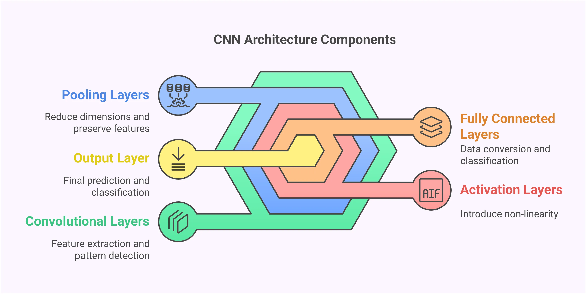

# Convolutional Neural Network (CNN)

## Mục tiêu
Folder này giúp hiểu cách một mạng CNN xử lý ảnh từ đầu đến cuối bằng cách trực quan hóa từng bước biến đổi dữ liệu.

Thay vì huấn luyện trên hàng nghìn ảnh, chúng ta chỉ sử dụng một ảnh duy nhất để quan sát:

1. Ảnh được biểu diễn dưới dạng ma trận như thế nào
2. Convolution hoạt động ra sao
3. Kernel phát hiện đặc trưng gì
4. Padding ảnh hưởng thế nào
5. Stride làm giảm kích thước ra sao
6. Activation ReLU thay đổi dữ liệu như thế nào
7. Pooling giữ lại thông tin quan trọng thế nào
8. Flatten chuyển Feature Map thành Vector
9. Fully Connected Layer đưa ra dự đoán cuối cùng

### CNN Pipeline
```
Input Image
      │
      ▼
+--------------+
| Convolution  |
+--------------+
      │
      ▼
+--------------+
| ReLU         |
+--------------+
      │
      ▼
+--------------+
| Max Pooling  |
+--------------+
      │
      ▼
+--------------+
| Convolution  |
+--------------+
      │
      ▼
+--------------+
| ReLU         |
+--------------+
      │
      ▼
+--------------+
| Max Pooling  |
+--------------+
      │
      ▼
+--------------+
| Flatten      |
+--------------+
      │
      ▼
+--------------+
| Dense Layer  |
+--------------+
      │
      ▼
Prediction
```

### Kiến trúc tổng quan
```
Input Image (28×28×1)

□□□□□□□□□□□□□□□□□□□□□□□□□□□□
□□□□□□□□□□□□□□□□□□□□□□□□□□□□
□□□□□□□□□□□□□□□□□□□□□□□□□□□□
□□□□□□□□□□□□□□□□□□□□□□□□□□□□

           │
           ▼

Conv Layer (3×3 Filter)

┌───────┐
│ 1 0 1 │
│ 0 1 0 │
│ 1 0 1 │
└───────┘

           │
           ▼

Feature Map

□□□□□□□□□□□□□□
□□□□□□□□□□□□□□
□□□□□□□□□□□□□□
□□□□□□□□□□□□□□

           │
           ▼

ReLU

Negative → 0

[-3, 5, -1, 2]

↓

[0, 5, 0, 2]

           │
           ▼

Pooling

2×2 Window

┌─────┐
│1  4 │
│3  2 │
└─────┘

↓

4

           │
           ▼

Flatten

2D Matrix

[[] [] []]

↓

1D Vector

[1,2,3,4,5,...]

           │
           ▼

Dense Layer

z = Wx + b

           │
           ▼

Softmax

[0.02, 0.95, 0.03]
```

### Thư mục
```
CNN/
│
├── README.md
│
├── assets/
│
├── data/
│   └── sample.jpg
│
├── notebooks/
│ 
│ # ========================== 
│ # PHASE A │ # Forward Propagation 
│ # ========================== 
│
│   ├── 01_image_as_matrix.ipynb
│   ├── 02_convolution.ipynb
│   ├── 03_padding.ipynb
│   ├── 04_stride.ipynb
│   ├── 05_relu.ipynb
│   ├── 06_pooling.ipynb
│   ├── 07_multi_filters.ipynb
│   ├── 08_flatten.ipynb
│   ├── 09_dense_layer.ipynb
│   ├── 10_simple_cnn.ipynb
│   ├── 11_forward_pass_by_hand.ipynb
│   ├── 12_compare_with_pytorch.ipynb
│
│ # ========================== 
│ # PHASE B │ # Backpropagation 
│ # ==========================
│
│   ├── 13_dense_backward.ipynb (nâng cao từ đây)
│   ├── 14_relu_backward.ipynb
│   ├── 15_conv_backward.ipynb
│   └── 16_cnn_training.ipynb
│
└── src/
    ├── base.py 
    ├── convolution.py
    ├── pooling.py
    ├── activation.py
    ├── flatten.py
    ├── dense.py
    ├── simple_cnn.py
    └── utils.py
```

#### Phase A — Understanding CNN

Tập trung vào:

- Ma trận ảnh
- Convolution
- Padding
- Stride
- ReLU
- Pooling
- Flatten
- Dense Layer
- Forward Propagation

Mục tiêu: __Hiểu CNN thực sự hoạt động như thế nào trên một ảnh duy nhất.__

#### Phase B — Building a Mini Deep Learning Framework

Tập trung vào:

- Gradient
- Chain Rule
- Backpropagation
- Weight Update
- Loss Function
- Training Loop

Mục tiêu: __Tự xây dựng một mini CNN framework có khả năng học tương tự PyTorch hoặc TensorFlow ở mức cơ bản.__

## Forward Propagation
Input: `x`

CNN thực hiện:
`x → Conv → ReLU → Pool → Flatten → Dense → ŷ`

Trong đó: $\hat{y}$ là dự đoán cuối cùng

## Backpropagation
Mục tiêu: __Tối thiểu hóa hàm mất mát:__

$$L(y, \hat{y})$$

Thông qua Gradient Descent.

CNN học bằng cách tính:

$$
\frac{\partial L}{\partial W}
$$

cho mọi Weight trong mạng.

## Chain Rule
Toàn bộ Backpropagation dựa trên Chain Rule:

$$
\frac{\partial L}{\partial y}
\cdot
\frac{\partial y}{\partial x}
$$

Ví dụ:
$$f(g(x))$$


Khi đó:
$$
\frac{dL}{dg}
\cdot
\frac{dg}{dx}
$$

Đây là nền tảng của mọi thuật toán huấn luyện Deep Learning.


### Bài 1: Image as Matrix
Một ảnh grayscale thực chất là ma trận số.

Ví dụ
```
Ảnh 5×5

10 20 30 40 50
15 25 35 45 55
20 30 40 50 60
25 35 45 55 65
30 40 50 60 70
```

CNN Không nhìn thấy mèo hay chó

CNN nhìn thấy:
```
[
 [10,20,30,40,50],
 [15,25,35,45,55],
 [20,30,40,50,60],
 [25,35,45,55,65],
 [30,40,50,60,70]
]
```

### Bài 2: Convolution
#### Kernel
```
1 0 1
0 1 0
1 0 1
```

Trượt trên ảnh:
```
Image Patch

10 20 30
15 25 35
20 30 40
```

Nhân từng phần tử:
```
10×1 + 20×0 + 30×1
15×0 + 25×1 + 35×0
20×1 + 30×0 + 40×1
```

Kết quả:
```
10 + 30 + 25 + 20 + 40

= 125
```

Một pixel của Feature Map được tạo ra.

### Bài 3: Padding
Không Padding:
```
Input 5×5

↓

Output 3×3
```

Có Padding = 1:
```
0 0 0 0 0 0 0
0 1 2 3 4 5 0
0 6 7 8 9 1 0
0 2 3 4 5 6 0
0 7 8 9 1 2 0
0 3 4 5 6 7 0
0 0 0 0 0 0 0
```
Kích thước được giữ nguyên.

### Bài 4: Stride
Stride = 1
```
□□□□□
□□□□□
□□□□□
□□□□□
□□□□□
```

Kernel đi từng pixel.

Stride = 2
```
□ □ □
     
□ □ □

□ □ □
```

Kernel nhảy 2 bước.

Feature Map nhỏ hơn.

### bài 5: ReLU
Hàm kích hoạt phổ biến nhất.
$$ReLU(x) = max(0, x)$$

Ví dụ:
```
Input

[-5, -2, 3, 7]

↓

Output

[0, 0, 3, 7]
```

Giúp mạng học tính phi tuyến.

### bài 6: Max Pooling
Window:
```
1 4
3 2
```

Max: `4`

Toàn bộ Feature Map:
```
1 4 2 8
3 2 7 1
5 6 9 3
2 1 4 8

↓

4 8
6 9
```

Kích thước giảm nhưng đặc trưng mạnh được giữ lại.

### bài 7: Multiple Filters
Một CNN thực tế không dùng một kernel.

Ví dụ:
```
Filter 1 → Edge Detection

Filter 2 → Vertical Line

Filter 3 → Horizontal Line

Filter 4 → Texture
```

Kết quả:
```
1 Input Image

↓

32 Feature Maps

↓

64 Feature Maps

↓

128 Feature Maps
```

CNN Càng sâu càng học được đặc trưng phức tạp.

### bài 8: Flatten
Feature Map:
```
2 × 2 × 3

Channel 1

1 2
3 4

Channel 2

5 6
7 8

Channel 3

9 1
2 3

↓

[1,2,3,4,5,6,7,8,9,1,2,3]
```

### Bài 9: Dense Layer
Fully Connected Layer:
$$z = Wx + b$$

Ví dụ:
```
Input Vector

[1,2,3]

Weights

[0.1,0.3,0.5]

Output

1×0.1 + 2×0.3 + 3×0.5

= 2.2
```

### Bài 10: CNN End-to-End
```
28×28×1
     │
     ▼
Conv
     │
     ▼
ReLU
     │
     ▼
Pooling
     │
     ▼
Conv
     │
     ▼
ReLU
     │
     ▼
Pooling
     │
     ▼
Flatten
     │
     ▼
Dense
     │
     ▼
Softmax
     │
     ▼
Prediction
```