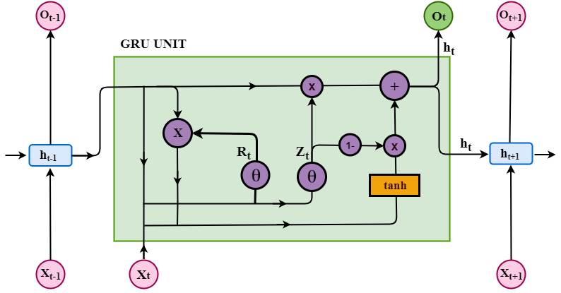
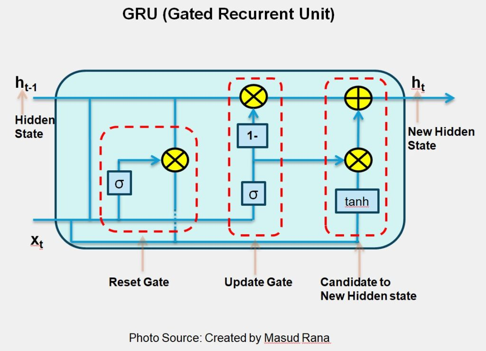
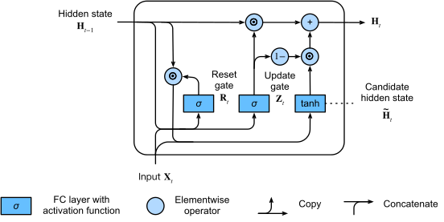
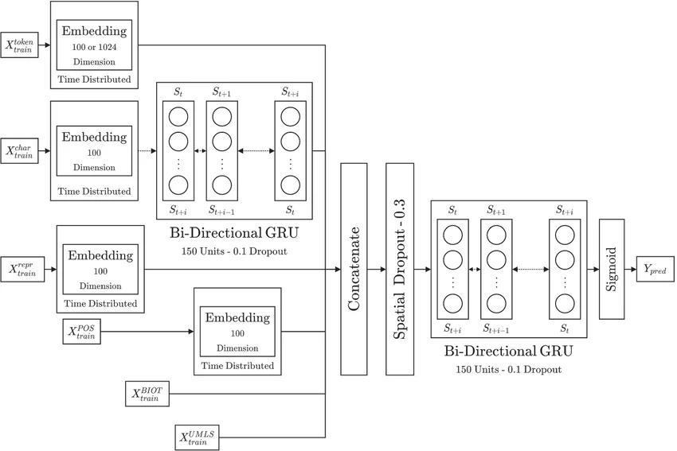

# Gated Recurrent Unit (GRU)

## 1. Introduction

Gated Recurrent Unit (GRU) là một kiến trúc mạng nơ-ron hồi tiếp (Recurrent Neural Network - RNN) được đề xuất bởi Cho et al. (2014) nhằm giải quyết các hạn chế của RNN truyền thống trong việc học các phụ thuộc dài hạn (long-term dependencies).

GRU sử dụng cơ chế **gating** để kiểm soát luồng thông tin giữa các bước thời gian, từ đó giảm hiện tượng:

- Vanishing Gradient
- Exploding Gradient
- Quên ngữ cảnh dài hạn

So với Long Short-Term Memory (LSTM), GRU có cấu trúc đơn giản hơn do chỉ sử dụng hai cổng:

1. Reset Gate
2. Update Gate

Điều này giúp giảm số lượng tham số cần học trong khi vẫn duy trì hiệu quả mô hình hóa chuỗi.

---

## 2. Architecture Overview



Hình trên minh họa kiến trúc cơ bản của một GRU Cell.

Tại thời điểm $(t)$, GRU nhận:

- Input hiện tại: $x_t$
- Hidden state trước đó: $h_{t-1}$

và tạo ra:

- Hidden state mới: $h_t$

Khác với LSTM, GRU không sử dụng Cell State riêng biệt. Toàn bộ thông tin được lưu trữ trực tiếp trong Hidden State.

---

# 3. Mathematical Formulation

## 3.1 Reset Gate

Reset Gate quyết định lượng thông tin từ trạng thái trước đó cần được sử dụng khi tạo trạng thái ứng viên mới.

$$
r_t = \sigma(W_r x_t + U_r h_{t-1} + b_r)
$$

Trong đó:

- $W_r$: trọng số của input
- $U_r$: trọng số của hidden state
- $b_r$: bias
- $\sigma$: hàm sigmoid

Giá trị của reset gate nằm trong khoảng:

$$
0 \le r_t \le 1
$$

Nếu:

$$
r_t \approx 0
$$

thì mô hình gần như bỏ qua thông tin quá khứ.

Nếu:

$$
r_t \approx 1
$$

thì thông tin lịch sử được giữ lại.

---

## 3.2 Update Gate

Update Gate xác định lượng thông tin từ hidden state cũ được giữ lại.

$$
z_t =
\sigma
(
W_z x_t
+
U_z h_{t-1}
+
b_z
)
$$

Giá trị:

$$
0 \le z_t \le 1
$$

Ý nghĩa:

- $z_t \rightarrow 1$: giữ lại nhiều thông tin cũ.
- $z_t \rightarrow 0$: cập nhật nhiều thông tin mới.

---

## 3.3 Candidate Hidden State

Sau khi tính reset gate, GRU tạo trạng thái ứng viên:

$$
\tilde{h}_t
=
\tanh
\left(
W_h x_t
+
U_h
(r_t \odot h_{t-1})
+
b_h
\right)
$$

Trong đó:

$$
\odot
$$

là phép nhân từng phần tử (element-wise multiplication).

Reset Gate tác động trực tiếp lên hidden state trước khi tham gia tính toán.

---

## 3.4 New Hidden State

Hidden state cuối cùng là sự kết hợp giữa:

- Hidden state cũ
- Candidate hidden state

$$
h_t
=
z_t \odot h_{t-1}
+
(1-z_t)\odot\tilde{h}_t
$$

Đây là phương trình quan trọng nhất của GRU.

Nếu:

$$
z_t = 1
$$

thì:

$$
h_t=h_{t-1}
$$

Nếu:

$$
z_t =0
$$

thì:

$$
h_t=\tilde h_t
$$

---

# 4. Internal Information Flow



Quá trình xử lý bên trong một GRU Cell gồm:

### Step 1

Nhận:

$$
x_t,\ h_{t-1}
$$

---

### Step 2

Tính Reset Gate:

$$
r_t
$$

---

### Step 3

Tính Update Gate:

$$
z_t
$$

---

### Step 4

Tạo Candidate Hidden State:

$$
\tilde h_t
$$

---

### Step 5

Kết hợp trạng thái cũ và mới:

$$
h_t
$$

---

### Step 6

Xuất hidden state mới:

$$
h_t
$$

sang bước thời gian tiếp theo.

---

# 5. Forward Propagation Algorithm

Cho chuỗi đầu vào:

$$
X=(x_1,x_2,...,x_T)
$$

Khởi tạo:

$$
h_0 = 0
$$

Thuật toán:

```text
for t = 1 → T

    r_t = sigmoid(W_r x_t + U_r h_{t-1} + b_r)

    z_t = sigmoid(W_z x_t + U_z h_{t-1} + b_z)

    h~_t = tanh(
                W_h x_t
                +
                U_h(r_t ⊙ h_{t-1})
                +
                b_h
              )

    h_t =
          z_t ⊙ h_{t-1}
          +
          (1-z_t) ⊙ h~_t

return h_t
```

---

# 6. Computational Graph



Sơ đồ trên mô tả đồ thị tính toán của GRU.

Các nút:

- `σ` : Sigmoid
- `tanh` : Hyperbolic Tangent
- `×` : Element-wise Multiplication
- `+` : Element-wise Addition

Luồng dữ liệu:

$$
(x_t,h_{t-1})
\rightarrow
(r_t,z_t)
\rightarrow
\tilde h_t
\rightarrow
h_t
$$

---

# 7. Gradient Flow Analysis

RNN truyền thống:

$$
h_t=
\tanh(Wx_t+Uh_{t-1})
$$

Gradient được truyền:

$$
\frac{\partial h_t}{\partial h_{t-1}}
=
U^T
\cdot
\tanh'
$$

Khi nhân nhiều lần:

$$
(U^T)^T
$$

gradient nhanh chóng tiến về:

$$
0
$$

gây Vanishing Gradient.

---

Trong GRU:

$$
h_t
=
z_t h_{t-1}
+
(1-z_t)\tilde h_t
$$

Ta có:

$$
\frac{\partial h_t}
{\partial h_{t-1}}
\approx
z_t
$$

Khi:

$$
z_t \approx 1
$$

gradient có thể truyền gần như trực tiếp qua nhiều bước thời gian.

Đây là nguyên nhân chính giúp GRU học được phụ thuộc dài hạn.

---

# 8. Comparison with LSTM

| Property | GRU | LSTM |
|-----------|-----------|-----------|
| Gates | 2 | 3 |
| Cell State | No | Yes |
| Hidden State | Yes | Yes |
| Parameters | Fewer | More |
| Training Speed | Faster | Slower |
| Memory Usage | Lower | Higher |
| Long-term Dependency | Good | Excellent |

---

# 9. Bidirectional GRU

Bidirectional GRU xử lý chuỗi theo hai hướng:

1. Forward

$$
x_1 \rightarrow x_T
$$

2. Backward

$$
x_T \rightarrow x_1
$$

Kết quả:

$$
h_t=
[\overrightarrow h_t;
\overleftarrow h_t]
$$

cho phép mô hình sử dụng đồng thời ngữ cảnh quá khứ và tương lai.



Kiến trúc trên sử dụng:

- Token Embedding
- Character Embedding
- POS Embedding
- Bi-Directional GRU
- Concatenation Layer
- Spatial Dropout
- Sigmoid Output

để thực hiện bài toán phân loại chuỗi.

---

# 10. Complexity Analysis

Giả sử:

- Input dimension: $d$
- Hidden dimension: $h$

Mỗi gate cần:

$$
O(dh+h^2)
$$

GRU có:

- Reset Gate
- Update Gate
- Candidate State

Tổng:

$$
O(3(dh+h^2))
$$

So với LSTM:

$$
O(4(dh+h^2))
$$

GRU yêu cầu ít tham số hơn khoảng 25%.

---

# 11. Advantages

### Efficient Training

Ít tham số hơn LSTM.

### Better Gradient Flow

Giảm Vanishing Gradient.

### Long-Term Dependency Learning

Học quan hệ dài hạn hiệu quả.

### Computationally Lightweight

Chi phí tính toán thấp hơn LSTM.

### Strong Empirical Performance

Hiệu quả trên nhiều bài toán NLP và Time Series.

---

# 12. Applications

GRU được sử dụng rộng rãi trong:

### Natural Language Processing

- Machine Translation
- Text Classification
- Named Entity Recognition
- Sentiment Analysis

### Speech Processing

- Speech Recognition
- Speaker Identification

### Time Series Forecasting

- Stock Prediction
- Weather Forecasting
- Sensor Analysis

### Bioinformatics

- DNA Sequence Modeling
- Protein Analysis

---

# 13. References

1. Cho, K., Van Merriënboer, B., Gulcehre, C., et al. (2014).

   *Learning Phrase Representations using RNN Encoder-Decoder for Statistical Machine Translation.*

2. Chung, J., Gulcehre, C., Cho, K., Bengio, Y. (2014).

   *Empirical Evaluation of Gated Recurrent Neural Networks on Sequence Modeling.*

3. Goodfellow, I., Bengio, Y., Courville, A. (2016).

   *Deep Learning.*

4. Jurafsky, D., Martin, J. H.

   *Speech and Language Processing.*
