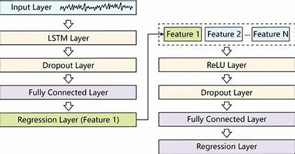

# LSTM (Long Short-Term Memory Networks)

## So sánh giữa các model base


---

## LSTM Architecture


---

## LSTM Pipeline


---

## 1. LSTM là?
LSTM (Long Short-Term Memory) là một biến thể của RNN được thiết kế để giải quyết vấn đề:

- Vanishing Gradient
- Exploding Gradient
- Khó học quan hệ dài hạn (Long-Term Dependency)

Ví dụ:
```
Tôi sinh ra ở Hà Nội.
...
Sau 100 từ.
...
Tôi rất nhớ quê hương đó.
```

Để hiểu "đó" là Hà Nội, mô hình phải nhớ thông tin rất xa.

RNN Thường quên. Nên LSTM được tạo ra để nhớ lâu hơn.

---

## 2. Vấn đề của RNN
### RNN Cơ bản
Tại thời điểm t:
$$h_t = \tanh (W_x x_t + W_h h_{t-1} + b)$$

Trong đó:
- $x_t$: input hiện tại
- $h_{t-1}$: hidden state cũ
- $h_t$: hidden state mới

### Luồng dữ liệu
```
x1 → h1
      ↓
x2 → h2
      ↓
x3 → h3
      ↓
...
```

Mọi thông tin đều phải đi qua hidden state.

Nếu chuỗi dài:
```
x1
 ↓
h1
 ↓
h2
 ↓
...
 ↓
h100
```

Gradient phải làn truyền qua 100 bước.

Kết quả: `Gradient ≈ 0` Mất đi thông tin.

---

## 3. Ý tưởng của LSTM
LSTM thêm một đường truyền riêng: __Cell State__ Thay vì ép mọi thứ đi qua hidden state.

### Hai bộ nhớ
#### Hidden State
- $h_t$: Bộ nhớ ngắn hạn -> Working Memory.

#### Cell State
- $C_t$: Bộ nhớ dài hạn -> Long-term Memory.

#### So sánh với não người:
```
Bạn nhớ số điện thoại hôm nay
→ Hidden State

Bạn nhớ tên mình
→ Cell State
```

---

## 4. Kiến trúc LSTM Cell
Ba cổng điều khiển thông tin.
```
Forget Gate
Input Gate
Output Gate
```

### Tổng quan
Input:
```
x_t
h_(t-1)
C_(t-1)
```

Output:
```
h_t
C_t
```

---

## 5. Forget Gate
Mục tiêu: `Thông tin nào cần quên?`

Công thức: $f_t = \sigma (W_f [h_{t-1}, x_t] + b_f)$

Sigmoid:
- `0 → quên hoàn toàn`
- `1 → giữ hoàn toàn`

Ví dụ:
```
Cell State:

[0.8, 0.7, 0.5]

Forget Gate:

[1, 0, 1]
```

Kết quả: `[0.8, 0, 0.5]`

---

## 6. Input Gate
Mục tiêu: `Thông tin nào cần ghi nhớ?`

### Step 1
Tạo candidate memory: $\tilde{C}_t = \tanh (W_c [h_{t-1}, x_t] + b_c)$

### Step 2
Input Gate: $i_t = \sigma (W_i [h_{t-1}, x_t] + b_i)$

### Step 3
Lưu vào Cell State.

## 7. Update cell State
Đây là bước quan trọng nhất.

Cập nhật bộ nhớ dài hạn:
$$C_t = f_t \odot C_{t-1} + i_t \odot \tilde{C}_t$$

Ý nghĩa:
```
Memory mới = Memory cũ còn lại + Thông tin mới
```

Ví dụ:
```
Old Memory = 100

Forget = 0.8

Input = 0.5

Candidate = 20

Memory = 100×0.8 + 20×0.5 = 90
```

## 8. Output Gate
Mục tiêu: `Thông tin nào được đưa ra ngoài?`

### Output Gate:
$$o_t = \sigma (W_o [h_{t-1}, x_t] + b_o)$$

### Hidden State:
$$h_t = o_t \odot \tanh(C_t)$$

## 9. Thuật toán LSTM
Cho mỗi timestep:
```
Input:
x_t
h_(t-1)
C_(t-1)
```

- Forget Gate: $f_t$
- Input Gate: $i_t$
- Candidate Memory: $\tilde{C}_t$
- Update Cell State: $C_t$
- Output Gate: $o_t$
- New Hidden State: $h_t$
- Output:
    - $h_t$
    - $C_t$

## 10. Pipeline LSTM
### Many-to-One
Sentiment Analysis

```
Words
 ↓
LSTM
 ↓
Dense
 ↓
Positive/Negative
```

Ví dụ: `I love this movie` -> `Positive`

### One-to-Many
Text Generation
```
Seed
 ↓
LSTM
 ↓
Word1
 ↓
Word2
 ↓
Word3
```

### Many-to-Many
Machine Translation
```
English
 ↓
Encoder LSTM
 ↓
Context
 ↓
Decoder LSTM
 ↓
Vietnamese
```

## 11. LSTM Architecture

### Vanilla LSTM
```
Input
 ↓
LSTM
 ↓
Dense
 ↓
Output
```

### Stacked LSTM
```
LSTM1
 ↓
LSTM2
 ↓
LSTM3
 ↓
Dense
```

Mỗi layer học mức trừu tượng khác nhau.

### Bidirectional LSTM
```
Forward LSTM
Backward LSTM
```

Đọc:
```
trái → phải
phải → trái
```

Ví dụ: `I live in New York`, Từ "New" được hiểu tốt hơn khi nhìn thấy "York".

### Deep LSTM
```
Input
 ↓
LSTM
 ↓
LSTM
 ↓
LSTM
 ↓
LSTM
 ↓
Dense
```

Thường: `2-8 tầng`

### Encoder-Decoder LSTM
```
Encoder
 ↓
Context Vector
 ↓
Decoder
```

Dùng cho:
- Translation
- Summarization
- Speech Recognition

### Attention LSTM
Khắc phục vấn đề: `Context Vector bị nghẽn`

Thay vì dùng: `1 vector`

Attention Cho phép:
```
Decoder
↓
Nhìn lại toàn bộ Encoder
```

Tiền thân trực tiếp của Transformer

## 12. Các biến thể của LSTM
### Peephole LSTM
Gate nhìn trực tiếp Cell State.
```
Gate ← C_t
```

Nhớ thời gian tốt hơn.

### ConvLSTM
Thay: `Matrix Multiplication` bằng `Convolution`.

Ứng dụng:
- Video Prediction
- Weather Forecasting

### Attention LSTM
`LSTM + Attention`

### Seq2Seq LSTM
`Encoder + Decoder`

