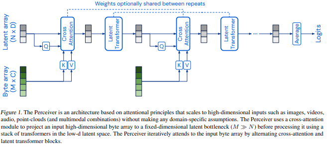
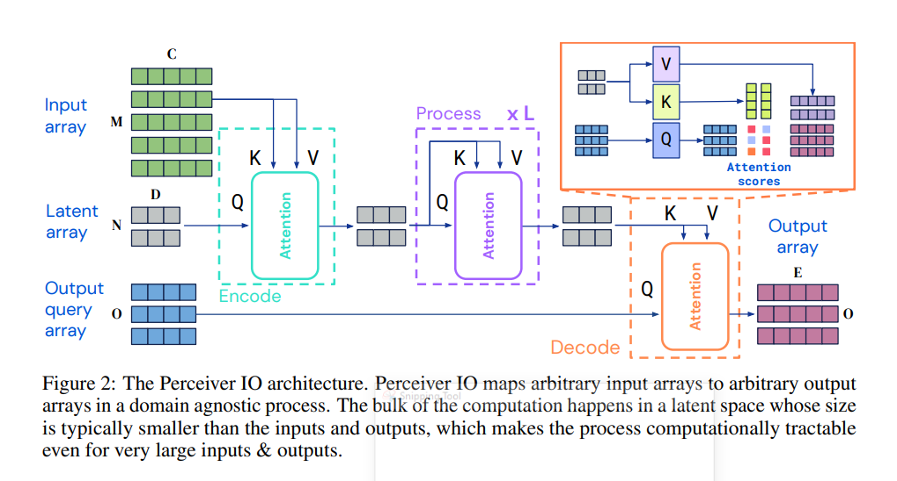

# Perceiver: General Perception with Iterative Attention

> Implementation-oriented explanation of Perceiver, Perceiver IO, and experimental latent architectures.



Link học youtube: <a href="https://www.youtube.com/watch?v=P_xeshTnPZg">Yannic Kilcher explanation!</a>

Link bài báo: <a href="https://arxiv.org/abs/2103.03206">Perceiver</a>


## 1. Motivation

Transformer truyền thống gặp vấn đề khi số lượng token đầu vào rất lớn.

Cho:
$$N = \text{number of input tokens}$$

Self-Attention:
$$O(N^2)$$

Memory:
$$M = O(N^2)$$

Đối với dữ liệu thực tế:
| Modality      | Token Count |
| ------------- | ----------- |
| Image 224×224 | 50,176      |
| Video         | >100,000    |
| Audio         | >100,000    |
| Point Cloud   | >1,000,000  |

Quadratic attention trở thành bottleneck chính.

### Ý tưởng cốt lõi

Không cho toàn bộ token tương tác với nhau.

Thay vào đó:

- Duy trì một latent space kích thước cố định
- Input chỉ tương tác với latent
- Mọi suy luận diễn ra trong latent space

## 2. Core Idea
Giả sử:

input:
$$X \in R^{N \times D}$$

Latent array:
$$Z \in R^{M \times C}$$

Với
$$M \ll N$$

Thông thường:
$$N = 50, 000$$
$$M = 512$$

Latent đóng vai trò:
- Information bottleneck
- Memory bank
- Induced set points

Tương tự như:
- Nyström approximation
- Set Transformer inducing points
- Learnable memory slots

## 3. Fourier Positional Encoding
Paper không dùng positional embedding học được.

Thay vào đó sử dụng Fourier Features.

Trong code:

```python
fourier_encode(...)
```

Cho tọa độ:
$$x \in [-1, 1]$$

Tạo các tần số:
$$f_i$$

Với 
$$i = 1, ..., K$$

Encoding:
$$\gamma(x) = [sin(\pi f_i x), cos(\pi f_i x), x]$$

Nếu dữ liệu có nhiều trục:

image:
$$(x, y)$$

Video:
$$(x, y, t)$$

Point Cloud:
$$(x, y, z)$$

encoding được thực hiện trên nhiều chiều.

## 4. Cross Attention
Bước đầu tiên:
$$Input \rightarrow Latents$$

---

Queries:
$$Q = ZW_Q$$

Keys:
$$K = XW_K$$

Values: 
$$V = XW_V$$

---

Attention:
$$Attention(Q, K, V) = Softmax(\frac {QK^T} {\sqrt{d}}V)$$

Shape: 
$$Q \in R^{M \times d}$$

$$K, V \in R^{N \times d}$$

Do đó:
$$QK^T \in R^{M \times N}$$

Chi phí:
$$O(MN)$$

Thay vì:
$$O(N^2)$$

## 5. Latent Transformer
Sau khi thu nhận thông tin:

$$Z \leftarrow CrossAttention(X, Z)$$

toàn bộ suy luận diễn ra trên latent.

Self-Attention:
$$Q = K = V = Z$$

Chi phí:
$$O(M^2)$$

Do:
$$M = 512$$

nên gần như không đổi bất kể input lớn bao nhiêu.

## 6. Iterative Attention
Paper không chỉ thực hiện một lần attention.

Một layer:
```
Cross Attention
      ↓
Feed Forward
      ↓
Latent Self Attention
      ↓
Feed Forward
```

Lặp lại:
```
depth lần
```

Flow:
```
Input Tokens
      │
      ▼
Cross Attention
      │
      ▼
Latent Array
      │
      ▼
Self Attention
      │
      ▼
Self Attention
      │
      ▼
Self Attention
      │
      ▼
Output
```

## 7. Complexity Analysis
Transformer: $O(N^2)$

Perceiver: $O(MN) + O(M^2)$

---

Nếu:
$$N = 50, 000$$
$$M = 512$$

thì:

Transfoermer:
$$2.5 \times 10^9$$

Attention iteractions

Perceiver:
$$2.56 \times 10^7$$

Attention interactions

---

Giảm gần:
$$100 \times$$

## 8. Weight typing
Ý tưởng:

Layer 1:
$$\theta$$

Layer 2:
$$\theta$$

Layer 3:
$$\theta$$

...

cùng sử dụng chung trọng số.

Lợi ích:

- giảm số tham số
- tăng khả năng tổng quát hóa
- tương tự Universal Transformer

## 9. Inverted Cross Attention

Attention chuẩn:
$$
Softmax(QK^T)
$$
chuẩn hóa theo chiều key.

Inverted Attention:
$$
Softmax(QK^T)
$$
chuẩn hóa theo chiều query.

---

Gần với:

- Slot Attention
- Competitive Binding
- Object-centric learning

Mỗi latent cạnh tranh để giải thích input.

## 10. Perceiver IO


Perceiver gốc:
```
Input
 ↓
Latents
 ↓
Classification Head
```

Perceiver IO:
```
Input
 ↓
Latents
 ↓
Decoder Queries
 ↓
Outputs
```

---

### Encoder
Chỉ cross attention một lần.
```Python
cross_attn(...)
```

sau đó:
```Python
latent self attention
```
nhiều lần

---

### Decoder
Queries:
$$Q_o$$

Cross attention:
$$Q_o \leftrightarrow Z$$

Output:
$$Y = Attention(Q_o, Z, Z)$$

Cho phép:

- Dense Prediction
- Segmentation
- Language Modeling
- Optical Flow
- Video Generation

## 11. Perceiver LM
Pipeline:
```
Tokens
 ↓
Embedding
 ↓
Positional Embedding
 ↓
Perceiver IO
 ↓
Vocabulary Projection
```

Khác GPT:

GPT:
```
Self Attention on tokens
```

Perceiver LM:
```
Cross Attention
 ↓
Latents
 ↓
Decoder Queries
```

Sequence dài hơn đáng kể.

---

## 12. Experimental Architectures

Repository này chứa ba hướng nghiên cứu thú vị.

---
### 12.1 Linear Attention Perceiver

File:
```
experimental.py
```

Thay thế attention trên input bằng:
```Python
LinearAttention
```

Độ phức tạp: $O(Nd)$

Mục tiêu: __Giảm thêm chi phí xử lý input.__

---

### 12.2 GRU-Gated Perceiver

File:
```
gated.py
```
Thay residual:
$$x + F(x)$$

bằng GRU update:
$$h_t = GRU(F(x), x)$$

Ý tưởng: __Transformer + Recurrent Memory__

Lợi ích:

- ổn định gradient
- iterative refinement tốt hơn
- deep network dễ train hơn

### 12.3 Mixed Latent Perceiver

File:
```
mixed_latents.py
```

Thay latent self-attention bằng:
```Python
Mixer(...)
```

sử dụng:
```Python
Conv1D
```
để trộn latent.

---
Từ: $O(M^2)$ sang gần $O(M)$.

Tư tưởng tương tự:
- MLP-Mixer
- gMLP
- ConvMixer

## 13. Training Dynamics

Perceiver hoạt động như:
```
Input Compression
        ↓
Latent Reasoning
        ↓
Output Decoding
```

Các latent học:

- object parts
- temporal events
- spatial structures
- semantic concepts

mà không cần định nghĩa thủ công.

## 14. Research Connections

Perceiver có liên hệ trực tiếp với:
- Set Transformer
- Nyström Transformer
- Performer
- Linformer
- Slot Attention
- Perceiver AR
- Flamingo
- Gato
- RT-1
- RT-2

## 15. Key Insight

Transformer cố gắng cho mọi token nói chuyện với mọi token.

Perceiver thay đổi hoàn toàn tư duy đó:

> Không mở rộng attention theo kích thước dữ liệu, mà nén dữ liệu vào một latent workspace có kích thước cố định rồi thực hiện toàn bộ suy luận bên trong workspace đó.

Đây là lý do Perceiver trở thành một trong những kiến trúc nền tảng quan trọng dẫn tới Perceiver IO, Flamingo và các mô hình multimodal quy mô lớn hiện đại.


---

**Tài liệu tham khảo**

```bibtex
@misc{jaegle2021perceiver,
    title   = {Perceiver: General Perception with Iterative Attention},
    author  = {Andrew Jaegle and Felix Gimeno and Andrew Brock and Andrew Zisserman and Oriol Vinyals and Joao Carreira},
    year    = {2021},
    eprint  = {2103.03206},
    archivePrefix = {arXiv},
    primaryClass = {cs.CV}
}
```

```bibtex
@misc{jaegle2021perceiver,
    title   = {Perceiver IO: A General Architecture for Structured Inputs & Outputs},
    author  = {Andrew Jaegle and Sebastian Borgeaud and Jean-Baptiste Alayrac and Carl Doersch and Catalin Ionescu and David Ding and Skanda Koppula and Andrew Brock and Evan Shelhamer and Olivier Hénaff and Matthew M. Botvinick and Andrew Zisserman and Oriol Vinyals and João Carreira},
    year    = {2021},
    eprint  = {2107.14795},
    archivePrefix = {arXiv},
    primaryClass = {cs.LG}
}
```

```bibtex
@inproceedings{wu2023invertedattention,
    title   = {Inverted-Attention Transformers can Learn Object Representations: Insights from Slot Attention},
    author  = {Yi-Fu Wu and Klaus Greff and Gamaleldin Fathy Elsayed and Michael Curtis Mozer and Thomas Kipf and Sjoerd van Steenkiste},
    booktitle = {UniReps:  the First Workshop on Unifying Representations in Neural Models},
    year    = {2023},
    url     = {https://openreview.net/forum?id=WgQZNoQ5AB}
}
```


---

**Thư viện tham khảo**


```python
import torch
from perceiver_pytorch import Perceiver

model = Perceiver(
    input_channels = 3,          # number of channels for each token of the input
    input_axis = 2,              # number of axis for input data (2 for images, 3 for video)
    num_freq_bands = 6,          # number of freq bands, with original value (2 * K + 1)
    max_freq = 10.,              # maximum frequency, hyperparameter depending on how fine the data is
    depth = 6,                   # depth of net. The shape of the final attention mechanism will be:
                                 #   depth * (cross attention -> self_per_cross_attn * self attention)
    num_latents = 256,           # number of latents, or induced set points, or centroids. different papers giving it different names
    latent_dim = 512,            # latent dimension
    cross_heads = 1,             # number of heads for cross attention. paper said 1
    latent_heads = 8,            # number of heads for latent self attention, 8
    cross_dim_head = 64,         # number of dimensions per cross attention head
    latent_dim_head = 64,        # number of dimensions per latent self attention head
    num_classes = 1000,          # output number of classes
    attn_dropout = 0.,
    ff_dropout = 0.,
    weight_tie_layers = False,   # whether to weight tie layers (optional, as indicated in the diagram)
    fourier_encode_data = True,  # whether to auto-fourier encode the data, using the input_axis given. defaults to True, but can be turned off if you are fourier encoding the data yourself
    self_per_cross_attn = 2      # number of self attention blocks per cross attention
)

img = torch.randn(1, 224, 224, 3) # 1 imagenet image, pixelized

model(img) # (1, 1000)
```

For the backbone of <a href="https://arxiv.org/abs/2107.14795">Perceiver IO</a>, the follow up paper that allows for flexible number of output sequence length, just import `PerceiverIO` instead

```python
import torch
from perceiver_pytorch import PerceiverIO

model = PerceiverIO(
    dim = 32,                    # dimension of sequence to be encoded
    queries_dim = 32,            # dimension of decoder queries
    logits_dim = 100,            # dimension of final logits
    depth = 6,                   # depth of net
    num_latents = 256,           # number of latents, or induced set points, or centroids. different papers giving it different names
    latent_dim = 512,            # latent dimension
    cross_heads = 1,             # number of heads for cross attention. paper said 1
    latent_heads = 8,            # number of heads for latent self attention, 8
    cross_dim_head = 64,         # number of dimensions per cross attention head
    latent_dim_head = 64,        # number of dimensions per latent self attention head
    weight_tie_layers = False,   # whether to weight tie layers (optional, as indicated in the diagram)
    seq_dropout_prob = 0.2       # fraction of the tokens from the input sequence to dropout (structured dropout, for saving compute and regularizing effects)
)

seq = torch.randn(1, 512, 32)
queries = torch.randn(128, 32)

logits = model(seq, queries = queries) # (1, 128, 100) - (batch, decoder seq, logits dim)
```

As an example, using PerceiverIO as a language model

```python
import torch
from perceiver_pytorch import PerceiverLM

model = PerceiverLM(
    num_tokens = 20000,          # number of tokens
    dim = 32,                    # dimension of sequence to be encoded
    depth = 6,                   # depth of net
    max_seq_len = 2048,          # maximum sequence length
    num_latents = 256,           # number of latents, or induced set points, or centroids. different papers giving it different names
    latent_dim = 512,            # latent dimension
    cross_heads = 1,             # number of heads for cross attention. paper said 1
    latent_heads = 8,            # number of heads for latent self attention, 8
    cross_dim_head = 64,         # number of dimensions per cross attention head
    latent_dim_head = 64,        # number of dimensions per latent self attention head
    weight_tie_layers = False    # whether to weight tie layers (optional, as indicated in the diagram)
)

seq = torch.randint(0, 20000, (1, 512))
mask = torch.ones(1, 512).bool()

logits = model(seq, mask = mask) # (1, 512, 20000)
```