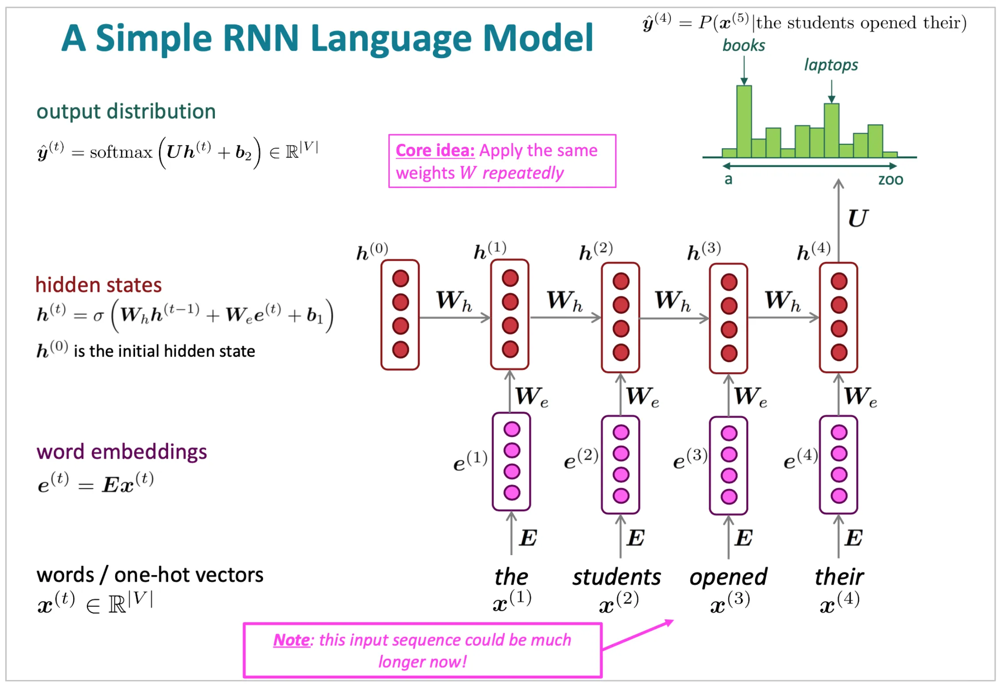

# Recurrent Neural Network - RNN mạng thần kinh hồi quy tập trung vào thời gian và trình tự



- $x^{(1)}, x^{(2)}, ...$: Là các từ hoặc câu đã embedding.

- $W_h$: Trọng lượng từ dữ liệu ẩn sang dữ liệu ẩn, Đây là kết nối quan trọng từ __trạng thái ẩn trước đó__ sang __trạng thái ẩn hiện tại__. Đây chính là cái tạo nên __"Trí nhớ"__ của RNN. Nó định xem thông tin từ quá quyết định ($h_0, h_1, ...$) quan trọng như nào đối với hiện tại, duy trì thông tin qua các bước thời gian

- $W_e$: Trọng lượng đầu vào được ẩn đi, Đây là kết nối quan trọng __từ đầu vào hiện tại__ ở __trạng thái ẩn__ . Nó xác định mức độ ảnh hưởng của dữ liệu mới $X_1, X_2$ đối với mạng nhớ.

---

## Learning RoadMap
```
Word
 ↓
One-Hot Encoding
 ↓
Embedding
 ↓
Vanilla RNN Cell
 ↓
Forward Propagation
 ↓
Backpropagation Through Time (BPTT)
 ↓
Language Model
 ↓
Text Generation
 ↓
LSTM
 ↓
GRU
 ↓
Seq2Seq
 ↓
Attention
```

---

## project Structure

```
RNN/
│
├── assets/
│
├── README.md
│
├── notebooks/
│   │
│   ├── 01_one_hot_encoding.ipynb
│   ├── 02_word_embedding.ipynb
│   ├── 03_rnn_cell_forward.ipynb
│   ├── 04_rnn_sequence_forward.ipynb
│   ├── 05_bptt.ipynb
│   ├── 06_language_model.ipynb
│   ├── 07_text_generation.ipynb
│   │
│   ├── 08_lstm_cell.ipynb
│   ├── 09_gru_cell.ipynb
│   ├── 10_seq2seq.ipynb
│   └── 11_attention.ipynb
│
├── src/
│   │
│   ├── data/
│   │
│   ├── preprocessing/
│   │   ├── tokenizer.py
│   │   ├── vocabulary.py
│   │   ├── one_hot.py
│   │   └── embedding.py
│   │
│   ├── layers/
│   │   ├── rnn_cell.py
│   │   ├── lstm_cell.py
│   │   ├── gru_cell.py
│   │   └── dense.py
│   │
│   ├── models/
│   │   ├── vanilla_rnn.py
│   │   ├── lstm.py
│   │   ├── gru.py
│   │   └── language_model.py
│   │
│   ├── losses/
│   │   ├── cross_entropy.py
│   │
│   ├── optimizers/
│   │   ├── sgd.py
│   │
│   ├── training/
│   │   ├── trainer.py
│   │   └── bptt.py
│   │
│   ├── visualization/
│   │   ├── hidden_states.py
│   │   ├── embeddings.py
│   │   └── predictions.py
│   │
│   └── utils/
│       ├── activations.py
│       ├── initialization.py
│       └── metrics.py
│
└── examples/
    ├── language_model.py
    ├── text_generation.py
    └── next_word_prediction.py
```

---

### 1. What is RNN?
__Recurrent Neural Network (RNN)__ là mạng neural được thiết kế để xử lý dữ liệu có __tính tuần tự (Sequential Data)__.

Khác với MLP thông thường, RNN có khả năng ghi nhớ thông tin từ các bước thời gian trước đó.

#### ý tưởng
Thay vì: `Input -> Output`

RNN Có thêm bộ nhớ:
```
Input_t
    ↓
Hidden State_t
    ↓
Output_t

Hidden State_(t-1)
    ↓
Hidden State_t
```

Thông tin từ quá khứ được truyền qua hidden state.

---

### 2. RNN Language Model
Ví dụ câu: `the students opened their`

Mục tiêu: `Predict next word`

RNN sẽ học: `P(word | context)`

Ví dụ: `P(books | the students opened their)`

Có thể lớn hơn: `P(laptops | the students opened their)`

---

### 3. Input Representation
#### One-hot Encoding
Vocavulary: `[a, cat, dog, book]`

Từ: `Dog`

Biểu diễn: `[0 0 1 0]`

Ký hiệu: $x^{(t)}$

---

### 4. Word Embedding
One-hot rất thưa (sparse).

Ta ánh xạ:
$$e^{(t)} = Ex^{(t)}$$

Trong đó:
- $E$ là embedding matrix
- $e^{(t)}$ là vector dense

VD: `dog -> [0.21, -0.4, 0.8]`

---

### 5. Hidden State
Tại thời điểm t:
$$h^(t) = \tanh (W_h h^{(t-1)} + W_e e^{(t)} + b)$$

Trong đó:
- __Current Input:__ $W_e e^{(t)}$
    - Thông tin mới nhất từ từ hiện tại.

- __Previous Memory:__ $W_h h^{(t-1)}$
    - Thông tin từ quá khứ

Đây chính là: __Memory Mechanism__ của RNN.

---

### 6. Output Layer
Sau khi có hidden state:
$$\hat{y}^{(t)} = softmax(U h^{(t)} + b_2)$$

Output là phân phối xác suất trên toàn bộ vocabulary.

Ví dụ:
```
books      0.35
laptops    0.20
tables     0.05
...
```

---

### 7. Parameter Sharing
Ý tưởng quan trọng nhất của RNN: __Cùng một bộ trọng số__ được sử dụng ở mọi bước thời gian.

$$W_h$$

Dùng cho:
```
t = 1
t = 2
t = 3
...
```

Điều này giúp:
- Ít tham số
- Học được pattern theo thời gian
- Xử lý chuỗi dài ngắn khác nhau

---

### 8. Forward Pass
Cho câu: `the students opened their`

Ta thực hiện:
```
x1 → h1
x2 → h2
x3 → h3
x4 → h4
```

Sau đó: `h4 → Softmax` để dự đoán từ tiếp theo. 

---

### 9. Backpropagation Through Time (BPTT)
RNN được huấn luyện bằng: __Backpropagation Through Time__ 

ý tưởng: __Unroll RNN__

Thành mạng học sâu theo thời gian: `h1 → h2 → h3 → h4`

Sau đó lan truyền gradient ngược lại.
```
Loss
 ↑
h4
 ↑
h3
 ↑
h2
 ↑
h1
```

---

### 10. Vanishing Gradient problem
Khi chuỗi quá dài:
```
100
200
500 bước
```

Gradient:
$$W_h^T W_h^T W_h^T ...$$

Có thể trở nên: `≈ 0` => mạng quên thông tin cũ.

___Đây là lý do LSTM và GRU ra đời.___

---

# Types of RNN

Có nhiều kiến trúc RNN khác nhau tùy theo số lượng input và output. 


---

### 1. One-to-One
```
Image
 ↓
Classifier
 ↓
Label
```

Ví dụ:
- Image Classification

`Cat Image → Cat`

---

### 2. One-to-Many
```
Image
 ↓
RNN
 ↓
Word1 Word2 Word3
```

Ví dụ:
- Image Captioning

```
Image
↓
"A dog is running"
```

---

### 3. Many-to-One
```
Word1 Word2 Word3
 ↓
RNN
 ↓
Positive
```

Ví dụ:
- Sentiment Analysis
- Spam Detection
- Intent Classification

---

### 4. Many-to-Many (Aligned)

Input và Output có cùng chiều dài.

```
I love AI

↓

PRON VERB NOUN
```

Ví dụ:
- POS Tagging
- Named Entity Recognition

---

### 5. Many-to-Many (Encoder-Decoder)

Input và Output có độ dài khác nhau.

```
English
↓

Encoder
↓

Context
↓

Decoder
↓

French
```

Ví dụ:
- Machine Translation
- Summarization
- Chatbot

# Learning Order

```
01 One-Hot Encoding
↓
02 Embedding
↓
03 RNN Cell
↓
04 Full RNN Forward
↓
05 BPTT
↓
06 Language Model
↓
07 Text Generation
↓
08 LSTM
↓
09 GRU
↓
10 Seq2Seq
↓
11 Attention
```