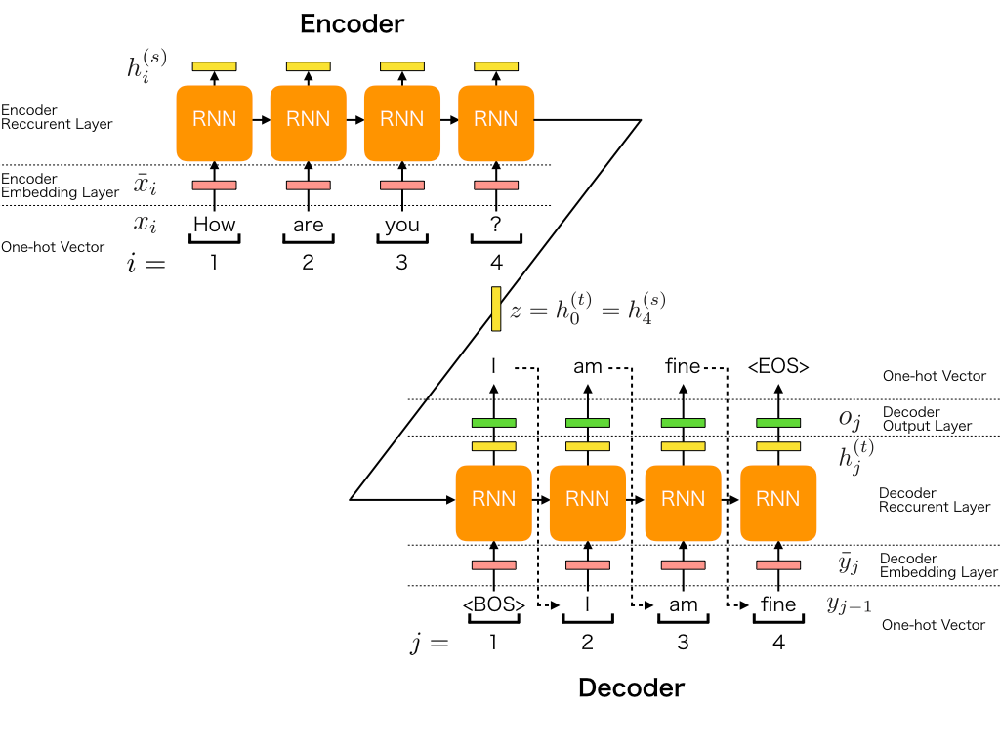
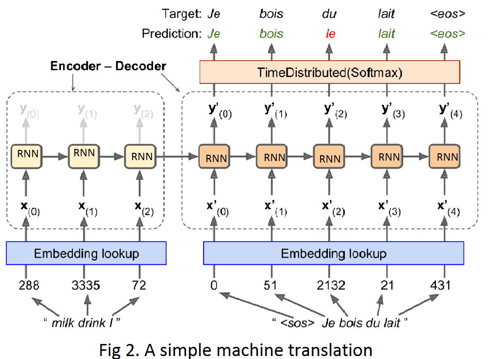
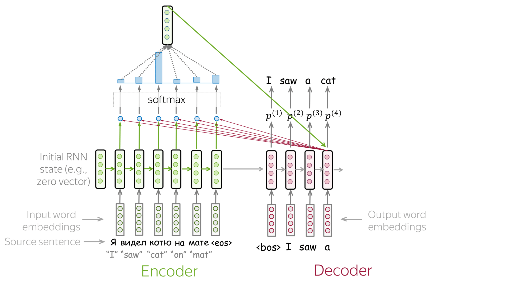

# Sequence-to-Sequence (Seq2Seq) Architecture

## 1. Giới thiệu

Sequence-to-Sequence (Seq2Seq) là một kiến trúc mạng nơ-ron được thiết kế để ánh xạ một chuỗi đầu vào có độ dài bất kỳ sang một chuỗi đầu ra có độ dài bất kỳ.

Kiến trúc này được giới thiệu lần đầu bởi Sutskever et al. (2014) và trở thành nền tảng cho nhiều bài toán:

- Machine Translation
- Text Summarization
- Dialogue Systems
- Speech Recognition
- Time Series Forecasting
- Question Answering

Ý tưởng cốt lõi của Seq2Seq là:

$$
X = (x_1, x_2, ..., x_n)
$$

được mã hóa thành một biểu diễn ngữ nghĩa (context vector)

$
z
$

sau đó được giải mã thành chuỗi đầu ra

$$
Y = (y_1, y_2, ..., y_m)
$$

---

## 2. Kiến trúc tổng quát

Seq2Seq gồm hai thành phần chính:

### Encoder

Encoder đọc toàn bộ chuỗi đầu vào và chuyển thành vector ngữ cảnh.

$$
h_t = f(x_t, h_{t-1})
$$

trong đó:

- $x_t$: đầu vào tại thời điểm $t$
- $h_t$: hidden state
- $f$: RNN / LSTM / GRU

Hidden state cuối cùng:

$$
z = h_n
$$

được sử dụng như biểu diễn ngữ nghĩa của toàn bộ chuỗi.

---

### Decoder

Decoder sinh từng phần tử đầu ra dựa trên:

- Context vector $z$
- Hidden state trước đó
- Token đã sinh ở bước trước

$$
s_t = g(y_{t-1}, s_{t-1}, z)
$$

Xác suất dự đoán:

$$
P(y_t|y_{<t}, z)
$$

Thông qua hàm Softmax:

$$
P(y_t)=Softmax(Ws_t+b)
$$

---

## 3. Encoder-Decoder dưới góc nhìn thuật toán

Mục tiêu của mô hình là học phân phối:

$$
P(Y|X)
$$

Theo quy tắc chuỗi:

$$
P(Y|X)
=
\prod_{t=1}^{m}
P(y_t|y_1,...,y_{t-1},X)
$$

Trong thực tế:

$$
P(Y|X)
=
\prod_{t=1}^{m}
P(y_t|y_{<t},z)
$$

với:

$$
z = Encoder(X)
$$

---

## 4. Encoder

### Forward Pass

Cho chuỗi đầu vào:

$$
X=(x_1,x_2,...,x_n)
$$

Encoder cập nhật trạng thái:

$$
h_1=f(x_1,h_0)
$$

$$
h_2=f(x_2,h_1)
$$

$$
...
$$

$$
h_n=f(x_n,h_{n-1})
$$

Context vector:

$$
z=h_n
$$

---

### Vấn đề Bottleneck

Trong Seq2Seq nguyên bản:

$$
z=h_n
$$

là vector duy nhất chứa toàn bộ thông tin chuỗi đầu vào.

Khi chiều dài chuỗi tăng:

- Mất thông tin
- Vanishing Gradient
- Giảm chất lượng dịch máy

Đây là động lực dẫn đến Attention Mechanism.

---

## 5. Decoder

Decoder khởi tạo:

$$
s_0 = z
$$

Tại bước thời gian $t$:

### Bước 1

Nhận token trước đó:

$$
y_{t-1}
$$

### Bước 2

Tính hidden state:

$$
s_t=g(y_{t-1},s_{t-1})
$$

### Bước 3

Sinh phân phối xác suất:

$$
o_t=Ws_t+b
$$

### Bước 4

Softmax:

$$
P(y_t)=Softmax(o_t)
$$

### Bước 5

Chọn token:

$$
y_t=\arg\max P(y_t)
$$

Lặp lại cho đến khi sinh token:

$$
<EOS>
$$

---

## 6. Teacher Forcing

Trong huấn luyện, Decoder không sử dụng dự đoán của chính nó.

Thay vào đó sử dụng nhãn thật:

$$
y_{t-1}^{true}
$$

làm đầu vào bước kế tiếp.

### Huấn luyện

Input Decoder:

$$
<BOS>, y_1, y_2, ..., y_{m-1}
$$

Target:

$$
y_1,y_2,...,y_m
$$

---

### Ưu điểm

- Hội tụ nhanh
- Gradient ổn định
- Giảm tích lũy lỗi

---

### Nhược điểm

Training:

$$
P(y_t|y_{t-1}^{true})
$$

Inference:

$$
P(y_t|\hat y_{t-1})
$$

Tạo ra hiện tượng:

**Exposure Bias**

---

## 7. Hàm mất mát

Mục tiêu cực đại hóa:

$$
P(Y|X)
$$

Tương đương cực tiểu hóa Negative Log Likelihood:

$$
L
=
-\sum_{t=1}^{m}
\log P(y_t^{true}|y_{<t},X)
$$

Trong thực tế thường sử dụng:

### Cross Entropy Loss

$$
L
=
-\sum_i y_i \log(\hat y_i)
$$

với:

- $y_i$: phân phối thực
- $\hat y_i$: phân phối dự đoán

---

## 8. Suy luận (Inference)

Sau khi huấn luyện:

1. Encoder xử lý chuỗi đầu vào.
2. Sinh context vector.
3. Decoder nhận token `<BOS>`.
4. Sinh token đầu tiên.
5. Token vừa sinh được đưa ngược lại Decoder.
6. Lặp đến khi gặp `<EOS>`.

---

### Greedy Decoding

$$
y_t=\arg\max P(y_t)
$$

Ưu điểm:

- Nhanh
- Đơn giản

Nhược điểm:

- Có thể không tối ưu toàn cục

---

### Beam Search

Duy trì $k$ chuỗi tốt nhất.

$$
Score(Y)
=
\sum_t \log P(y_t)
$$

Ưu điểm:

- Chất lượng cao hơn Greedy

Nhược điểm:

- Chi phí tính toán lớn hơn

---

## 9. Seq2Seq cho Time Series Forecasting

Cho chuỗi lịch sử:

$$
(x_1,x_2,...,x_n)
$$

Encoder tạo:

$$
z
$$

Decoder dự báo:

$$
(\hat y_1,\hat y_2,...,\hat y_m)
$$

Ứng dụng:

- Demand Forecasting
- Energy Consumption Forecasting
- Stock Prediction
- Traffic Forecasting

---

## 10. Độ phức tạp tính toán

Giả sử:

- Chiều dài chuỗi đầu vào: $n$
- Chiều dài chuỗi đầu ra: $m$
- Hidden size: $H$

Encoder:

$$
O(nH^2)
$$

Decoder:

$$
O(mH^2)
$$

Tổng:

$$
O((n+m)H^2)
$$

---

## 11. Hạn chế của Seq2Seq cổ điển

### Context Bottleneck

Toàn bộ thông tin nén vào:

$$
z=h_n
$$

---

### Khó xử lý chuỗi dài

Thông tin đầu chuỗi dễ bị mất.

---

### Suy giảm Gradient

Đặc biệt với RNN cơ bản.

---

### Suy luận tuần tự

Không thể song song hóa hoàn toàn.

---

## 12. Hướng phát triển

### Seq2Seq + Attention

Thay vì chỉ dùng:

$$
h_n
$$

Decoder truy cập toàn bộ:

$$
(h_1,h_2,...,h_n)
$$

---

### Bahdanau Attention (2015)

Giảm bottleneck.

---

### Luong Attention (2015)

Hiệu quả tính toán tốt hơn.

---

### Transformer (2017)

Loại bỏ hoàn toàn RNN:

$$
Attention(Q,K,V)
=
Softmax
\left(
\frac{QK^T}
{\sqrt{d_k}}
\right)V
$$

Transformer hiện là kiến trúc chủ đạo trong NLP hiện đại.

---

## 13. Tóm tắt

Seq2Seq là kiến trúc Encoder–Decoder dùng để mô hình hóa:

$$
X \rightarrow Y
$$

Quy trình:

1. Encoder đọc chuỗi đầu vào.
2. Sinh context vector.
3. Decoder sinh chuỗi đầu ra từng bước.
4. Huấn luyện bằng Cross Entropy + Teacher Forcing.
5. Suy luận bằng Greedy hoặc Beam Search.

Mặc dù đã được thay thế phần lớn bởi Transformer, Seq2Seq vẫn là nền tảng lý thuyết quan trọng để hiểu:

- Machine Translation
- Attention Mechanism
- Transformer Architecture
- Large Language Models (LLMs)

---

## Tài liệu tham khảo

1. Sutskever, I., Vinyals, O., & Le, Q. V. (2014). Sequence to Sequence Learning with Neural Networks.

2. Cho, K. et al. (2014). Learning Phrase Representations using RNN Encoder-Decoder for Statistical Machine Translation.

3. Bahdanau, D., Cho, K., & Bengio, Y. (2015). Neural Machine Translation by Jointly Learning to Align and Translate.

4. Vaswani, A. et al. (2017). Attention Is All You Need.