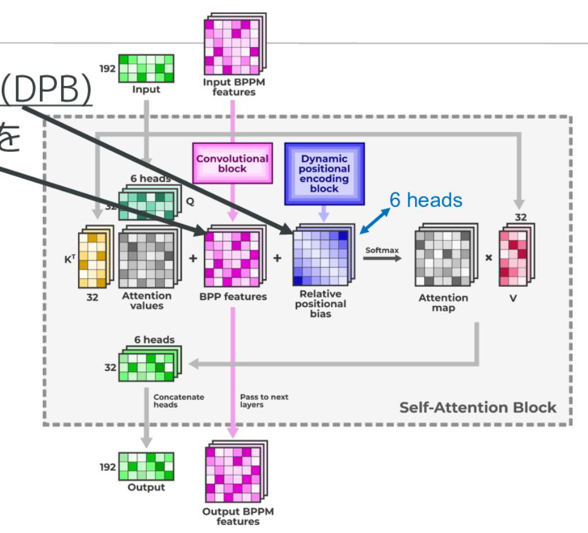
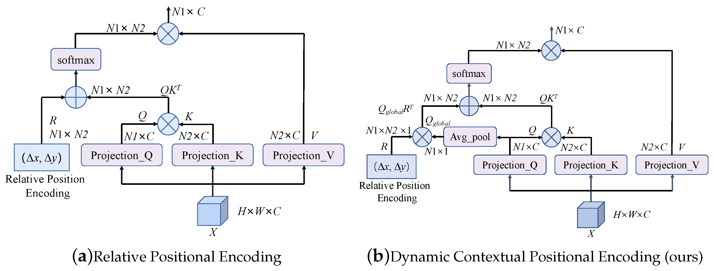

# Dynamic Position Bias (DPB)

> Learning Relative Positional Geometry in Attention Mechanisms

---

# 1. Introduction

Trong Transformer nguyên thủy, cơ chế Self-Attention không chứa bất kỳ khái niệm nào về thứ tự của token.

Attention được tính bởi:

$$
A=\operatorname{softmax} \left( \frac{QK^T}{\sqrt d} \right)
$$

Nếu hoán vị toàn bộ chuỗi đầu vào, kết quả attention sẽ thay đổi tương ứng nhưng mô hình không có khả năng nhận biết vị trí tuyệt đối hay tương đối giữa các token.

Do đó cần một cơ chế bổ sung thông tin vị trí.

Các thế hệ Position Encoding có thể được phân loại:

```text
Absolute Position Encoding
        │
        ├── Sinusoidal
        └── Learned Position Embedding

Relative Position Encoding
        │
        ├── Shaw et al.
        ├── T5 Relative Bias
        └── ALiBi

Dynamic Relative Position
        │
        └── Dynamic Position Bias
```

Dynamic Position Bias (DPB) là một bước tiến từ việc lưu trữ embedding vị trí sang việc học trực tiếp một hàm liên tục mô tả khoảng cách tương đối giữa các token.

---

## DPB inside Attention

<p align="center">
  
</p>

---

# 2. Motivation

Các phương pháp Relative Position Bias truyền thống thường sử dụng:

$$
B_{ij}=E_{bucket(i-j)}
$$

trong đó:

* $i$ là vị trí query
* $j$ là vị trí key
* bucket là phép lượng tử hóa khoảng cách

Ví dụ:

```text
distance
   │
   ▼
bucket
   │
   ▼
embedding table
```

Vấn đề:

* Hàm rời rạc
* Mất thông tin liên tục
* Hai khoảng cách gần nhau có thể rơi vào hai bucket khác nhau
* Khó mở rộng cho độ dài ngữ cảnh lớn

DPB thay thế lookup table bằng một hàm học được:

$$
f(i-j)
$$

---

# 3. Core Idea

Thay vì học embedding cho từng vị trí:

$$
Position
\rightarrow
Embedding
$$

DPB học:

$$
Distance
\rightarrow
Bias
$$

Cụ thể:

$$
r=i-j
$$

và

$$
B_{ij}=f(r)
$$

với:

$$
f:\mathbb R \rightarrow \mathbb R^H
$$

trong đó:

* $H$ là số attention heads

---

# 4. High-Level Architecture

## Traditional Relative Bias

```text
(i-j)
   │
Bucketization
   │
Embedding Lookup
   │
Attention Bias
```

## Dynamic Position Bias

```text
(i-j)
   │
   ▼
     MLP
   │
   ▼
Bias for each head
   │
   ▼
Attention Score
```

---

# 5. DPB Architecture

Đầu vào:

$$
r=i-j
$$

MLP được sử dụng để ánh xạ khoảng cách tương đối thành bias attention.

```text
Relative Distance
       │
       ▼
Linear Layer
       │
       ▼
SiLU
       │
       ▼
Linear Layer
       │
       ▼
SiLU
       │
       ▼
Linear Layer
       │
       ▼
Head-wise Bias
```


---

# 6. Mathematical Formulation

Cho:

$$
r=i-j
$$

Layer đầu tiên:

$$
h_1= \sigma(W_1r+b_1)
$$

Layer thứ hai:

$$
h_2= \sigma(W_2h_1+b_2)
$$

Output:

$$
B=W_3h_2+b_3
$$

Trong đó:

$$
B \in \mathbb R^H
$$

Mỗi attention head nhận một bias riêng.

---

# 7. Attention with Dynamic Bias

Attention score chuẩn:

$$
S_{ij}= \frac{q_i^Tk_j}{\sqrt d}
$$

DPB bổ sung:

$$
S_{ij}= \frac{q_i^Tk_j}{\sqrt d} + B(i-j)
$$

hoặc cho từng head:

$$
S_{ij}^{(h)}= \frac {q_i^{(h)}k_j^{(h)}} {\sqrt d} + B_h(i-j)
$$

Sau đó:

$$
A_{ij}= \operatorname{softmax}(S_{ij})
$$

---

# 8. Visualization of Relative Distance

```text
Query Position = 8

0 1 2 3 4 5 6 7 8
                ▲

Distances

8 7 6 5 4 3 2 1 0
```

DPB học trực tiếp:

```text
8 → bias
7 → bias
6 → bias
5 → bias
...
```

thay vì ánh xạ qua bucket.

---

# 9. Continuous Geometry

Relative Bias truyền thống:

```text
distance
     │
     ▼
bucket
     │
     ▼
bias
```

DPB:

```text
distance
     │
     ▼
continuous function
     │
     ▼
bias
```

Do đó:

$$
B(7) \approx B(8)
$$

một cách tự nhiên.

---

# 10. Translation Invariance

Giả sử:

```text
1 2 3 4 5
```

dịch thành:

```text
11 12 13 14 15
```

Ta có:

$$
(1-2)= (11-12)
$$

Do đó:

$$
B(1-2)= B(11-12)
$$

DPB chỉ phụ thuộc vào khoảng cách tương đối.

Nó không phụ thuộc vị trí tuyệt đối.

---

# 11. Multi-Head Dynamic Bias

Mỗi attention head học một hình học khác nhau.

```text
Head 1
 └─ Local Pattern

Head 2
 └─ Medium Range

Head 3
 └─ Long Range

Head 4
 └─ Global Pattern
```

Tương ứng:

$$B_1(r)$$

$$B_2(r)$$

$$B_3(r)$$

$$ B_4(r) $$

---

# 12. Comparison with Other Methods

| Method                | Absolute | Relative | Continuous | Learnable |
| --------------------- | -------- | -------- | ---------- | --------- |
| Sinusoidal            | ✓        | ✗        | ✓          | ✗         |
| Learned PE            | ✓        | ✗        | ✓          | ✓         |
| Shaw RPE              | ✗        | ✓        | ✗          | ✓         |
| T5 Bias               | ✗        | ✓        | ✗          | ✓         |
| ALiBi                 | ✗        | ✓        | ✓          | ✗         |
| RoPE                  | ✗        | ✓        | ✓          | ✗         |
| Dynamic Position Bias | ✗        | ✓        | ✓          | ✓         |

---

# 13. DPB vs T5 Relative Bias

T5:

$$
B_{ij}= E_{bucket(i-j)}
$$

```text
distance
    │
    ▼
bucket
    │
    ▼
embedding
```

DPB:

$$
B_{ij}=MLP(i-j)
$$

```text
distance
    │
    ▼
MLP
    │
    ▼
bias
```

DPB loại bỏ bước bucketization.

---

# 14. DPB vs ALiBi

ALiBi:

$$
B(i-j)=m(i-j)
$$

Là một hàm tuyến tính.

DPB:

$$
B(i-j)=f(i-j)
$$

Là hàm phi tuyến được học.

Do đó:

```text
ALiBi
    ⊂
Dynamic Position Bias
```

ALiBi có thể xem như trường hợp đặc biệt của DPB.

---

# 15. DPB vs RoPE

RoPE:

$$
Q,K \rightarrow Rotary(Q,K)
$$

Tác động lên vector biểu diễn.

DPB:

$$
Score= QK^T+B
$$

Tác động lên attention logits.

```text
RoPE
 └─ Modify representations

DPB
 └─ Modify attention scores
```

Hai kỹ thuật có thể sử dụng đồng thời.

---

# 16. Computational Complexity

Cho chuỗi độ dài:

$$
n
$$

Ma trận khoảng cách:

$$
R=[i-j]
$$

có kích thước:

$$
n \times n
$$

Bias:

$$
B=f(R)
$$

Độ phức tạp:

$$
O(n^2)
$$

Giống attention chuẩn.

Không làm thay đổi asymptotic complexity.

---

# 17. Geometric Interpretation

Attention chuẩn:

$$
K(x_i,x_j)= q_i^Tk_j
$$

DPB bổ sung:

$$
K'(x_i,x_j)= q_i^Tk_j + f(i-j)
$$

hay:

$$
K'= K + K_{position}
$$

Trong đó:

$$
K_{position}= f(i-j)
$$

là một positional kernel được học.

---

# 18. Dynamic Position Bias in Modern LLMs

DPB đại diện cho xu hướng:

```text
Absolute Position
        │
        ▼
Relative Position
        │
        ▼
Continuous Relative Position
        │
        ▼
Learned Relative Geometry
```

Thay vì học:

```text
Token Position
```

mô hình học:

```text
Token Distance Geometry
```

---

Đây là hướng phát triển xuất hiện trong nhiều kiến trúc attention hiện đại.

## Dynamic Position Bias Overview

<p align="center">
  
</p>

---

# References

1. Dynamic Position Bias: Position Information in Attention Mechanisms (2022)
2. Attention Is All You Need (2017)
3. T5: Exploring the Limits of Transfer Learning with a Unified Text-to-Text Transformer
4. ALiBi: Train Short, Test Long
5. RoFormer: Rotary Position Embedding
6. x-transformers (Lucidrains)
7. Dynamic Positional Bias Survey (EmergentMind)
