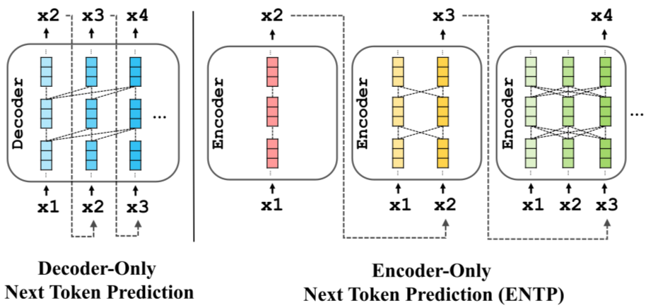
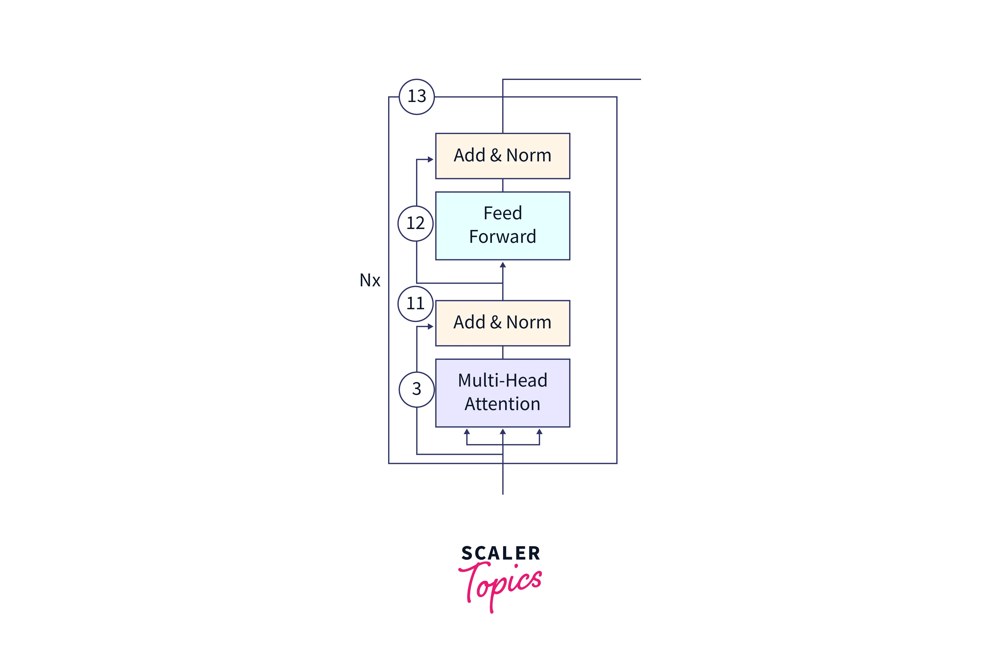
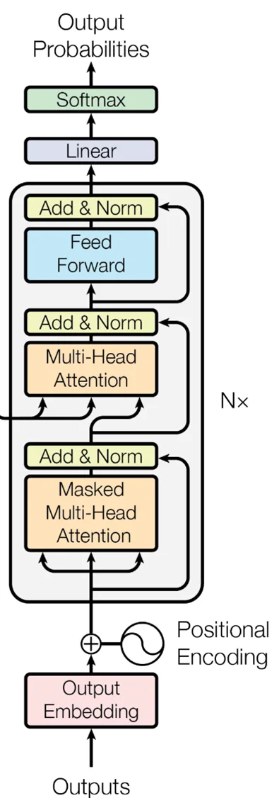

# Encoder và Decoder trong Transformer

# 1. Tổng Quan

Trong các mô hình Deep Learning hiện đại, đặc biệt là Transformer, hai thành phần trung tâm là:

* Encoder
* Decoder

Chúng thực hiện quá trình:

$$
\text{Input} \rightarrow \text{Latent Representation} \rightarrow \text{Output}
$$

Ý tưởng cốt lõi:

* Encoder biến đổi dữ liệu đầu vào thành biểu diễn ngữ nghĩa mức cao.
* Decoder sử dụng biểu diễn này để sinh đầu ra mong muốn.

Transformer đã chuẩn hóa kiến trúc Encoder–Decoder thông qua cơ chế Self-Attention.

---

# 2. Các Họ Kiến Trúc Transformer

## 2.1 Full Encoder–Decoder

Kiến trúc gốc của Transformer.

Bao gồm:

$$
\text{Input} \rightarrow \text{Encoder} \rightarrow \text{Context} \rightarrow \text{Decoder} \rightarrow \text{Output}
$$

Ví dụ nhiệm vụ:

* Machine Translation
* Summarization
* Sequence-to-Sequence

Các mô hình:

* T5
* BART
* Original Transformer

---

## 2.2 Encoder-Only

Chỉ sử dụng Encoder Stack.

Quá trình:

$$
X \rightarrow Encoder \rightarrow H
$$

Trong đó:

$$
H= {h_1,h_2,\ldots,h_n}
$$

là biểu diễn ngữ nghĩa cuối cùng.

Đặc điểm:

* Bidirectional Attention
* Hiểu ngữ cảnh toàn bộ câu

Các mô hình:

* BERT
* RoBERTa
* DeBERTa

---

## 2.3 Decoder-Only

Chỉ sử dụng Decoder Stack.

Quá trình:

$$
x_1 \rightarrow x_2 \rightarrow x_3 \rightarrow \cdots
$$

Mỗi token chỉ nhìn thấy quá khứ:

$$
x_1,\ldots,x_t
$$

không nhìn thấy tương lai.

Các mô hình:

* GPT
* LLaMA
* Mistral
* Qwen

---

# 3. Tư Tưởng Toán Học Của Encoder

Mục tiêu:

Cho chuỗi đầu vào:

$$
X= [x_1,x_2,\ldots,x_n]
$$

Encoder học ánh xạ:

$$
f_\theta : X \rightarrow H
$$

trong đó:

$$
H= [h_1,h_2,\ldots,h_n]
$$

với:

$$
h_i \in \mathbb{R}^{d_{model}}
$$

Mỗi vector:

$$
h_i
$$

không chỉ chứa thông tin của token:

$$
x_i
$$

mà còn chứa ngữ cảnh toàn bộ chuỗi.

---

# 4. Flow Hoạt Động Của Encoder

## Step 1: Token Embedding

Biến token thành vector:

$$
x_i \rightarrow e_i
$$

với:

$$
e_i \in \mathbb{R}^{d_{model}}
$$

Toàn bộ chuỗi:

$$
E= [e_1,e_2,\ldots,e_n]
$$

---

## Step 2: Positional Encoding

Attention không nhận biết vị trí.

Bổ sung:

$$
P= [p_1,p_2,\ldots,p_n]
$$

Đầu vào thực tế:

$$
Z^{(0)} = E+P
$$

---

## Step 3: Multi-Head Self-Attention

Đây là trái tim của Encoder.

Cho:

$$
X=Z^{(0)}
$$

Tạo:

$$
Q=XW_Q
$$

$$
K=XW_K
$$

$$
V=XW_V
$$

---

### Attention Score

Tính độ tương đồng:

$$
S=QK^T
$$

---

### Scaling

$$
S= \frac{QK^T} {\sqrt{d_k}}
$$

---

### Softmax

$$
A=
Softmax(S)
$$

---

### Weighted Sum

$$
O=AV
$$

---

### Attention Formula

$$
Attention(Q,K,V) = Softmax \left( \frac{QK^T} {\sqrt{d_k}}\right) V
$$

---

## Step 4: Multi-Head Mechanism

Head thứ i:

$$
head_i = Attention(Q_i,K_i,V_i)
$$

Ghép:

$$
H= Concat(head_1,\ldots,head_h)
$$

Projection:

$$
MHA = HW_O
$$

---

## Step 5: Residual Connection

$$
Y= X+MHA
$$

---

## Step 6: Layer Normalization

$$
Z= LayerNorm(Y)
$$

---

## Step 7: Feed Forward Network

Mỗi token đi qua MLP.

$$
FFN(x) = W_2 \sigma (W_1x+b_1)+b_2
$$

Thông thường:

$$
d_{ff} = 4d_{model}
$$

---

## Step 8: Residual + LayerNorm

$$
Y_2 = Z+FFN(Z)
$$

$$
Output = LayerNorm(Y_2)
$$

---

# 5. Encoder Block Tổng Quát

Một Encoder Block:

$$
X
\rightarrow MHA \rightarrow AddNorm \rightarrow FFN \rightarrow AddNorm \rightarrow Output
$$

Viết gọn:

$$
EncoderBlock(X) = LN \left( FFN (LN(X+MHA(X))) + LN(X+MHA(X)) \right)
$$

---

# 6. Encoder Stack

N block được xếp chồng.

$$
H^{(0)} = Embedding+PE
$$

$$
H^{(1)} = Encoder_1(H^{(0)})
$$

$$
H^{(2)} = Encoder_2(H^{(1)})
$$

$$
\cdots
$$

$$
H^{(L)} = Encoder_L(H^{(L-1)})
$$

Đầu ra cuối:

$$
H^{(L)}
$$

được gọi là:

$$
Memory
$$

hoặc:

$$
Context Representation
$$

---

# 7. Tư Tưởng Toán Học Của Decoder

Decoder thực hiện:

$$
g_\phi : (H,Y_{<t}) \rightarrow y_t
$$

Trong đó:

$$
H
$$

là output của Encoder.

Decoder sinh token kế tiếp:

$$
y_t
$$

dựa trên:

* Output trước đó
* Context từ Encoder

---

# 8. Flow Hoạt Động Của Decoder

## Step 1: Input Embedding

Cho chuỗi đầu ra đã biết:

$$
Y= [y_1,\ldots,y_t]
$$

Embedding:

$$
D^{(0)} = Embedding(Y)+PE
$$

---

## Step 2: Masked Self-Attention

Khác Encoder.

Ma trận mask:

$$
M_{ij} = \begin{cases} 0 & j\le i\ -\infty & j>i \end{cases}
$$

Score:

$$
S= \frac{QK^T}{\sqrt{d_k}} +M
$$

Attention:

$$
A= Softmax(S)
$$

Token hiện tại chỉ nhìn thấy quá khứ.

---

## Step 3: Add & Norm

$$
Z_1 = LayerNorm(D^{(0)}+MSA)
$$

---

## Step 4: Cross Attention

Khác biệt lớn nhất của Decoder.

Query:

$$
Q=Z_1W_Q
$$

từ Decoder.

Key:

$$
K=HW_K
$$

từ Encoder.

Value:

$$
V=HW_V
$$

từ Encoder.

---

### Cross Attention

$$
CrossAttention = Softmax\left( \frac{QK^T}{\sqrt{d_k}}\right)V
$$

Decoder truy cập toàn bộ thông tin từ Encoder.

---

## Step 5: Add & Norm

$$
Z_2 = LayerNorm(Z_1+CrossAttention)
$$

---

## Step 6: Feed Forward Network

$$
FFN(Z_2)
$$

---

## Step 7: Add & Norm

$$
Output = LayerNorm(Z_2+FFN(Z_2))
$$

---

# 9. Decoder Block Tổng Quát

Một Decoder Block:

$$
Input \rightarrow MaskedSelfAttention \rightarrow AddNorm \rightarrow CrossAttention \rightarrow AddNorm \rightarrow FFN \rightarrow AddNorm \rightarrow Output
$$

---

# 10. Decoder Stack

$$
D^{(1)} = Decoder_1(D^{(0)},H)
$$

$$
D^{(2)} = Decoder_2(D^{(1)},H)
$$

$$
\cdots
$$

$$
D^{(L)} = Decoder_L(D^{(L-1)},H)
$$

---

# 11. Projection Sang Vocabulary

Sau Decoder cuối:

$$
D^{(L)}
$$

Chiếu sang vocabulary:

$$
z_t = D^{(L)}W_{vocab} +b
$$

---

## Softmax

$$
P(y_t) = Softmax(z_t)
$$

---

## Chọn Token

$$
y_t = argmax(P(y_t))
$$

hoặc

$$
y_t \sim P(y_t)
$$

---

# 12. So Sánh Encoder và Decoder

| Thành phần       | Encoder  | Decoder    |
| ---------------- | -------- | ---------- |
| Self Attention   | Có       | Có         |
| Masked Attention | Không    | Có         |
| Cross Attention  | Không    | Có         |
| Nhìn tương lai   | Có       | Không      |
| Mục tiêu         | Encoding | Generation |

---

# 13. Liên Hệ Với X-Transformers

X-Transformers không thay đổi bản chất toán học của Transformer.

Nó là framework tổng quát hóa:

$$
Transformer = Attention + Residual + Normalization + FeedForward
$$

và mở rộng:

* Rotary Position Embedding (RoPE)
* ALiBi
* RMSNorm
* SwiGLU
* Gated Residual
* Multi Query Attention
* Grouped Query Attention
* Sparse Attention
* Linear Attention

Tuy nhiên mọi biến thể đều kế thừa cùng một luồng nền tảng:

$$
Input \rightarrow Attention \rightarrow FeedForward \rightarrow Representation
$$

đối với Encoder

và

$$
Input \rightarrow MaskedAttention \rightarrow CrossAttention \rightarrow FeedForward\rightarrow Token
$$

đối với Decoder.

---

# 14. Kết Luận

Encoder chịu trách nhiệm xây dựng biểu diễn ngữ nghĩa toàn cục:

$$
X \rightarrow H
$$

Decoder chịu trách nhiệm sinh chuỗi:

$$
(H,Y_{<t}) \rightarrow Y
$$

Toàn bộ Transformer hiện đại, từ BERT đến GPT, T5, LLaMA, Mistral hay các biến thể trong X-Transformers, đều được xây dựng từ hai khối nền tảng này:

$$
\boxed{Attention + FeedForward + Residual + Normalization}
$$

Sự khác biệt chủ yếu nằm ở:

* Loại Attention
* Positional Encoding
* Normalization
* Feed Forward Design
* Cách tổ chức Encoder và Decoder
