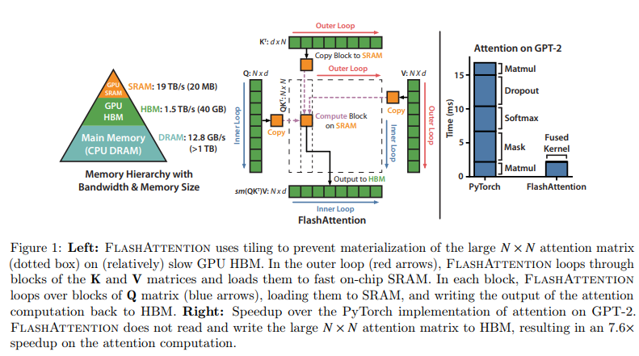
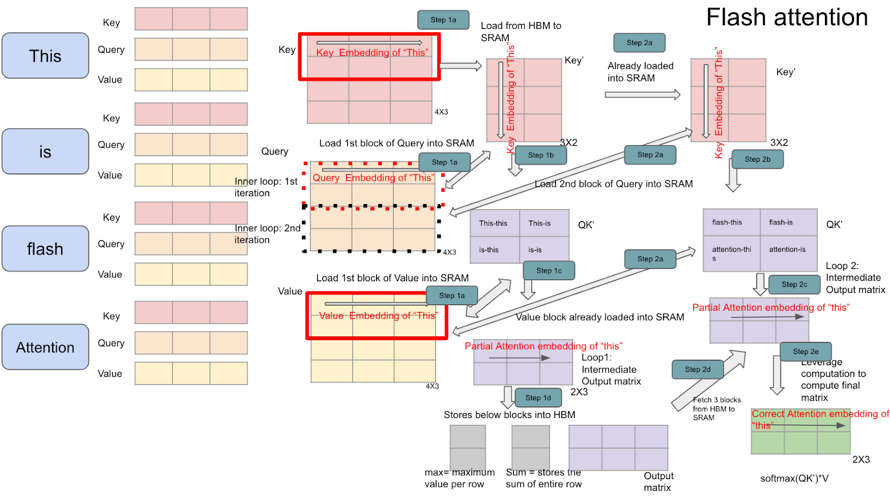

# FlashAttention: Fast and Memory-Efficient Exact Attention



## 1. Giới thiệu

FlashAttention là một thuật toán tối ưu hóa việc tính toán Self-Attention được đề xuất trong bài báo:

**FlashAttention: Fast and Memory-Efficient Exact Attention with IO-Awareness**

Mục tiêu chính:

* Giảm chi phí truy cập bộ nhớ (HBM Memory).
* Tăng tốc độ huấn luyện và suy luận Transformer.
* Giữ nguyên kết quả Attention chính xác (Exact Attention).
* Không thay đổi kiến trúc Transformer.

FlashAttention không phải là một Attention mới.

Nó là một **thuật toán tính toán Attention hiệu quả hơn**.

---

## 2. Vấn đề của Scaled Dot Product Attention

Attention tiêu chuẩn:

$$
Attention(Q,K,V)=

Softmax
\left(
\frac{QK^T}{\sqrt d}
\right)V
$$

với:

$$
Q,K,V \in \mathbb R^{N\times d}
$$

trong đó:

* (N): chiều dài chuỗi
* (d): kích thước embedding

---

### Bước 1

Tính ma trận điểm số:

$$
S
=

QK^T
$$

kích thước:

$$
N\times N
$$

---

### Bước 2

Tính Softmax:

$$
P
=

Softmax(S)
$$

---

### Bước 3

Nhân với Value:

$$
O
=

PV
$$

---

## 3. Nút thắt cổ chai

Chi phí tính toán:

$$
O(N^2)
$$

đây không phải vấn đề lớn nhất.

Vấn đề thực sự:

$$
O(N^2)
$$

bộ nhớ.

---

Ví dụ:

$$
N=8192
$$

khi đó:

$$
N^2=

67,108,864
$$

phần tử.

Ma trận Attention Score:

$$
QK^T
$$

chiếm hàng trăm MB.

---

Pipeline chuẩn:

```text
HBM
 ↓
Load Q
 ↓
Load K
 ↓
Compute QKᵀ
 ↓
Write Score Matrix
 ↓
Read Score Matrix
 ↓
Softmax
 ↓
Write Probabilities
 ↓
Read Probabilities
 ↓
Multiply V
 ↓
Write Output
```

Chi phí lớn nhất đến từ:

```text
Memory Read / Write
```

không phải FLOPs.

---

## 4. IO Complexity

Bài báo chỉ ra:

GPU hiện đại:

```text
Compute rất nhanh
```

nhưng

```text
HBM Memory chậm hơn nhiều
```

Do đó:

```text
Memory Bandwidth
```

trở thành giới hạn.

---

### Thời gian thực tế

$$
T
\approx
T_{IO}
+
T_{Compute}
$$

trong đó:

$$
T_{IO}
\gg
T_{Compute}
$$

---

FlashAttention tập trung giảm:

$$
T_{IO}
$$

thay vì giảm FLOPs.

---

# 5. Ý tưởng cốt lõi

Không bao giờ lưu toàn bộ:

$$
QK^T
$$

xuống bộ nhớ.

Thay vào đó:

```text
Load một block nhỏ
↓
Tính Attention
↓
Tính Softmax
↓
Tính Output
↓
Discard
```

Mọi thứ được thực hiện trong:

```text
SRAM
```

của GPU.

---

## 6. Tiling

Chia ma trận thành các block.

---

### Query Block

$$
Q=
\begin{bmatrix}
Q_1\
Q_2\
\vdots\
Q_m
\end{bmatrix}
$$

---

### Key Block

$$
K=
\begin{bmatrix}
K_1\
K_2\
\vdots\
K_n
\end{bmatrix}
$$

---

### Value Block

$$
V=
\begin{bmatrix}
V_1\
V_2\
\vdots\
V_n
\end{bmatrix}
$$

---

Thay vì:

$$
QK^T
$$

FlashAttention tính:

$$
Q_iK_j^T
$$

theo từng block.

---

## 7. Online Softmax

Đây là phát minh quan trọng nhất.

---

### Softmax chuẩn

$$
Softmax(x_i)=

\frac{e^{x_i}}
{\sum_j e^{x_j}}
$$

cần biết:

$$
\sum_j e^{x_j}
$$

trên toàn bộ hàng.

---

Điều này khiến Attention phải lưu toàn bộ:

$$
QK^T
$$

---

FlashAttention sử dụng:

```text
Online Softmax
```

để xử lý từng block.

---

## 8. Running Maximum

Với một hàng attention.

Giả sử đã duyệt tới block (t).

Lưu:

$$
m_t=

\max(x)
$$

---

Khi block mới đến:

$$
m_{new}=

\max(m_t,m_{block})
$$

---

## 9. Running Sum

Đồng thời lưu:

$$
l_t=

\sum_i
e^{x_i-m_t}
$$

---

Cập nhật:

$$
l_{new}=

e^{m_t-m_{new}}l_t
+
\sum_j
e^{x_j-m_{new}}
$$

---

Nhờ đó:

```text
Không cần toàn bộ vector.
```

---

## 10. Online Attention Output

Attention Output:

$$
O
=

Softmax(S)V
$$

---

FlashAttention cập nhật trực tiếp:

$$
O_t
$$

trong lúc duyệt block.

---

Nếu block mới xuất hiện:

$$
O_{new}=

\frac{
e^{m_t-m_{new}}
l_t
O_t
+
\sum_j
e^{S_j-m_{new}}V_j
}
{l_{new}}
$$

---

Điều này cho phép:

```text
Không lưu Attention Matrix.
```

---

# 11. Thuật toán FlashAttention


Cho:

$$
Q,K,V
$$

---

Khởi tạo:

$$
m=-\infty
$$

$$
l=0
$$

$$
O=0
$$

---

Lặp theo block:

```text
for K_block,V_block
```

---

Tính score:

$$
S
=

Q_{block}
K_{block}^T
$$

---

Tìm max:

$$
m_{block}=

max(S)
$$

---

Cập nhật:

$$
m_{new}=

max(m,m_{block})
$$

---

Tính:

$$
P
=

e^{S-m_{new}}
$$

---

Cập nhật:

$$
l_{new}=

e^{m-m_{new}}l
+
\sum P
$$

---

Cập nhật output:

$$
O_{new}=

\frac{
e^{m-m_{new}}lO
+
PV
}
{l_{new}}
$$

---

Lặp tới hết.

---

## 12. Độ phức tạp

### Compute

Không đổi:

$$
O(N^2)
$$

---

### Memory

Attention chuẩn:

$$
O(N^2)
$$

---

FlashAttention:

$$
O(Nd)
$$

---

Giảm hoàn toàn việc lưu:

$$
N\times N
$$

Attention Matrix.

---

## 13. IO Complexity

Bài báo chứng minh:

Attention chuẩn:

$$
\Theta(N^2)
$$

lần truy cập bộ nhớ.

---

FlashAttention:

$$
\Theta
\left(
\frac{N^2d^2}{M}
\right)
$$

với:

$$
M
$$

là SRAM.

---

Đây là mức tối ưu gần như lý thuyết.

---

# 14. FlashAttention v1

Đặc điểm:

* Exact Attention.
* Tiling.
* Online Softmax.
* IO-Aware Algorithm.

Tăng tốc:

```text
2x – 4x
```

so với Attention chuẩn.

---

# 15. FlashAttention v2

Bài báo:

**FlashAttention-2: Faster Attention with Better Parallelism**

---

Cải tiến:

### Work Partitioning

Phân chia workload tốt hơn.

### Warp Parallelism

Khai thác GPU hiệu quả hơn.

### Giảm Synchronization

Giảm chi phí đồng bộ.

### Occupancy cao hơn

Tăng mức sử dụng SM.

---

Hiệu năng:

```text
50% – 100%
```

nhanh hơn FlashAttention v1.

---

# 16. FlashAttention và Transformer hiện đại

Ngày nay gần như mọi LLM lớn đều dùng FlashAttention hoặc biến thể của nó:

* GPT-4 class models
* Claude
* Gemini
* LLaMA
* Mistral
* DeepSeek
* Qwen

---

FlashAttention không thay đổi:

$$
Attention(Q,K,V)
$$

mà thay đổi:

```text
Cách tính toán Attention
```

để tận dụng phần cứng tối đa.

---

# 17. Quan điểm học thuật

Attention gốc tập trung vào:

$$
Algorithmic Complexity
$$

---

FlashAttention đưa thêm khái niệm:

$$
IO Complexity
$$

---

Tư tưởng cốt lõi:

> Một thuật toán không chỉ được đánh giá bằng FLOPs, mà còn bằng số lần dữ liệu phải di chuyển giữa các tầng bộ nhớ.

Đây là lý do FlashAttention trở thành nền tảng mặc định của hầu hết các Transformer hiện đại.

---

# 18. Những kiến thức nên học trước

Để hiểu hoàn toàn FlashAttention cần nắm:

### Toán học

* Softmax
* Log-Sum-Exp
* Numerical Stability
* Matrix Multiplication

### Transformer

* Self-Attention
* Multi-Head Attention
* Causal Mask

### GPU

* SRAM
* HBM
* CUDA Memory Hierarchy
* Tiling
* Parallel Reduction

---

# 19. Tóm tắt

FlashAttention là thuật toán tính Self-Attention theo hướng tối ưu truy cập bộ nhớ.

Các ý tưởng nền tảng:

1. Không lưu ma trận Attention đầy đủ.
2. Chia Attention thành các block nhỏ.
3. Sử dụng Online Softmax.
4. Tính trực tiếp Output trong quá trình duyệt block.
5. Giảm IO từ HBM.
6. Giữ nguyên Exact Attention.
7. Tăng tốc Transformer mà không thay đổi mô hình.

Về mặt lịch sử, FlashAttention là bước chuyển từ tư duy:

$$
\text{Optimize FLOPs}
$$

sang:

$$
\text{Optimize Memory Movement}
$$

và trở thành nền tảng triển khai Attention của các LLM hiện đại.
