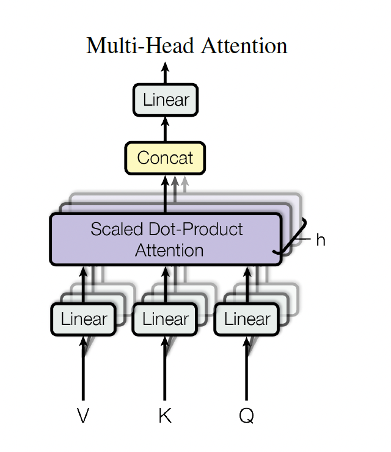
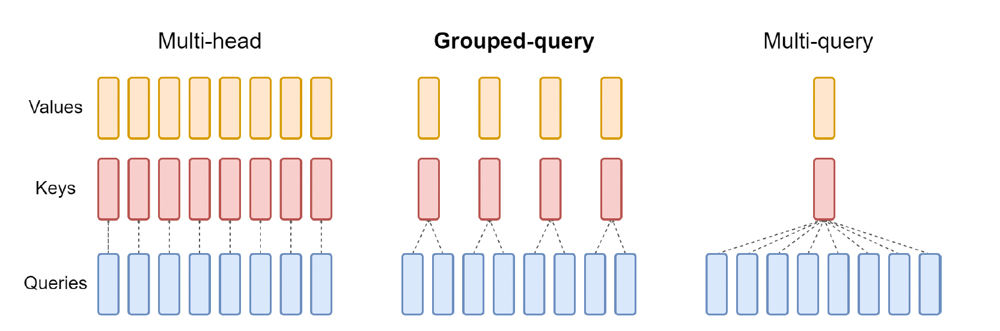
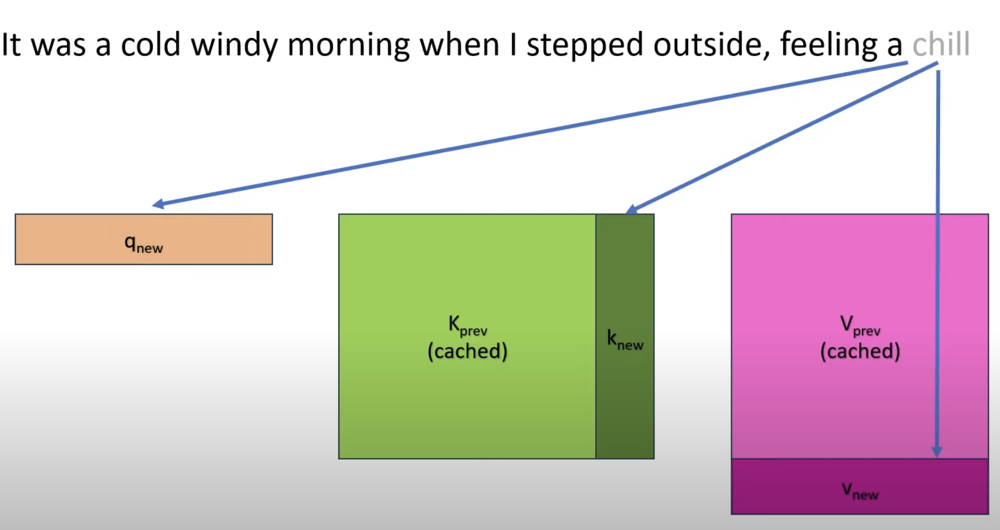
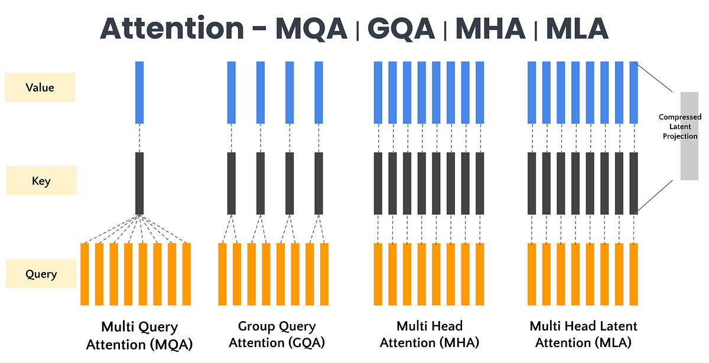

# Multi-Query Attention (MQA)

> Fast Transformer Decoding: One Write-Head is All You Need
> Noam Shazeer, 2019

---

# 1. Giới thiệu

Multi-Query Attention (MQA) là một biến thể của Multi-Head Attention được thiết kế nhằm giải quyết nút thắt lớn nhất của Transformer trong giai đoạn suy luận (inference):

> KV Cache Memory Bandwidth.

Trong các mô hình ngôn ngữ lớn (LLMs), khi chiều dài ngữ cảnh tăng lên hàng chục nghìn hoặc hàng triệu token, chi phí đọc Key-Value Cache trở thành yếu tố chi phối thời gian suy luận hơn cả số lượng phép tính Attention.

MQA được đề xuất bởi Noam Shazeer (2019) với ý tưởng cực kỳ đơn giản:

* Giữ nguyên nhiều Query Heads.
* Chia sẻ chung Key và Value cho tất cả Head.

Điều này giúp giảm kích thước KV Cache theo hệ số bằng số lượng head.

---

# 2. Từ Multi-Head Attention đến Multi-Query Attention

## Multi-Head Attention

Trong Transformer nguyên thủy:

$$
Q_i=XW_i^Q
$$

$$
K_i=XW_i^K
$$

$$
V_i=XW_i^V
$$

với:

$$
i=1,\ldots,h
$$

Mỗi head có:

* Query riêng
* Key riêng
* Value riêng

---



<p align="center">
<b>Hình 1.</b> Multi-Head Attention: mỗi head sở hữu một bộ Key và Value riêng.
</p>

---

Attention của head thứ i:

$$
Head_i=
\text{Softmax}
\left(
\frac{Q_iK_i^T}
{\sqrt{d_h}}
\right)V_i
$$

Toàn bộ output:

$$
Y=
\text{Concat}
(
Head_1,\ldots,Head_h
)
W_O
$$

---

# 3. Động cơ của MQA

Giả sử:

* chiều dài ngữ cảnh:

$$
L
$$

* số head:

$$
h
$$

* chiều head:

$$
d_h
$$

KV Cache cần lưu:

$$
K_1,\ldots,K_h
$$

và

$$
V_1,\ldots,V_h
$$

Dung lượng:

$$
O(Lhd_h)
$$

Khi:

$$
L \gg 10^4
$$

chi phí bộ nhớ trở thành cực kỳ lớn.

---

Trong quá trình sinh token:

```text
Token mới
    │
    ▼
Đọc toàn bộ KV Cache
    │
    ▼
Attention
    │
    ▼
Sinh token tiếp theo
```

Mỗi bước suy luận đều phải truy cập toàn bộ KV Cache.

Do đó:

$$
Memory\ Bandwidth
\rightarrow
Bottleneck
$$

---

# 4. Ý tưởng cốt lõi của MQA

MQA giữ nguyên:

$$
Q_1,Q_2,\ldots,Q_h
$$

nhưng chỉ dùng:

$$
K
$$

và

$$
V
$$

duy nhất.

---



<p align="center">
<b>Hình 2.</b> Multi-Query Attention: nhiều Query Heads nhưng chỉ một Key-Value Head.
</p>

---

Công thức:

## Query

$$
Q_i=XW_i^Q
$$

## Shared Key

$$
K=XW^K
$$

## Shared Value

$$
V=XW^V
$$

---

Attention:

$$
Head_i=
\text{Softmax}
\left(
\frac{Q_iK^T}
{\sqrt{d_h}}
\right)V
$$

---

Output:

$$
Y=
\text{Concat}
(
Head_1,\ldots,Head_h
)
W_O
$$

---

# 5. So sánh trực quan

## Multi-Head Attention

```text
Head1 → K1,V1

Head2 → K2,V2

Head3 → K3,V3

...

Headh → Kh,Vh
```

---

## Multi-Query Attention

```text
Head1 ─┐
Head2 ─┤
Head3 ─┤
 ...   ├──► K,V
Headh ─┘
```

---

Từ góc nhìn hình học:

MHA:

```text
Head1 → Memory1

Head2 → Memory2

Head3 → Memory3
```

MQA:

```text
Head1 ─┐
Head2 ─┤
Head3 ─┤
       ├── Shared Memory
Headh ─┘
```

---

# 6. Phân tích KV Cache

## MHA

KV Cache:

$$
O(Lhd_h)
$$

---

Ví dụ:

* h = 32
* d_h = 128
* L = 32K

thì phải lưu:

$$
32
$$

bộ Key

và

$$
32
$$

bộ Value.

---

## MQA

KV Cache:

$$
O(Ld_h)
$$

Chỉ lưu:

$$
K
$$

và

$$
V
$$

một lần.

---



<p align="center">
<b>Hình 3.</b> So sánh dung lượng KV Cache giữa MHA và MQA.
</p>

---

Tỷ lệ giảm:

$$
\frac{Lhd_h}
{Ld_h}=

h
$$

Nếu:

$$
h=32
$$

thì:

$$
32\times
$$

ít bộ nhớ hơn.

---

# 7. Phân tích độ phức tạp

| Thành phần       | MHA      | MQA     |
| ---------------- | -------- | ------- |
| Query Projection | $O(h)$     | $O(h)$    |
| Key Projection   | $O(h)$     | $O(1)$    |
| Value Projection | $O(h)$     | $O(1)$    |
| KV Cache         | $O(Lhd_h)$ | $O(Ld_h)$ |
| Memory Read      | $O(Lhd_h)$ | $O(Ld_h)$ |

---

MQA không làm giảm đáng kể FLOPs Attention.

Điểm mạnh thực sự nằm ở:

$$
Memory\ Access
$$

---

# 8. Tại sao MQA tăng tốc Inference?

Trong LLM:

```text
GPU Compute
      │
      ▼
Attention
      │
      ▼
Memory Read
      │
      ▼
KV Cache
```

Nút thắt không phải:

$$
Compute
$$

mà là:

$$
Memory\ Bandwidth
$$

---

MQA giảm:

$$
K,V
$$

cần đọc từ bộ nhớ.

Do đó:

$$
Bandwidth
\downarrow
$$

$$
Latency
\downarrow
$$

$$
Throughput
\uparrow
$$

---

# 9. Nhược điểm

MQA đánh đổi hiệu suất bằng khả năng biểu diễn.

---

Trong MHA:

$$
K_1\neq K_2\neq \cdots \neq K_h
$$

$$
V_1\neq V_2\neq \cdots \neq V_h
$$

Mỗi head có thể học một dạng thông tin riêng.

---

Trong MQA:

$$
K_1=K_2=\cdots=K_h
$$

$$
V_1=V_2=\cdots=V_h
$$

Toàn bộ head dùng chung một không gian bộ nhớ.


---

# 10. MQA dẫn tới GQA

Nhược điểm của MQA thúc đẩy sự ra đời của Grouped Query Attention.

---

## MHA

```text
32 Query Heads
32 KV Heads
```

---

## MQA

```text
32 Query Heads
1 KV Head
```

---

## GQA

```text
32 Query Heads
8 KV Heads
```

---



<p align="center">
<b>Hình 4.</b> Sự tiến hóa từ MHA → MQA → GQA.
</p>

---

GQA trở thành kiến trúc attention mặc định của nhiều LLM hiện đại.

---

# 11. Ý nghĩa lịch sử

MQA là công trình đầu tiên chỉ ra rằng:

> Chi phí lớn nhất của Transformer inference nằm ở KV Cache bandwidth chứ không phải FLOPs.

Ý tưởng này mở đường cho:

* Grouped Query Attention (GQA)
* PagedAttention
* Flash-Decoding
* KV Compression
* MLA
* Multi-Level KV Cache
* Long Context LLM

---

# 12. Tổng kết

Multi-Query Attention thay thế:

$$
(Q_i,K_i,V_i)
$$

bằng:

$$
(Q_i,K,V)
$$

trong đó:

* Query vẫn đa đầu.
* Key và Value được chia sẻ.
* KV Cache giảm theo hệ số số head.
* Memory bandwidth giảm mạnh.
* Inference nhanh hơn đáng kể.
* Đánh đổi bằng việc giảm khả năng biểu diễn.

MQA là cầu nối quan trọng giữa Multi-Head Attention cổ điển và các cơ chế attention tối ưu hóa cho LLM hiện đại như GQA, Flash-Decoding và MLA.
