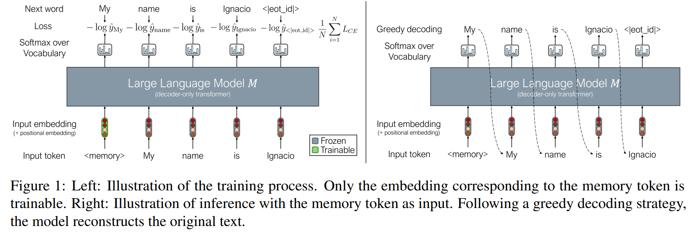
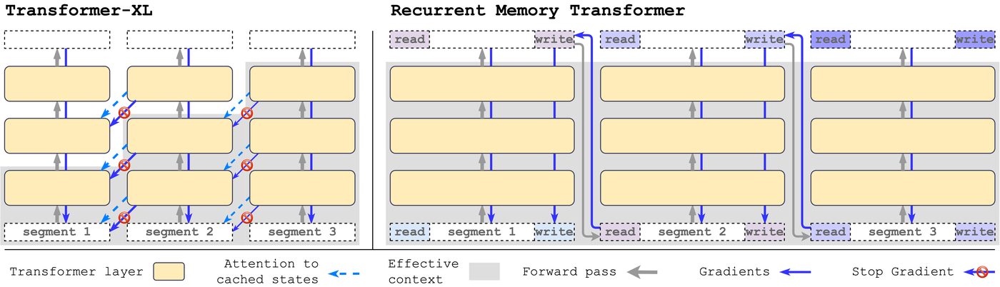

# Memory Tokens



## 1. Giới thiệu

Một trong những giới hạn cơ bản của Transformer là:

* Context window hữu hạn.
* Self-Attention có độ phức tạp:

$$
O(n^2)
$$

với:

$$
n = \text{sequence length}
$$

Khi chuỗi trở nên dài hơn:

$$
n \rightarrow \infty
$$

thì:

* Chi phí Attention tăng rất nhanh.
* Thông tin ở đầu chuỗi dần bị suy giảm.
* Mô hình khó duy trì trạng thái dài hạn.

Ý tưởng của **Memory Tokens** là thêm một tập token đặc biệt đóng vai trò như một vùng nhớ (memory slots) để lưu trữ thông tin toàn cục của chuỗi.

Thay vì chỉ có:

$$
X = [x_1,x_2,\ldots,x_n]
$$

ta mở rộng thành:

$$
X'=[m_1,m_2,\ldots,m_k,x_1,x_2,\ldots,x_n]
$$

trong đó:

$$
m_i
$$

là các Memory Tokens học được trong quá trình huấn luyện.

---

## 2. Vấn đề của Self-Attention truyền thống

Attention chuẩn:

$$
Q=XW_Q
$$

$$
K=XW_K
$$

$$
V=XW_V
$$

và:

$$
A=\text{softmax}
\left(
\frac{QK^T}{\sqrt d}
\right)
V
$$

Mỗi token tương tác với toàn bộ chuỗi.

Ma trận attention:

$$
A \in \mathbb R^{n\times n}
$$

kích thước tăng theo:

$$
n^2
$$

Ngoài ra thông tin chỉ được lan truyền qua nhiều tầng Transformer.

Đối với chuỗi dài:

* Khó lưu trữ trạng thái toàn cục.
* Thông tin xa bị pha loãng.
* Không có vị trí chuyên biệt để tích lũy kiến thức.

---

## 3. Ý tưởng cốt lõi của Memory Tokens



Thêm:

$$
M=
[m_1,m_2,\ldots,m_k]
$$

vào đầu chuỗi.

Input mới:

$$
X'=[M;X]
$$

với:

$$
M \in \mathbb R^{k\times d}
$$

$$
X \in \mathbb R^{n\times d}
$$

Sau đó thực hiện Self-Attention bình thường.

Memory token có khả năng:

* Nhận thông tin từ mọi token.
* Phân phối thông tin trở lại chuỗi.
* Tích lũy trạng thái toàn cục qua nhiều tầng.

---

### 3.1 So sánh giữa transfrmer thường và Memory Tokens.

```
Transformer thường

x1 <------> x2 <------> x3 <------> x4
 \_________________________________/

Mọi token phải tự lưu thông tin


Memory Tokens

m1  m2  m3
|\  |\  |\
| \ | \ | \
|  \|  \|  \
x1 x2 x3 x4 x5 x6

Memory trở thành trung tâm lưu trữ
```

---

## 4. Biểu diễn toán học

Sau khi ghép:

$$
H^{(0)}=

[M;X]
$$

Ta có:

$$
H^{(l)}=

\text{TransformerLayer}
(H^{(l-1)})
$$

Attention:

$$
Q=H^{(l-1)}W_Q
$$

$$
K=H^{(l-1)}W_K
$$

$$
V=H^{(l-1)}W_V
$$

và:

$$
H^{(l)}=

\text{softmax}
\left(
\frac{QK^T}{\sqrt d}
\right)
V
$$

Do Memory Tokens cũng nằm trong chuỗi nên:

* Memory có thể attention tới mọi token.
* Mọi token có thể attention tới Memory.

Không cần sửa đổi Attention.

---

## 5. Memory như Bottleneck toàn cục

__Minh họa:__
```
Input Tokens
      ↓

┌─────────────┐
│ Memory Slot │
└─────────────┘

      ↓

Output Tokens
```

Ký hiệu:

$$
M^{(l)}=

[m_1^{(l)},...,m_k^{(l)}]
$$

Sau một tầng:

$$
M^{(l+1)}=

f(M^{(l)},X^{(l)})
$$

Trong đó:

$$
f
$$

là phép attention.

Ta có thể xem:

$$
M^{(l)}
$$

là một trạng thái ẩn toàn cục.

Tương tự hidden state trong RNN:

$$
h_t
$$

nhưng được học bởi Attention.

---

## 6. Luồng truyền thông tin

### Transformer thường

Thông tin truyền:

$$
x_i
\rightarrow
x_j
$$

qua nhiều bước attention.

Khoảng cách hiệu quả:

$$
O(n)
$$

đối với một số kiến trúc sparse.

---

### Memory Tokens

Thông tin truyền:

$$
x_i
\rightarrow
m
\rightarrow
x_j
$$

Memory đóng vai trò trung tâm.

Khoảng cách logic:

$$
2
$$

bước attention.

Điều này giúp:

* Tổng hợp thông tin toàn cục.
* Giảm khó khăn khi học phụ thuộc dài hạn.

---

## 7. Memory Compression

Minh họa
```
4096 Tokens
      ↓

 ┌────────┐
 │ Memory │
 │  32    │
 │ Tokens │
 └────────┘

      ↓

Compressed Representation
```
$$\mathbb{R}^{4096 \times d} \rightarrow \mathbb{R}^{32 \times d}$$

Memory có thể được xem là phép nén:

Từ:

$$
n
\text{ token}
$$

sang:

$$
k
\text{ token}
$$

với:

$$
k \ll n
$$

Thông tin:

$$
X
\rightarrow
M
$$

là quá trình:

$$
\mathbb R^{n\times d}
\rightarrow
\mathbb R^{k\times d}
$$

Memory trở thành latent representation của toàn bộ chuỗi.

Ý tưởng này là nền tảng của:

* Perceiver
* Set Transformer
* Latent Attention
* Recurrent Memory Transformer

---

## 8. Memory Reading và Writing

Memory Tokens thực hiện hai chức năng đồng thời.

```
WRITE

x1
x2  ---> Memory
x3


READ

Memory ---> x1
Memory ---> x2
Memory ---> x3

hoặc

          Write
X ----------------> M

X <---------------- M
          Read
```

### Write

Memory đọc dữ liệu:

$$
M
\leftarrow
\text{Attention}(M,X)
$$

Memory hấp thụ thông tin từ chuỗi.

---

### Read

Token đọc dữ liệu:

$$
X
\leftarrow
\text{Attention}(X,M)
$$

Chuỗi truy cập thông tin đã lưu.

---

Kết hợp:

$$
X
\leftrightarrow
M
$$

tạo thành cơ chế bộ nhớ khả vi (Differentiable Memory).

---

## 9. Quan hệ với CLS Token

```
ViT

[CLS] x1 x2 x3 x4


Memory Transformer

[m1] [m2] [m3] x1 x2 x3 x4
```

Trong Vision Transformer:

$$
[\text{CLS},x_1,\ldots,x_n]
$$

CLS token là:

$$
k=1
$$

Memory Token.

Nó tổng hợp thông tin toàn bộ ảnh.

Memory Tokens mở rộng ý tưởng này:

$$
k>1
$$

nhiều vùng nhớ thay vì một vùng nhớ duy nhất.

---

## 10. Quan hệ với Perceiver

Perceiver sử dụng:

$$
L=
[l_1,\ldots,l_m]
$$

latent vectors.

Cross-Attention:

$$
L
\leftarrow
X
$$

rồi:

$$
L
\leftrightarrow
L
$$

Memory Tokens có thể xem là phiên bản đơn giản hơn:

* Không cần Cross-Attention riêng.
* Chỉ thêm token vào chuỗi.
* Vẫn dùng Self-Attention chuẩn.

---

## 11. Recurrent Memory Transformer
Minh họa:
```
Segment 1

[M0] X1
   ↓
[M1]


Segment 2

[M1] X2
   ↓
[M2]


Segment 3

[M2] X3
   ↓
[M3]
```

Một bước tiến xa hơn là:

$$
M_t
$$

được truyền giữa các segment.

Segment thứ nhất:

$$
[M_0;X_1]
\rightarrow
M_1
$$

Segment thứ hai:

$$
[M_1;X_2]
\rightarrow
M_2
$$

Segment thứ ba:

$$
[M_2;X_3]
\rightarrow
M_3
$$

Ta thu được bộ nhớ dài hạn vượt quá context window.

Đây là nền tảng của:

* Transformer-XL
* Compressive Transformer
* Recurrent Memory Transformer
* Long-context LLM

---

## 12. Độ phức tạp

Chuỗi gốc:

$$
n
$$

Memory:

$$
k
$$

Tổng token:

$$
n+k
$$

Attention cost:

$$
O((n+k)^2)
$$

Khi:

$$
k \ll n
$$

chi phí tăng không đáng kể.

Ví dụ:

$$
n=4096
$$

$$
k=32
$$

thì:

$$
(4096+32)^2
\approx
4096^2
$$

nhưng mô hình có thêm bộ nhớ toàn cục.

---

## 13. Diễn giải theo Information Theory

Memory Tokens học ánh xạ:

$$
X
\rightarrow
M
$$

sao cho:

$$
I(M,X)
$$

được tối đa hóa.

trong đó:

$$
I
$$

là Mutual Information.

Memory trở thành biểu diễn cô đọng nhất của chuỗi.

Tương tự:

$$
\text{Encoder}
\rightarrow
\text{Latent Space}
\rightarrow
\text{Decoder}
$$

trong AutoEncoder.

---

## 14. Hạn chế

Nếu:

$$
k
$$

quá nhỏ:

* Memory quá tải.
* Mất thông tin.

Nếu:

$$
k
$$

quá lớn:

* Attention cost tăng.
* Dễ học dư thừa.

Memory không giải quyết triệt để:

$$
O(n^2)
$$

mà chủ yếu cải thiện khả năng lưu trữ và truyền tải thông tin toàn cục.

---

## 15. Tóm tắt
__Pipe line:__
```
CLS Token
     ↓

Memory Tokens
     ↓

Perceiver Latents
     ↓

Recurrent Memory
     ↓

Long Context LLMs
```

Memory Tokens là một tập vector học được:

$$
M=
[m_1,\ldots,m_k]
$$

được chèn vào chuỗi để đóng vai trò bộ nhớ khả vi.

Quá trình hoạt động:

$$
X
\rightarrow
M
\rightarrow
X
$$

Memory:

* Thu thập thông tin toàn cục.
* Nén biểu diễn của chuỗi.
* Giảm khó khăn của phụ thuộc dài hạn.
* Tạo nền tảng cho các kiến trúc long-context hiện đại.

Chuỗi phát triển của ý tưởng:

$$
\text{CLS Token}
\rightarrow
\text{Memory Tokens}
\rightarrow
\text{Perceiver Latents}
\rightarrow
\text{Recurrent Memory}
\rightarrow
\text{Long Context LLMs}
$$

Memory Tokens vì vậy là một trong những bước chuyển quan trọng từ Transformer chuẩn sang các kiến trúc bộ nhớ hiện đại trong x-transformers và các LLM thế hệ mới.
