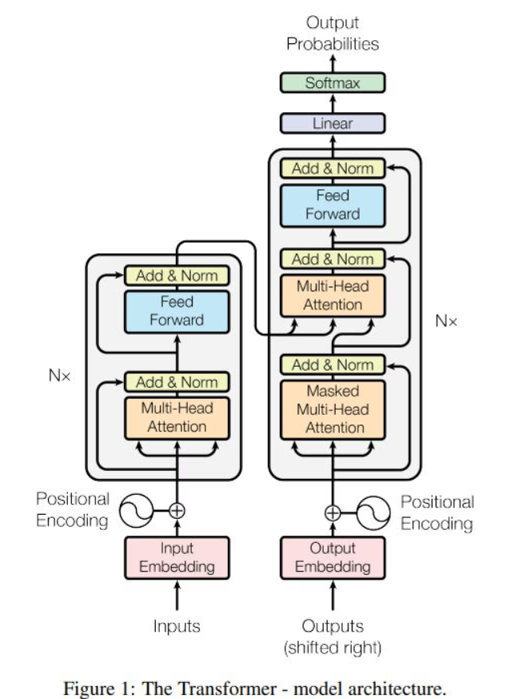
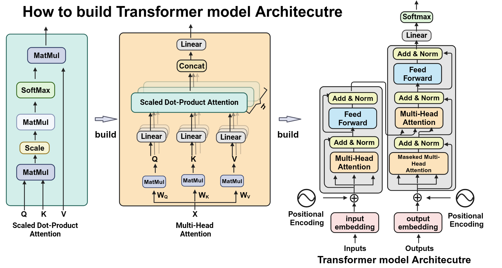
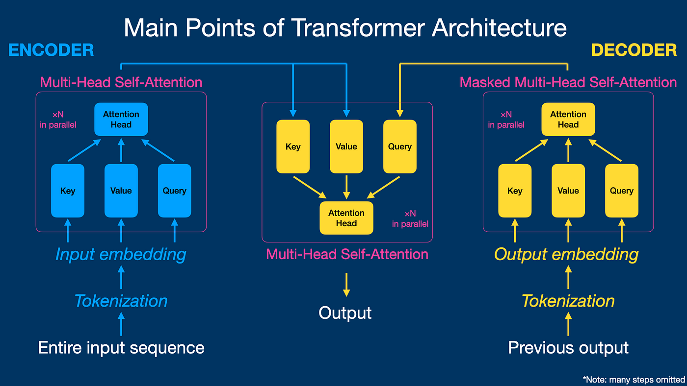
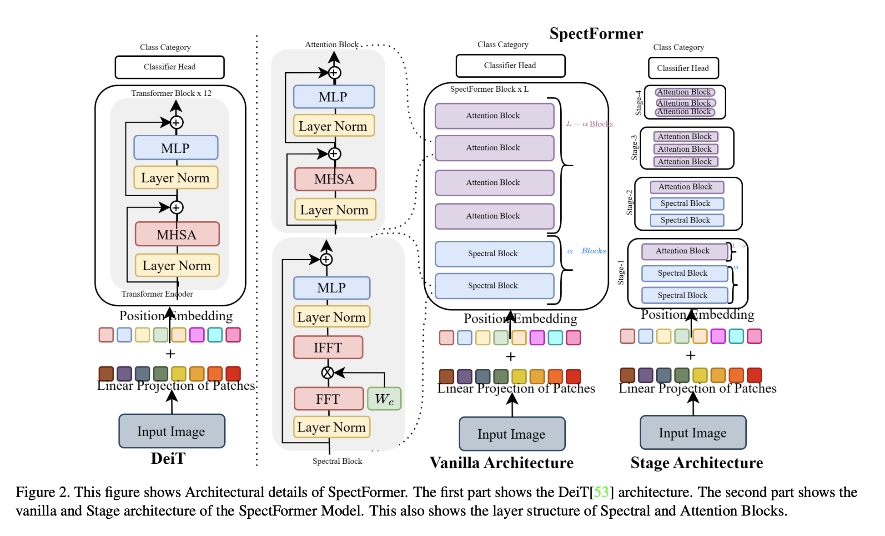
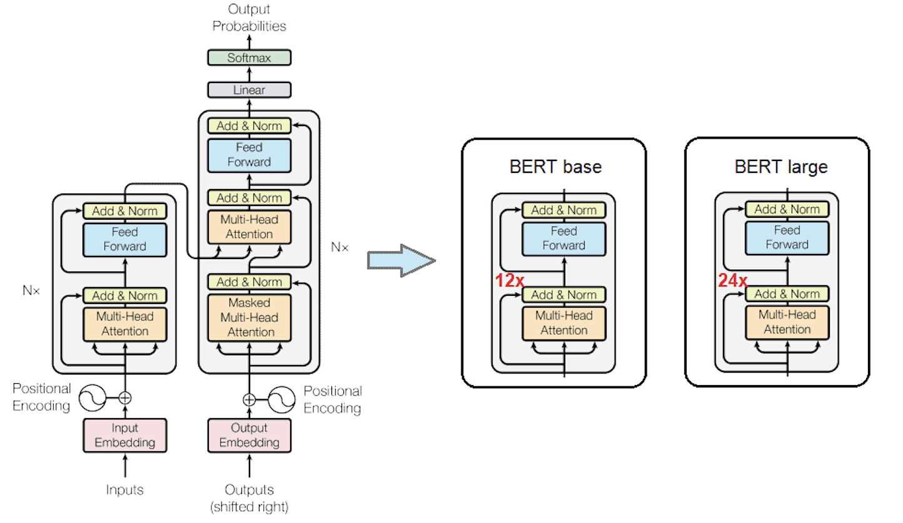

# Transformer Architecture: From Attention Is All You Need to BERT and GPT

## Overview

Transformer là kiến trúc nền tảng của phần lớn các mô hình Deep Learning hiện đại trong Natural Language Processing (NLP), Computer Vision (CV), Multimodal Learning và Large Language Models (LLMs).

Kiến trúc này được giới thiệu trong bài báo:

> Vaswani et al. (2017), *Attention Is All You Need*

Khác với RNN và LSTM, Transformer xử lý toàn bộ chuỗi song song thông qua cơ chế **Self-Attention**, cho phép mô hình học quan hệ phụ thuộc dài hạn hiệu quả hơn.

---

# Table of Contents

1. Transformer Architecture
2. Input Representation
3. Positional Encoding
4. Self-Attention
5. Multi-Head Attention
6. Encoder Block
7. Decoder Block
8. Transformer Training Objective
9. BERT Architecture
10. GPT Architecture
11. Transformer vs BERT vs GPT
12. Computational Complexity
13. Evolution of Transformer
14. References

---

# 1. Transformer Architecture

## Original Architecture

Transformer gốc gồm:

* Encoder Stack
* Decoder Stack

Mỗi stack bao gồm nhiều block giống nhau được xếp chồng.




Trong bài báo gốc:

| Hyperparameter         | Value |
| ---------------------- | ----- |
| N Layers               | 6     |
| d_model                | 512   |
| Attention Heads        | 8     |
| Feed Forward Dimension | 2048  |

---

# 2. Input Representation

Chuỗi văn bản đầu vào trải qua các bước:

```text
Text
↓
Tokenization
↓
Token IDs
↓
Embedding
↓
Positional Encoding
↓
Input Matrix X
```

Kết quả:

$$
X \in \mathbb{R}^{n \times d_{model}}
$$

Trong đó:

* ($n$): sequence length
* ($d_{model}$): embedding dimension

---

# 3. Positional Encoding

Self-Attention không chứa thông tin vị trí.

Transformer bổ sung Positional Encoding:

$$PE(pos,2i) = \sin \left( \frac{pos}{10000^{2i/d_{model}}} \right)$$

$$ PE(pos,2i+1) = \cos\left( \frac{pos}{10000^{2i/d_{model}}} \right)$$

Mục tiêu:

* Mã hóa vị trí token
* Bảo toàn thứ tự chuỗi
* Cho phép mô hình học khoảng cách tương đối

---

# 4. Self-Attention

Self-Attention là thành phần quan trọng nhất của Transformer.



Từ đầu vào:

$$X$$

Mô hình tạo:

$$
Q = XW_Q
$$

$$
K = XW_K
$$

$$
V = XW_V
$$

Trong đó:

* ($Q$): Query
* ($K$): Key
* ($V$): Value

và:

$$
W_Q;W_K;W_V
$$

là các ma trận tham số học được.

---

## Attention Score

Độ tương đồng giữa các token:

$$
Score = QK^T
$$

Kích thước:

$$
QK^T
\in
\mathbb{R}^{n\times n}
$$

---

## Scaling

Để tránh giá trị quá lớn:

$$
\frac{QK^T}{\sqrt{d_k}}
$$

---

## Softmax

Chuẩn hóa thành phân phối xác suất:

$$
Attention(Q,K,V) = Softmax \left( \frac{QK^T}{\sqrt{d_k}} \right) V
$$

Đây là công thức cốt lõi của Transformer.

---

# 5. Multi-Head Attention

Một Attention Head thường không đủ để học nhiều loại quan hệ khác nhau.

Transformer sử dụng nhiều head song song.



Mỗi head:

$$ head_i = Attention(Q_i,K_i,V_i) $$

Sau đó:

$$ MultiHead = Concat(head_1,...,head_h) W_O $$

Lợi ích:

* Học nhiều loại quan hệ ngôn ngữ
* Học đặc trưng ở nhiều không gian biểu diễn khác nhau
* Tăng khả năng biểu diễn của mô hình

---

# 6. Encoder Block

Một Encoder Block gồm:

```text
Multi-Head Self-Attention
↓
Add & Norm
↓
Feed Forward Network
↓
Add & Norm
```



---

## Residual Connection

$$
y = x + f(x)
$$

Vai trò:

* Giảm vanishing gradient
* Hỗ trợ huấn luyện mạng sâu

---

## Layer Normalization

$$ LN(x) = \frac{x-\mu}{\sigma} $$

Vai trò:

* Ổn định phân phối activation
* Tăng tốc hội tụ

---

## Feed Forward Network

Áp dụng độc lập trên từng token:

$$ FFN(x) = W_2 GELU(W_1x+b_1) + b_2 $$

Thông thường:

```text
512
↓
2048
↓
512
```

---

# 7. Decoder Block

Decoder Block gồm:

```text
Masked Multi-Head Attention
↓
Add & Norm
↓
Cross Attention
↓
Add & Norm
↓
Feed Forward
↓
Add & Norm
```

---

## Masked Self-Attention

Decoder không được nhìn thấy token tương lai.

Mask:

$$
M=
\begin{bmatrix}
0 & -\infty & -\infty\\
0 & 0 & -\infty\\
0 & 0 & 0
\end{bmatrix}
$$

Attention:

$$
Softmax
\left(
\frac{QK^T}{\sqrt{d_k}}
+
M
\right)
$$

Đảm bảo token tại thời điểm (t) chỉ quan sát:

$$
{1,\ldots,t}
$$

---

## Cross Attention

Trong Decoder:

* Query đến từ Decoder
* Key và Value đến từ Encoder

$$
Q_{decoder}
$$

$$
K_{encoder},V_{encoder}
$$

Cross Attention cho phép Decoder tham chiếu thông tin từ chuỗi nguồn.

---

# 8. Transformer Training Objective

Trong bài toán Machine Translation:

Input:

```text
English
```

Output:

```text
French
```

Transformer học:

$$
P(y|x)
$$

Loss Function:

$$ \mathcal{L} = -\sum_t \log P(y_t|y_{\lt t},x) $$

---

# 9. BERT Architecture

## Encoder-Only Transformer




BERT giữ lại:

```text
Encoder
```

Loại bỏ:

```text
Decoder
```

---

## Bidirectional Attention

BERT được phép nhìn:

```text
Left Context
+
Right Context
```

Ví dụ:

```text
The cat sat on $MASK$
```

BERT quan sát toàn bộ câu trước khi dự đoán.

---

## Training Objective

Masked Language Modeling (MLM)

$$
P(token_i|context)
$$

Ví dụ:

```text
The cat sat on $MASK$
```

↓

```text
mat
```

---

## Characteristics

* Encoder-only
* Bidirectional
* Context Understanding
* Text Classification
* Named Entity Recognition
* Question Answering
* Sentence Embedding

---

# 10. GPT Architecture

## Decoder-Only Transformer


GPT giữ lại:

```text
Decoder
```

Loại bỏ:

```text
Encoder
```

---

## Causal Attention

GPT chỉ được nhìn quá khứ:

```text
x₁, x₂, ..., xₜ₋₁
```

Mục tiêu:

$$ P(x_t|x_{<t}) $$

---

## Training Objective

Causal Language Modeling

$$ \mathcal{L} = -\sum_t \log P(x_t|x_{\lt t}) $$

---

## Characteristics

* Decoder-only
* Autoregressive
* Text Generation
* Coding Models
* Chat Models
* Reasoning Models

---

# 11. Transformer vs BERT vs GPT

| Property           | Transformer | BERT   | GPT    |
| ------------------ | ----------- | ------ | ------ |
| Encoder            | ✓           | ✓      | ✗      |
| Decoder            | ✓           | ✗      | ✓      |
| Bidirectional      | ✓           | ✓      | ✗      |
| Causal Attention   | ✓           | ✗      | ✓      |
| Text Understanding | Medium      | Strong | Strong |
| Text Generation    | Strong      | Weak   | Strong |

---

# 12. Computational Complexity

Self-Attention yêu cầu:

$$
O(n^2)
$$

về:

* Computation
* Memory

Đây là nút thắt chính khi sequence length tăng.

---

# 13. Evolution of Transformer

```text
Attention Is All You Need
            │
            ▼
    Transformer
            │
    ┌───────┴────────┐
    ▼                ▼
  BERT             GPT
Encoder        Decoder
 Only            Only
```

Tiếp tục phát triển thành:

```text
Transformer
      ↓
BERT / GPT
      ↓
Vision Transformer (ViT)
      ↓
Large Language Models
      ↓
Multimodal Models
```

Ví dụ:

* GPT Series
* LLaMA Series
* Qwen Series
* Gemma Series
* DeepSeek Series

---

# 14. Key Insight

Transformer gốc:

```text
Encoder + Decoder
```

BERT:

```text
Encoder Only
```

GPT:

```text
Decoder Only
```

Do đó:

```text
Attention Is All You Need
        │
        ▼
 ┌──────────────┐
 │ Transformer  │
 │ Encoder      │
 │ + Decoder    │
 └──────────────┘
      │      │
      │      │
      ▼      ▼
 ┌───────┐ ┌───────┐
 │ BERT  │ │ GPT   │
 └───────┘ └───────┘
 Encoder   Decoder
  Only      Only
```

Các Large Language Models hiện đại chủ yếu là các biến thể của kiến trúc Decoder-Only Transformer.

---

# References

## Foundational Papers

1. Vaswani et al. (2017), Attention Is All You Need
2. Devlin et al. (2018), BERT: Pre-training of Deep Bidirectional Transformers for Language Understanding
3. Radford et al. (2018), Improving Language Understanding by Generative Pre-Training
4. Brown et al. (2020), Language Models are Few-Shot Learners

## Recommended Reading

* The Annotated Transformer
* Illustrated Transformer
* HuggingFace Transformer Documentation
* Stanford CS224N
* CMU Neural Networks for NLP
