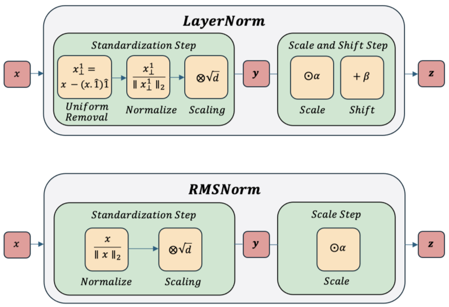

# RMSNorm (Root Mean Square Layer Normalization)

## 1. Giới thiệu

Trong các mạng học sâu hiện đại, đặc biệt là Transformer và Large Language Models (LLMs), việc kiểm soát độ lớn của activation là một vấn đề quan trọng.

Khi số lượng layer tăng lên hàng chục hoặc hàng trăm tầng, activation có xu hướng:

* Tăng quá lớn (Exploding Activations)
* Suy giảm quá nhỏ (Vanishing Activations)
* Gây mất ổn định trong quá trình lan truyền gradient

Để giải quyết vấn đề này, các phương pháp Normalization được đưa vào kiến trúc mạng nhằm duy trì sự ổn định của tín hiệu trong quá trình huấn luyện.

Trong Transformer gốc, phương pháp được sử dụng là Layer Normalization (LayerNorm). Tuy nhiên, các nghiên cứu sau đó chỉ ra rằng việc chuẩn hóa theo trung bình (mean-centering) có thể không phải thành phần thiết yếu để đạt được tính ổn định.

Từ nhận xét này, RMSNorm được đề xuất như một phiên bản đơn giản hơn của LayerNorm nhưng vẫn giữ được các đặc tính quan trọng đối với việc huấn luyện mô hình quy mô lớn.

---

## 2. Động cơ nghiên cứu

Cho vector đầu vào:

$$
x=[x_1,x_2,\ldots,x_d]
$$

LayerNorm thực hiện hai bước:

### Bước 1: Loại bỏ giá trị trung bình

$$
\mu=\frac{1}{d}\sum_{i=1}^{d}x_i
$$

$$
x \rightarrow x-\mu
$$

### Bước 2: Chuẩn hóa phương sai

$$
\sigma^2=\frac{1}{d}\sum_{i=1}^{d}(x_i-\mu)^2
$$

$$
x \rightarrow \frac{x-\mu}{\sqrt{\sigma^2+\epsilon}}
$$

Như vậy LayerNorm vừa:

* Dịch chuyển vector về tâm
* Kiểm soát độ lớn vector

Tuy nhiên các nghiên cứu thực nghiệm cho thấy:

> Việc kiểm soát độ lớn của vector quan trọng hơn việc đưa trung bình về 0.

Điều này dẫn tới ý tưởng:

Thay vì chuẩn hóa theo mean và variance, chỉ cần chuẩn hóa theo độ lớn tổng thể của vector.

---

## 3. Ý tưởng cốt lõi của RMSNorm

RMSNorm loại bỏ hoàn toàn bước tính mean.

Thay vào đó chỉ đo độ lớn của vector bằng Root Mean Square:

$$
RMS(x)=\sqrt{\frac{1}{d}\sum_{i=1}^{d}x_i^2}
$$

Sau đó chuẩn hóa trực tiếp:

$$
\hat{x}=\frac{x}{RMS(x)}
$$

Cuối cùng áp dụng hệ số học được:

$$
y=\gamma \odot \hat{x}
$$

Trong đó:

* $\gamma$ là vector tham số học được
* $\odot$ là phép nhân từng phần tử

Toàn bộ cơ chế của RMSNorm chỉ xoay quanh việc kiểm soát độ lớn của activation.

---

## 4. Công thức toán học đầy đủ

Cho:

$$
x \in \mathbb{R}^{d}
$$

Tính RMS:

$$
r=\sqrt{\frac{1}{d}\sum_{i=1}^{d}x_i^2+\epsilon}
$$

Chuẩn hóa:

$$
\hat{x}=\frac{x}{r}
$$

Scale:

$$
y=\gamma \odot \hat{x}
$$

Suy ra:

$$
RMSNorm(x)=
\gamma \odot
\frac{x}
{
\sqrt{
\frac{1}{d}
\sum_{i=1}^{d}
x_i^2+\epsilon
}
}
$$

Khác với LayerNorm:

* Không tính mean
* Không tính variance
* Không có bias parameter

---

## 5. Diễn giải hình học

Chuẩn Euclidean của vector:

$$
|x|*2=
\sqrt{
\sum*{i=1}^{d}x_i^2
}
$$

Ta có:

$$
RMS(x)=\frac{|x|_2}{\sqrt{d}}
$$

Do đó RMSNorm có thể viết lại dưới dạng:

$$
RMSNorm(x)
\propto
\frac{x}{|x|_2}
$$

Điều này có nghĩa:

RMSNorm gần tương đương với việc đưa vector lên một hypersphere có bán kính cố định.

Các đặc tính quan trọng:

* Giữ nguyên hướng vector
* Điều chỉnh độ lớn vector
* Không thay đổi thông tin tương đối giữa các chiều

Trong không gian biểu diễn, RMSNorm chủ yếu kiểm soát độ dài vector thay vì thay đổi hướng biểu diễn.

---

## 6. Tính chất Scale Invariance

Giả sử:

$$
x'=cx
$$

với:

$$
c>0
$$

Khi đó:

$$
RMS(x') =

\sqrt{
\frac{1}{d}
\sum_{i=1}^{d}
(cx_i)^2
}
$$

$$

c,RMS(x)
$$

Suy ra:

$$
\frac{x'}{RMS(x')} =

\frac{cx}{c,RMS(x)}

\frac{x}{RMS(x)}
$$

Do đó:

$$
RMSNorm(cx)=RMSNorm(x)
$$

Đây là tính chất rất quan trọng.

Mô hình trở nên ít nhạy cảm hơn với độ lớn tuyệt đối của activation.

Thay vào đó mô hình chủ yếu quan tâm đến hướng của vector.

---

## 7. So sánh với LayerNorm

### LayerNorm

$$
LN(x) =

\gamma
\odot
\frac{x-\mu}
{\sqrt{\sigma^2+\epsilon}}
+\beta
$$

Yêu cầu:

* Mean
* Variance
* Scale
* Bias

---

### RMSNorm

$$
RMSNorm(x) =

\gamma
\odot
\frac{x}
{
\sqrt{
\frac{1}{d}
\sum_{i=1}^{d}x_i^2
+\epsilon
}
}
$$

Yêu cầu:

* Mean Square
* Scale

---

### So sánh

| Thành phần        | LayerNorm | RMSNorm      |
| ----------------- | --------- | ------------ |
| Mean              | Có        | Không        |
| Variance          | Có        | Không        |
| Bias              | Có        | Không        |
| Scale Invariance  | Một phần  | Tốt          |
| Chi phí tính toán | Cao hơn   | Thấp hơn     |
| LLM hiện đại      | Ít dùng   | Rất phổ biến |

---

## 8. RMSNorm trong Transformer

Trong Transformer hiện đại, RMSNorm thường xuất hiện dưới dạng Pre-Norm.

### Attention Block

$$
y=
x+
Attention(RMSNorm(x))
$$

### Feed Forward Block

$$
z=
y+
MLP(RMSNorm(y))
$$

Kiến trúc này giúp:

* Gradient ổn định hơn
* Huấn luyện sâu hơn
* Giảm nguy cơ gradient explosion

Đây là cấu trúc xuất hiện trong phần lớn LLM hiện đại.

---

## 9. Vai trò trong Self-Attention

Trong Attention:

$$
Q=XW_Q
$$

$$
K=XW_K
$$

$$
V=XW_V
$$

Attention score:

$$
A=
\frac{QK^T}
{\sqrt d}
$$

Nếu độ lớn của $X$ thay đổi mạnh:

$$
|X|
\rightarrow
\text{không ổn định}
$$

thì:

$$
QK^T
$$

cũng dao động mạnh.

Khi đó Softmax có thể:

* Quá nhọn
* Quá phẳng
* Khó tối ưu

RMSNorm giúp duy trì:

$$
|X|
\approx const
$$

Từ đó Attention ổn định hơn trong toàn bộ quá trình huấn luyện.

---

## 10. Độ phức tạp tính toán

### LayerNorm

Tính:

$$
\mu
$$

và

$$
\sigma^2
$$

nên cần nhiều phép cộng và truy cập bộ nhớ hơn.

Độ phức tạp:

$$
O(3d)
$$

---

### RMSNorm

Chỉ tính:

$$
\sum x_i^2
$$

Độ phức tạp:

$$
O(2d)
$$

Do đó RMSNorm có chi phí thấp hơn đáng kể khi:

* Hidden size lớn
* Nhiều layer
* Batch lớn
* Sequence dài

---

## 11. Vai trò trong các LLM hiện đại

Các mô hình ngôn ngữ lớn hiện nay gần như đều chuyển sang RMSNorm thay cho LayerNorm.

Lý do:

* Tính toán đơn giản hơn
* Truy cập bộ nhớ ít hơn
* Scale invariance tốt hơn
* Phù hợp với Pre-Norm Transformer
* Hoạt động ổn định ở quy mô hàng tỷ tham số

RMSNorm hiện là thành phần tiêu chuẩn trong:

* LLaMA
* Mistral
* Gemma
* Qwen
* DeepSeek
* Phi

và nhiều biến thể Transformer hiện đại khác.

---

## 12. Tóm tắt

RMSNorm là một phương pháp chuẩn hóa đơn giản hóa từ LayerNorm bằng cách loại bỏ hoàn toàn bước mean-centering.

Công thức trung tâm:

$$
RMSNorm(x)=
\gamma \odot
\frac{x}
{
\sqrt{
\frac{1}{d}
\sum_{i=1}^{d}
x_i^2+\epsilon
}
}
$$

Ý tưởng cốt lõi:

> Điều quan trọng không phải đưa trung bình về 0, mà là kiểm soát độ lớn của vector biểu diễn.

Các đặc tính nổi bật:

* Giữ nguyên hướng vector
* Chuẩn hóa độ lớn activation
* Scale Invariance
* Chi phí thấp hơn LayerNorm
* Phù hợp với Transformer cực sâu
* Trở thành chuẩn mặc định trong hầu hết LLM hiện đại
