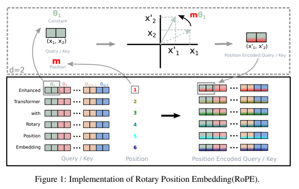
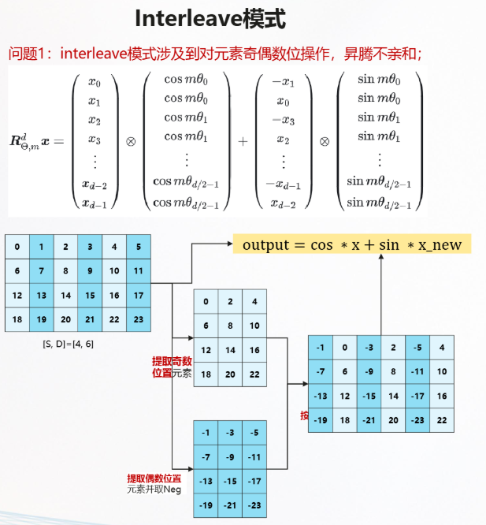
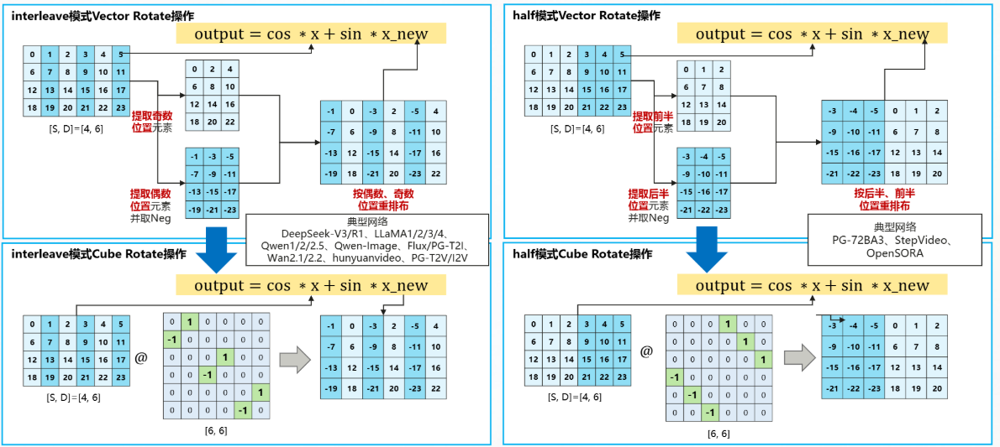
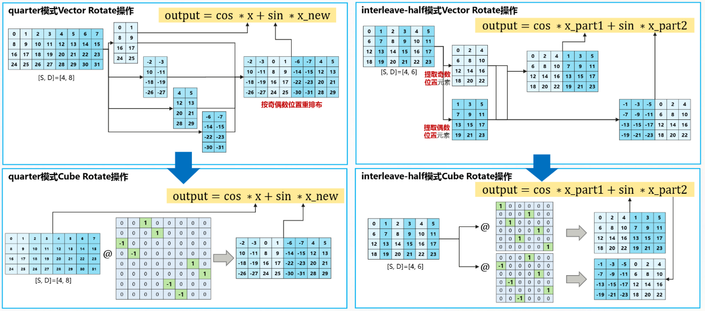
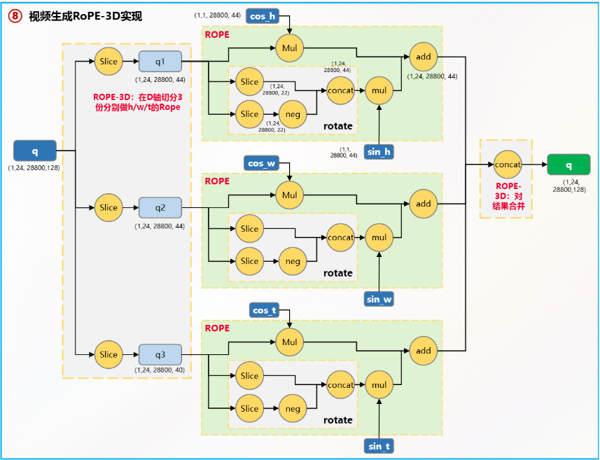
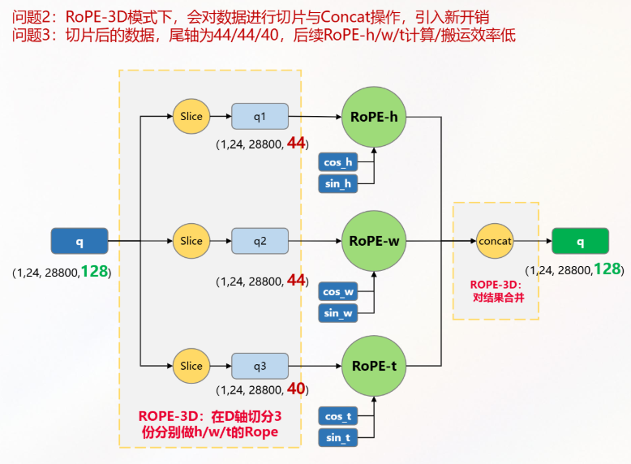
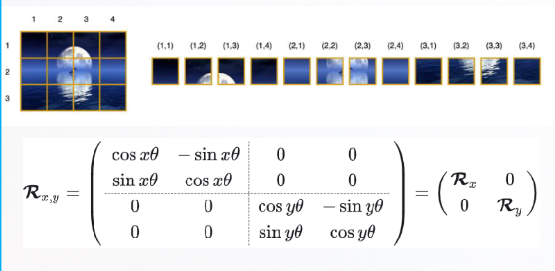
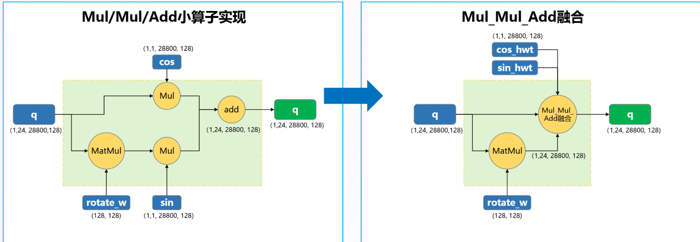
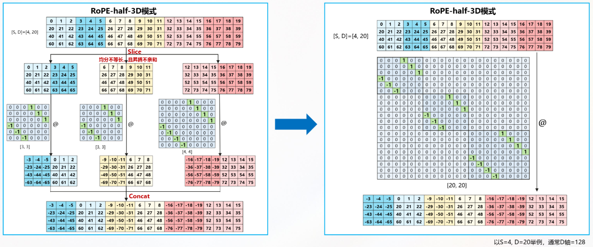
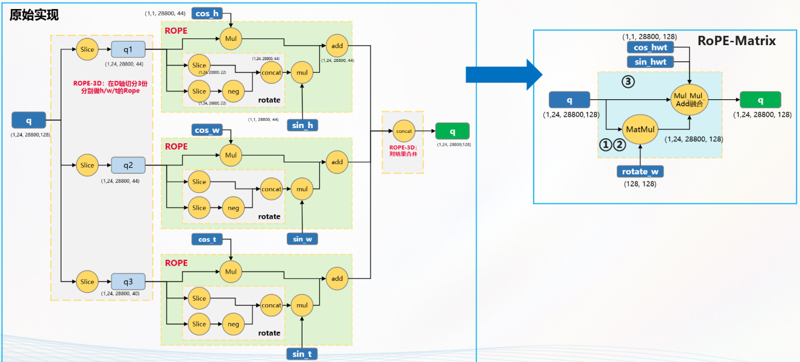

# Rotary Position Embedding (RoPE)

## 1. Giới thiệu

Rotary Position Embedding (RoPE) là phương pháp mã hóa vị trí được đề xuất trong bài báo:

**RoFormer: Enhanced Transformer with Rotary Position Embedding**

Mục tiêu của RoPE là đưa thông tin vị trí vào Attention mà không cần cộng thêm vector positional embedding vào token embedding như Transformer gốc.

Ý tưởng cốt lõi:

* Position không được cộng vào embedding.
* Position được mã hóa bằng phép quay (rotation) trong không gian vector.
* Attention tự động học được khoảng cách tương đối giữa các token.

RoPE hiện là nền tảng của phần lớn LLM hiện đại:

* GPT-NeoX
* LLaMA
* Mistral
* Mixtral
* Qwen
* DeepSeek
* Gemma
* x-transformers

---

## 2. Bài toán của Positional Embedding truyền thống

Transformer không có khái niệm thứ tự.

Attention chỉ nhìn thấy tập token:

$$
X = [x_1, x_2, \dots, x_n]
$$

Nếu hoán đổi thứ tự:

$$
[x_1, x_2, x_3]
$$

thành

$$
[x_3, x_2, x_1]
$$

thì Self-Attention nguyên bản không phân biệt được.

Do đó cần bổ sung thông tin vị trí.

Transformer gốc sử dụng:

$$
h_i = x_i + p_i
$$

với $p_i$ là positional embedding.

Nhược điểm:

* Position tuyệt đối.
* Khó extrapolate (suy rộng) tới sequence dài hơn.
* Attention không mô hình hóa trực tiếp relative distance.

RoPE được thiết kế để giải quyết các vấn đề này.

---

## 3. Ý tưởng hình học

Xét vector 2 chiều:

$$
v = \begin{bmatrix} x \\ y \end{bmatrix}
$$

Phép quay góc $\theta$:

$$
R(\theta) = \begin{bmatrix} \cos\theta & -\sin\theta \\ \sin\theta & \cos\theta \end{bmatrix}
$$

Sau khi quay:

$$
v' = R(\theta)v
$$

Ta nhận được vector mới nhưng vẫn giữ nguyên độ dài:

$$
\|v'\| = \|v\|
$$

RoPE sử dụng chính phép quay này để mã hóa vị trí.

---

## 4. Rotary Embedding

Giả sử $q_i$ là query tại vị trí $i$. Ta quay vector theo góc phụ thuộc vị trí:

$$
\widetilde{q}_i = R(i\theta)q_i
$$

Tương tự với key $k_j$ tại vị trí $j$:

$$
\widetilde{k}_j = R(j\theta)k_j
$$

Attention sử dụng $\widetilde{q}_i^T \widetilde{k}_j$ thay vì $q_i^T k_j$.

---

## 5. Tính chất quan trọng nhất

Attention sau khi áp dụng RoPE:

$$
\widetilde{q}_i^T \widetilde{k}_j = \left(R(i\theta)q_i\right)^T \left(R(j\theta)k_j\right)
$$

Khai triển đại số tuyến tính:

$$
= q_i^T R(i\theta)^T R(j\theta) k_j
$$

Do ma trận quay là ma trận trực giao ($R(\theta)^T = R(-\theta)$) nên:

$$
= q_i^T R(-i\theta) R(j\theta) k_j
$$

Sử dụng tính chất nhân ma trận quay $R(a)R(b) = R(a+b)$, ta được:

$$
= q_i^T R((j-i)\theta) k_j
$$

Do đó:

$$
\widetilde{q}_i^T \widetilde{k}_j = q_i^T R((j-i)\theta) k_j
$$

Điều quan trọng nhất là Attention chỉ phụ thuộc vào khoảng cách tương đối $(j-i)$ thay vì phụ thuộc trực tiếp vào vị trí tuyệt đối.

Đây chính là lý do RoPE tự nhiên sinh ra **Relative Position Encoding**.

---

## 6. Mở rộng lên không gian nhiều chiều

Trong Transformer, kích thước mô hình thường rất lớn:

$$
d_{\text{model}} \in \{1024, 2048, 4096, \dots\}
$$

Không thể áp dụng một phép quay 2 chiều duy nhất cho toàn bộ vector. Do đó, RoPE chia vector thành các cặp chiều:

$$
[x_1, x_2, x_3, x_4, \dots, x_d] \rightarrow (x_1, x_2), (x_3, x_4), \dots, (x_{d-1}, x_d)
$$

Mỗi cặp được xem như một mặt phẳng 2 chiều độc lập.

Ví dụ: $[x_1, x_2, x_3, x_4]$ được chia thành $(x_1, x_2)$ và $(x_3, x_4)$. Mỗi cặp sẽ được quay với một góc khác nhau.

---

## 7. Ma trận RoPE đầy đủ

Cho $d = \text{head\_dim}$. Tập tần số $\Theta$ được định nghĩa:

$$
\Theta = \{ \theta_0, \theta_1, \dots, \theta_{\frac{d}{2}-1} \} \quad \text{với} \quad \theta_i = 10000^{-\frac{2i}{d}}
$$

Tại vị trí $m$, ma trận quay toàn cục $R_m$ được viết dưới dạng block-diagonal (ma trận khối đường chéo):

$$
R_m = \begin{bmatrix}
\cos(m\theta_0) & -\sin(m\theta_0) & 0 & 0 & \cdots \\
\sin(m\theta_0) & \cos(m\theta_0) & 0 & 0 & \cdots \\
0 & 0 & \cos(m\theta_1) & -\sin(m\theta_1) & \cdots \\
0 & 0 & \sin(m\theta_1) & \cos(m\theta_1) & \cdots \\
\vdots & \vdots & \vdots & \vdots & \ddots
\end{bmatrix}
$$

Mỗi cặp chiều được quay với một tần số riêng. Những chiều đầu có tần số cao, những chiều cuối có tần số thấp. Điều này giúp mô hình đồng thời học được cả **quan hệ cục bộ (ngắn hạn)** lẫn **quan hệ dài hạn**.

---

### 7.1. Các chế độ sắp xếp dữ liệu

#### Interleave Mode

**Giải thích kiến trúc:** Chế độ này gom cụm xử lý theo từng cặp phần tử liền kề chẵn-lẻ trong không gian bộ nhớ contiguous.
- Vector $\mathbf{x}_{\text{new}}$ được tạo ra bằng cách hoán vị cục bộ: đảo vị trí phần tử lẻ lên trước, phần tử chẵn ra sau và đổi dấu phần tử đứng trước: $[-x_1, x_0, -x_3, x_2, \dots]$.
- Thao tác tính toán diễn ra song song trực tiếp trên thanh ghi vùng nhớ cục bộ lân cận, tối ưu cache cho các phép toán phần tử (Element-wise).

#### So sánh Interleave vs Half

**Giải thích kiến trúc:** Sơ đồ so sánh hai layout sắp xếp dữ liệu phổ biến nhất trong các mô hình sinh thế hệ mới:
- **Interleave Mode (trái):** Như định nghĩa trên, bắt cặp đan xen $[x_0, x_1]$. Cấu trúc này được áp dụng mặc định trong các LLM hàng đầu như LLaMA, DeepSeek, Qwen.
- **Half Mode (phải):** Thay vì bắt cặp liền kề, hệ thống cắt đôi vector theo chiều dài kích thước $d$. Nửa đầu $[x_0, x_1, \dots]$ sẽ bắt cặp tương ứng với nửa sau $[x_{d/2}, x_{d/2+1}, \dots]$. Vector $\mathbf{x}_{\text{new}}$ tạo ra bằng cấu trúc $[-x_{\text{half2}}, x_{\text{half1}}]$. Kiến trúc này xuất hiện nhiều trong các mô hình khuếch tán không gian thời gian lớn như OpenSORA, StepVideo, hoặc khi xử lý các cấu trúc Tensor dạng hình khối (Cube Rotate).

#### Quarter Mode

**Giải thích kiến trúc:** Minh họa các layout biến thể phức tạp hơn được sinh ra để tương thích với cấu trúc dữ liệu đa chiều đa phân đoạn:
- **Quarter Mode:** Vector đặc trưng được chia thành 4 phân đoạn bằng nhau. Các phép toán xoay hoán vị được thực hiện chéo giữa phân đoạn 1-2 và phân đoạn 3-4 hoặc xoay vòng tròn.
- **Interleave-Half Mode:** Kiến trúc lai (Hybrid Layout). Hệ thống áp dụng cấu trúc chia đôi (Half) trên tổng thể nhưng bên trong mỗi nửa lại thực hiện cấu trúc đan xen (Interleave). Các layout này tối ưu hóa luồng nạp dữ liệu cho các phần cứng NPU chuyên dụng nhằm tối đa hóa hiệu suất phần trăm sử dụng toán tử SIMD.

---

## 8. Biểu diễn bằng số phức

Đây là cách diễn giải toán học trực quan nhất của RoPE. Xét một cặp chiều $(x, y)$, ta biểu diễn dưới dạng số phức:

$$
z = x + iy \quad \text{với} \quad i^2 = -1
$$

Một phép quay góc $\theta$ được thực hiện bằng phép nhân với số phức có dạng mũ Euler:

$$
z' = z e^{i\theta}
$$

Theo công thức Euler $e^{i\theta} = \cos\theta + i\sin\theta$, ta có:

$$
z' = z(\cos\theta + i\sin\theta)
$$

Đây chính xác là phép quay trong mặt phẳng 2 chiều. RoPE áp dụng ý tưởng này cho Query và Key:

$$
q_m = q e^{im\theta}, \quad k_n = k e^{in\theta}
$$

Khi tính tích vô hướng cho Attention (bằng phép nhân số phức với liên hợp phức $\overline{k}_n$):

$$
q_m \overline{k}_n = \left(q e^{im\theta}\right) \left(\overline{k} e^{-in\theta}\right) = q \overline{k} e^{i(m-n)\theta}
$$

Ta thấy đại lượng vị trí tương đối $(m-n)$ xuất hiện một cách hoàn toàn tự nhiên:

$$
\text{Attention} \propto (m-n)
$$

---

## 9. Thuật toán triển khai

* **Bước 1:** Sinh vector tần số $\theta_i = 10000^{-\frac{2i}{d}}$.
* **Bước 2:** Với vị trí token $m \in \{0, 1, 2, \dots\}$, tính tích góc quay $m\theta_i$.
* **Bước 3:** Tính toán các giá trị lượng giác $\cos(m\theta_i)$ và $\sin(m\theta_i)$.
* **Bước 4:** Áp dụng phép quay cho Query. Nếu $q = [q_1, q_2]$ và $\phi = m\theta_i$:
  $$
  q' = \begin{bmatrix} \cos\phi & -\sin\phi \\ \sin\phi & \cos\phi \end{bmatrix} q
  $$
* **Bước 5:** Áp dụng phép quay tương tự cho Key để chuyển đổi $K \rightarrow K_{\text{rope}}$.
* **Bước 6:** Tính toán ma trận Attention chuẩn:
  $$
  \text{Attention} = \text{Softmax}\left( \frac{Q_{\text{rope}} K_{\text{rope}}^{T}}{\sqrt{d}} \right) V
  $$

---

### 9.1. Bài toán hiệu năng (RoPE-3D)

#### Quy trình triển khai

**Giải thích kiến trúc:** Sơ đồ thể hiện luồng xử lý mã hóa vị trí ba chiều (3D Positional Encoding) cho mô hình Transformer xử lý video. Không gian biểu diễn đặc trưng gồm ba thành phần độc lập: chiều cao ($h$), chiều rộng ($w$), và trục thời gian ($t$).
- Cấu trúc Tensor đặc trưng $D$ ban đầu bắt buộc phải đi qua toán tử tách lát (`Slice`) để chia thành các phân đoạn tương ứng với từng trục không gian.
- Tiếp theo, hệ thống thực hiện đồng thời các phép toán nhân (`Mul`) với các hệ số lượng giác $\sin/\cos$ của từng trục và cộng tích lũy (`Add`) để nhúng vị trí. Cuối cùng, luồng dữ liệu được gộp lại bằng toán tử `Concat`.

#### Hạn chế cố hữu

**Giải thích kiến trúc:** Sơ đồ phân tích sâu vào thắt nút cổ chai hiệu năng (Performance Bottleneck) của RoPE-3D truyền thống:
- Do đặc thù dữ liệu video, trục thời gian hoặc các kích thước biên thường nhỏ tạo ra các mảnh dữ liệu rất mỏng (Mảnh cắt đuôi - `tail`).
- Việc liên tục gọi lệnh `Slice` và `Concat` trên bộ nhớ ép buộc GPU phải liên tục cấp phát các vùng nhớ đệm trung gian (Intermediate VRAM overhead) và kích hoạt các thao tác dịch chuyển dữ liệu qua lại không cần thiết giữa các tầng bộ nhớ (Memory-bound). Điều này làm sụt giảm nghiêm trọng tốc độ tính toán thực tế của phần cứng, bất chấp việc bản chất toán học rất đơn giản.

---

## 10. Vì sao RoPE hoạt động tốt

* **Relative Position:** Điểm số Attention phụ thuộc trực tiếp vào khoảng cách tương đối $(j-i)$ thay vì vị trí tuyệt đối $i$ hay $j$.
* **Translation Invariance:** Nếu dịch chuyển toàn bộ chuỗi đi một khoảng $c$ ($i \rightarrow i+c$ và $j \rightarrow j+c$), hiệu khoảng cách vẫn được bảo toàn:
  $$
  (j+c) - (i+c) = j-i
  $$
* **Không làm tăng tham số:** RoPE là một hàm cố định, hoàn toàn không cần học sinh ra ma trận embedding tuyệt đối hay relative bias matrix, giúp tiết kiệm bộ nhớ.
* **Khả năng ngoại suy (Extrapolation):** Nhờ bản chất tuần hoàn mượt mà của hàm $\sin$ và $\cos$, RoPE hỗ trợ các kỹ thuật mở rộng ngữ cảnh tốt hơn nhiều so với việc học vị trí dạng tĩnh.
* **Tương thích hoàn toàn với Self-Attention:** Chỉ cần can thiệp biến đổi hình học trên ma trận $Q$ và $K$ trước bước tính tích vô hướng, không làm thay đổi các khối LayerNorm, MLP hay Residual Connection.

---

## 11. RoPE trong LLM hiện đại

**Giải thích kiến trúc:** Sơ đồ khối chuẩn hóa quy trình xử lý dữ liệu (Data Pipeline) bên trong một Layer Decoder chuẩn của kiến trúc LLM (như LLaMA).
- Từ Tensor đầu vào ($X$), hệ thống nhân với các trọng số để chiếu tạo ra 3 ma trận $Q, K, V$.
- Lớp xử lý RoPE được đặt trực tiếp như một bộ lọc tiền xử lý ngay trước khi đưa vào lõi Attention tính toán tích vô hướng. Lớp này nhận thông tin mã hóa vị trí hiện tại ($pos$) và thực hiện xoay cấu trúc không gian trên cặp hai ma trận $Q$ và $K$. Riêng ma trận giá trị $V$ hoàn toàn được giữ nguyên không tác động vị trí, đi thẳng vào làm toán tử tích chéo cuối cùng.

Pipeline tổng quát:

$$
\text{Input} \rightarrow \text{Embedding} \rightarrow Q, K, V \rightarrow \text{RoPE}(Q, K) \rightarrow \text{Attention} \rightarrow \text{MLP} \rightarrow \text{Output}
$$

---

## 12. Mối liên hệ với Fourier Features

RoPE thực chất là một dạng Fourier Encoding. Mỗi chiều biểu diễn một tần số:

$$
\omega_i = 10000^{-\frac{2i}{d}}
$$

Thông tin vị trí được mã hóa thông qua bộ các sóng điều hòa $\sin(\omega_i t)$ và $\cos(\omega_i t)$. Do đó, RoPE có thể được định nghĩa một cách trực quan là một cơ chế **Relative Positional Fourier Encoding** tích hợp sâu trực tiếp vào toán tử tính toán Attention.

---

## 13. Những cải tiến từ RoPE

* **NTK-Aware RoPE:** Điều chỉnh căn chỉnh dải tần số để mở rộng context window mà không cần tinh chỉnh (fine-tune) lại quá nhiều.
* **Linear Scaling:** Thu tỷ lệ vị trí theo công thức $m \rightarrow \frac{m}{s}$ với hệ số giãn kích thước chuỗi $s > 1$.
* **Dynamic RoPE:** Tự động tính toán linh hoạt tần số góc dựa trên độ dài ngữ cảnh thực tế đầu vào.
* **YaRN & LongRoPE:** Các kỹ thuật cải biên nâng cao giúp LLM cán mốc xử lý cửa sổ ngữ cảnh siêu dài từ hàng trăm nghìn đến hàng triệu token.

---

### 13.1. Hợp nhất toán tử (Operator Fusion)

**Giải thích kiến trúc:** Minh họa giải pháp tối ưu hóa mức độ biên dịch mã nguồn phần cứng (Compiler level optimization):
- **Kiến trúc cũ (trái):** Đồ thị tính toán gồm các nút lệnh rời rạc. Dữ liệu đầu ra của phép nhân `Mul` bắt buộc phải ghi xuống bộ nhớ VRAM, sau đó nút lệnh `Add` lại đọc ngược dữ liệu đó lên để tính toán tiếp.
- **Kiến trúc tối ưu (phải):** Sử dụng kỹ thuật gộp toán tử thành một Kernel đơn nhất dạng `Mul_Mul_Add Fusion`. Toàn bộ chuỗi phép nhân lượng giác và cộng tích lũy vị trí được thực hiện hoàn toàn bên trong bộ nhớ đệm SRAM (thanh ghi chip xử lý), triệt tiêu hoàn toàn độ trễ IO đọc/ghi phần cứng, giúp tăng tốc độ xử lý lên gấp nhiều lần.

### 13.2. Chuyển đổi sang kiến trúc RoPE-Matrix

- **Giải thích kiến trúc:** Sơ đồ mô tả quy trình chuyển đổi cơ chế tính toán hình học từ dạng cắt tỉa không gian sang đại số tuyến tính ma trận phẳng thuần túy (áp dụng cho biến thể `RoPE-half-3D`). Thay vì sử dụng luồng rẽ nhánh phức tạp, toàn bộ các ma trận hệ số $\cos/\sin$ được ánh xạ trực tiếp thành một cấu trúc ma trận quay khối đồng nhất quy mô lớn. Quá trình nhúng thông tin vị trí giờ đây thu gọn về duy nhất một phép toán nhân ma trận đơn giản (`MatMul`), cực kỳ thân thiện với lõi Tensor Core của GPU.

**Giải thích kiến trúc:** Mô hình hóa trừu tượng mức cao (Abstraction level) minh chứng cho sức mạnh của sự đơn giản hóa kiến trúc:
- **Cấu trúc ban đầu:** Luồng dữ liệu rối rắm với các kết nối đan chéo đứt đoạn để đồng bộ hóa vị trí 3 chiều trên các phân mảnh dữ liệu.
- **Cấu trúc RoPE-Matrix tổng quát hóa:** Biến đổi đồ thị trở thành một đường thẳng tuyến tính sạch sẽ thông qua một phép nhân ma trận tích hợp. Cải tiến này giúp loại bỏ toàn bộ các logic kiểm tra điều kiện rẽ nhánh trong mã nguồn điều khiển phần cứng, giúp hệ thống chạy ở xung nhịp tối đa, tạo nền tảng vững chắc cho việc mở rộng cửa sổ ngữ cảnh siêu dài lên tới hàng triệu token của các mô hình như LongRoPE.

---

## 14. Điều cần hiểu trước khi học x-transformers

Để đọc hiểu sâu mã nguồn triển khai RoPE trong thư viện `x-transformers`, bạn nên nắm chắc các kiến thức nền tảng sau:

1. **Đại số tuyến tính (Linear Algebra):** Không gian Vector (Vector Space), Tích vô hướng (Inner Product), Ma trận trực giao (Orthogonal Matrix), Ma trận quay (Rotation Matrix).
2. **Phân tích Fourier (Fourier Analysis):** Tần số (Frequency), Chu kỳ (Period), Pha (Phase), Fourier Features.
3. **Cơ chế Attention:** Khái niệm cơ bản về các vector toán học Query, Key, Value và phép toán Dot Product.
4. **Số phức (Complex Numbers):** Công thức Euler (Euler Formula), Phép nhân số phức (Complex Multiplication) và biểu diễn phép quay trên mặt phẳng phức (Complex Rotation).

> **Cốt lõi:** RoPE đơn giản là mã hóa vị trí bằng phép quay trong không gian vector để Attention tự động phụ thuộc vào khoảng cách tương đối giữa các token.

---

## Tóm tắt

RoPE thay thế cấu trúc Positional Embedding dạng cộng truyền thống bằng phép quay hình học trực giao:

$$
q_i \rightarrow R(i)q_i \quad \text{và} \quad k_j \rightarrow R(j)k_j
$$

Từ đó đưa công thức toán học tính điểm Self-Attention về dạng:

$$
q_i^T R(j-i) k_j
$$

Nhờ vậy, mô hình tự động nắm bắt được khoảng cách tương đối $(j-i)$ một cách tường minh mà không cần tiêu tốn tài nguyên cho các tham số học thêm. Nó là nhân tố cốt lõi tạo nên sự thành công về mặt xử lý ngữ cảnh của loạt mô hình tiên tiến như GPT-NeoX, LLaMA, Mistral, Qwen, Gemma và DeepSeek.