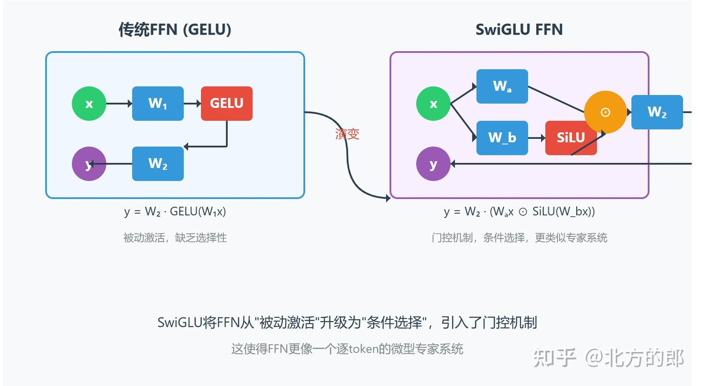
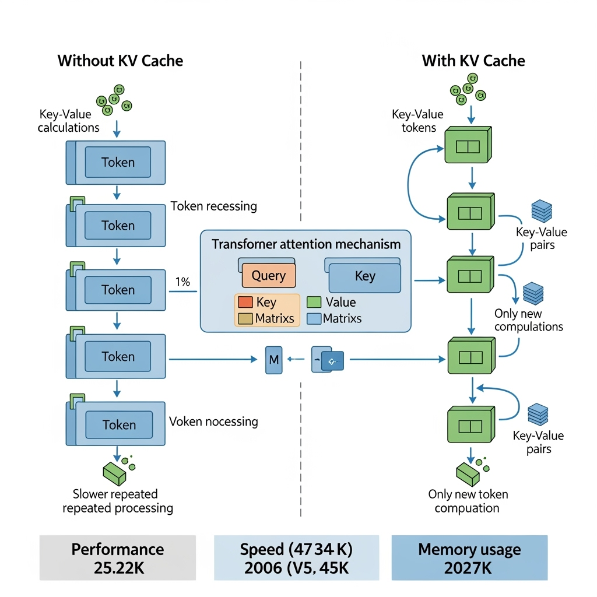

# SwiGLU: Sigmoid-Weighted Gated Linear Unit


# 1. Giới thiệu

Trong kiến trúc Transformer, phần lớn sự chú ý thường tập trung vào cơ chế Attention. Tuy nhiên trên thực tế, phần **Feed Forward Network (FFN)** chiếm phần lớn số lượng tham số và chi phí tính toán của mô hình.

Trong Transformer nguyên bản:

$$
FFN(x) = W_2 \phi(W_1x+b_1)+b_2
$$

với:

$$
\phi \in {ReLU, GELU}
$$

Kiến trúc này hoạt động như một Multi-Layer Perceptron độc lập trên từng token.

Nhiều nghiên cứu gần đây chỉ ra rằng việc cải tiến FFN có thể mang lại mức cải thiện đáng kể cho hiệu năng mô hình mà không cần thay đổi cơ chế Attention.

Từ đó xuất hiện một họ kiến trúc mới dựa trên **Gated Linear Unit (GLU)** và biến thể thành công nhất hiện nay là **SwiGLU**.

SwiGLU hiện được sử dụng trong:

* LLaMA
* PaLM
* Gemma
* Mistral
* Mixtral
* Qwen
* DeepSeek
* các Transformer thế hệ mới

---

# 2. Vị trí của SwiGLU trong Transformer

Transformer nguyên bản:

```text
Input
 ↓
Attention
 ↓
Residual
 ↓
LayerNorm
 ↓
FFN
 ↓
Residual
```

Transformer hiện đại:

```text
Input
 ↓
Attention
 ↓
Residual
 ↓
RMSNorm
 ↓
SwiGLU
 ↓
Residual
```

SwiGLU thay thế trực tiếp khối:

$$
Linear \rightarrow GELU \rightarrow Linear
$$

của Transformer nguyên bản.

---

# 3. Từ MLP đến Gated Networks

Cho vector đầu vào:

$$
x \in \mathbb{R}^{d}
$$

Một MLP thông thường thực hiện:

$$
h = \phi(Wx)
$$

sau đó:

$$
y = W_oh
$$

Hay:

$$
y=W_o\phi(Wx)
$$

Trong cấu trúc này chỉ tồn tại một luồng thông tin duy nhất.

Toàn bộ quá trình học được mô tả bởi:

$$
f(x) = \phi(Wx)
$$

Điều này giới hạn khả năng mô hình hóa các tương tác phức tạp giữa các đặc trưng.

---

# 4. Gated Linear Unit (GLU)

Ý tưởng trung tâm của GLU là tách biểu diễn thành hai nhánh:

$$
u=W_u x
$$

$$
v=W_v x
$$

Một nhánh đóng vai trò biểu diễn nội dung.

Nhánh còn lại đóng vai trò điều khiển.

Đầu ra:

$$
GLU(x) = u \odot \sigma(v)
$$

hay:

$$
GLU(x) = (W_u x) \odot \sigma(W_v x)
$$

với:

$$
\sigma(x) = \frac{1}{1+e^{-x}}
$$

là hàm Sigmoid.

---

# 5. Họ kiến trúc GLU

Sau GLU, nhiều biến thể được đề xuất bằng cách thay đổi hàm kích hoạt của nhánh điều khiển.

## ReGLU

$$
ReGLU(x) = (W_u x) \odot ReLU(W_v x)
$$

---

## GEGLU

$$
GEGLU(x) = (W_u x) \odot GELU(W_v x)
$$

---

## SwiGLU

$$
SwiGLU(x) = (W_u x) \odot Swish(W_v x)
$$

---

# 6. Swish Activation

Swish được giới thiệu như một hàm kích hoạt trơn hơn ReLU.

Định nghĩa:

$$
Swish(x) = x \sigma(x)
$$

hay:

$$
Swish(x) = x \cdot \frac{1}{1+e^{-x}}
$$

---

## Tính chất

### Liên tục

$$
Swish(x) \in C^\infty
$$

khả vi tại mọi điểm.

---

### Không triệt tiêu hoàn toàn miền âm

Khác với:

$$
ReLU(x) = \max(0,x)
$$

Swish vẫn cho phép thông tin từ miền âm được lan truyền.

---

### Gradient mượt

Không xuất hiện điểm gãy như ReLU.

Điều này giúp tối ưu ổn định hơn trên các mô hình rất lớn.

---

# 7. SwiGLU

Kết hợp cơ chế GLU với Swish:

$$
u = W_u x
$$

$$
v =W_v x
$$

Đầu ra:

$$
SwiGLU(x) = u \odot Swish(v)
$$

Thay định nghĩa Swish:

$$
u \odot (v\sigma(v))
$$

suy ra:

$$
SwiGLU(x) = (W_u x) \odot (W_v x) \odot \sigma(W_v x)
$$

Đây là biểu thức toán học quan trọng nhất của SwiGLU.

---

# 8. Phân tích toán học

Cho:

$$
x \in \mathbb{R}^{d}
$$

Sau hai phép chiếu tuyến tính:

$$
u=W_u x
$$

$$
v=W_v x
$$

ta thu được hai không gian đặc trưng độc lập.

Nhánh thứ nhất:

$$
u
$$

mang thông tin nội dung.

Nhánh thứ hai:

$$
Swish(v)
$$

mang thông tin điều khiển.

Đầu ra cuối cùng:

$$
y=u\odot Swish(v)
$$

không còn là biến đổi tuyến tính đơn giản mà trở thành tương tác nhân giữa hai biểu diễn.

Điều này làm tăng đáng kể khả năng biểu diễn của mạng.

---

# 9. Vai trò của cơ chế Gating

Có thể xem:

$$
u
$$

là nội dung.

Trong khi:

$$
Swish(v)
$$

là hệ số điều chế.

Nếu:

$$
Swish(v_i) \approx 0
$$

thành phần thứ (i) bị triệt tiêu.

Nếu:

$$
Swish(v_i) \gg 0
$$

thành phần thứ (i) được khuếch đại.

Do đó SwiGLU thực hiện một dạng lựa chọn đặc trưng động ngay bên trong từng token.

---

# 10. SwiGLU trong Feed Forward Network hiện đại



Khối FFN truyền thống:

$$
FFN(x) = W_2 \phi(W_1x)
$$

Khối SwiGLU:

$$
FFN(x) = W_o \Big( (W_u x) \odot Swish(W_v x) \Big)
$$

Pipeline:

```text
                ┌──────── W_u ────────┐
                │                     │
x ──────────────┤                     × ─── W_o ─── y
                │                     │
                └──────── W_v ──Swish─┘
```

---

# 11. Kích thước ẩn và tối ưu tham số

Trong Transformer nguyên bản:

$$
d_{ff} = 4d_{model}
$$

Ví dụ:

$$
d_{model} = 4096
$$

suy ra:

$$
d_{ff} = 16384
$$

---

Do SwiGLU sử dụng hai ma trận:

$$
W_u
$$

và

$$
W_v
$$

số lượng tham số tăng lên.

Để giữ FLOPs gần tương đương, các mô hình hiện đại thường sử dụng:

$$
d_{hidden} = \frac{8}{3} d_{model}
$$

thay vì:

$$
4d_{model}
$$

Đây là cấu hình được sử dụng trong PaLM, LLaMA và Mistral.

---

# 12. Phân tích Gradient

Cho:

$$
y=u\odot Swish(v)
$$

Gradient theo nhánh nội dung:

$$
\frac{\partial y}{\partial u} = Swish(v)
$$

Gradient theo nhánh điều khiển:

$$
\frac{\partial y}{\partial v} = u \odot Swish'(v)
$$

Trong đó:

$$
Swish'(x) = \sigma(x) + x\sigma(x)(1-\sigma(x))
$$

Do đạo hàm liên tục trên toàn bộ miền xác định nên gradient ổn định hơn ReLU.

---

# 13. So sánh GELU và SwiGLU

## GELU

$$
h=GELU(Wx)
$$

Chỉ tồn tại một luồng biểu diễn.

---

## SwiGLU

$$
h=(W_u x) \odot Swish(W_v x)
$$

Tồn tại hai luồng:

* Content Branch
* Gate Branch

---

Điều này cho phép mô hình học riêng biệt:

$$
Information
$$

và

$$
Importance
$$

Thay vì gộp chung trong một biểu diễn duy nhất.

---

# 14. Vai trò trong LLM hiện đại



Attention chịu trách nhiệm học:

$$
Token \leftrightarrow Token
$$

---

SwiGLU chịu trách nhiệm học:

$$
Feature \leftrightarrow Feature
$$

bên trong từng token.

Do đó:

```text
Attention
    ↓
Trao đổi thông tin giữa các token

SwiGLU
    ↓
Tái cấu trúc thông tin bên trong token
```

Hai cơ chế này bổ sung cho nhau để tạo thành nền tảng của Transformer hiện đại.

Trong các mô hình ngôn ngữ lớn hiện nay, SwiGLU gần như đã trở thành lựa chọn mặc định thay thế GELU.

---

# 15. Tóm tắt

SwiGLU là một kiến trúc Feed Forward dựa trên cơ chế Gating.

Định nghĩa:

$$
u=W_u x
$$

$$
v=W_v x
$$

$$
Swish(v) =v\sigma(v)
$$

$$
SwiGLU(x) =u\odot Swish(v)
$$

hay:

$$
SwiGLU(x) = (W_u x) \odot (W_v x) \odot \sigma(W_v x)
$$

Các đặc điểm cốt lõi:

1. Tách riêng nội dung và cơ chế điều khiển.
2. Tạo tương tác nhân giữa hai không gian đặc trưng.
3. Gradient mượt và ổn định.
4. Khả năng biểu diễn mạnh hơn GELU.
5. Hiệu quả trên các mô hình quy mô rất lớn.
6. Là thành phần tiêu chuẩn trong hầu hết LLM hiện đại.
7. Đại diện cho hướng tiến hóa của Feed Forward Network trong Transformer.
