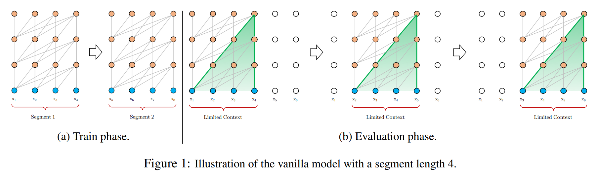
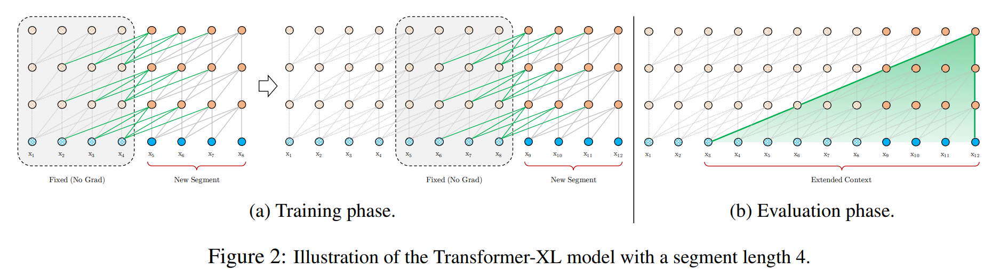

# Transformer-XL

> **Transformer-XL: Attentive Language Models Beyond a Fixed-Length Context**
>
> Zihang Dai et al., 2019

---

# 1. Giới thiệu

Transformer-XL là kiến trúc đầu tiên giải quyết thành công một trong những hạn chế lớn nhất của Transformer gốc:

* Context cố định.
* Không có bộ nhớ giữa các segment.
* Không học được dependency rất xa.

Trong Transformer chuẩn, chuỗi dài được chia thành nhiều đoạn:

$$
X = [S_1,S_2,\ldots,S_n]
$$

Mỗi segment được xử lý độc lập:

$$
P(S_i)
$$

không sử dụng thông tin từ:

$$
S_{i-1}
$$

Điều này gây ra hiện tượng:

* Context Fragmentation
* Long-Term Dependency Failure

Transformer-XL đưa ra hai ý tưởng cốt lõi:

1. Segment-Level Recurrence
2. Relative Positional Encoding

---

# 2. Vấn đề của Transformer gốc



Hình trên minh họa Transformer chuẩn khi xử lý chuỗi dài bằng các segment độc lập.

Mỗi segment chỉ có thể attention bên trong chính nó:

$$
S_i \not\leftrightarrow S_{i-1}
$$

Do đó các dependency vượt qua biên segment bị mất hoàn toàn.

Hiện tượng này được gọi là:

- Context Fragmentation
- Temporal Discontinuity
- Fixed-Length Context Limitation

## Fixed-Length Context

Transformer chỉ nhìn thấy:

$$
L
$$

token gần nhất.

Ví dụ:

```text
Context Window = 512

Token 1 -------------------- Token 10000
          ↑
      Current Window
```

Khi cửa sổ trượt:

```text
[1 ... 512]
      ↓
[513 ... 1024]
```

Thông tin cũ bị loại bỏ hoàn toàn.

---

## Context Discontinuity

Chuỗi:

```text
Segment 1
--------------------
Token 1 ... Token 512

Segment 2
--------------------
Token 513 ... Token 1024
```

Transformer không biết rằng:

```text
Token 512
```

và

```text
Token 513
```

nằm cạnh nhau trong cùng chuỗi.

---

# 3. Ý tưởng cốt lõi

Transformer-XL bổ sung bộ nhớ giữa các segment.

```text
Segment 1
     │
     ▼
 Hidden States
     │
     ▼
   Memory
     │
     ▼
Segment 2
     │
     ▼
 Hidden States
     │
     ▼
   Memory
     │
     ▼
Segment 3
```

Thay vì truyền token, Transformer-XL truyền:

$$
\text{Hidden States}
$$

của segment trước.

---

# 4. Segment-Level Recurrence



Transformer-XL tái sử dụng hidden states của segment trước làm bộ nhớ (memory).

Thay vì:

$$
S_i
$$

được xử lý độc lập, ta có:

$$
S_i
\leftarrow
M_{i-1}
$$

với:

$$
M_{i-1}
=
SG(H_{i-1})
$$

Các token trong segment hiện tại có thể attention tới:

- Hidden states hiện tại
- Hidden states của segment trước

Nhờ đó context hiệu dụng được mở rộng vượt quá chiều dài segment.

## Transformer chuẩn

Layer:

$$
l
$$

sinh ra:

$$
H_n^l
$$

cho segment:

$$
n
$$

```text
Input
  │
  ▼
Attention
  │
  ▼
 FFN
  │
  ▼
H_n^l
```

Sau khi kết thúc segment, hidden state bị loại bỏ.

---

## Transformer-XL

Sau khi tính:

$$
H_n^l
$$

ta lưu lại:

$$
M_n^l
$$

(memory)

```text
Segment n

Input
  │
  ▼
Attention
  │
  ▼
 FFN
  │
  ▼
H_n^l
  │
  └────────► Memory
```

Segment tiếp theo sử dụng memory này.

---

## Công thức

Memory được định nghĩa:

$$
M_n^l=

SG(H_{n-1}^l)
$$

trong đó:

$$
SG
$$

là Stop Gradient.

Memory chỉ được dùng cho forward pass.

Gradient không truyền ngược qua các segment cũ.

---

# 5. Attention với Memory

Trong Transformer chuẩn:

$$
Q = HW_Q
$$

$$
K = HW_K
$$

$$
V = HW_V
$$

---

Trong Transformer-XL:

Keys và Values được mở rộng:

$$
K=[M;H]W_K
$$

$$
V=[M;H]W_V
$$

với:

$$
[M;H]
$$

là phép nối.

---

## Minh họa

```text
Memory
┌──────────────┐
│ h1 h2 h3 h4  │
└──────────────┘

Current Segment
┌──────────────┐
│ h5 h6 h7 h8  │
└──────────────┘

      │
      ▼

┌────────────────────┐
│ h1 h2 h3 h4 h5 h6  │
│ h7 h8              │
└────────────────────┘

      │
      ▼

Attention
```

Token hiện tại có thể attention tới:

* Segment hiện tại
* Segment trước

---

# 6. Context Length Mở Rộng

Transformer:

$$
Context=L
$$

Transformer-XL:

$$
Context=L+M
$$

Nếu lưu nhiều memory:

$$
Context=L+kM
$$

---

Ví dụ:

```text
Current Segment = 512

Memory = 512
```

Tổng context:

$$
1024
$$

tokens.

---

# 7. Vấn đề Positional Encoding

Memory tạo ra một vấn đề nghiêm trọng.

Transformer gốc dùng:

$$
x_i+p_i
$$

với:

$$
p_i
$$

là vị trí tuyệt đối.

---

Segment 1:

```text
p1 p2 p3 p4
```

Segment 2:

```text
p1 p2 p3 p4
```

Khi tái sử dụng hidden states:

```text
Old Segment : p1 p2 p3 p4
New Segment : p1 p2 p3 p4
```

Transformer không biết đâu là token cũ.

---

# 8. Relative Positional Encoding

Đây là đóng góp quan trọng nhất của Transformer-XL.

Thay vì dùng:

$$
p_i
$$

Transformer-XL dùng:

$$
r_{i-j}
$$

---

## Ý tưởng

Không quan tâm:

```text
Token A ở vị trí 1234
```

Mà quan tâm:

```text
Token A cách Token B bao xa
```

---

## Minh họa

```text
Token i

      ◄──── 3 ────►

Token j
```

Điều quan trọng là:

$$
i-j
$$

không phải:

$$
i
$$

hay

$$
j
$$

---

# 9. Attention Score

Transformer chuẩn:

$$
A_{ij}=

q_i^T k_j
$$

---

Transformer-XL:

$$
A_{ij}=

q_i^T k_j
+
q_i^T r_{i-j}
+
u^T k_j
+
v^T r_{i-j}
$$

---

## Thành phần 1

Content-Based Attention

$$
q_i^T k_j
$$

Đánh giá độ tương đồng nội dung.

---

## Thành phần 2

Relative Position

$$
q_i^T r_{i-j}
$$

Đánh giá khoảng cách.

---

## Thành phần 3

Global Content Bias

$$
u^T k_j
$$

Bias nội dung.

---

## Thành phần 4

Global Position Bias

$$
v^T r_{i-j}
$$

Bias vị trí.

---

# 10. Kiến trúc Attention

```text
               Query
                 │
                 ▼
        ┌─────────────────┐
        │ Attention Score │
        └─────────────────┘

      ↗       ↑        ↖

 Content   Relative   Bias
  Term     Position   Terms

 qᵀk      qᵀr      uᵀk + vᵀr
```

Tổng:

$$
A_{ij}=

q_i^Tk_j
+
q_i^Tr_{i-j}
+
u^Tk_j
+
v^Tr_{i-j}
$$

---

# 11. Memory Cache

Sau mỗi segment:

```text
Segment
   │
   ▼
Hidden States
   │
   ▼
Memory Cache
```

Segment tiếp theo:

```text
Memory Cache
      │
      ▼
Attention
      ▲
      │
Current Segment
```

Đây chính là tiền thân của:

* KV Cache
* Streaming Transformer
* Long Context LLM

---

# 12. So sánh với Transformer gốc

| Thuộc tính        | Transformer | Transformer-XL |
| ----------------- | ----------- | -------------- |
| Context           | Cố định     | Mở rộng        |
| Memory            | Không       | Có             |
| Recurrence        | Không       | Có             |
| Long Dependency   | Yếu         | Tốt            |
| Relative Position | Không       | Có             |
| Streaming         | Không       | Có             |

---

# 13. Độ phức tạp

Transformer:

$$
O(L^2)
$$

---

Transformer-XL:

$$
O(L(L+M))
$$

với:

* $L$: segment length
* $M$: memory length

---

# 14. Quan hệ với KV Cache hiện đại

Ngày nay GPT suy luận bằng:

```text
Key Cache
Value Cache
```

Pipeline:

```text
Token mới
      │
      ▼
Append KV
      │
      ▼
Attention
```

Transformer-XL chính là phiên bản sơ khai của ý tưởng này.

Memory:

$$
M
$$

đóng vai trò tương tự:

```text
Past Keys
Past Values
```

trong LLM hiện đại.

---

# 15. Vị trí trong lịch sử Transformer

```text
Transformer (2017)
        │
        ▼
Transformer-XL (2019)
        │
        ▼
Sparse Transformer
        │
        ▼
Longformer
        │
        ▼
BigBird
        │
        ▼
GPT-3
        │
        ▼
Modern LLM
```

Transformer-XL là bước chuyển từ:

```text
Fixed Context Transformer
```

sang:

```text
Memory-Augmented Transformer
```

---

# 16. Tóm tắt

Transformer-XL có thể được mô tả bằng:

$$
\text{Transformer}
+
\text{Memory}
+
\text{Recurrence}
+
\text{Relative Position}
$$

Ba đóng góp nền tảng:

### Segment-Level Recurrence

$$
H_{n-1}
\rightarrow
M_n
$$

### Memory-Augmented Attention

$$
[M;H]
\rightarrow
Attention
$$

### Relative Positional Encoding

$$
A_{ij}=

q_i^Tk_j
+
q_i^Tr_{i-j}
+
u^Tk_j
+
v^Tr_{i-j}
$$

Transformer-XL là kiến trúc đầu tiên mở rộng Transformer vượt qua giới hạn context cố định và là nền tảng trực tiếp cho KV Cache, Streaming Transformer và các LLM dài ngữ cảnh hiện đại.
