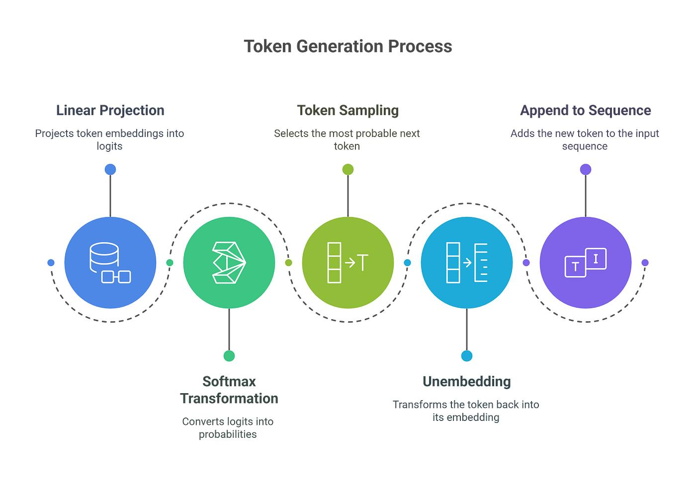
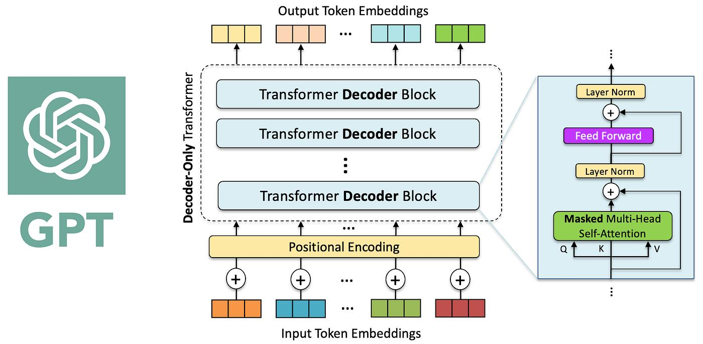
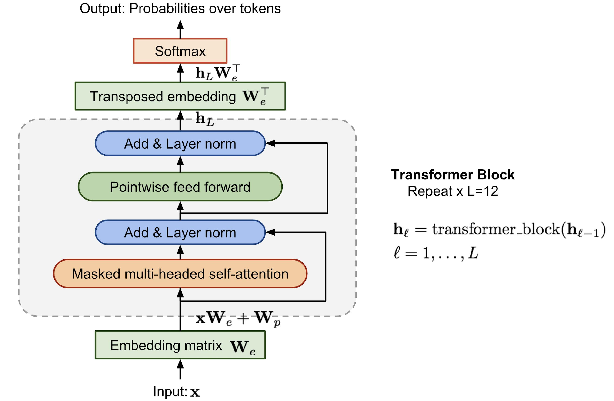
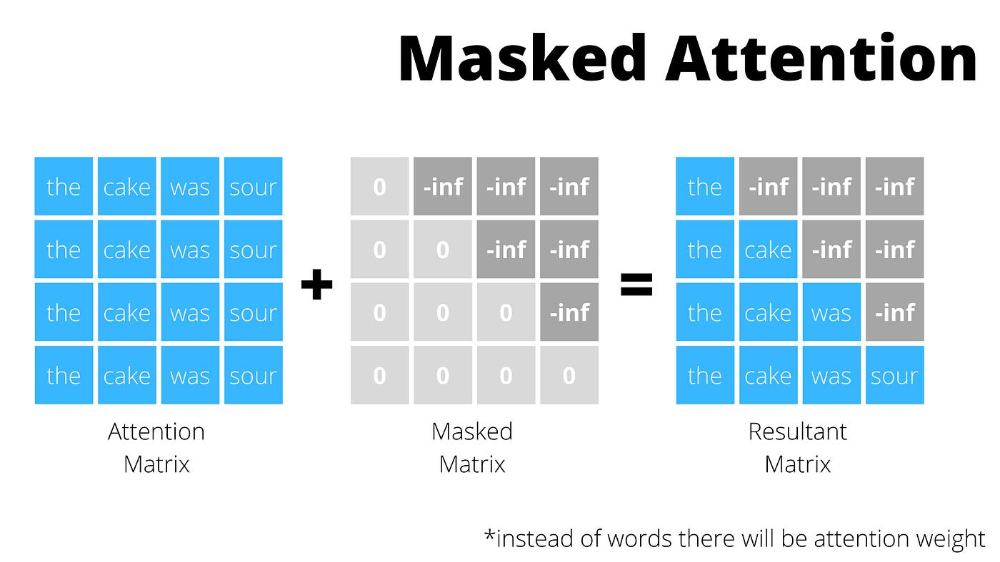
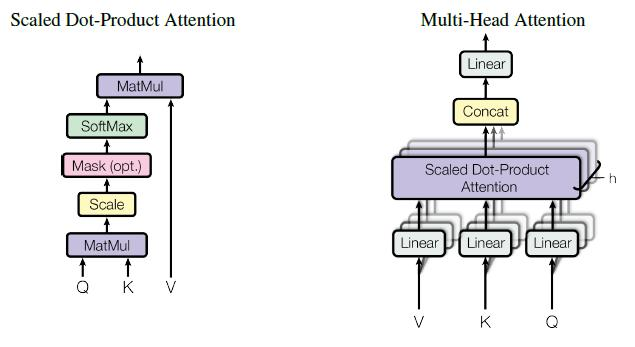
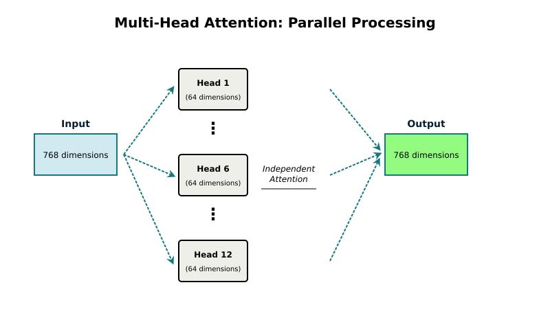
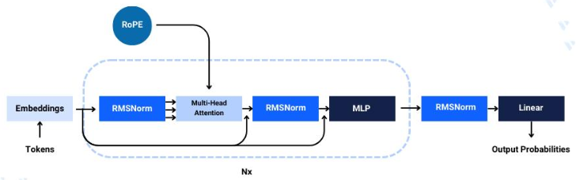

# Decoder-Only Transformer (GPT-style Language Models)

> Kiến trúc nền tảng của GPT, LLaMA, Mistral, Qwen và các Large Language Models hiện đại.
> Tài liệu này trình bày theo hướng học thuật, tập trung vào mô hình xác suất, attention và kiến trúc tối giản.



---

# 1. Mô hình xác suất tự hồi quy

Decoder-Only Transformer mô hình hóa phân phối chuỗi ngôn ngữ:

$$
P(x_1, x_2, ..., x_T) = \prod_{t=1}^{T} P(x_t \mid x_{\lt t})
$$

Trong đó:

- $x_t$: token tại vị trí $t$
- $x_{<t}$: toàn bộ token trước đó

Mục tiêu học:

$$
\max_\theta \sum_{t=1}^{T} \log P_\theta(x_t \mid x_{\lt t})
$$

---

# 2. Kiến trúc tổng thể

Decoder-Only Transformer gồm một stack các Transformer blocks:

```
Input Tokens
↓
Token Embedding
↓
Positional Encoding (RoPE / variants)
↓
Decoder Block × L
↓
LayerNorm / RMSNorm
↓
Linear LM Head
↓
Softmax
↓
Next token distribution
```





---

# 3. Token Embedding

Gọi:

- $V$: vocabulary size
- $d$: embedding dimension
- $E \in \mathbb{R}^{|V| \times d}$

Embedding:

$$
e_t = E[x_t]
$$

Chuỗi embedding:

$$
X = (e_1, e_2, ..., e_T)
$$

---

# 4. Positional Encoding (RoPE)

GPT hiện đại dùng Rotary Position Embedding:

$$
\tilde{q}_t = R(t) q_t,\quad \tilde{k}_t = R(t) k_t
$$

Trong đó $R(t)$ là phép quay trong không gian embedding.

---

# 5. Causal Self-Attention

## 5.1 Linear projections

$$
Q = XW_Q,\quad K = XW_K,\quad V = XW_V
$$

---

## 5.2 Attention score

$$
S = \frac{QK^T}{\sqrt{d_k}}
$$

---

## 5.3 Causal mask

$$
M_{ij} = \begin{cases} 0 & j \le i \\ -\infty & j > i \end{cases}
$$

---

## 5.4 Attention output

$$
A = softmax(S + M)
$$

$$
O = AV
$$

---



---

# 6. Multi-Head Attention

$$
head_i = Attention(Q_i, K_i, V_i)
$$

$$
MHA(X) = Concat(head_1, ..., head_h) W_O
$$

---





---

# 7. Decoder Block (GPT Block)

Một block tiêu chuẩn:

```
X
↓
RMSNorm
↓
Causal Self-Attention
↓
Residual
↓
RMSNorm
↓
Feed Forward (SwiGLU)
↓
Residual
```



---

## 7.1 Forward pass

Attention sublayer:

$$
U = X + Attention(Norm(X))
$$

FFN sublayer:

$$
Y = U + FFN(Norm(U))
$$

---

# 8. Feed Forward Network (SwiGLU)

$$
FFN(x) = (W_1 x) \odot Swish(W_2 x)
$$

$$
Swish(x) = x \cdot \sigma(x)
$$

---

# 9. RMSNorm

$$
RMS(x) = \sqrt{\frac{1}{d}\sum_{i=1}^{d} x_i^2}
$$

$$
RMSNorm(x) = \gamma \frac{x}{RMS(x)}
$$

---

# 10. Residual Connection

$$
X_{l+1} = X_l + F(X_l)
$$

Giúp:

- ổn định gradient
- huấn luyện deep networks

---

# 11. Stack Decoder Layers

Mô hình gồm $L$ layers:

$$
h_L = f_L(f_{L-1}(...f_1(x)))
$$

---

# 12. LM Head

$$
z = W_{lm} h_L
$$

$$
P(x_{t+1}) = softmax(z)
$$

---

# 13. KV Cache (Inference Optimization)

Trong sinh autoregressive:

- Key/Value của token cũ được lưu lại
- chỉ tính query mới

Độ phức tạp:

$$
O(T^2) \rightarrow O(T)
$$

---

# 14. Inference Process

Quá trình sinh token:

$$
x_t \sim P(x_t \mid x_{\lt t})
$$

Sau đó:

$$
x_{1:t} \rightarrow x_{1:t+1}
$$

Lặp lại đến khi kết thúc chuỗi.

---

# 15. Toàn bộ GPT pipeline

```
Embedding
↓
RoPE
↓
L × Decoder Block
↓
RMSNorm
↓
LM Head
↓
Softmax
```


---

# 16. Bản chất toán học GPT

Decoder-Only Transformer xấp xỉ:

$$
P_\theta(x) = \prod_t P_\theta(x_t \mid x_{\lt t})
$$

với:

$$
P_\theta(x_t \mid x_{\lt t}) = softmax(W \cdot f_\theta(x_{\lt t}))
$$

---

# 17. Kết luận

Decoder-Only Transformer là:

- mô hình xác suất tự hồi quy
- chỉ dựa trên causal self-attention
- tối ưu next-token prediction
- không cần encoder
- nền tảng của toàn bộ GPT-style LLMs

$$
\boxed{ \text{GPT} \equiv \text{Stack of Decoder Blocks} }
$$