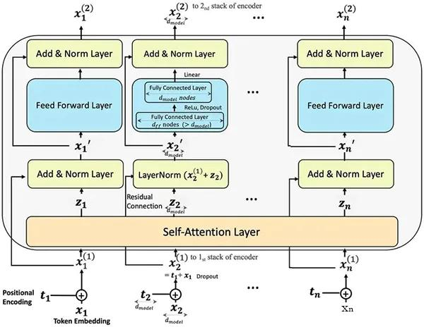
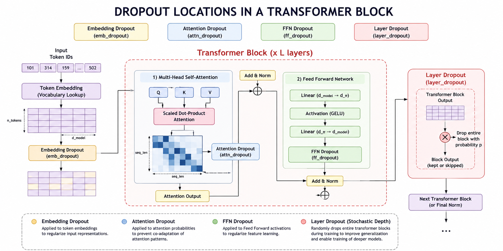
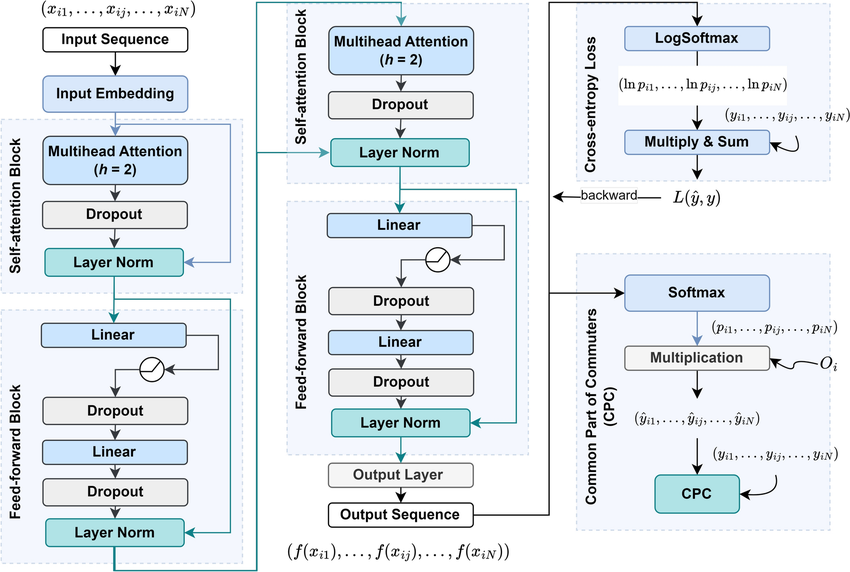
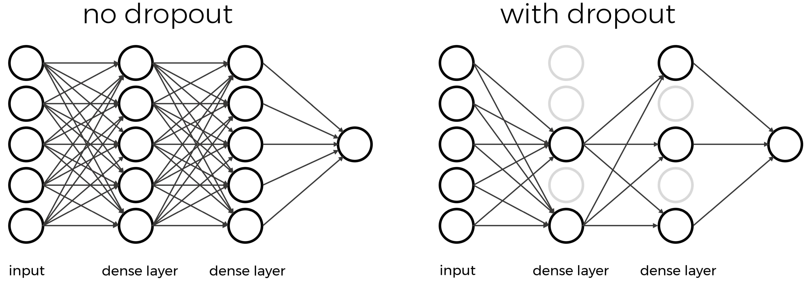
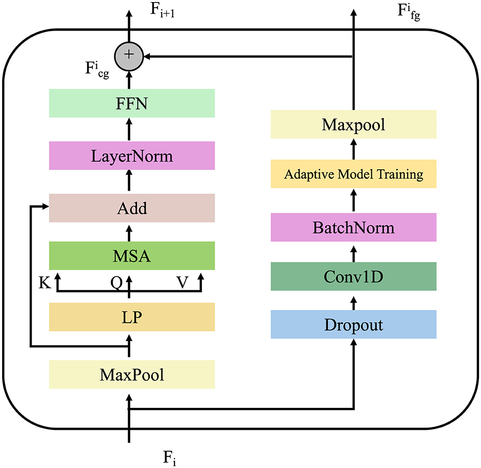
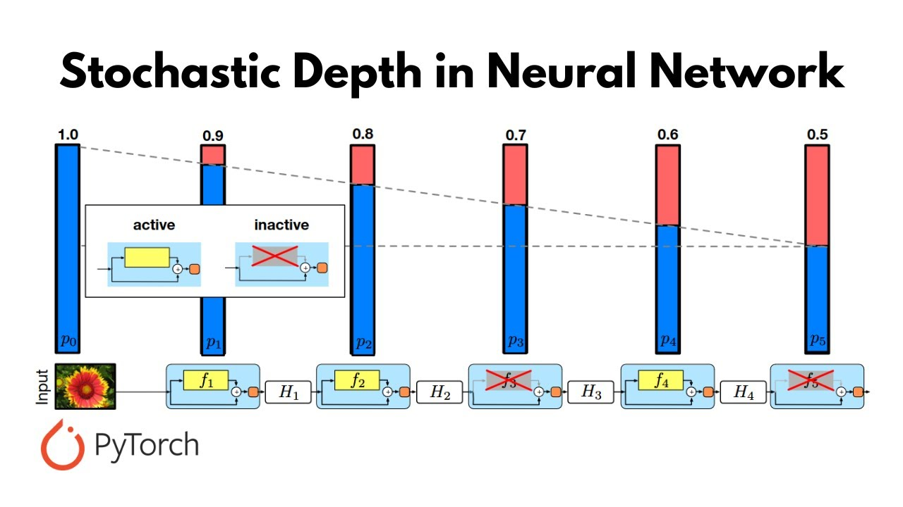

# Dropout Mechanisms in x-Transformers

> Hiểu về Embedding Dropout, Attention Dropout, Feed Forward Dropout và Stochastic Depth trong Kiến trúc Transformer Hiện đại

---

## Table of Contents

1. Introduction
2. Why Transformers Need Dropout
3. Transformer Block Overview
4. Embedding Dropout
5. Attention Dropout
6. Feed Forward Dropout
7. Layer Dropout (Stochastic Depth)
8. Mathematical Analysis
9. Interaction with Residual Connections
10. Training vs Inference
11. Computational Trade-offs
12. Role in Modern LLMs
13. x-Transformers Implementation
14. Summary
15. References

---

# 1. Introduction

Kiến trúc Transformer sở hữu năng lực biểu diễn vô cùng to lớn.

Khi chiều sâu và chiều rộng của mô hình tăng lên, mạng nơ-ron ngày càng có xu hướng ghi nhớ các ví dụ huấn luyện thay vì học các biểu diễn có tính khái quát hóa cao.

Để giải quyết vấn đề này, các kiến trúc Transformer hiện đại áp dụng nhiều hình thức điều quy hóa dropout khác nhau xuyên suốt toàn bộ mạng lưới.

Khác với các mạng nơ-ron cổ điển nơi dropout thường chỉ được áp dụng cho các kích hoạt ẩn (hidden activations), Transformer phân bổ dropout trên nhiều thành phần riêng biệt:

* Nhúng token (Token embeddings)

* Xác suất chú ý (Attention probabilities)

* Mạng truyền thẳng (Feed Forward Networks)

* Các nhánh tàn dư (Residual branches)

* Toàn bộ các tầng Transformer (Entire Transformer layers)

Thư viện x-transformers cung cấp khả năng cấu hình trực tiếp các cơ chế này:

```python
TransformerWrapper(
    num_tokens = 20000,
    max_seq_len = 1024,

    emb_dropout = 0.1,

    attn_layers = Decoder(
        dim = 512,
        depth = 6,
        heads = 8,

        layer_dropout = 0.1,
        attn_dropout = 0.1,
        ff_dropout = 0.1
    )
)
```

Mỗi cơ chế loại bỏ (dropout mechanism) điều chỉnh một thành phần khác nhau của đồ thị tính toán Transformer.

---

# 2. Why Transformers Need Dropout

Consider a model

$$
y=f(x;\theta)
$$

with parameters

$$
\theta.
$$

Nếu không có điều quy hóa (regularization), mô hình có thể sẽ học thuộc lòng các mối phụ thuộc mang tính biệt hóa cao giữa các nơ-ron với nhau.

Hiện tượng này được gọi là **sự đồng thích ứng (co-adaptation)**.

Dropout giúp ngăn chặn các mối phụ thuộc tiêu cực này bằng cách loại bỏ ngẫu nhiên một phần của mạng nơ-ron trong quá trình huấn luyện.

Đối với một hàm kích hoạt ẩn

$$
h_i,
$$

dropout samples a binary mask

$$
m_i \sim Bernoulli(1-p)
$$

and computes

$$
\tilde h_i=m_i h_i.
$$

where

$$
p
$$

is the dropout probability.

Thus

$$
P(\tilde h_i=0)=p.
$$

Mỗi lượt lặp huấn luyện (training iteration) thực chất là đang tối ưu hóa một mạng con (subnetwork) khác nhau.

---

# 3. Transformer Block Overview

Một tầng Transformer tiêu chuẩn bao gồm:

```text
Input
 │
 ▼
Multi-Head Attention
 │
 ▼
Residual Add
 │
 ▼
Feed Forward Network
 │
 ▼
Residual Add
 │
 ▼
Output
```

Dropout có thể được chèn vào một vài vị trí khác nhau.

---

## Dropout Locations

<p align="center">
  
</p>


<p align="center">
  
</p>

---

# 4. Embedding Dropout

## Motivation

Các tầng nhúng (Embedding layers) chuyển đổi các chỉ mục token (token indices) thành các biểu diễn vector liên tục.

Let

$$
E \in \mathbb{R}^{n \times d}
$$

ma trận nhúng (embedding matrix).

Một số chiều nhúng nhất định có thể trở nên quá biệt hóa (học thuộc lòng dữ liệu).

Embedding dropout giúp giảm thiểu hiệu ứng tiêu cực này.

---

## Mathematical Formulation

Sample mask

$$
M \sim Bernoulli(1-p).
$$

Then

$$
\tilde E=M \odot E.
$$

where

$$
\odot
$$

đại diện cho phép nhân theo từng phần tử (element-wise multiplication).

---

## Interpretation

Embedding dropout thúc đẩy:

* Biểu diễn phân bổ (Distributed representations): Thông tin được phân tán đều thay vì tập trung vào một vài chiều cố định.

* Mã hóa token mạnh mẽ (Robust token encoding): Giúp mô hình nhận diện token ổn định hơn trong nhiều ngữ cảnh nhiễu.

* Giảm thiểu việc học thuộc lòng (Reduced memorization): Hạn chế tối đa tình trạng quá khớp (overfitting) dữ liệu huấn luyện.

Thay vì để mô hình phụ thuộc hoàn toàn vào các tọa độ nhúng đơn lẻ (individual embedding coordinates).

---

## x-Transformers

```python
emb_dropout = 0.1
```

---

## Illustration

<p align="center">
  
</p>

---

# 5. Attention Dropout

## Motivation

Cơ chế tự chú ý (Self-attention) tính toán các mối phụ thuộc giữa các token với nhau.

Nếu không có điều quy hóa, các đầu chú ý (attention heads) thường có xu hướng bị sụp đổ và tập trung hoàn toàn vào một vài đường dẫn chú ý áp đảo (dominant attention paths).

Attention dropout ép buộc ma trận chú ý phải duy trì tính đa dạng (diverse).

---

# Self-Attention

Attention scores:

$$
S=\frac{QK^T}{\sqrt d}
$$

Attention probabilities:

$$
A=\text{softmax}(S).
$$

Output:

$$
Y=AV.
$$

---

## Attention Dropout

Apply a random mask:

$$
M \sim Bernoulli(1-p).
$$

The attention matrix becomes

$$
\tilde A=M\odot A.
$$

Therefore

$$
Y=\tilde A V.
$$

---

## Graph Interpretation

Without dropout:

```text
Token A
 ├──► Token B
 ├──► Token C
 └──► Token D
```

With dropout:

```text
Token A
 │
 └──► Token C
```

Mô hình không thể lúc nào cũng dựa dẫm vào cùng một cạnh chú ý (attention edge) cố định.

---

## x-Transformers

```python
attn_dropout = 0.1
```

---

## Illustration

<p align="center">
  
</p>

---

# 6. Feed Forward Dropout

Mạng truyền thẳng (Feed Forward Network - FFN) đóng góp phần lớn số lượng tham số trong các kiến trúc Transformer hiện đại.

---

## Feed Forward Network

A typical FFN is

$$
FFN(x)=W_2 \sigma(W_1 x).
$$

For GELU activation:

$$
FFN(x)=W_2 GELU(W_1x).
$$

---

## Applying Dropout

Hidden activations:

$$
h=GELU(W_1x).
$$

Sample mask

$$
M \sim Bernoulli(1-p).
$$

Then

$$
\tilde h=M\odot h.
$$

Output:

$$
FFN(x)=W_2 \tilde h.
$$

---

## Effect

FFN dropout ngăn chặn:

* Sự học thuộc lòng đặc trưng (Feature memorization): Hạn chế mô hình ghi nhớ máy móc các đặc trưng cục bộ của dữ liệu huấn luyện.

* Sự đồng thích ứng của các đơn vị ẩn (Hidden unit co-adaptation): Ngăn các nơ-ron ở tầng ẩn phụ thuộc chặt chẽ vào nhau để cùng ra quyết định sai lệch.

* Sự biệt hóa quá mức của kích hoạt (Excessive activation specialization): Tránh tình trạng một vài bộ kích hoạt cụ thể bị phóng đại hoặc tập trung quá sâu vào một nhóm dữ liệu hẹp.

---

## x-Transformers

```python
ff_dropout = 0.1
```

---

## Illustration

<p align="center">
  
</p>

---

# 7. Layer Dropout (Stochastic Depth)

Layer Dropout (hay còn gọi là Stochastic Depth) có bản chất khác biệt hoàn toàn so với dropout truyền thống.

Thay vì loại bỏ các nơ-ron đơn lẻ, toàn bộ các khối (blocks) Transformer sẽ bị xóa bỏ ngẫu nhiên trong quá trình huấn luyện.

---

# Motivation

Deep Transformers may contain:

* 24 layers
* 48 layers
* 80+ layers
* 100+ layers

Việc huấn luyện các mạng lưới như vậy có thể trở nên mất ổn định.

---

# Stochastic Depth

Let

$$
z_l=f_l(x_l)
$$

be the output of layer

$$
l.
$$

Sample

$$
m_l \sim Bernoulli(1-p).
$$

Then

$$
x_{l+1} = x_l + m_l z_l.
$$

If

$$
m_l=0
$$

the entire layer is skipped.

---

## Visualization

Normal execution:

```text
x
 │
 ▼
Layer
 │
 ▼
Output
```

Dropped execution:

```text
x
 │
 └────────► Output
```

---

## Ensemble Interpretation

For

$$
L
$$

layers,

Mạng lưới có thể biểu diễn xấp xỉ

$$
2^L
$$

mạng con (subnetworks) khả dĩ.

Do đó, độ sâu ngẫu nhiên (stochastic depth) hoạt động giống như một mô hình tổ hợp ẩn (implicit ensemble) có quy mô cực kỳ lớn.

---

## x-Transformers

```python
layer_dropout = 0.1
```

---

## Illustration

<p align="center">
  
</p>

---

# 8. Mathematical Analysis

Giả sử có một vector ẩn

$$
h.
$$

Áp dụng dropout thu được

$$
\tilde h=Mh.
$$

Giá trị kỳ vọng:

$$
E[\tilde h]=(1-p)h.
$$

Để bảo toàn quy mô (giá trị tỷ lệ) trong quá trình huấn luyện:

$$
\tilde h= \frac{M}{1-p}h.
$$

Cơ chế này được gọi là __inverted dropout (dropout đảo ngược)__ và đang được sử dụng rộng rãi bởi các khung làm việc (frameworks) học sâu hiện đại.

---

# 9. Interaction with Residual Connections

Transformer residual connection:

$$
y=x+f(x).
$$

With dropout:

$$
y=x+M\odot f(x).
$$

Các đường dẫn tàn dư (Residual pathways) đảm bảo:

* Luồng gradient ổn định (Stable gradient flow): Giúp tín hiệu đạo hàm truyền ngược về các tầng trước mà không bị tiêu biến.

* Tối ưu hóa mạnh mẽ (Robust optimization): Hỗ trợ thuật toán tìm kiếm nghiệm hội tụ dễ dàng hơn.

* Bỏ qua tầng một cách an toàn (Safe layer skipping): Cho phép dữ liệu đi tắt qua các khối bị loại bỏ mà không làm gián đoạn mạng lưới.

Điều này giúp cho cơ chế độ sâu ngẫu nhiên (stochastic depth) hoạt động khả thi và thực tế trong các kiến trúc Transformer cực sâu.

---

# 10. Training vs Inference

## Training

Random masks are sampled.

```text
Dropout ON
```

Different subnetworks are trained.

---

## Inference

```text
Dropout OFF
```

All units remain active.

The full model is used.

---

# 11. Computational Trade-offs

| Mechanism         | Memory Cost | Compute Cost    | Regularization Strength |
| ----------------- | ----------- | --------------- | ----------------------- |
| Embedding Dropout | Low         | Low             | Medium                  |
| Attention Dropout | Low         | Low             | High                    |
| FFN Dropout       | Low         | Low             | Medium                  |
| Layer Dropout     | Very Low    | Reduces Compute | Very High               |

---

# 12. Role in Modern LLMs

Các mô hình Transformer quy mô vừa và nhỏ thường áp dụng dropout một cách sâu rộng.

Các ví dụ điển hình bao gồm:

* BERT
* RoBERTa
* T5
* ViT

Ngược lại, các mô hình ngôn ngữ lớn (LLMs) tiên phong hiện nay thường giảm thiểu hoặc loại bỏ hoàn toàn dropout tiêu chuẩn vì những lý do sau:

* __Tập dữ liệu cực kỳ khổng lồ__: Khi lượng dữ liệu huấn luyện lên tới hàng nghìn tỷ token, nguy cơ mô hình bị quá khớp (overfitting) giảm đi đáng kể, khiến vai trò chống học thuộc lòng của dropout truyền thống không còn quá cấp thiết.

* __Nhiễu trong quá trình huấn luyện đóng vai trò như một bộ điều quy__: Việc huấn luyện với batch size lớn, độ chính xác thấp (như FP16/BF16) và xáo trộn dữ liệu liên tục đã tự động tạo ra một lượng "nhiễu" tự nhiên, có tác dụng điều quy hóa cho mạng lưới.

* __Quá trình tối ưu hóa quy mô lớn vận hành khác biệt__: Ở quy mô hàng tỷ tham số, dropout tiêu chuẩn có thể làm chậm tốc độ hội tụ và gây mất ổn định cho các thuật toán tối ưu hóa trong giai đoạn đầu.

Mặc dù vậy, các kỹ thuật điều quy cấu trúc (structural regularization) như độ sâu ngẫu nhiên (stochastic depth) vẫn đóng vai trò đặc biệt quan trọng trong các kiến trúc mạng siêu sâu để đảm bảo tính ổn định vững chắc.

---

# 13. x-Transformers Implementation

```python
import torch

from x_transformers import (
    TransformerWrapper,
    Decoder
)

model = TransformerWrapper(
    num_tokens = 20000,
    max_seq_len = 1024,

    emb_dropout = 0.1,

    attn_layers = Decoder(
        dim = 512,
        depth = 6,
        heads = 8,

        layer_dropout = 0.1,
        attn_dropout = 0.1,
        ff_dropout = 0.1
    )
)

x = torch.randint(
    0,
    20000,
    (1, 1024)
)

logits = model(x)
```

---

# 14. Summary

Hệ thống dropout trong `x-transformers` bao gồm bốn cơ chế điều quy hóa bổ trợ lẫn nhau:

| Mechanism         | Purpose                        |
| ----------------- | ------------------------------ |
| __Embedding Dropout__ | Điều quy hóa đầu vào (Input Regularization)           |
| __Attention Dropout__ | Điều quy hóa đồ thị chú ý (Attention Graph Regularization) |
| __FFN Dropout__      | Điều quy hóa đặc trưng (Feature Regularization)         |
| __Layer Dropout__    | Điều quy hóa độ sâu (Depth Regularization)           |

Khi kết hợp lại, các cơ chế này biến một mô hình Transformer định tính (deterministic) thành một tổ hợp ngẫu nhiên (stochastic ensemble) gồm nhiều mạng con khác nhau. Từ đó giúp cải thiện khả năng khái quát hóa, tăng tính mạnh mẽ và đảm bảo sự ổn định trong suốt quá trình huấn luyện.

---

# 15. References

### Original Transformer

Ashish Vaswani et al.

**Attention Is All You Need**

2017

---

### Dropout

Nitish Srivastava et al.

**Dropout: A Simple Way to Prevent Neural Networks from Overfitting**

JMLR 2014

---

### Stochastic Depth

Gao Huang et al.

**Deep Networks with Stochastic Depth**

ECCV 2016

---

### x-Transformers

https://github.com/lucidrains/x-transformers
