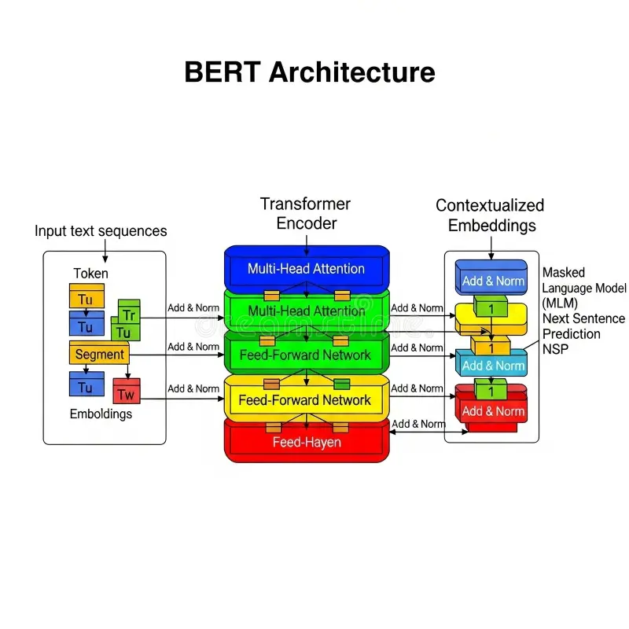
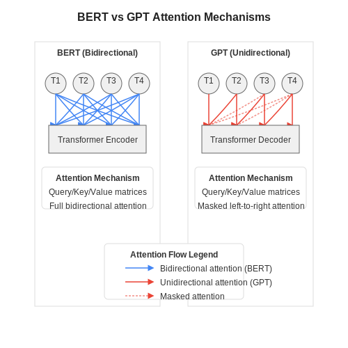
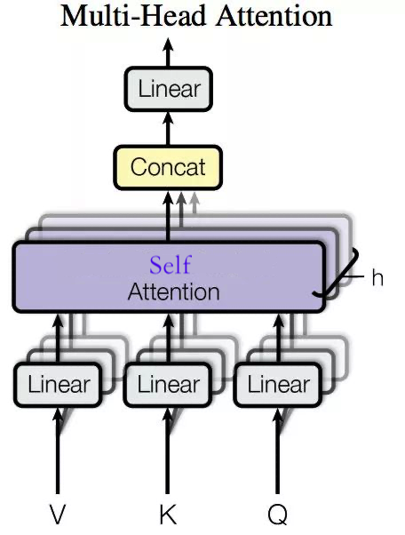
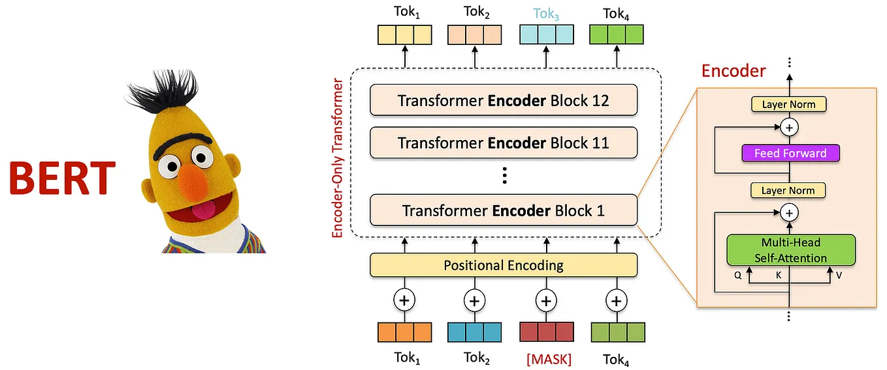
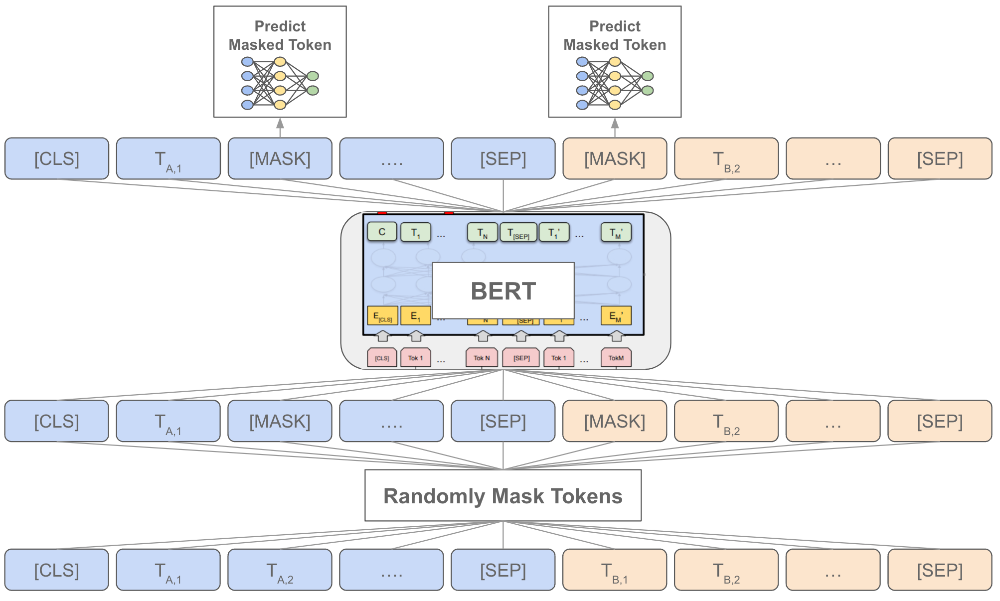
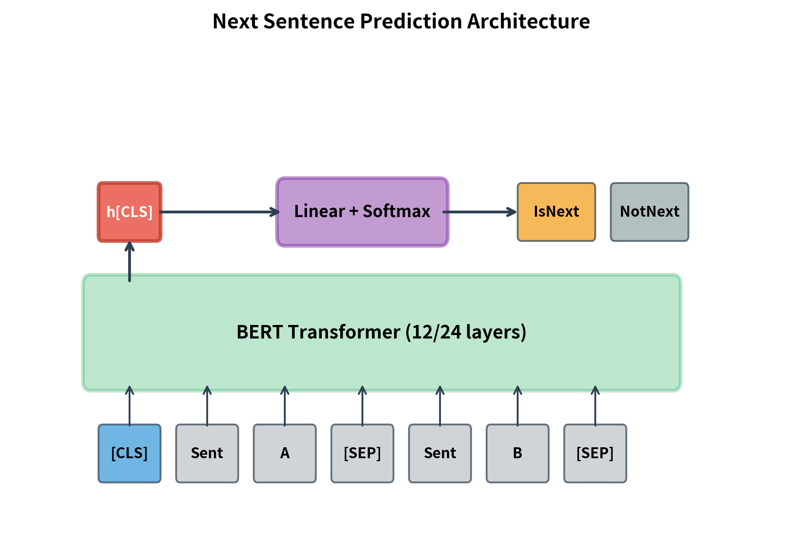
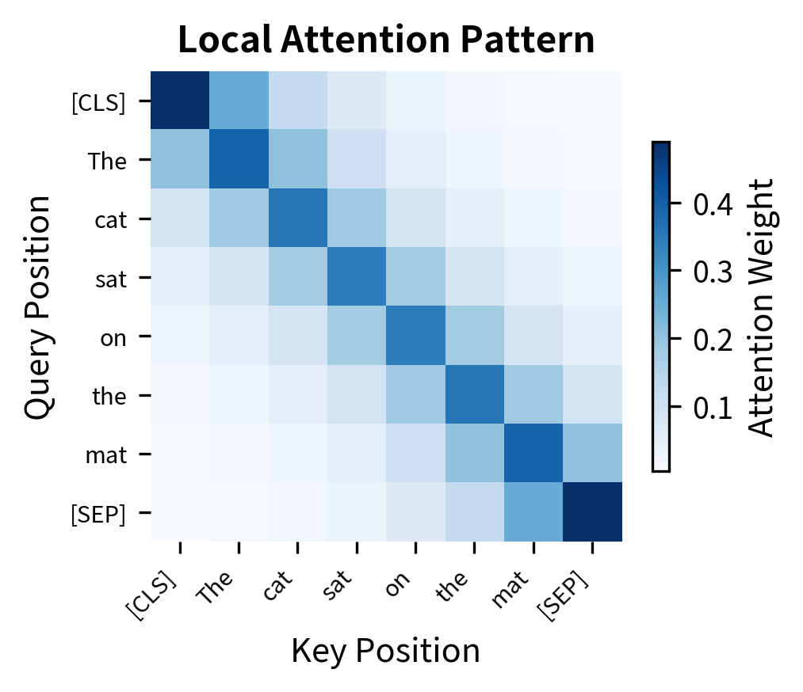

# Encoder-Only Transformer

> Mathematical Foundations of BERT and Modern Encoder Architectures

---

# 1. Introduction

Encoder-Only Transformer là một nhánh của kiến trúc Transformer được thiết kế cho các bài toán **biểu diễn ngữ nghĩa (representation learning)** thay vì **sinh chuỗi tự hồi quy (autoregressive generation)**.

Khác với Transformer nguyên thủy gồm Encoder và Decoder, kiến trúc này chỉ giữ lại phần Encoder.

```text
Input Tokens
      │
      ▼
Encoder Stack
      │
      ▼
Contextual Representations
```

Những mô hình nổi tiếng thuộc họ này gồm:

* BERT
* RoBERTa
* DeBERTa
* ELECTRA
* ModernBERT

---

# 2. Overall Architecture

<p align="center">
    
</p>

<p align="center">
    <em>Overall Encoder-Only Transformer Architecture</em>
</p>

Luồng xử lý tổng quát:

```text
Input Tokens
      │
      ▼
Token Embedding
      │
      ▼
Position Embedding
      │
      ▼
Encoder Layer × N
      │
      ▼
Contextual Embeddings
      │
      ▼
Task Head
```

Mục tiêu của Encoder là học ánh xạ:

$$
f : X \rightarrow H
$$

trong đó:

$$
X = (x_1,x_2,\ldots,x_n)
$$

là chuỗi đầu vào và

$$
H = (h_1,h_2,\ldots,h_n)
$$

là biểu diễn ngữ cảnh tương ứng.

---

# 3. Input Representation

## 3.1 Token Embedding

Cho từ vựng có kích thước:

$$
V
$$

và không gian ẩn:

$$
d
$$

Embedding matrix:

$$
E \in \mathbb{R}^{V \times d}
$$

Token thứ i được ánh xạ thành:

$$
e_i = E[x_i]
$$

---

## 3.2 Positional Embedding

Self-Attention không chứa thông tin thứ tự.

Do đó:

$$
z_i = e_i + p_i
$$

với:

$$
p_i
$$

là positional embedding.

Đầu vào thực tế:

$$
Z = [z_1,z_2,\ldots,z_n]
$$

---

# 4. Encoder Layer

<p align="center">
    
</p>

<p align="center">
    <em>Transformer Encoder Block</em>
</p>

Một Encoder Layer gồm:

```text
Input
 │
 ▼
Multi Head Self Attention
 │
Add & Norm
 │
 ▼
Feed Forward
 │
Add & Norm
 ▼
Output
```

Toán học:

$$
Y = LN(X + MHA(X))
$$

$$
H = LN(Y + FFN(Y))
$$

---

# 5. Bidirectional Self-Attention

Đây là điểm khác biệt quan trọng nhất của BERT.

<p align="center">
    
</p>

<p align="center">
    <em>Bidirectional Attention</em>
</p>

Trong Encoder:

Mỗi token được phép quan sát toàn bộ chuỗi.

Attention mask:

```text
● ● ● ● ●
● ● ● ● ●
● ● ● ● ●
● ● ● ● ●
● ● ● ● ●
```

Không tồn tại causal mask.

---

## 5.1 Query Key Value

Cho:

$$
X \in \mathbb{R}^{n \times d}
$$

Ta xây dựng:

$$
Q = XW_Q
$$

$$
K = XW_K
$$

$$
V = XW_V
$$

---

## 5.2 Attention Scores

Điểm attention:

$$
S=\frac{QK^T}{\sqrt d}
$$

---

## 5.3 Attention Distribution

$$
A=\operatorname{softmax}(S)
$$

---

## 5.4 Context Vector

$$
H=AV
$$

---

# 6. Multi-Head Self-Attention

<p align="center">
    
</p>

<p align="center">
    <em>Multi-Head Self-Attention</em>
</p>

Một head:

$$
head_i =Attention(Q_i,K_i,V_i)
$$

N head:

$$
MHA = Concat(head_1,\ldots,head_h)W_O
$$

Mỗi head học một quan hệ khác nhau trong dữ liệu.

---

# 7. Feed Forward Network

Sau Attention, mỗi token được xử lý độc lập.

BERT sử dụng:

$$
FFN(x) = W_2 GELU(W_1x+b_1) +b_2
$$

Thông thường:

$$
d_{ff}=4d
$$

Ví dụ:

$$
768 \rightarrow 3072 \rightarrow 768
$$

---

# 8. Residual Connections

Mỗi sub-layer:

$$
y = x + F(x)
$$

Giúp:

* tránh mất gradient
* huấn luyện mạng sâu
* tăng ổn định

---

# 9. Layer Normalization

Chuẩn hóa:

$$
LN(x)= \gamma \frac {x-\mu}{\sigma}+\beta
$$

với:

$$
\mu =\frac1d \sum_{i=1}^{d}x_i
$$

$$
\sigma=\sqrt{ \frac1d \sum_{i=1}^{d} (x_i-\mu)^2}
$$

---

# 10. Full Encoder Stack

<p align="center">
    
</p>

<p align="center">
    <em>Stacked Transformer Encoder Layers</em>
</p>

Encoder gồm N lớp:

$$
H^{(0)} = X
$$

$$
H^{(l+1)}=EncoderLayer(H^{(l)})
$$

với:

$$
l=0,\ldots,N-1
$$

Kết quả cuối:

$$
H^{(N)}
$$

---

# 11. BERT Architecture

## BERT Base

| Parameter       | Value |
| --------------- | ----- |
| Layers          | 12    |
| Hidden Size     | 768   |
| Attention Heads | 12    |
| Parameters      | 110M  |

---

## BERT Large

| Parameter       | Value |
| --------------- | ----- |
| Layers          | 24    |
| Hidden Size     | 1024  |
| Attention Heads | 16    |
| Parameters      | 340M  |

---

# 12. Masked Language Modeling

<p align="center">
    
</p>

<p align="center">
    <em>Masked Language Modeling</em>
</p>

BERT không dự đoán token tiếp theo.

Thay vào đó, ngẫu nhiên mask:

$$
15%
$$

token trong câu.

Ví dụ:

```text
The cat sits on the mat
```

↓

```text
The [MASK] sits on the mat
```

↓

```text
Predict:
cat
```

Hàm mất mát:

$$
L_{MLM}=* \sum_i \log P(x_i|x_{\setminus i})
$$

---

# 13. CLS Representation

<p align="center">
    
</p>

<p align="center">
    <em>CLS Token Representation</em>
</p>

Đầu chuỗi thêm token:

```text
[CLS]
```

Ví dụ:

```text
[CLS] token₁ token₂ token₃ ...
```

Output:

$$
h_{CLS}
$$

được dùng làm biểu diễn toàn bộ câu.

Classification:

$$
y=W h_{CLS} +b
$$

---

# 14. Complexity Analysis

<p align="center">
    
</p>

<p align="center">
    <em>Quadratic Attention Matrix</em>
</p>

Attention matrix:

$$
A \in \mathbb{R}^{n\times n}
$$

Memory:

$$
O(n^2)
$$

Compute:

$$
O(n^2d)
$$

Đây là giới hạn chính của Encoder Transformer khi xử lý chuỗi dài.

---

# 15. Encoder in x-transformers

Cấu hình tối giản:

```python
from x_transformers import (
    TransformerWrapper,
    Encoder
)

model = TransformerWrapper(
    num_tokens = vocab_size,
    max_seq_len = seq_len,
    attn_layers = Encoder(
        dim = 768,
        depth = 12,
        heads = 12
    )
)
```

Kiến trúc bên trong:

```text
TransformerWrapper
        │
        ▼
Embedding Layer
        │
        ▼
Encoder Stack
        │
        ▼
Contextual Embeddings
```

---

# 16. Mathematical Summary

Toàn bộ Encoder có thể được mô tả bằng:

$$
H^{(0)}=Embedding(X)+Position(X)
$$

$$
H^{(l+1)}=EncoderLayer(H^{(l)})
$$

$$
l=0,\ldots,N-1
$$

Output cuối:

$$
H^{(N)}
$$

Trong đó mỗi token:

$$
h_i=f(x_1,x_2,\ldots,x_n)
$$

phụ thuộc vào toàn bộ chuỗi đầu vào.

Đây chính là bản chất của Bidirectional Contextual Representation Learning.

---

# References

1. Vaswani et al., *Attention Is All You Need*, 2017.
2. Devlin et al., *BERT: Pre-training of Deep Bidirectional Transformers for Language Understanding*, 2018.
3. x-transformers Documentation.
4. RoBERTa.
5. DeBERTa.
6. ELECTRA.
7. ModernBERT.
