# ALiBi Positional Embedding - Overview

---

# 1. Big Picture

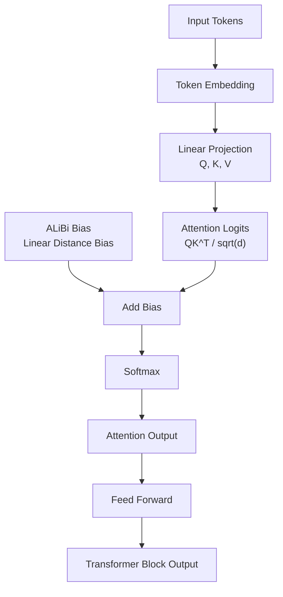

---

# 2. Core Mathematical Idea

Traditional Attention:

```math
A_{ij} = \frac{Q_iK_j^T}{\sqrt d}
```

ALiBi:

```math
A_{ij} = \frac{Q_iK_j^T}{\sqrt d} - m_h(i-j)
```

where:

```math
m_h>0
```

and:

```math
i-j
```

is the relative distance.

---

# 3. Attention Matrix Construction

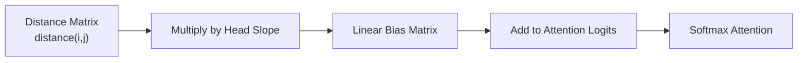

```math
b_{ij}=-m_h(i-j)
```

---

# 4. Distance Penalty

```text
Distance:

0   1   2   3   4   5
│   │   │   │   │   │
▼   ▼   ▼   ▼   ▼   ▼

Bias:

0  -1  -2  -3  -4  -5
```

Therefore:

```text
distance ↑
      ↓
negative bias ↑
      ↓
attention score ↓
```

---

# 5. Causal ALiBi Matrix

```text
┌──────────────────────────┐
│  0  -1  -2  -3  -4  -5  │
│  0   0  -1  -2  -3  -4  │
│  0   0   0  -1  -2  -3  │
│  0   0   0   0  -1  -2  │
│  0   0   0   0   0  -1  │
│  0   0   0   0   0   0  │
└──────────────────────────┘
```

Farther tokens receive larger penalties.

---

# 6. Inductive Bias of ALiBi

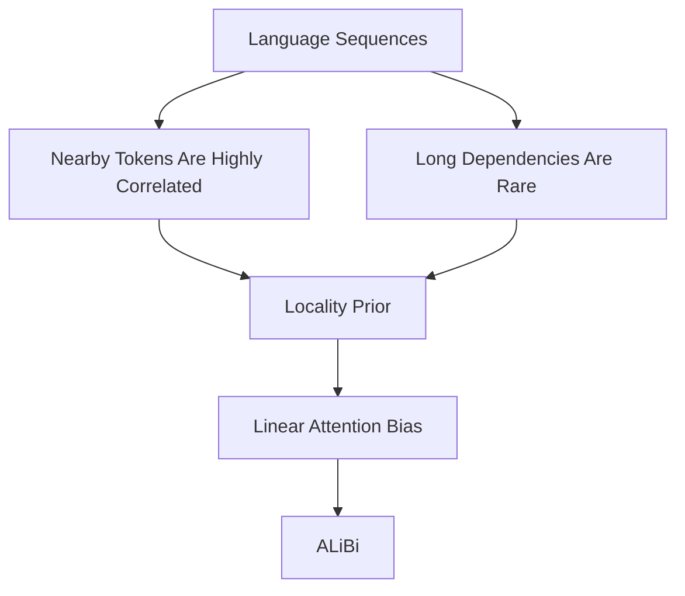

---

# 7. Multi-Head Behavior

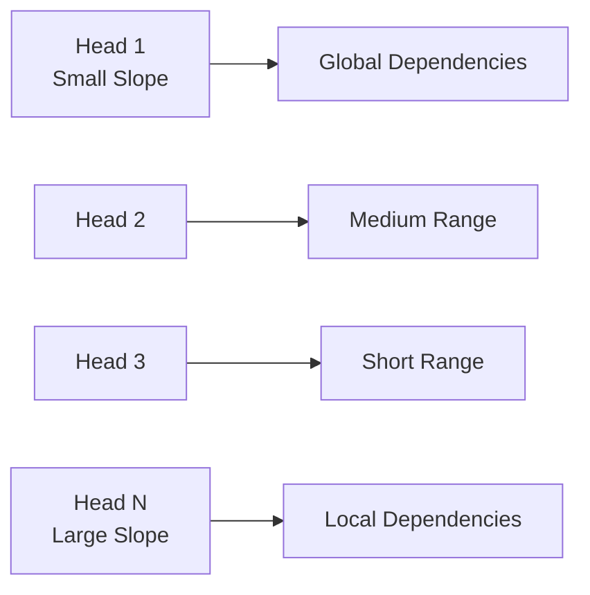

---

# 8. Hierarchical Receptive Fields

```text
Head 1:
──────────────────────────────
Very long context

Head 2:
───────────────────
Medium-long context

Head 3:
────────────
Medium context

Head N:
──────
Local context
```

---

# 9. Length Extrapolation Mechanism

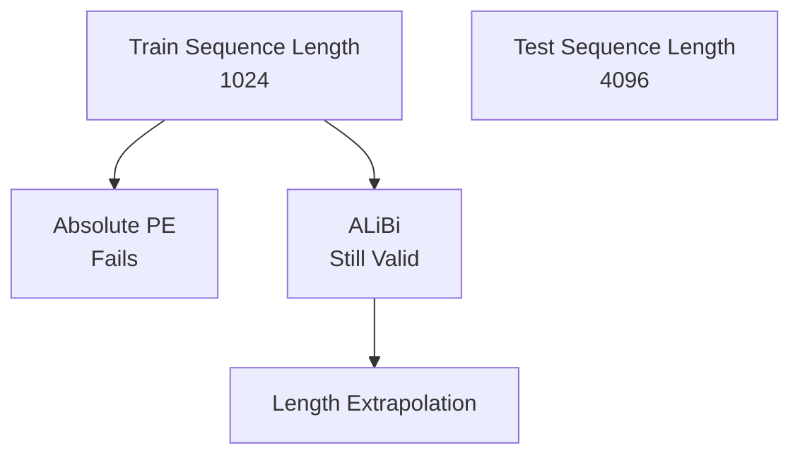

Because:

```math
b_{ij} = -m_h(i-j)
```

depends only on distance and not on:

```math
L_{train}
```

---

# 10. Why ALiBi Works

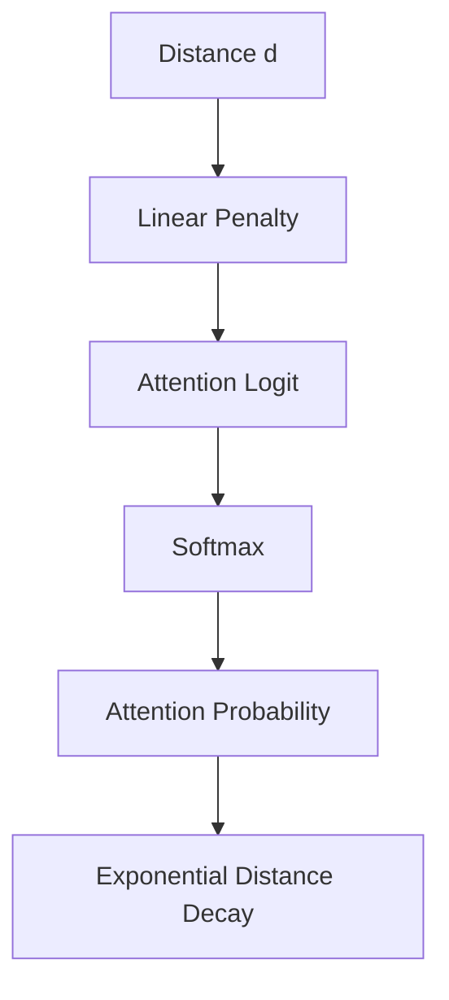

Thus:

```math
P(attend) \propto e^{-m_h d}
```

which behaves like an exponential decay kernel.

---

# 11. Comparison with Other Position Methods

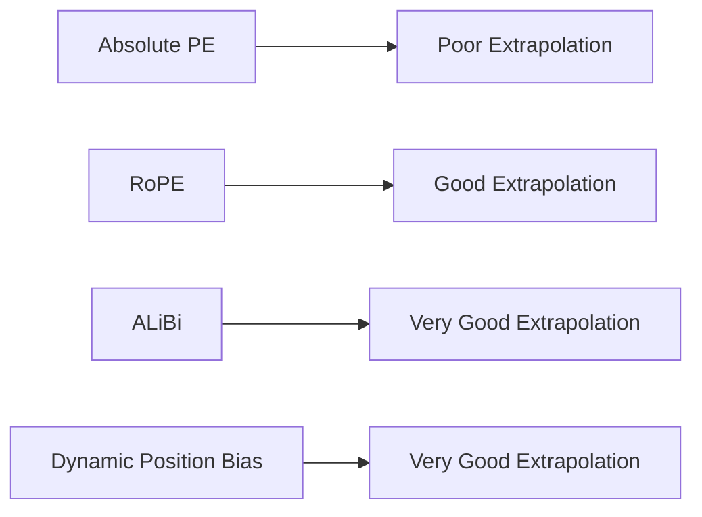

---

# 12. Advantages

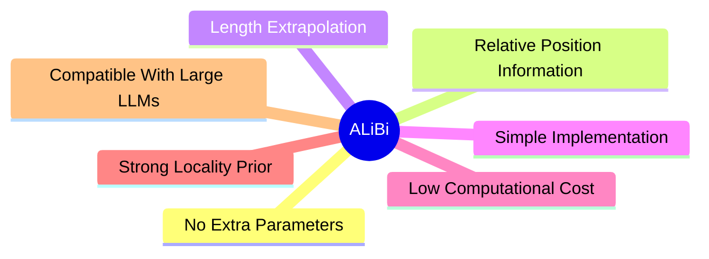

---

# 13. Limitations

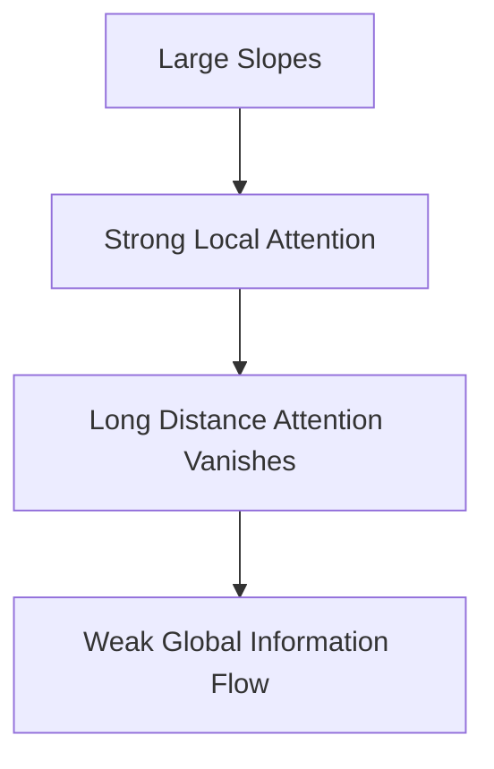

---

# 14. ALiBi in x-transformers

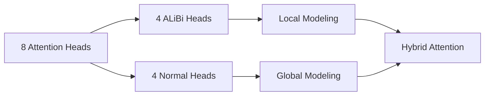

---

# 15. Complete Overview

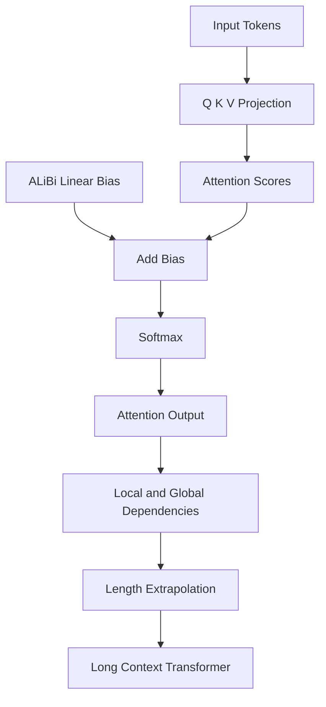

---

# Overview

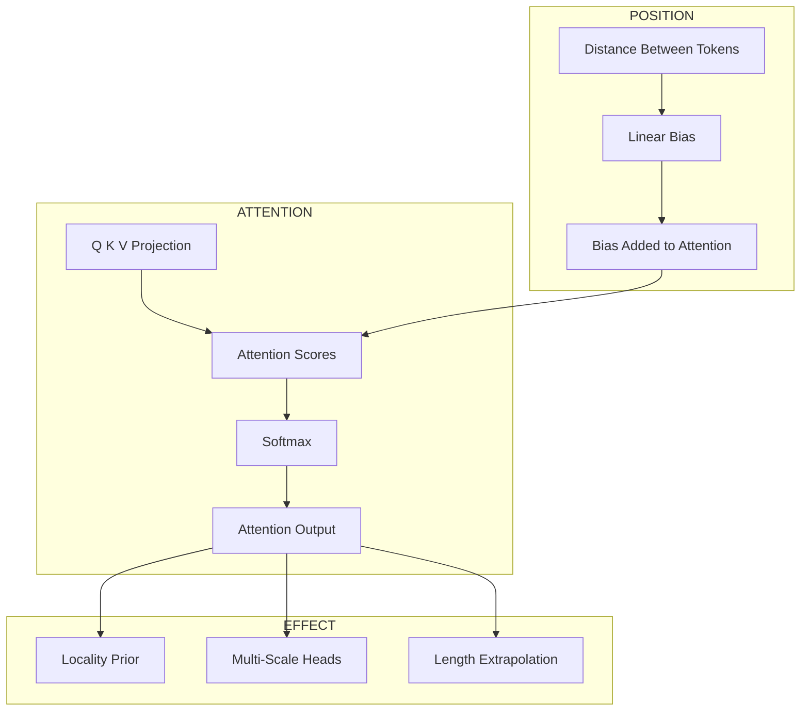

---

# Summary

```text
ALiBi
│
├── No positional embeddings
├── Add linear bias to attention scores
├── Multi-scale attention heads
├── Strong locality inductive bias
├── No extra parameters
├── O(L²) complexity unchanged
├── Supports length extrapolation
└── Widely used in modern x-transformers and LLMs
```


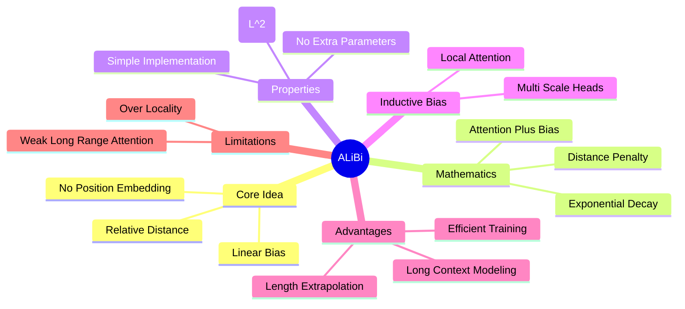