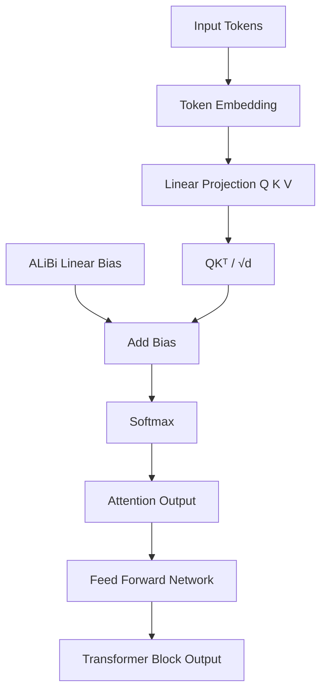
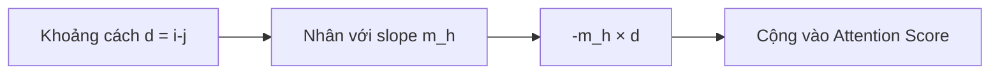
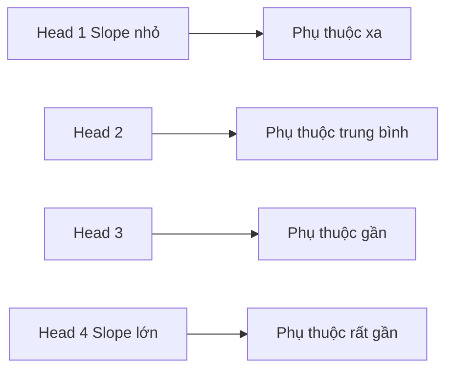

# ALiBi Positional Embedding

## Attention with Linear Biases cho Khả năng Ngoại suy Độ dài trong Transformer

> *Train Short, Test Long: Attention with Linear Biases Enables Input Length Extrapolation*
> Ofir Press, Noah A. Smith, Mike Lewis (ICLR 2022)

---

# 1. Động cơ nghiên cứu

Transformer nguyên bản sử dụng **Absolute Positional Embedding**:

```math
x_i = e_i + p_i
```

trong đó:

* $e_i$: embedding của token.
* $p_i$: embedding vị trí.

Tuy nhiên, phương pháp này có một hạn chế lớn:

> Mô hình không thể tự nhiên tổng quát hóa đến các chuỗi dài hơn độ dài đã được huấn luyện.

Các phương pháp **Relative Positional Encoding** cải thiện vấn đề này nhưng thường:

* tăng số lượng tham số,
* tăng chi phí bộ nhớ,
* tăng chi phí tính toán.

ALiBi (**Attention with Linear Biases**) đề xuất một giải pháp cực kỳ đơn giản:

> Không mã hóa vị trí vào biểu diễn token.

Thay vào đó:

> Đưa thông tin vị trí trực tiếp vào ma trận attention thông qua một độ lệch tuyến tính (linear bias) cố định.

Phương pháp này:

* không thêm tham số học được,
* gần như không tăng chi phí tính toán,
* cải thiện đáng kể khả năng ngoại suy độ dài chuỗi.

---

# 2. Ý tưởng cốt lõi

Self-Attention tiêu chuẩn:

```math
A_{ij} = \frac{Q_iK_j^T}{\sqrt d}
```

ALiBi sửa thành:

```math
A_{ij} = \frac{Q_iK_j^T}{\sqrt d} + b_{ij}
```

với:

```math
b_{ij} = -m_h(i-j)
```

đối với attention nhân quả (causal attention):

```math
i \ge j
```

và:

```math
m_h>0
```

là hệ số độ dốc $slope$ của head thứ $h$.

Do đó:

```math
A_{ij} = \frac{Q_iK_j^T}{\sqrt d} - m_h(i-j)
```

---

# 3. Diễn giải trực quan

Khoảng cách giữa hai token càng lớn:

```math
|i-j| \uparrow
```

thì độ phạt:

```math
-m_h(i-j)
```

càng lớn.

Kết quả:

```math
\text{attention score} \downarrow
```

đối với các token ở xa.

ALiBi đưa vào một **giả thiết quy nạp (inductive bias) về tính cục bộ**:

```text
Token gần nhau
      ↑
attention lớn

Token ở xa
      ↓
attention nhỏ
```

nhưng không hề giới hạn cứng receptive field.

---

# 4. Minh họa ma trận Attention

## Không dùng ALiBi

```text
QKᵀ
┌──────────────────┐
│ . . . . . . . .  │
│ . . . . . . . .  │
│ . . . . . . . .  │
│ . . . . . . . .  │
└──────────────────┘
```

## Có ALiBi

```text
QKᵀ + Bias
┌──────────────────┐
│ 0 -1 -2 -3 -4 -5 │
│ 0  0 -1 -2 -3 -4 │
│ 0  0  0 -1 -2 -3 │
│ 0  0  0  0 -1 -2 │
└──────────────────┘
```

Token càng xa:

```text
distance ↑
bias ↓
attention ↓
```

---

# 5. Hệ số Slope theo Multi-Head

Mỗi attention head được gán một hệ số:

```math
m_1,m_2,\dots,m_H
```

Bài báo gốc sử dụng:

```math
m_h = 2^{-8h/H}
```

(tương đương một cấp số nhân).

Điều này tạo ra các receptive field khác nhau:

| Head | Độ dốc    | Hành vi            |
| ---- | --------- | ------------------ |
| nhỏ  | phạt yếu  | attention toàn cục |
| lớn  | phạt mạnh | attention cục bộ   |

Do đó:

```text
Head đầu:
    phụ thuộc xa

Head cuối:
    phụ thuộc gần
```

---

# 6. Tại sao ALiBi ngoại suy được độ dài?

Absolute Positional Embedding:

```math
P\in\mathbb R^{L_{train}\times d}
```

chỉ được định nghĩa đến:

```math
L_{train}
```

Nếu:

```math
L_{test}>L_{train}
```

thì không tồn tại embedding vị trí mới.

Ngược lại, ALiBi tính:

```math
b_{ij} = -m_h(i-j)
```

với:

```math
(i-j)\in\mathbb N
```

nên:

```text
Train: 1024 token
Test : 4096 token
```

vẫn hoàn toàn hợp lệ.

Đây chính là:

# Length Extrapolation

---

# 7. Giải thích dưới góc độ xác suất

Ngôn ngữ tự nhiên có tính cục bộ rất mạnh:

* từ gần nhau thường có quan hệ ngữ nghĩa cao,
* phụ thuộc xa xuất hiện ít hơn.

ALiBi mã hóa trực tiếp giả thiết này:

```math
P(\text{attend}) \propto \exp \left( \frac{QK^T}{\sqrt d} - m_hd \right)
```

trong đó:

```math
d=i-j
```

suy ra:

```math
P(\text{attend}) \propto e^{-m_hd}
```

Đây chính là một dạng:

* hàm suy giảm theo khoảng cách,
* soft locality prior,
* inductive bias cho bài toán mô hình hóa chuỗi.

---

# 8. Thuật toán

```text
Input
      ↓
Tạo Q,K,V
      ↓
Tính QKᵀ
      ↓
Tạo ma trận ALiBi Bias
      ↓
Cộng Bias
      ↓
Softmax
      ↓
Nhân với V
```

Pseudo-code:

```python
scores = q @ k.transpose(-2, -1)
scores = scores / sqrt(d)

scores = scores + alibi_bias

attn = softmax(scores)

out = attn @ v
```

---

# 9. Độ phức tạp

ALiBi không làm thay đổi:

### Thời gian:

```math
O(L^2)
```

### Bộ nhớ:

```math
O(L^2)
```

Chi phí phát sinh chỉ là tạo:

```math
b_{ij}
```

gần như không đáng kể.

---

# 10. ALiBi trong x-transformers

```python
model = TransformerWrapper(
    num_tokens = 20000,
    max_seq_len = 1024,
    attn_layers = Decoder(
        dim = 512,
        depth = 6,
        heads = 8,
        alibi_pos_bias = True,
        alibi_num_heads = 4
    )
)
```

Tham số:

```python
alibi_num_heads
```

cho phép chỉ một phần attention head sử dụng ALiBi.

Nguyên nhân:

ALiBi có thể tạo ra tính cục bộ quá mạnh, khiến mô hình khó học các phụ thuộc rất xa.

Do đó:

```text
ALiBi heads
      ↓
học phụ thuộc gần

Normal heads
      ↓
học phụ thuộc xa
```

Đây là thiết kế lai (hybrid) thường hoạt động tốt hơn trong thực tế.

---

# 11. Hạn chế

Các nghiên cứu gần đây cho thấy:

> Không có phương pháp positional encoding nào có thể ngoại suy hoàn hảo đến độ dài vô hạn.

ALiBi cũng vậy:

* cải thiện đáng kể khả năng extrapolation,
* nhưng hiệu năng vẫn giảm ở độ dài rất lớn.

Ngoài ra:

```text
distance > 1000 token
      ↓
attention ≈ 0
```

nếu slope quá lớn.

Điều này có thể làm suy yếu quá trình truyền thông tin toàn cục.

---

# 12. So sánh với các phương pháp khác

| Phương pháp           | Tham số | Relative | Extrapolation |
| --------------------- | ------- | -------- | ------------- |
| Absolute PE           | Có      | Không    | Kém           |
| Shaw Relative PE      | Có      | Có       | Trung bình    |
| RoPE                  | Không   | Có       | Tốt           |
| ALiBi                 | Không   | Có       | Rất tốt       |
| Dynamic Position Bias | Có      | Có       | Rất tốt       |

---

# 13. Kiến trúc tổng quát



---

# 14. Xây dựng Bias



---

# 15. Ý nghĩa của Multi-Head



---

# 16. Những điểm quan trọng cần ghi nhớ

1. ALiBi loại bỏ hoàn toàn positional embedding.

2. Thông tin vị trí được đưa trực tiếp vào attention logits.

3. Bias được định nghĩa:

```math
b_{ij} = -m_h(i-j)
```

4. ALiBi áp đặt giả thiết quy nạp về tính cục bộ.

5. Hỗ trợ ngoại suy độ dài chuỗi.

6. Không thêm tham số học được.

7. Là một trong những positional mechanism đơn giản và hiệu quả nhất trong các kiến trúc Transformer hiện đại, đặc biệt trong `x-transformers`.

---

# Tài liệu tham khảo

```bibtex
@inproceedings{press2022train,
  title={Train Short, Test Long: Attention with Linear Biases Enables Input Length Extrapolation},
  author={Press, Ofir and Smith, Noah and Lewis, Mike},
  booktitle={ICLR},
  year={2022}
}

@article{kazemnejad2023rope,
  title={The Impact of Positional Encoding on Length Generalization in Transformers},
  author={Kazemnejad, Amirhossein et al.},
  year={2023}
}
```

### Nguồn

* https://ofir.io/train_short_test_long.pdf
* https://github.com/ofirpress/attention_with_linear_biases
* https://github.com/ofirpress/attention_with_linear_biases/issues/5
* https://github.com/lucidrains/x-transformers
* https://arxiv.org/pdf/2305.19466
