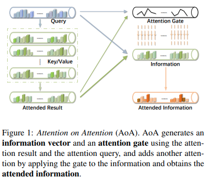
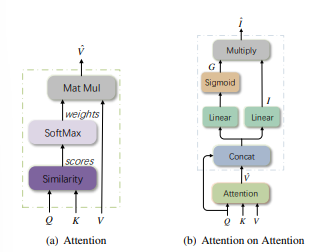
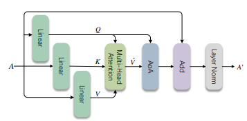
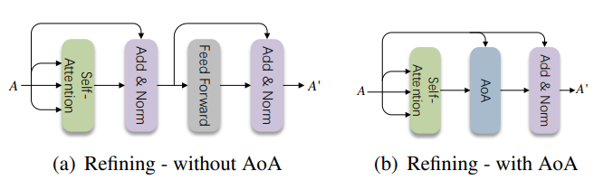
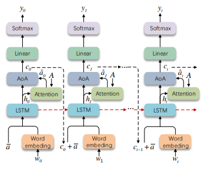
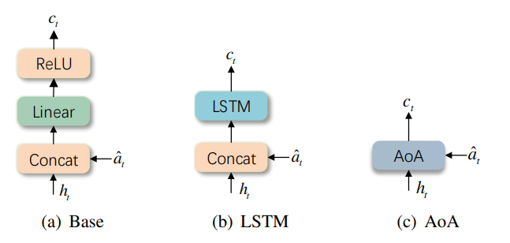

# Attention on Attention (AoA)

> Paper: **Attention on Attention for Image Captioning**
>
> Ziheng Huang, Xinghang Li, Xiaodan Liang, Lianwen Jin, Lei Wang
>
> ICCV 2019
>
> Paper: https://arxiv.org/abs/1908.06954

<p align="center">
    
</p>

---

# 1. Giới thiệu

Attention là thành phần trung tâm của các kiến trúc hiện đại như Transformer, Vision Transformer (ViT), Multimodal Transformer và Large Language Models.

Tuy nhiên, attention truyền thống chỉ giải quyết câu hỏi:

> **Where should the model attend?**

hay nói cách khác:

$$
Attention(Q,K,V)
$$

chỉ xác định vị trí thông tin cần truy xuất.

Sau khi attention sinh ra context vector:

$$
\hat V
$$

toàn bộ thông tin được chuyển tiếp đến tầng kế tiếp mà không có cơ chế đánh giá chất lượng của chính thông tin đó.

Trong bài báo *Attention on Attention for Image Captioning*, Huang et al. đề xuất một tầng xử lý mới:

$$
Attention \rightarrow Attention\ on\ Attention
$$

cho phép mô hình học thêm:

> **What information should be trusted and preserved?**

Ý tưởng này đưa thêm một cơ chế gating lên đầu ra attention và có thể xem là tiền thân của nhiều kiến trúc hiện đại như:

* GLU
* GEGLU
* SwiGLU
* Gated Attention Unit
* Attention Output Gating
* x-transformers `attn_on_attn`

---

# 2. Động cơ nghiên cứu

Attention truyền thống:

$$
\hat V = Attention(Q,K,V)
$$

được tính bởi:

$$
Attention(Q,K,V)= Softmax \left( \frac{QK^T}{\sqrt d} \right)V
$$

Trong đó:

* Query xác định điều cần tìm
* Key xác định vị trí thông tin
* Value chứa nội dung thực tế

Kết quả:

$$
\hat V
$$

là một weighted average của nhiều value vectors.

Vấn đề xuất hiện vì:

* Một số thành phần hữu ích
* Một số thành phần là nhiễu
* Một số thành phần không liên quan

nhưng attention không phân biệt được điều này.

```text
Attention
     │
     ▼
Weighted Average
     │
     ▼
Useful Information
+ Noise
+ Redundant Features
```

AoA được thiết kế để thực hiện thêm một bước lọc thông tin sau attention.

---

# 3. Ý tưởng Attention-on-Attention

## Attention truyền thống

```text
Q,K,V
  │
  ▼
Attention
  │
  ▼
Context Vector
```

---

## Attention on Attention

```text
Q,K,V
  │
  ▼
Attention
  │
  ▼
Context Vector
  │
  ▼
AoA Module
  │
  ▼
Refined Context
```

Attention đầu tiên trả lời:

```text
Where should I look?
```

AoA trả lời:

```text
What should I keep?
```

---

# 4. Kiến trúc toán học của AoA

Sau khi attention sinh ra:

$$
\hat V
$$

AoA ghép:

$$
[\hat V ; Q]
$$

trong đó:

$$
;
$$

là phép nối vector.

---

## Information Vector

AoA xây dựng một vector thông tin:

$$
I= W_I [\hat V;Q] + b_I
$$

trong đó:

$$
I
$$

đại diện cho nội dung ứng viên sẽ được truyền tiếp.

---

## Attention Gate

AoA đồng thời sinh một gate:

$$
G= \sigma ( W_G [\hat V;Q] + b_G )
$$

với:

$$
\sigma(x)= \frac1{1+e^{-x}}
$$

---

## Output

Đầu ra cuối cùng:

$$
AoA = I \odot G
$$

trong đó:

$$
\odot
$$

là phép nhân từng phần tử.

---

# 5. Minh họa cơ chế AoA

```text
               Attention
        ┌─────────────────────┐
Q ─────►│                     │
K ─────►│                     │────► V̂
V ─────►│                     │
        └─────────────────────┘
                     │
                     ▼
                  [V̂ ; Q]
                     │
         ┌───────────┴───────────┐
         ▼                       ▼

 Information Branch       Attention Gate
         │                       │
         ▼                       ▼

         I                    Sigmoid
                                 │
                                 ▼
                                 G

         └───────────┬───────────┘
                     ▼

                  I ⊙ G

                     │
                     ▼

                AoA Output
```

---

# 6. Figure 2 trong bài báo

Hình quan trọng nhất của bài báo mô tả sự khác biệt giữa Attention và AoA.

<p align="center">
    
</p>

**Figure 2. Attention and Attention-on-Attention** [1]

Quan sát:

### Attention

```text
Query
   │
   ▼
Similarity Scores
   │
   ▼
Weighted Sum
   │
   ▼
Context Vector
```

### AoA

```text
Context Vector
       +
Original Query
       │
       ▼
Information Vector

       +
Attention Gate

       │
       ▼
Element-wise Gating
```

AoA thực hiện thêm một tầng attention ngầm thông qua gating.

---

# 7. Liên hệ với GLU

AoA có dạng:

$$
AoA= I \odot G
$$

Trong khi GLU:

$$
GLU(X)= A(X) \odot \sigma(B(X))
$$

Dễ thấy:

```text
AoA = Attention + GLU
```

hay:

```text
Attention Output
      │
      ▼
Feature Selection
```

Điều này giải thích vì sao ý tưởng AoA xuất hiện lại trong các Transformer hiện đại.

---

# 8. AoA trong Image Encoder

Bài báo không áp dụng AoA trực tiếp lên ảnh gốc.

Thay vào đó:

* CNN trích xuất region features
* Self-Attention học quan hệ giữa các vùng
* AoA lọc lại biểu diễn

---

## Figure 4

<p align="center">
    
</p>

**Figure 4. Refining Module** [1]

---

### Kiến trúc

```text
Image Regions
       │
       ▼
Multi-Head Attention
       │
       ▼
AoA
       │
       ▼
Refined Features
```

Mục tiêu:

$$
f_i \rightarrow f_i'
$$

sao cho:

$$
f_i'
$$

mang nhiều thông tin ngữ nghĩa hơn.

---

# 9. Refining Module không dùng và dùng AoA

Figure 6 so sánh hai kiến trúc.

<p align="center">
    
</p>

**Figure 6. Refining Module w/o and w/ AoA** [1]

---

## Không dùng AoA

```text
Multi-Head Attention
         │
         ▼
      Output
```

---

## Dùng AoA

```text
Multi-Head Attention
         │
         ▼
        AoA
         │
         ▼
      Output
```

AoA đóng vai trò như một attention filter.

---

# 10. AoA Decoder

Trong caption decoder:

<p align="center">
    
</p>

**Figure 5. AoANet Decoder** [1]

---

## Kiến trúc

```text
Previous Words
       │
       ▼
      LSTM
       │
       ▼
Visual Attention
       │
       ▼
      AoA
       │
       ▼
Word Prediction
```

Trong đó:

Attention tìm vùng ảnh liên quan.

AoA quyết định:

$$
\text{Thông tin nào từ ảnh nên được sử dụng}
$$

để dự đoán từ tiếp theo.

---

# 11. Figure 7 – Các cách mô hình hóa Context

<p align="center">
    
</p>

**Figure 7. Different schemes for modeling context vector** [1]

Tác giả khảo sát nhiều cách xây dựng:

$$
c_t
$$

trước khi đưa vào decoder.

Kết quả cho thấy AoA consistently cải thiện chất lượng biểu diễn.

---

# 12. Liên hệ với Transformer hiện đại

AoA xuất hiện trước làn sóng GLU-based Transformers.

Ngày nay ý tưởng tương tự xuất hiện trong:

### GEGLU

$$
GEGLU= X \odot GELU(X)
$$

### SwiGLU

$$
SwiGLU= X \odot Swish(X)
$$

### PaLM

### LLaMA

### x-transformers

### Gated Attention Unit

Tư tưởng chung:

```text
Information Extraction
          +
Information Selection
```

thay vì chỉ:

```text
Information Extraction
```

---

# 13. AoA trong x-transformers

Lucidrains đã triển khai AoA trong thư viện x-transformers:

```python
Encoder(
    dim = 512,
    depth = 6,
    heads = 8,
    attn_on_attn = True
)
```

Tuy nhiên implementation hiện tại không hoàn toàn giống paper.

Theo tác giả repository:

> phiên bản gốc của AoA hoạt động chưa tốt trên bài toán ngôn ngữ.

Do đó x-transformers sử dụng một biến thể:

```text
Attention Output
        │
        ▼
GLU-style Gate
        │
        ▼
Refined Output
```

và bỏ phần nối trực tiếp query vào gate.

---

# 14. So sánh với Feed Forward Network

Transformer chuẩn:

```text
Attention
    │
    ▼
FFN
```

AoA:

```text
Attention
    │
    ▼
AoA
    │
    ▼
FFN
```

AoA đóng vai trò:

```text
Post-Attention Filtering
```

giúp attention output trở nên chọn lọc hơn trước khi đi vào FFN.

---

# 15. Độ phức tạp tính toán

Attention:

$$
O(n^2d)
$$

AoA:

$$
O(nd^2)
$$

Do chi phí attention chiếm ưu thế:

$$
O(n^2d) \gg O(nd^2)
$$

AoA chỉ tạo thêm overhead rất nhỏ.

---

# 16. Tổng kết

Attention-on-Attention là một cơ chế **gating sau attention** nhằm đánh giá lại thông tin mà attention vừa truy xuất.

Đóng góp quan trọng nhất của bài báo là chia quá trình attention thành hai giai đoạn:

### Information Retrieval

$$
Q,K,V \rightarrow \hat V
$$

---

### Information Selection

$$
\hat V \rightarrow AoA
$$

Tư tưởng này trở thành nền tảng cho nhiều kiến trúc hiện đại sử dụng gating trong Transformer và được xem là một trong những tiền thân của các biến thể:

* GLU
* GEGLU
* SwiGLU
* Gated Attention
* Attention Output Gating
* x-transformers Attention-on-Attention

---

# Tài liệu tham khảo

[1] Huang, Z., Li, X., Liang, X., Jin, L., Wang, L.
**Attention on Attention for Image Captioning.**
ICCV 2019.

[2] Vaswani et al.
**Attention Is All You Need.**
NeurIPS 2017.

[3] Shazeer.
**GLU Variants Improve Transformer.**
2020.

[4] lucidrains.
**x-transformers Repository.**
https://github.com/lucidrains/x-transformers
