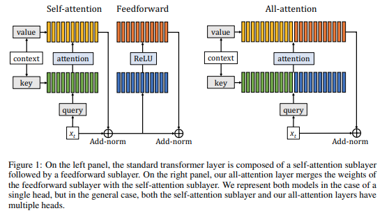

# Augmenting Self-attention with Persistent Memory 

<p align="center">
    
</p>


> Scientific Analysis of Persistent Memory Attention in Transformer Architectures

---

## 1. Tổng quan

Một trong những giả định quan trọng của kiến trúc Transformer là mọi tri thức cần thiết đều có thể được biểu diễn thông qua hai thành phần:

$$
\text{Transformer Block}=\text{Self-Attention} + \text{Feed Forward Network}
$$

trong đó:

* Self-Attention chịu trách nhiệm mô hình hóa quan hệ giữa các token.
* Feed Forward Network (FFN) chịu trách nhiệm lưu trữ và biến đổi tri thức bên trong mô hình.

Nghiên cứu **Augmenting Self-Attention with Persistent Memory** đặt ra câu hỏi:

> Liệu có thể đưa tri thức học được trực tiếp vào cơ chế Attention thay vì lưu trữ gián tiếp trong FFN hay không?

Từ đó tác giả đề xuất bổ sung một tập các **learnable memory key-value pairs** vào mỗi Attention layer.

---

## 2. Động cơ nghiên cứu

### 2.1 Giới hạn của Self-Attention

Attention tiêu chuẩn được định nghĩa bởi:

$$
A(Q,K,V)= Softmax \left( \frac{QK^T}{\sqrt d} \right)V
$$

Trong đó:

$$
Q,K,V \in \mathbb R^{n\times d}
$$

với:

* $n$: độ dài chuỗi
* $d$: chiều biểu diễn

Attention chỉ có thể truy xuất thông tin từ các token hiện diện trong chuỗi đầu vào.

Nó không có cơ chế lưu trữ tri thức toàn cục độc lập với ngữ cảnh hiện tại.

---

### 2.2 Vai trò của Feed Forward Network

Khối FFN được mô tả bởi:

$$
FFN(x)=W_2\sigma(W_1x)
$$

Thông thường số lượng tham số của FFN lớn hơn đáng kể so với Attention.

Trong các Transformer hiện đại:

$$
\text{Parameters}*{FFN} \gg \text{Parameters}*{Attention}
$$

Điều này dẫn tới giả thuyết:

FFN thực chất đang đóng vai trò như một hệ thống bộ nhớ hơn là một phép biến đổi phi tuyến đơn thuần.

---

## 3. Ý tưởng Persistent Memory

Thay vì chỉ sử dụng:

$$
K,V
$$

từ chuỗi đầu vào,

ta bổ sung:

$$
M_K \in \mathbb R^{m\times d}
$$

và

$$
M_V \in \mathbb R^{m\times d}
$$

với:

* (m): số memory slots
* (d): chiều biểu diễn

Các ma trận này được học thông qua backpropagation và tồn tại xuyên suốt quá trình huấn luyện.

---

## 4. Self-Attention chuẩn

Cho:

$$
Q,K,V
$$

ta tính:

### Attention Score

$$
S = \frac{QK^T}{\sqrt d}
$$

### Attention Distribution

$$
P=Softmax(S)
$$

### Output

$$
O=PV
$$

---

## 5. Persistent Memory Attention

Ta mở rộng tập key-value:

$$
K'=[K;M_K]
$$

$$
V'=[V;M_V]
$$

với:

$$
K' \in \mathbb R^{(n+m)\times d}
$$

$$
V' \in \mathbb R^{(n+m)\times d}
$$

Attention mới trở thành:

$$
O=softmax \left( \frac{QK'^T}{\sqrt d} \right) V'
$$

---

## 6. Kiến trúc tổng quát

```text
                    Query

                      │
                      ▼

         ┌────────────────────────┐
         │    Self Attention      │
         └────────────────────────┘
                    ▲
                    │

       ┌────────────┴────────────┐
       │                         │

   Sequence KV            Memory KV

       │                         │
       └────────────┬────────────┘
                    │

             Concatenation

                    │
                    ▼

           Attention Computation

                    │
                    ▼

                 Output
```

---

## 7. Diễn giải toán học

Trong Transformer chuẩn:

$$
QK^T
$$

đo độ tương đồng giữa Query và các token khác trong chuỗi.

Khi bổ sung Persistent Memory:

$$
Q[K;M_K]^T
$$

Query có thể đồng thời:

1. Truy xuất thông tin từ ngữ cảnh hiện tại.
2. Truy xuất thông tin từ bộ nhớ toàn cục.

Do đó Attention trở thành:

$$
\text{Context Retrieval} + \text{Memory Retrieval}
$$

---

## 8. Memory như một Knowledge Base

Các memory vectors:

$$
M_K={m_1,m_2,\dots,m_m}
$$

được chia sẻ cho mọi sequence.

Không phụ thuộc vào:

* Batch hiện tại
* Token hiện tại
* Độ dài chuỗi

Vì vậy chúng có thể học các mẫu thống kê xuất hiện nhiều lần trong tập dữ liệu huấn luyện.

---

## 9. Quan hệ với Feed Forward Network

FFN:

$$
FFN(x)= W_2\sigma(W_1x)
$$

có thể được diễn giải như một hệ thống memory lookup.

Ma trận:

$$
W_1
$$

hoạt động tương tự key memory.

Trong khi:

$$
W_2
$$

hoạt động tương tự value memory.

Do đó:

$$
FFN \approx \text{Key-Value Memory}
$$

---

## 10. Loại bỏ FFN

Một kết quả đáng chú ý của bài báo là:

Transformer chỉ sử dụng:

```text
Self-Attention + Persistent Memory
```

có thể đạt hiệu năng gần tương đương:

```text
Self-Attention + Feed Forward Network
```

Điều này cung cấp bằng chứng rằng khả năng lưu trữ tri thức của FFN có thể được thay thế một phần bởi bộ nhớ attention.

---

## 11. Kết hợp FFN và Persistent Memory

Trong thực tế, hiệu quả tốt nhất thường đạt được khi sử dụng:

```text
Self Attention + Persistent Memory + Feed Forward Network
```

Thay vì thay thế hoàn toàn FFN.

Điều này cho phép:

* FFN thực hiện biến đổi phi tuyến cục bộ.
* Memory thực hiện lưu trữ tri thức toàn cục.

---

## 12. Độ phức tạp tính toán

### Self-Attention chuẩn

$$
O(n^2)
$$

---

### Persistent Memory Attention

$$
O(n(n+m))
$$

Trong đó:

$$
m \ll n
$$

Ví dụ:

$$
n=4096
$$

$$
m=16
$$

Chi phí bổ sung là rất nhỏ.

---

## 13. Phân tích theo lý thuyết biểu diễn

Attention chuẩn:

$$
f(x)= \sum_i \alpha_i v_i
$$

chỉ biểu diễn tổ hợp tuyến tính của các token trong chuỗi.

Persistent Memory mở rộng không gian biểu diễn thành:

$$
f(x)= \sum_i \alpha_i v_i + \sum_j \beta_j m_j
$$

trong đó:

$$
m_j
$$

là các vector bộ nhớ học được.

Không gian biểu diễn của mô hình do đó lớn hơn đáng kể.

---

## 14. So sánh với các kiến trúc Memory khác

| Architecture            | Memory Type               |
| ----------------------- | ------------------------- |
| Transformer             | None                      |
| Relative Attention      | Positional Memory         |
| Transformer-XL          | Segment Memory            |
| Compressive Transformer | Compressed Memory         |
| Memorizing Transformer  | External Retrieval Memory |
| RETRO                   | Database Retrieval        |
| Persistent Memory       | Learned Global Memory     |

---

## 15. Triển khai trong x-transformers

Trong thư viện x-transformers:

```python
from x_transformers import Encoder

enc = Encoder(
    dim = 512,
    depth = 6,
    heads = 8,
    attn_num_mem_kv = 16
)
```

Tham số:

```python
attn_num_mem_kv = 16
```

sinh ra:

$$
16
$$

memory keys

và

$$
16
$$

memory values

cho mỗi Attention layer.

---

## 16. Vai trò trong sự tiến hóa của Transformer

Persistent Memory là một trong những bước đầu tiên đưa khái niệm bộ nhớ trực tiếp vào cơ chế Attention.

Quá trình phát triển có thể được xem như:

$$
\text{Attention} \rightarrow \text{Attention + Persistent Memory} \rightarrow \text{Retrieval Attention} \rightarrow \text{External Memory Systems} \rightarrow \text{Modern Long-Context LLMs}
$$

Nó tạo nền tảng lý thuyết cho các nghiên cứu sau này về:

* Retrieval-Augmented Models
* External Memory Networks
* Long Context Transformers
* Memory-Augmented LLMs

---

## 17. Ưu điểm

### Truy xuất tri thức toàn cục

Memory được chia sẻ giữa mọi chuỗi dữ liệu.

### Chi phí thấp

Chỉ bổ sung:

$$
O(nm)
$$

với:

$$
m \ll n
$$

### Dễ tích hợp

Không thay đổi công thức Attention cơ bản.

### Tăng năng lực biểu diễn

Attention có khả năng truy xuất tri thức học được trực tiếp.

### Tương thích với mọi biến thể Transformer

* Encoder
* Decoder
* Encoder-Decoder
* Sparse Attention
* Linear Attention

---

## 18. Hạn chế

Memory là bộ nhớ tĩnh:

$$
M_K,M_V= \text{constant after training}
$$

Do đó:

* Không cập nhật theo ngữ cảnh.
* Không ghi nhớ dài hạn theo phiên làm việc.
* Không thể lưu trữ tài liệu bên ngoài.

Đây là lý do các nghiên cứu sau phát triển:

* Retrieval-Augmented Generation (RAG)
* RETRO
* Memorizing Transformer
* Recurrent Memory Transformer
* External Memory Networks

---

## 19. Kết luận

Persistent Memory Attention mở rộng Self-Attention bằng cách bổ sung một tập các memory key-value được học:

$$
K'=[K;M_K]
$$

$$
V'=[V;M_V]
$$

Từ góc nhìn lý thuyết, cơ chế này biến Attention từ một bộ tổng hợp ngữ cảnh thành một hệ thống:

$$
\text{Context Retrieval} + \text{Knowledge Retrieval}
$$

Sự kết hợp giữa Self-Attention và Persistent Memory là một bước quan trọng trong quá trình tiến hóa từ Transformer nguyên thủy đến các kiến trúc bộ nhớ hiện đại được sử dụng trong các hệ thống LLM quy mô lớn ngày nay.
