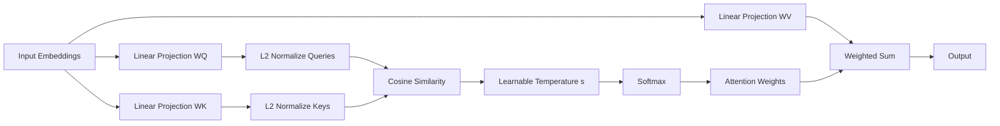
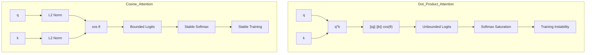
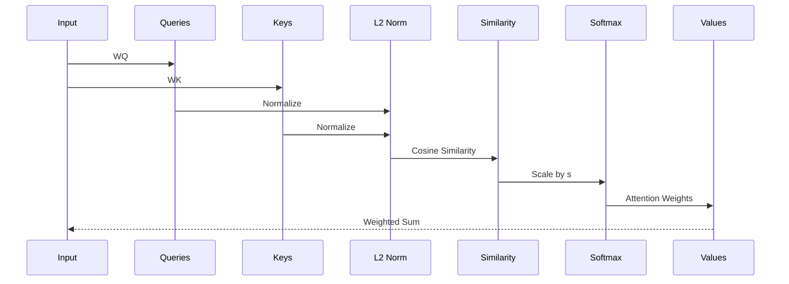
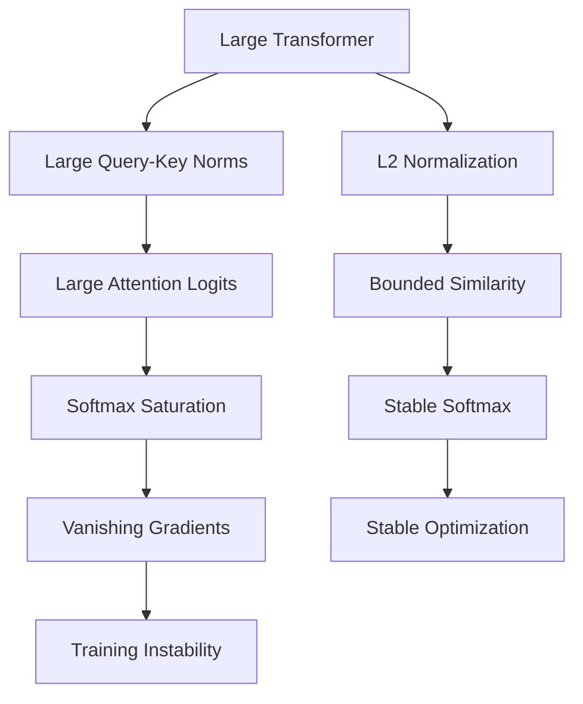
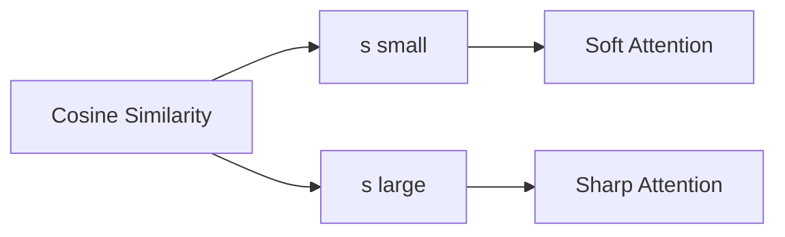
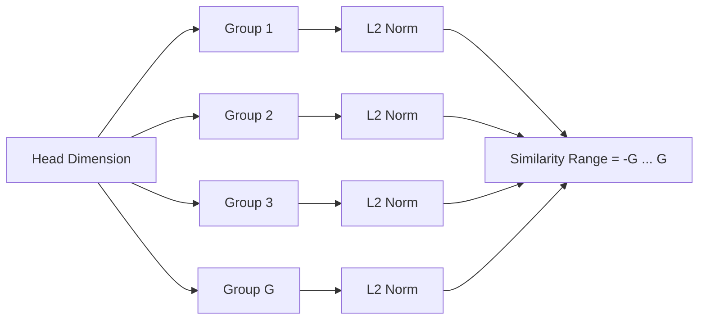
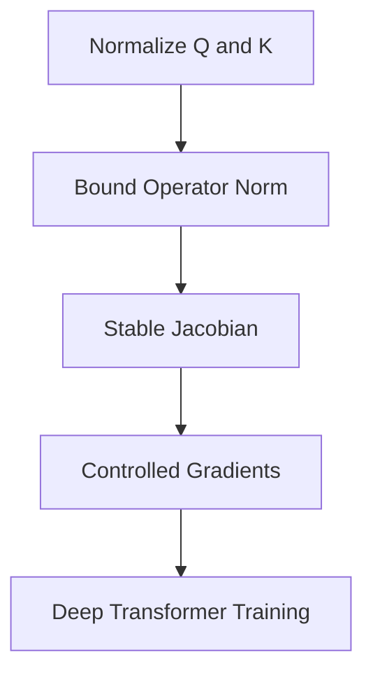
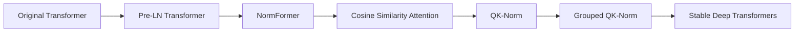
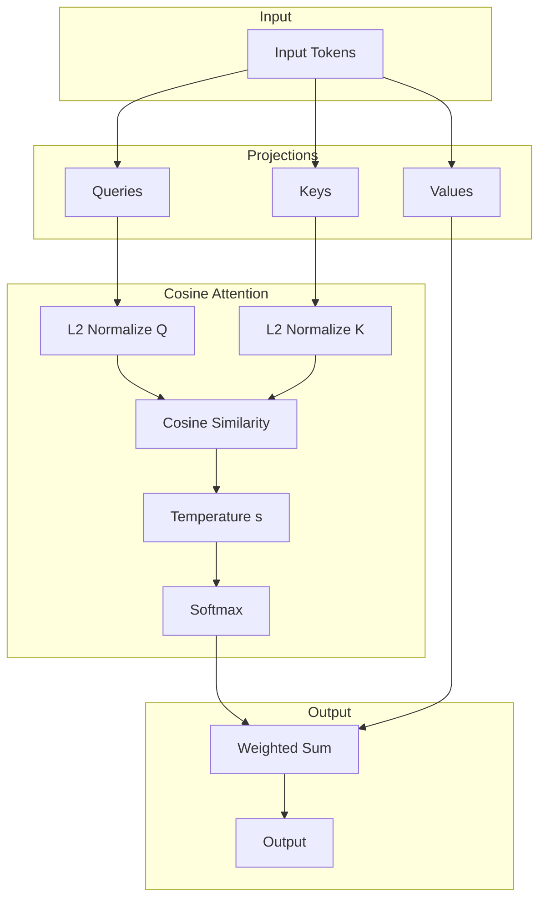
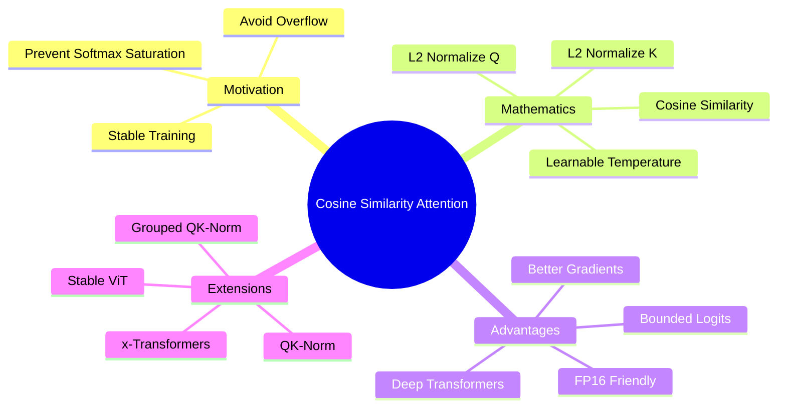

# Cosine Similarity Attention - Overview

> Tổng quan kiến trúc, nguyên lý toán học, cơ chế ổn định số học và vị trí của **Cosine Similarity Attention (QK-Norm Attention)** trong họ kiến trúc x-Transformers.

---

# 1. Big Picture



---

# 2. Core Mathematical Idea

Transformer chuẩn:

```math
\mathrm{Attention}(Q,K,V) = \mathrm{Softmax} \left( \frac{QK^T}{\sqrt d} \right)V
```

Cosine Similarity Attention:

```math
\mathrm{Attention}(Q,K,V) = \mathrm{Softmax} \left( s\hat Q\hat K^T \right)V
```

với

```math
\hat q = \frac{q}{\|q\|_2}, \qquad \hat k = \frac{k}{\|k\|_2}
```

---

# 3. Geometric Interpretation

Attention score trở thành:

```math
\hat q^T\hat k = \cos\theta
```

Do đó:

```math
-1 \le \cos\theta \le 1
```

attention score luôn bị chặn.

---

# 4. Dot Product vs Cosine Similarity



---

# 5. Information Flow



---

# 6. Why Does It Work?



---

# 7. Numerical Stability

## Standard Attention

```math
q^Tk = \|q\| \|k\| \cos\theta
```

Range:

```math
(-\infty,+\infty)
```

---

## Cosine Attention

```math
\hat q^T\hat k = \cos\theta
```

Range:

```math
[-1,1]
```

---

## Grouped QK-Norm

```math
-G \le \hat q^T\hat k \le G
```

---

# 8. Role of Temperature



---

# 9. Grouped QK Normalization



---

# 10. Spectral View



---

# 11. Computational Complexity

| Method                      | Time   | Memory |
| --------------------------- | ------ | ------ |
| Dot Product Attention       | O(n²d) | O(n²)  |
| Cosine Similarity Attention | O(n²d) | O(n²)  |

Additional cost:

```math
O(nd)
```

for L2 normalization.

---

# 12. Position in x-Transformers



---

# 13. Complete Architecture



---

# 14. Summary



---

# Key Equation

```math
\boxed{ \mathrm{Attention}(Q,K,V) = \mathrm{Softmax} \left( s\hat Q\hat K^T \right)V }
```

Cosine Similarity Attention biến attention từ phép đo phụ thuộc vào **độ lớn vector** thành phép đo phụ thuộc vào **góc giữa các vector**, từ đó cải thiện đáng kể độ ổn định số học và khả năng mở rộng của Transformer quy mô lớn.
