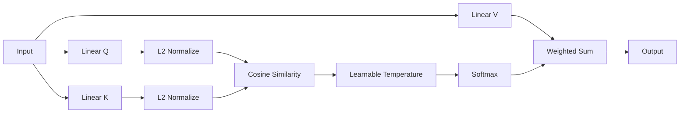
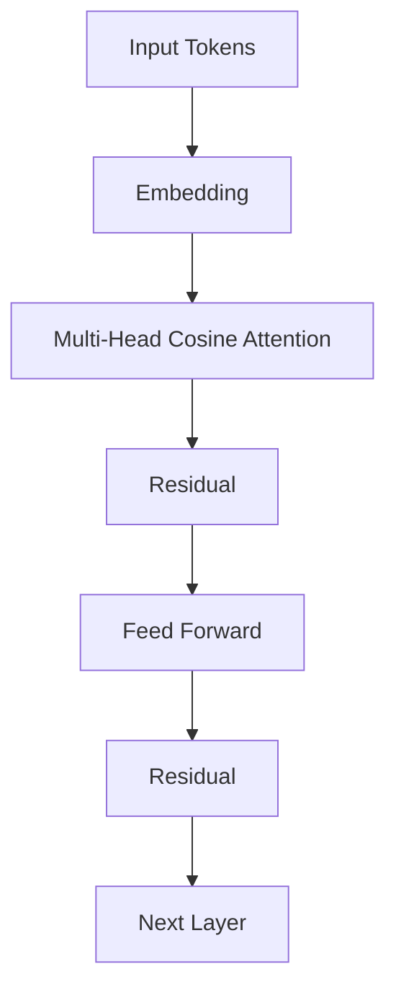

# Cosine Similarity Attention (QK-Norm Attention)

> Stable Attention via L2-Normalized Queries and Keys

---

# 1. Giới thiệu

**Cosine Similarity Attention** (hay còn gọi là **QK-Normalization Attention**) là một biến thể của Scaled Dot-Product Attention, trong đó:

1. Vector **Query** và **Key** được chuẩn hóa L2 trước khi tính attention.
2. Hệ số scale `1/√d` được thay bằng một **nhiệt độ học được (learnable temperature)** hoặc một hằng số cố định.

Phương pháp này được đề xuất nhằm giải quyết hai vấn đề cố hữu của Transformer:

* Attention logits phát triển quá lớn khi kích thước embedding tăng.
* Softmax dễ bị bão hòa (softmax saturation), dẫn đến:

  * gradient biến mất,
  * huấn luyện không ổn định,
  * overflow trong mixed precision.

Ý tưởng cốt lõi:

```math
\text{Attention}(Q,K,V) = \text{Softmax} \left( s \cdot \hat Q \hat K^T \right)V
```

với:

```math
\hat Q_i=\frac{Q_i}{\|Q_i\|_2}, \qquad \hat K_j=\frac{K_j}{\|K_j\|_2}
```

và

```math
s
```

là tham số nhiệt độ học được.

---

# 2. Động cơ khoa học

## 2.1 Vấn đề của Dot-Product Attention

Scaled Dot-Product Attention:

```math
A= \text{Softmax} \left( \frac{QK^T}{\sqrt d} \right)
```

giả định:

```math
q_i,k_i \sim \mathcal N(0,1)
```

khi đó:

```math
Var(q^Tk)=d
```

nên cần chia cho:

```math
\sqrt d
```

để giữ phương sai ổn định.

Tuy nhiên trong thực tế:

* Q và K không còn Gaussian.
* Norm của vector tăng theo quá trình huấn luyện.
* Một vài token có thể tạo ra logits cực lớn:

```math
q^Tk \gg 100
```

dẫn tới:

```math
\exp(q^Tk)\rightarrow\infty
```

và:

```math
\text{Softmax}(x) \rightarrow \text{One-Hot}
```

Gradient gần như biến mất:

```math
\frac{\partial \text{Softmax}}{\partial x} \approx 0
```

---

## 2.2 Nguyên nhân sâu xa

Dot-product phụ thuộc vào:

```math
q^Tk = \|q\| \|k\| \cos\theta
```

Attention score bị ảnh hưởng bởi:

1. độ lớn vector;
2. góc giữa vector.

Trong khi điều Transformer thực sự cần là:

> mức độ tương đồng ngữ nghĩa.

Tức là:

```math
\cos\theta
```

chứ không phải:

```math
\|q\| \|k\|
```

---

# 3. Cosine Similarity Attention

Chuẩn hóa:

```math
\hat q = \frac{q}{\|q\|_2}
```

```math
\hat k = \frac{k}{\|k\|_2}
```

Attention score:

```math
a_{ij} = \hat q_i^T \hat k_j = \cos(\theta_{ij})
```

nên:

```math
-1 \le a_{ij} \le 1
```

Attention logits luôn bị chặn.

---

# 4. Learnable Temperature

Do cosine similarity nằm trong:

```math
[-1,1]
```

nên attention có thể quá phẳng.

Thêm tham số:

```math
s
```

ta được:

```math
a_{ij} = s \cdot \cos(\theta_{ij})
```

Attention:

```math
A= \text{Softmax} (s\hat Q\hat K^T)
```

Nếu:

```math
s \uparrow
```

attention sắc nét hơn.

Nếu:

```math
s \downarrow
```

attention mềm hơn.

---

# 5. Công thức đầy đủ

## Bước 1

```math
Q=XW_Q
```

```math
K=XW_K
```

```math
V=XW_V
```

---

## Bước 2

```math
\hat Q = \frac{Q} {\|Q\|_2}
```

```math
\hat K = \frac{K} {\|K\|_2}
```

---

## Bước 3

```math
L = s \hat Q \hat K^T
```

---

## Bước 4

```math
A= \text{Softmax}(L)
```

---

## Bước 5

```math
Y=AV
```

---

# 6. Thuật toán

```text
Input:
    X

Q = XWQ
K = XWK
V = XWV

Q = L2Normalize(Q)
K = L2Normalize(K)

Scores = s · QKᵀ

A = Softmax(Scores)

Output = AV
```

---

# 7. Grouped QK Normalization

Thay vì:

```math
\|q\|_2
```

trên toàn bộ head dimension, chia thành:

```math
G
```

nhóm:

```math
q= [q^{(1)}, q^{(2)}, \dots, q^{(G)}]
```

Mỗi nhóm được chuẩn hóa riêng:

```math
\hat q^{(g)} = \frac {q^{(g)}} {\|q^{(g)}\|}
```

Khi đó:

```math
-G \le \hat q^T\hat k \le G
```

Độ sắc của attention được kiểm soát bởi:

```math
G
```

mà không cần temperature học được.

---

# 8. Vì sao Cosine Attention ổn định hơn?

## Dot Product

```math
q^Tk = \|q\| \|k\| \cos\theta
```

Logits:

```math
(-\infty,+\infty)
```

---

## Cosine Attention

```math
\cos\theta
```

Logits:

```math
[-1,1]
```

hoặc:

```math
[-G,G]
```

Gradient luôn được kiểm soát.

Không cần:

* clipping;
* logit capping;
* softmax stabilization phức tạp.

---

# 9. Phân tích phổ (Spectral Analysis)

Cosine normalization:

```math
\|q\|=1
```

```math
\|k\|=1
```

suy ra:

```math
\|QK^T\|_2
```

được chặn.

Do đó:

* Jacobian ổn định hơn;
* giảm exploding gradient;
* giảm gradient noise;
* phù hợp với Transformer rất sâu.

---

# 10. Quan hệ với Sparse Distributed Memory

Cosine similarity gần với cơ chế:

* Associative Memory
* Hopfield Network
* Sparse Distributed Memory của Pentti Kanerva.

Attention trở thành:

> tìm kiếm bộ nhớ theo góc giữa các vector.

Thay vì:

> tìm kiếm theo độ lớn vector.

---

# 11. Độ phức tạp

### Thời gian

```math
O(n^2d)
```

### Bộ nhớ

```math
O(n^2)
```

Giống hoàn toàn Dot-Product Attention.

Chi phí thêm:

```math
O(nd)
```

cho phép chuẩn hóa L2.

---

# 12. Ưu điểm

* ổn định số học;
* loại bỏ overflow;
* hoạt động tốt với fp16/bf16;
* gradient mượt hơn;
* huấn luyện mô hình rất lớn dễ dàng hơn;
* không cần logit clipping;
* phù hợp với deep transformer.

---

# 13. Nhược điểm

* attention có thể quá phẳng;
* cần temperature hoặc Grouped-QK;
* với head dimension nhỏ có thể giảm biểu diễn.

---

# 14. Vị trí trong x-Transformers

```text
Transformer
        ↓
Pre-LN Transformer
        ↓
NormFormer
        ↓
Cosine Similarity Attention
        ↓
QK-Norm
        ↓
Grouped QK-Norm
        ↓
Stable Deep Transformers
```

---

# 15. Kiến trúc tổng quát



---

# 16. Pipeline trong x-Transformer



---

# 17. Tóm tắt

Cosine Similarity Attention thay thế:

```math
QK^T
```

bằng:

```math
\frac{Q}{\|Q\|} \frac{K^T}{\|K\|}
```

nhằm:

1. loại bỏ sự phụ thuộc vào norm của vector;
2. giữ attention logits bị chặn;
3. cải thiện ổn định số học;
4. hỗ trợ huấn luyện Transformer quy mô rất lớn;
5. tạo nền tảng cho các biến thể hiện đại như:

* QK-Norm,
* Grouped QK-Norm,
* Stable Transformer,
* Deep Vision Transformer,
* x-Transformers.

```

---

# Tài liệu tham khảo

1. Henry et al., **Query-Key Normalization for Transformers**, 2020.
2. Wang et al., **CosFormer**, 2021.
3. Liu et al., **Swin Transformer V2**, 2021.
4. Dehghani et al., **Scaling Vision Transformers to 22 Billion Parameters**, 2023.
5. Karras et al., **Analyzing and Improving the Training Dynamics of Diffusion Models**, 2023.
6. lucidrains, **x-transformers repository**.

https://arxiv.org/pdf/2111.05498

https://www.youtube.com/watch?v=THIIk7LR9_8
```
