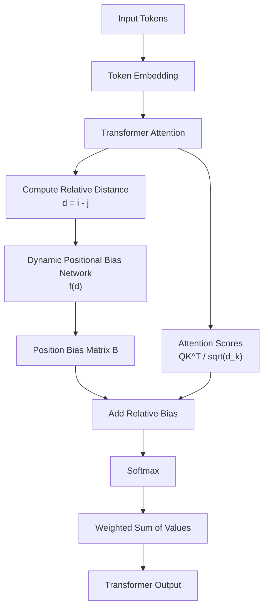
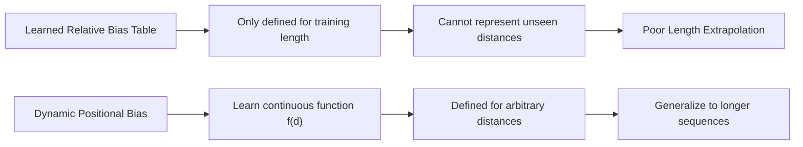
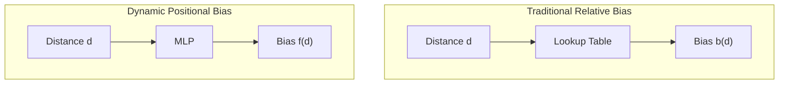
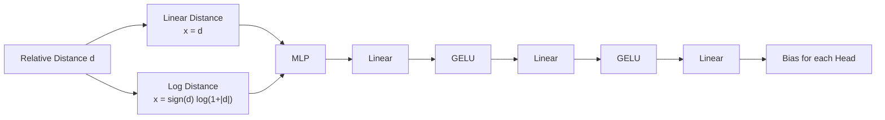
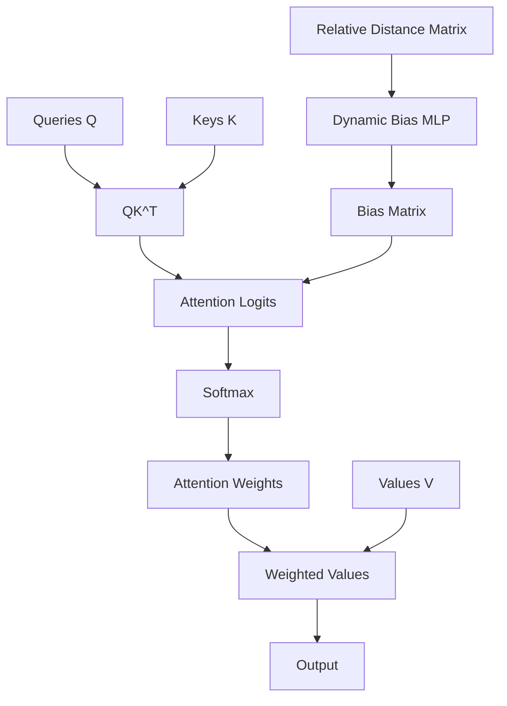
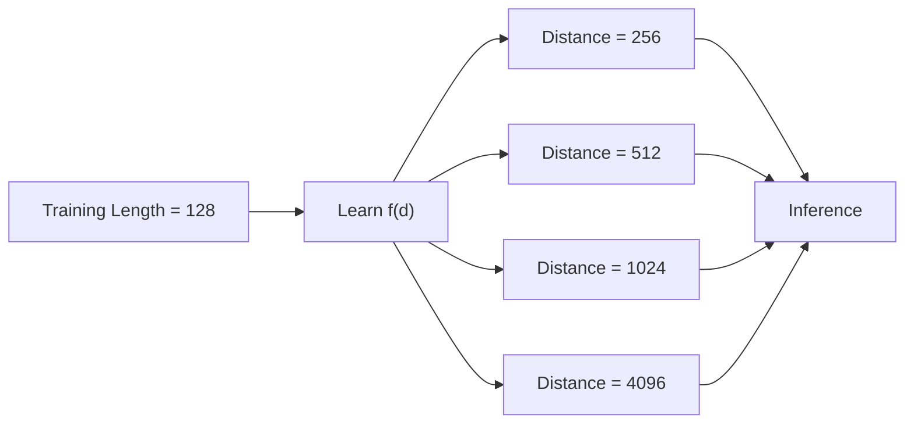
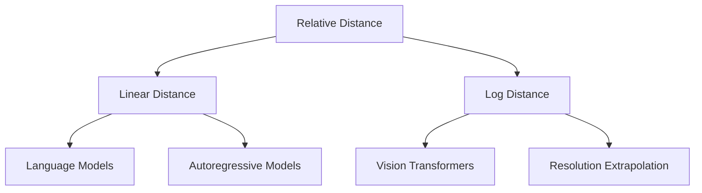
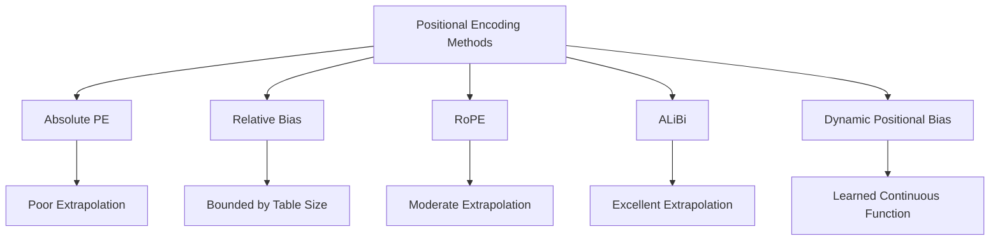
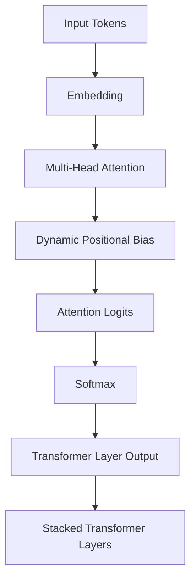
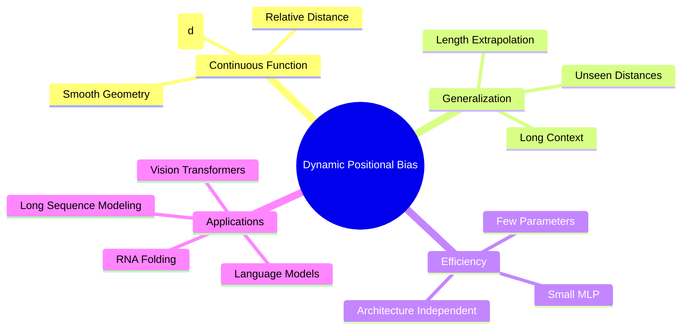

# Dynamic Positional Bias (DPB) - Overview

> Học một hàm liên tục của khoảng cách tương đối nhằm cải thiện khả năng ngoại suy chiều dài (Length Extrapolation) của Transformer.

---

# 1. Big Picture



---

# 2. Motivation



---

# 3. Relative Bias vs Dynamic Bias



---

# 4. Dynamic Bias Network



---

# 5. Mathematical Pipeline

```text
Relative Distance
        d = i - j
             |
             v
       Distance Encoding
             |
             v
      x = d
      or
      x = sign(d) log(1+|d|)
             |
             v
           MLP
             |
             v
        b(d)=f(d)
             |
             v
Attention Logits:
QK^T / sqrt(d_k) + b(d)
             |
             v
          Softmax
             |
             v
        Attention Output
```

---

# 6. Attention Architecture



---

# 7. Length Extrapolation



---

# 8. Linear vs Log Distance



---

# 9. Comparison with Other Positional Methods



---

# 10. DPB inside x-Transformers



---

# 11. Scientific Interpretation



---

# 12. Key Takeaway

```text
Traditional Relative Bias
        |
        +--> Learn a finite table b(d)
        |
        +--> Limited by training length

Dynamic Positional Bias
        |
        +--> Learn a continuous function f(d)
        |
        +--> Generalize to arbitrary distances
        |
        +--> Enable long-context modeling
        |
        +--> Strong positional inductive bias
```
