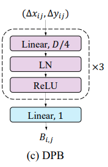

# Dynamic Positional Bias (DPB)

> Học hàm vị trí tương đối liên tục cho khả năng ngoại suy chiều dài trong Transformer.

<p align="center">
  
</p>

---

# 1. Giới thiệu

Thông tin vị trí là thành phần thiết yếu trong kiến trúc Transformer vì cơ chế self-attention vốn bất biến theo phép hoán vị (permutation invariant). Các phương pháp đầu tiên như **Sinusoidal Positional Encoding** và **Learned Absolute Positional Embedding** đưa thông tin vị trí trực tiếp vào biểu diễn của token. Tuy nhiên, các phương pháp này thường không tổng quát hóa tốt khi chiều dài chuỗi suy luận lớn hơn đáng kể so với chiều dài huấn luyện.

Các phương pháp vị trí tương đối (Relative Positional Methods) cải thiện hạn chế trên bằng cách mã hóa khoảng cách giữa các cặp token. Tuy nhiên, hầu hết các phương pháp Relative Position Bias truyền thống vẫn dựa trên một bảng tra cứu hữu hạn và do đó không thể ngoại suy tới những khoảng cách chưa từng xuất hiện trong quá trình huấn luyện.

**Dynamic Positional Bias (DPB)** giải quyết vấn đề này bằng cách học một **hàm liên tục của khoảng cách tương đối** thay vì lưu trữ một giá trị bias rời rạc cho từng cặp vị trí.

Ý tưởng này ban đầu được phát triển nhằm giải quyết bài toán tổng quát hóa độ phân giải trong Vision Transformer, sau đó được chứng minh là hoạt động hiệu quả cho:

* Mô hình ngôn ngữ (Language Models)
* Mô hình sinh học phân tử (Biological Sequence Modeling)
* Các bài toán ngữ cảnh dài (Long-Context Modeling)

---

# 2. Động cơ nghiên cứu

Relative Position Bias truyền thống sử dụng một bảng:

$$
B \in \mathbb{R}^{2L-1}
$$

trong đó:

$$
B_{ij}=B(i-j).
$$

Bảng này chỉ được định nghĩa cho:

$$
|i-j|\le L.
$$

Nếu trong giai đoạn suy luận:

$$
|i-j|>L,
$$

mô hình chưa từng học các mối quan hệ vị trí này.

Hệ quả:

* khả năng ngoại suy chiều dài kém;
* phải huấn luyện lại khi tăng chiều dài ngữ cảnh;
* thông tin vị trí phụ thuộc trực tiếp vào độ dài huấn luyện.

---

# 3. Ý tưởng cốt lõi

Thay vì học một bảng:

$$
b(d),
$$

DPB học một hàm liên tục:

$$
f_\theta(d),
$$

trong đó:

$$
d=i-j
$$

là khoảng cách tương đối giữa hai token.

Bias vị trí được tính bằng:

$$
B_{ij}=f_\theta(i-j).
$$

Attention logits trở thành:

$$
A_{ij}= \frac{Q_iK_j^\top}{\sqrt{d_k}} + f_\theta(i-j).
$$

Do:

$$
f_\theta
$$

được định nghĩa trên toàn bộ miền khoảng cách nên mô hình có thể xử lý các khoảng cách chưa từng xuất hiện trong quá trình huấn luyện.

---

# 4. Kiến trúc tổng quát

```text
Khoảng cách tương đối d = i - j
                |
                v
     Biến đổi Linear hoặc Log
                |
                v
             MLP nhỏ
                |
                v
     Bias cho từng Attention Head
                |
                v
      Cộng vào Attention Logits
```

---

# 5. Công thức toán học

## Bước 1: Tính khoảng cách tương đối

$$
d=i-j
$$

---

## Bước 2: Mã hóa khoảng cách

### Khoảng cách tuyến tính

$$
x=d
$$

### Khoảng cách logarit

$$
x= Sign (d) \log(1+|d|)
$$

Biến đổi logarit được đề xuất trong SwinV2 nhằm cải thiện khả năng tổng quát hóa sang độ phân giải lớn hơn.

---

## Bước 3: Mạng sinh bias động

Mạng sinh bias là một MLP nhỏ:

$$
h_1= \phi(W_1x+b_1)
$$

$$
h_2= \phi(W_2h_1+b_2)
$$

$$
b(d)= W_3h_2+b_3
$$

trong đó:

$$
\phi(\cdot)= \text{GELU}.
$$

Đầu ra là:

$$
b(d)\in\mathbb{R}^{H},
$$

với:

$$
H
$$

là số lượng attention head.

---

# 6. Attention với Dynamic Positional Bias

Ma trận attention cuối cùng:

$$
A= Softmax \left( \frac{QK^\top}{\sqrt{d_k}} + B \right).
$$

DPB chỉ thay đổi attention logits và không làm thay đổi biểu diễn token.

---

# 7. Tại sao DPB có khả năng ngoại suy?

Relative Position Bias truyền thống học:

$$
b(d)= \text{bảng tra cứu}.
$$

Biểu diễn chỉ tồn tại trong miền đã huấn luyện.

Ngược lại, DPB học:

$$
b(d)=f_\theta(d),
$$

là một hàm liên tục.

Do đó, nếu mô hình được huấn luyện với:

```text
Chiều dài huấn luyện = 128
```

thì mô hình vẫn có thể tính:

```text
Khoảng cách = 512
Khoảng cách = 1024
Khoảng cách = 4096
```

mà không cần thêm tham số mới.

Đây chính là khả năng:

> **Length Extrapolation**.

---

# 8. Linear Distance và Log Distance

## Linear Distance

$$
x=d
$$

Ưu điểm:

* bảo toàn cấu trúc metric thực;
* phù hợp cho mô hình ngôn ngữ;
* hiệu quả trong sinh tự hồi quy.

Các thực nghiệm của Eric Engelhart cho thấy:

```text
Linear Distance > Log Distance
```

đối với bài toán NLP.

---

## Log Distance

$$
x= Sign(d) \log(1+|d|)
$$

Ưu điểm:

* nén các khoảng cách lớn;
* cải thiện khả năng tổng quát hóa độ phân giải;
* phù hợp cho Vision Transformer.

Biến thể này được sử dụng trong:

* SwinV2
* CrossFormer

---

# 9. So sánh với các phương pháp mã hóa vị trí khác

| Phương pháp             | Tương đối | Ngoại suy  | Số tham số |
| ----------------------- | --------- | ---------- | ---------- |
| Sinusoidal              | Không     | Hạn chế    | 0          |
| Learned Absolute        | Không     | Kém        | O(Ld)      |
| Relative Bias           | Có        | Không      | O(L)       |
| RoPE                    | Có        | Trung bình | 0          |
| ALiBi                   | Có        | Rất tốt    | 0          |
| Dynamic Positional Bias | Có        | Rất tốt    | O(MLP)     |

---

# 10. So sánh với ALiBi

ALiBi sử dụng:

$$
b(d)=m_hd.
$$

DPB sử dụng:

$$
b(d)=f_\theta(d).
$$

Do đó:

```text
ALiBi : thiên kiến tuyến tính cố định
DPB   : thiên kiến được học
```

DPB có khả năng biểu diễn mạnh hơn.

---

# 11. So sánh với RoPE

RoPE biến đổi:

$$
Q,K \rightarrow R(d)Q, R(d)K.
$$

Trong khi đó DPB thực hiện:

$$
QK^\top \rightarrow QK^\top+f_\theta(d).
$$

Ưu điểm của DPB:

* triển khai đơn giản;
* độc lập với kiến trúc attention;
* dễ mở rộng;
* hỗ trợ ngữ cảnh dài.

---

# 12. Độ phức tạp tính toán

Chi phí attention:

$$
O(N^2).
$$

Chi phí của MLP:

$$
O(1)
$$

cho mỗi khoảng cách.

Do đó:

$$
O(N^2)
$$

vẫn là độ phức tạp tổng thể của mô hình.

---

# 13. Sử dụng trong x-transformers

```python
from x_transformers import TransformerWrapper, Decoder

model = TransformerWrapper(
    num_tokens = 256,
    max_seq_len = 1024,
    attn_layers = Decoder(
        dim = 512,
        depth = 6,
        heads = 8,
        dynamic_pos_bias = True,
        dynamic_pos_bias_log_distance = False
    )
)
```

Đối với mô hình ngôn ngữ:

```python
dynamic_pos_bias=True
dynamic_pos_bias_log_distance=False
```

Đối với Vision Transformer:

```python
dynamic_pos_bias=True
dynamic_pos_bias_log_distance=True
```

---

# 14. Luồng thông tin tổng quát

```text
Input Tokens
      |
      v
Embedding
      |
      v
Tính Q, K, V
      |
      +--------------------+
      |                    |
      v                    |
Khoảng cách tương đối      |
      |                    |
      v                    |
MLP sinh Bias động         |
      |                    |
      v                    |
Ma trận Bias vị trí        |
      +--------------------+
               |
               v
      Attention Logits
               |
               v
            Softmax
               |
               v
        Weighted Values
               |
               v
      Transformer Output
```

---

# 15. Diễn giải khoa học

Dynamic Positional Bias giả định rằng:

$$
\text{Mức độ tương tác}= f(\text{Khoảng cách tương đối}),
$$

trong đó:

$$
f
$$

là một hàm liên tục thay vì một bảng rời rạc.

Giả định này mang lại:

1. khả năng ngoại suy chiều dài;
2. thiên kiến hình học liên tục;
3. hiệu quả tham số cao;
4. khả năng tổng quát hóa tốt đối với ngữ cảnh dài.

DPB đã chứng minh hiệu quả trong:

* mô hình ngôn ngữ;
* Vision Transformer;
* dự đoán cấu trúc RNA;
* mô hình hóa chuỗi dài.

---

# Tài liệu tham khảo

```bibtex
@article{liu2021swinv2,
  title={Swin Transformer V2: Scaling Up Capacity and Resolution},
  author={Liu, Ze and others},
  journal={arXiv preprint arXiv:2111.09883},
  year={2021}
}

@article{wang2021crossformer,
  title={CrossFormer: A Versatile Vision Transformer Based on Cross-Scale Attention},
  author={Wang, Wenxiao and others},
  journal={arXiv preprint arXiv:2108.00154},
  year={2021}
}

@misc{foster2022dynamicpositionbias,
  title={Dynamic Positional Bias for Language Models},
  author={Charles Foster},
  year={2022},
  howpublished={GitHub}
}

@misc{engelhart2022investigating,
  title={Investigating Length Extrapolation of Dynamic Position Bias},
  author={Eric Engelhart},
  year={2022},
  howpublished={GitHub}
}

@misc{xtransformers,
  title={x-transformers},
  author={Phil Wang},
  year={2024},
  url={https://github.com/lucidrains/x-transformers}
}

https://www.kaggle.com/competitions/stanford-ribonanza-rna-folding/writeups/vigg-1st-place-solution-transformer-model-with-dyn
```
