# Enhanced Recurrence in x-Transformers: Overview

> **Core Idea**

```math
M_l^{(t)} = SG \left( H_{l+s}^{(t-1)} \right)
```

instead of

```math
M_l^{(t)} = SG \left( H_l^{(t-1)} \right)
```

where:

* $H_l^{(t-1)}$: hidden states của đoạn trước,
* $M_l^{(t)}$: bộ nhớ của đoạn hiện tại,
* $s$: số tầng dịch bộ nhớ xuống,
* $SG$: phép dừng gradient (stop-gradient).

---

# 1. Bức tranh tổng quan

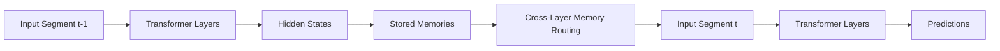

---

# 2. Sự tiến hóa của cơ chế hồi quy (Recurrence)

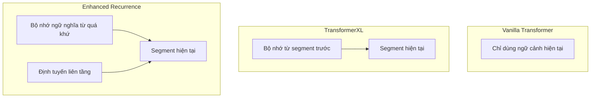

---

# 3. Transformer-XL vs Enhanced Recurrence

## Transformer-XL

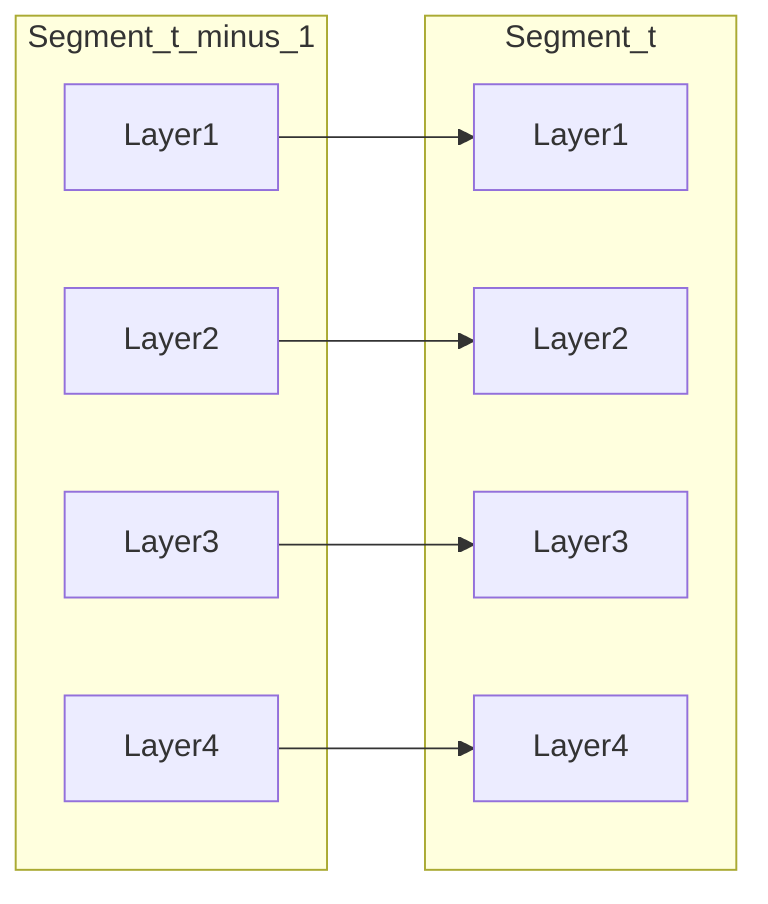

Bộ nhớ quay về __đúng tầng tương ứng__.

---

## Enhanced Recurrence

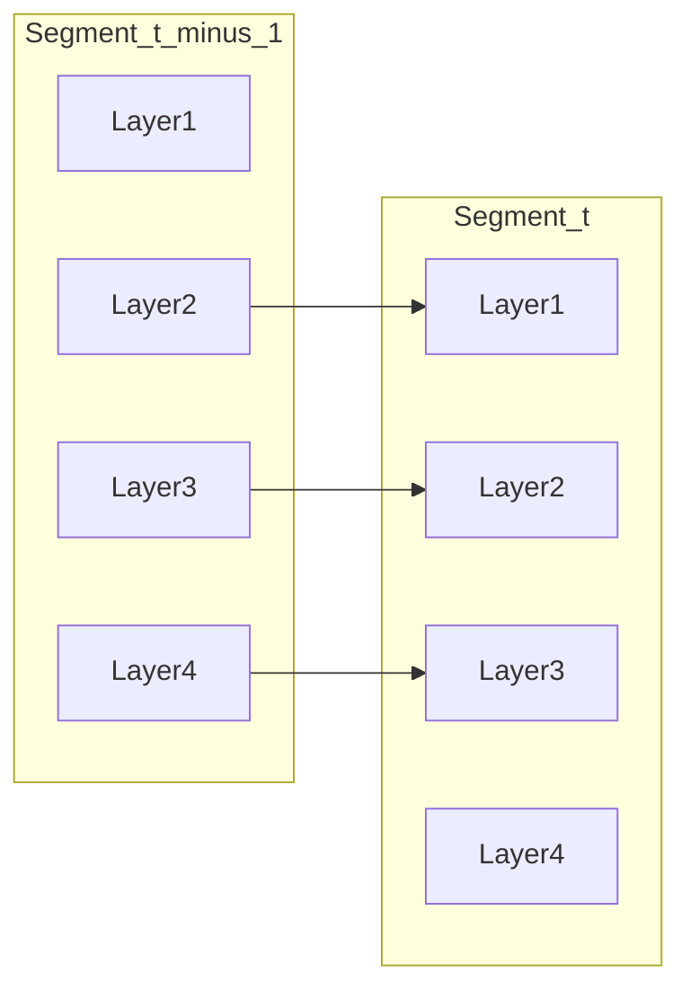

Bộ nhớ được __định tuyến xuống tầng thấp hơn.__

---

# 4. Cross-Layer Information Flow

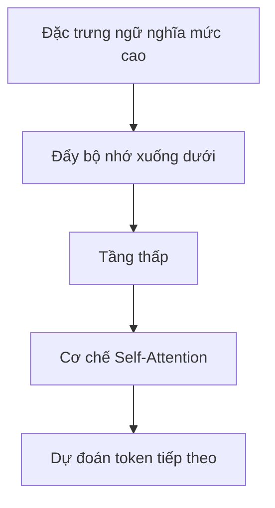

---

# 5. Complete Architecture

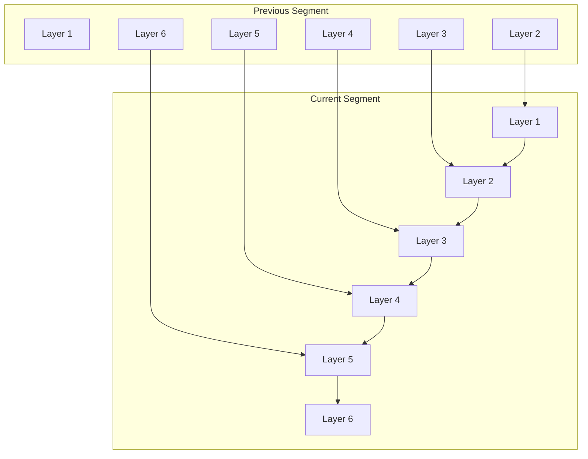

---

# 6. Information Propagation

## Transformer-XL

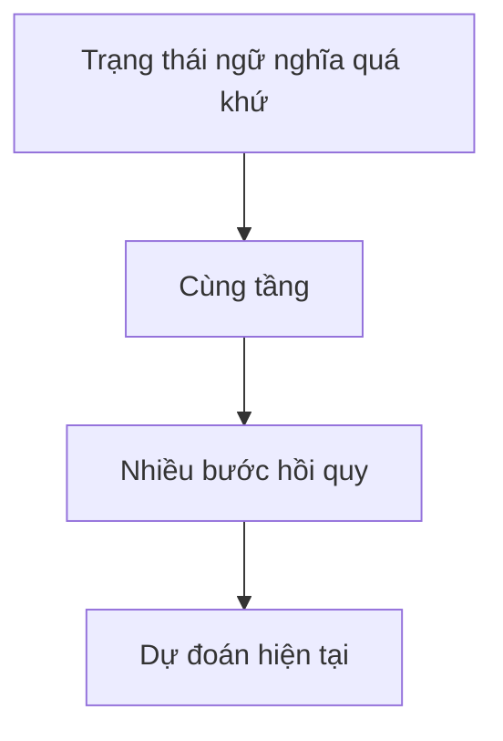

---

## Enhanced Recurrence

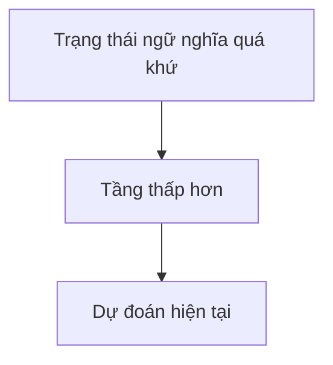

Shorter path:

```math
\text{Path}_{ER}
<
\text{Path}_{TXL}
```

---

# 7. Attention Computation

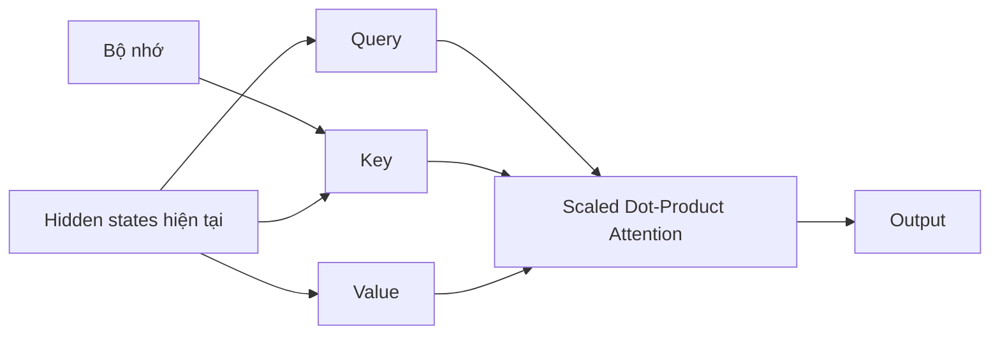

where

```math
Q=W_QH
```

```math
K=W_K[M;H]
```

```math
V=W_V[M;H]
```

---

# 8. Algorithm Overview

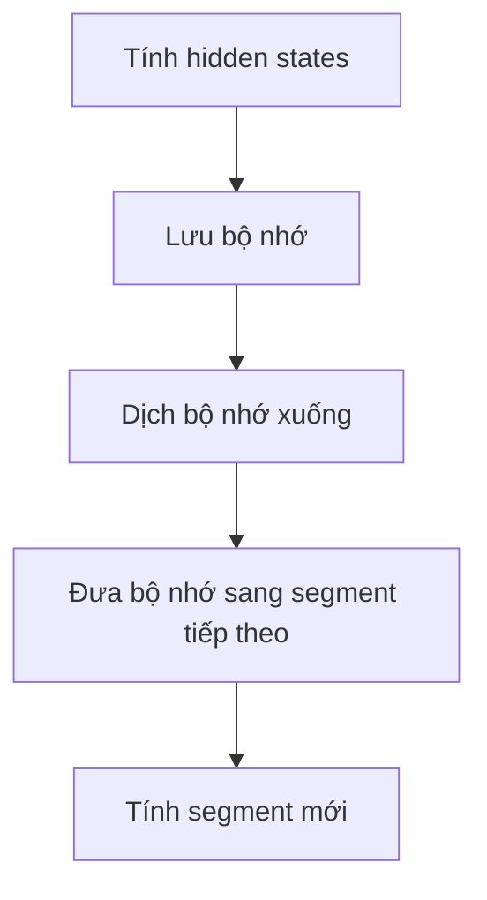

---

# 9. x-Transformers Implementation

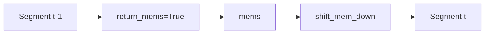

Implementation:

```python
shift_mem_down = 1
```

gives

```text
Layer6 → Layer5
Layer5 → Layer4
Layer4 → Layer3
Layer3 → Layer2
Layer2 → Layer1
```

---

# 10. Computational Cost

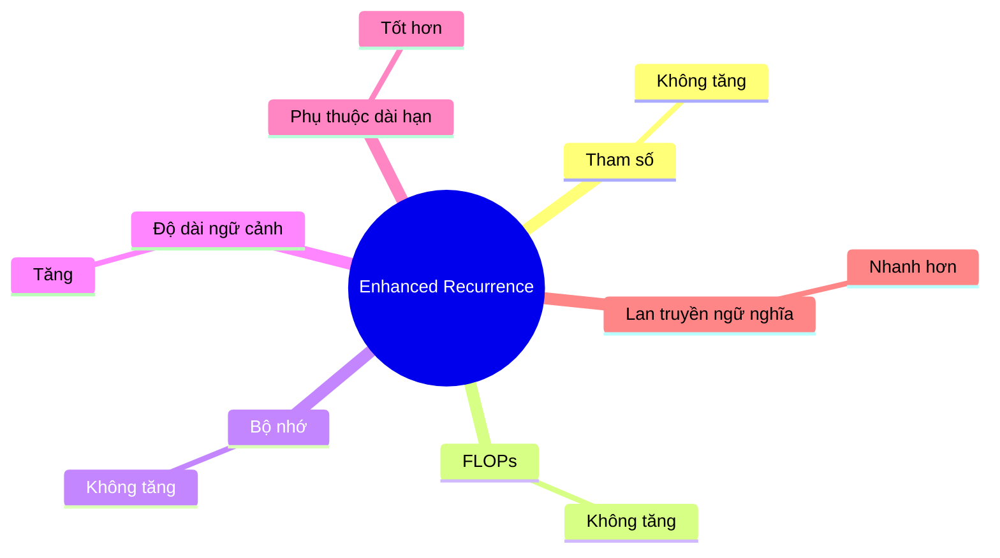

---

# 11. Position in the Evolution of x-Transformers

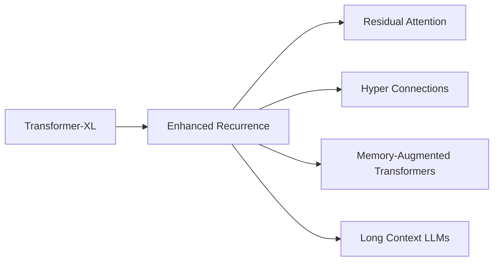

---

# Final Summary

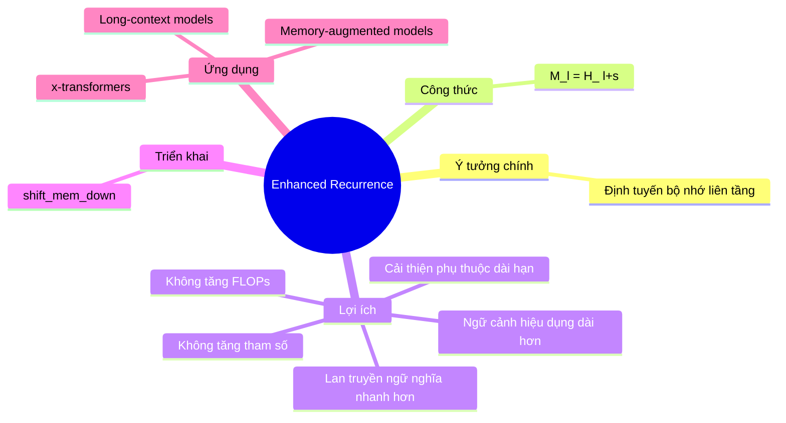
