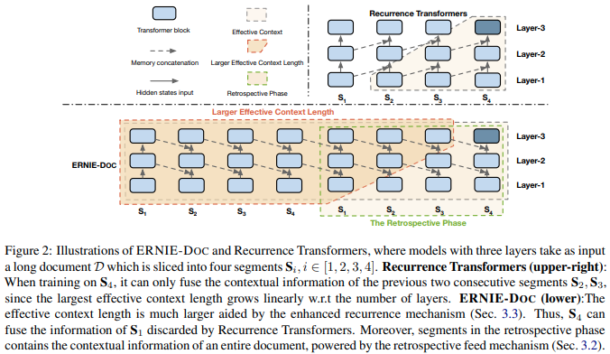
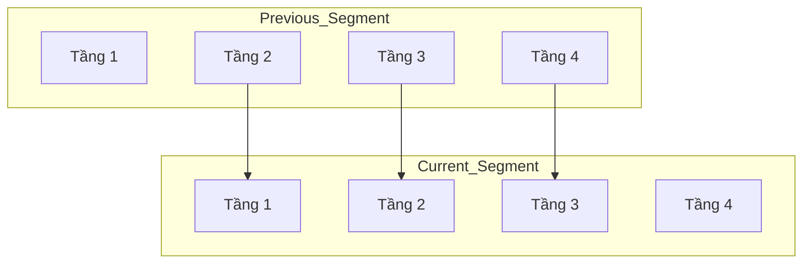

# Enhanced Recurrence trong x-Transformers

## Mở rộng Transformer-XL bằng cơ chế định tuyến bộ nhớ liên tầng (Cross-Layer Memory Routing)

> **Ý tưởng cốt lõi:** Thay vì đưa bộ nhớ của tầng (l) quay trở lại chính tầng đó ở đoạn (segment) tiếp theo, Enhanced Recurrence định tuyến bộ nhớ của tầng (l) xuống tầng thấp hơn (l-s). Thay đổi đơn giản này giúp cải thiện đáng kể khả năng lan truyền thông tin dài hạn mà không làm tăng số lượng tham số hoặc chi phí tính toán.

<p align="center">
  
</p>

---

# 1. Giới thiệu

Các kiến trúc Transformer đã đạt được thành công vượt bậc trong xử lý ngôn ngữ tự nhiên và mô hình hóa chuỗi. Tuy nhiên, Transformer tiêu chuẩn bị giới hạn bởi cửa sổ ngữ cảnh cố định do độ phức tạp bậc hai của cơ chế self-attention:

$$
\text{Complexity} = O(L^2)
$$

trong đó $L$ là độ dài chuỗi.

Transformer-XL giới thiệu cơ chế **segment-level recurrence**, cho phép tái sử dụng thông tin từ các đoạn trước dưới dạng bộ nhớ (memory), từ đó mở rộng chiều dài ngữ cảnh hiệu dụng vượt ra ngoài độ dài chuỗi được sử dụng khi huấn luyện.

Tuy nhiên, Transformer-XL ràng buộc mỗi tầng chỉ được sử dụng lại chính biểu diễn lịch sử của nó:

$$
M_l^{(t)} = SG(H_l^{(t-1)})
$$

trong đó:

* $H_l^{(t-1)}$: hidden states của tầng (l) tại đoạn trước;
* $M_l^{(t)}$: bộ nhớ được sử dụng tại đoạn hiện tại;
* $SG(\cdot)$: phép dừng lan truyền gradient (stop-gradient).

Thiết kế này làm hạn chế tốc độ lan truyền của thông tin ngữ nghĩa mức cao trong toàn bộ mạng.

Enhanced Recurrence được đề xuất nhằm khắc phục hạn chế này thông qua cơ chế **định tuyến bộ nhớ liên tầng (cross-layer memory routing)**.

---

# 2. Động cơ nghiên cứu

Trong các Transformer sâu:

* Các tầng thấp chủ yếu mã hóa thông tin từ vựng và cú pháp cục bộ.
* Các tầng cao học được các biểu diễn ngữ nghĩa và trừu tượng.

Trong Transformer-XL, thông tin ngữ nghĩa được lưu trữ ở các tầng trên cần nhiều bước hồi quy (recurrent steps) mới có thể ảnh hưởng tới các tầng thấp trong tương lai.

Hệ quả là:

* phụ thuộc dài hạn lan truyền chậm;
* việc sử dụng bộ nhớ chưa hiệu quả;
* khả năng suy luận trên ngữ cảnh rất dài bị suy giảm.

Giả thuyết trung tâm của Enhanced Recurrence là:

> Các biểu diễn ngữ nghĩa mức cao của những đoạn trước nên ảnh hưởng trực tiếp đến các tầng thấp ở các đoạn tiếp theo.

---

# 3. Enhanced Recurrence

Thay vì:

$$
M_l^{(t)}= SG \left( H_l^{(t-1)} \right)
$$

Enhanced Recurrence định nghĩa:

$$
M_l^{(t)}= SG \left( H_{l+s}^{(t-1)} \right)
$$

trong đó:

* $s$ là tham số dịch chuyển bộ nhớ;
* $s \ge 1$.

Trường hợp đặc biệt:

$$
s=1
$$

ta thu được:

$$
M_l^{(t)}= SG \left( H_{l+1}^{(t-1)} \right)
$$

nghĩa là bộ nhớ của tầng (l+1) được định tuyến xuống tầng (l).

---

# 4. Kiến trúc

## Transformer-XL

```text
Segment t-1

Layer6 → Mem6
Layer5 → Mem5
Layer4 → Mem4
Layer3 → Mem3
Layer2 → Mem2
Layer1 → Mem1

Segment t

Layer6 uses Mem6
Layer5 uses Mem5
Layer4 uses Mem4
Layer3 uses Mem3
Layer2 uses Mem2
Layer1 uses Mem1
```

Mỗi tầng chỉ sử dụng lại bộ nhớ của chính nó.

---

## Enhanced Recurrence

```text
Segment t-1

Layer6
Layer5
Layer4
Layer3
Layer2
Layer1

        ↓
        ↓
        ↓

Segment t

Layer5 uses Mem6
Layer4 uses Mem5
Layer3 uses Mem4
Layer2 uses Mem3
Layer1 uses Mem2
```

Bộ nhớ của các tầng trên được chuyển xuống các tầng dưới.

---

## Sơ đồ định tuyến liên tầng



---

# 5. Công thức toán học

Đối với tầng (l), attention được tính bởi:

$$
Q_l=W_QH_l
$$

$$
K_l=W_K[M_l;H_l]
$$

$$
V_l=W_V[M_l;H_l]
$$

trong đó:

$$
[M_l;H_l]
$$

là phép nối (concatenation) giữa bộ nhớ và hidden states hiện tại.

Phép attention:

$$
Attention(Q_l,K_l,V_l)= softmax \left( \frac{Q_lK_l^\top}{\sqrt{d}} \right)V_l.
$$

Enhanced Recurrence chỉ thay đổi cách xây dựng (M_l), toàn bộ phần còn lại của Transformer được giữ nguyên.

---

# 6. Thuật toán

## Thuật toán Enhanced Recurrence

```text
Input:
    Bộ nhớ của đoạn trước
    Token của đoạn hiện tại

1. Tính hidden states của tất cả các tầng.
2. Lưu các hidden states làm bộ nhớ.
3. Dịch chuyển bộ nhớ xuống dưới s tầng.
4. Sử dụng bộ nhớ đã dịch chuyển ở đoạn kế tiếp.

Output:
    Logits hiện tại
    Bộ nhớ mới
```

---

## Mã giả

```python
for layer in layers:

    mem = previous_hidden[layer + shift_mem_down]

    x = attention(
        x,
        mem
    )

    x = feed_forward(x)

return x, memories
```

---

# 7. Mở rộng ngữ cảnh hiệu dụng

Luồng thông tin của Transformer-XL:

```text
Trạng thái ngữ nghĩa quá khứ
            ↓
        Cùng một tầng
            ↓
   Nhiều bước hồi quy
            ↓
      Các tầng thấp
```

Enhanced Recurrence:

```text
Trạng thái ngữ nghĩa quá khứ
            ↓
        Các tầng thấp
            ↓
       Token hiện tại
```

Độ dài đường truyền thông tin được rút ngắn:

$$
\text{Path}*{ER} < \text{Path}*{TXL}
$$

Do đó, thông tin ngữ nghĩa có thể ảnh hưởng tới dự đoán tương lai nhanh hơn đáng kể.

---

# 8. Độ phức tạp tính toán

Enhanced Recurrence không bổ sung tham số mới.

| Thuộc tính | Độ phức tạp |
| ---------- | ----------- |
| Tham số    | $O(1)$      |
| FLOPs      | $O(1)$      |
| Bộ nhớ     | $O(1)$      |

Phương pháp này chỉ thay đổi cách định tuyến bộ nhớ hồi quy.

---

# 9. Triển khai trong x-Transformers

```python
model = TransformerWrapper(
    num_tokens = 20000,
    max_seq_len = 512,
    max_mem_len = 2048,
    shift_mem_down = 1,
    attn_layers = Decoder(
        dim = 512,
        depth = 6,
        heads = 8,
        rotary_pos_emb = True
    )
)
```

Trong quá trình suy luận:

```python
logits1, mems1 = model(
    seg1,
    return_mems = True
)

logits2, mems2 = model(
    seg2,
    mems = mems1,
    return_mems = True
)
```

Các bộ nhớ được tự động dịch chuyển:

```text
Bộ nhớ của tầng N
        ↓
Tầng N−1 của đoạn kế tiếp
```

---

# 10. Ưu điểm

## Lan truyền thông tin nhanh hơn

Thông tin ngữ nghĩa mức cao có thể đi trực tiếp tới các tầng thấp.

## Ngữ cảnh hiệu dụng dài hơn

Mô hình tận dụng được các biểu diễn trừu tượng từ những đoạn ở rất xa.

## Không phát sinh chi phí

Không làm tăng:

* số lượng tham số;
* bộ nhớ;
* độ phức tạp tính toán.

## Cải thiện phụ thuộc dài hạn

Mô hình hoạt động tốt hơn trên các tác vụ ngữ cảnh dài.

---

# 11. Vai trò trong sự phát triển của x-Transformers

Enhanced Recurrence minh họa một nguyên lý quan trọng:

> Hiệu quả của Transformer không chỉ đến từ Attention, mà còn đến từ cách tổ chức và định tuyến thông tin trong mạng.

Ý tưởng này đã ảnh hưởng tới nhiều hướng nghiên cứu sau này:

* hierarchical memories;
* residual attention;
* hyper-connections;
* memory-augmented Transformers;
* các mô hình ngữ cảnh dài hiện đại.

---

# 12. Kết luận

Enhanced Recurrence thay thế:

$$
M_l^{(t)}= H_l^{(t-1)}
$$

bằng:

$$
M_l^{(t)}= H_{l+s}^{(t-1)}
$$

từ đó tạo ra cơ chế **định tuyến bộ nhớ liên tầng**.

Mặc dù rất đơn giản, phương pháp này:

1. tăng tốc lan truyền thông tin ngữ nghĩa;
2. mở rộng ngữ cảnh hiệu dụng;
3. cải thiện khả năng học phụ thuộc dài hạn;
4. không làm tăng chi phí tính toán.

Enhanced Recurrence là một mở rộng thanh lịch của Transformer-XL và là một bước quan trọng trong quá trình phát triển của các kiến trúc **x-Transformer** hiện đại.

---

# Tài liệu tham khảo

```bibtex
@article{geva2021transformer,
  title={Transformer Feed-Forward Layers Are Key-Value Memories},
  author={Geva, Mor and Schuster, Roei and Berant, Jonathan and Levy, Omer},
  journal={Proceedings of EMNLP},
  year={2021}
}
```

```bibtex
@article{dai2019transformerxl,
  title={Transformer-XL: Attentive Language Models Beyond a Fixed-Length Context},
  author={Dai, Zihang and Yang, Zhilin and Yang, Yiming and Carbonell, Jaime and Le, Quoc and Salakhutdinov, Ruslan},
  journal={Proceedings of ACL},
  year={2019}
}
```

```bibtex
@misc{xtransformers,
  title={x-transformers},
  author={Phil Wang},
  year={2024},
  howpublished={\url{https://github.com/lucidrains/x-transformers}}
}
```
