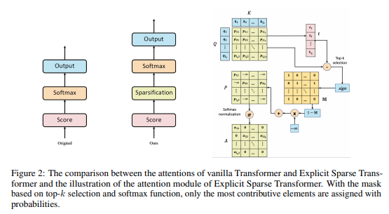

# Explicit Sparse Transformer: Concentrated Attention Through Explicit Selection

> Attention Sparsification bằng cơ chế lựa chọn tường minh (Explicit Selection)

<p align="center"> 
  
</p> 

---

## 1. Giới thiệu

Self-Attention là thành phần trung tâm của Transformer, cho phép mỗi token tương tác với toàn bộ chuỗi đầu vào. Tuy nhiên, trong thực tế phần lớn các kết nối attention mang rất ít thông tin hữu ích nhưng vẫn tiêu tốn bộ nhớ, băng thông và năng lực tính toán.

Bài báo **Explicit Sparse Transformer: Concentrated Attention Through Explicit Selection** đề xuất một phương pháp sparsification đơn giản:

* Tính attention logits như Transformer chuẩn.
* Chỉ giữ lại **Top-k giá trị lớn nhất**.
* Loại bỏ toàn bộ các kết nối còn lại trước Softmax.

Khác với Sparsemax hoặc Entmax, phương pháp này không thay đổi hàm chuẩn hóa xác suất mà thực hiện lựa chọn trực tiếp trên attention scores.

---

# 2. Động cơ nghiên cứu

Trong Transformer chuẩn:

$$
A = Softmax\left(\frac{QK^T}{\sqrt d}\right)
$$

mọi phần tử attention đều tham gia vào phép chuẩn hóa.

---

## Attention Distribution của Softmax

```text
Attention Weight

Token 1  ████████████ 0.24
Token 2  ██████████   0.20
Token 3  ████████     0.16
Token 4  ██████       0.12
Token 5  █████        0.10
Token 6  ████         0.08
Token 7  ███          0.06
Token 8  ██           0.04
```

Mặc dù chỉ vài token thực sự quan trọng, Softmax vẫn cấp xác suất khác 0 cho toàn bộ chuỗi.

Điều này dẫn tới:

* Information Noise
* Attention Dilution
* Gradient Propagation không cần thiết
* Chi phí tính toán lớn

---

# 3. Ý tưởng Explicit Selection

Giả sử một Query tạo ra vector attention score:

$$
S=[s_1,s_2,...,s_n]
$$

Ví dụ:

$$
S=[5.2,4.8,4.4,2.1,1.5,0.8]
$$

---

## Bước 1: Chọn Top-k

Nếu:

$$
k=3
$$

ta giữ lại:

$$
[5.2,4.8,4.4]
$$

và loại bỏ:

$$
[2.1,1.5,0.8]
$$

---

## Minh họa

```text
Attention Logits

5.2 ██████████████████
4.8 ████████████████
4.4 ██████████████
2.1 ███████
1.5 █████
0.8 ███

          Top-k = 3
```

Sau khi lựa chọn:

```text
5.2 ██████████████████
4.8 ████████████████
4.4 ██████████████
2.1
1.5
0.8
```

---

# 4. Explicit Sparse Attention Pipeline

```text
                Query
                   │
                   ▼
            QKᵀ / √d
                   │
                   ▼
         Attention Logits
                   │
                   ▼
            Top-k Selection
                   │
                   ▼
             Sparse Mask
                   │
                   ▼
               Softmax
                   │
                   ▼
              Attention
                   │
                   ▼
                Output
```

---

# 5. Cơ chế toán học

## Dense Attention

$$
S=\frac{QK^T}{\sqrt d}
$$

$$
A=Softmax(S)
$$

$$
O=AV
$$

---

## Explicit Sparse Attention

Tạo mask:

$$
M_i= \begin{cases} 1 & i \in TopK\\ 0 & otherwise \end{cases}
$$

Áp dụng:

$$
S' = M \odot S + (1-M)(-\infty)
$$

Sau đó:

$$
A = Softmax(S')
$$

$$
O = AV
$$

---

# 6. Attention Graph

## Transformer chuẩn

```text
           Query

      ┌─────┼─────┐
      │     │     │
      ▼     ▼     ▼

    Key1 Key2 Key3
      │     │     │
      ▼     ▼     ▼

    Key4 Key5 Key6
```

Query kết nối tới toàn bộ Key.

---

## Explicit Sparse Transformer

```text
           Query

             │
      ┌──────┴──────┐
      ▼             ▼

    Key2         Key5
```

Chỉ các Key quan trọng nhất được giữ lại.

---

# 7. Information Bottleneck

Top-k hoạt động như một bộ lọc thông tin.

```text
Dense Attention

Input
  │
  ▼
$$ Toàn bộ token $$
  │
  ▼
Attention
  │
  ▼
Output
```

---

```text
Explicit Sparse Attention

Input
  │
  ▼
$$ Toàn bộ token $$
  │
  ▼
Top-k Filter
  │
  ▼
Attention
  │
  ▼
Output
```

Mô hình bị buộc phải lựa chọn các kết nối quan trọng nhất.

---

# 8. Tác động lên Gradient

Attention chuẩn:

```text
Loss
 │
 ├─────────────► Token 1
 ├─────────────► Token 2
 ├─────────────► Token 3
 ├─────────────► Token 4
 ├─────────────► Token 5
 └─────────────► Token 6
```

---

Explicit Sparse Attention:

```text
Loss
 │
 ├─────────────► Token 2
 ├─────────────► Token 5
 └─────────────► Token 6
```

Gradient chỉ lan truyền qua các kết nối được chọn.

Điều này làm giảm:

* Gradient Noise
* Overfitting
* Attention Diffusion

---

# 9. Straight-Through Estimator

Top-k là phép toán rời rạc:

$$
TopK(x)
$$

không khả vi hoàn toàn.

Để huấn luyện ổn định, x-transformers hỗ trợ:

```python
attn_sparse_topk_straight_through = True
```

---

## Forward Pass

```text
QK
 │
 ▼
Top-k
 │
 ▼
Sparse Attention
```

---

## Backward Pass

```text
Gradient
    │
    ▼
Bypass Top-k
    │
    ▼
Original Attention Scores
```

Gradient được truyền qua attention gốc thay vì qua phép chọn rời rạc.

Đây là cơ chế:

$$
STE= Straight\ Through\ Estimator
$$

---

# 10. Hard Attention (k = 1)

Trường hợp cực hạn:

$$
k=1
$$

Attention trở thành:

$$
A=[0,0,1,0,0]
$$

---

## Minh họa

```text
Before

0.35
0.25
0.18
0.12
0.10

After

0
0
1
0
0
```

Output:

$$
O=v_{argmax}
$$

Token mạnh nhất được chọn duy nhất.

---

Trong x-transformers:

```python
attn_hard = True
```

---

# 11. Độ phức tạp

Attention đầy đủ:

$$
O(N^2)
$$

---

Explicit Sparse:

$$
O(Nk)
$$

với:

$$
k \ll N
$$

---

Ví dụ

```text
Sequence Length = 4096

Dense

4096² = 16,777,216 edges
```

---

```text
Top-k = 8

4096 × 8 = 32,768 edges
```

---

Tỷ lệ giảm:

```text
16,777,216
─────────── ≈ 512×
   32,768
```

---

# 12. So sánh với Sparsemax và Entmax

| Thuộc tính           | Softmax | Sparsemax  | Entmax     | Explicit Sparse |
| -------------------- | ------- | ---------- | ---------- | --------------- |
| Sparse thật          | ✗       | ✓          | ✓          | ✓               |
| Kiểm soát số kết nối | ✗       | ✗          | ✗          | ✓               |
| Dễ triển khai GPU    | ✓       | Trung bình | Trung bình | ✓               |
| Top-k trực tiếp      | ✗       | ✗          | ✗          | ✓               |
| Chi phí bổ sung      | Thấp    | Trung bình | Trung bình | Rất thấp        |

---

# 13. Vai trò trong X-Transformers

Trong thư viện x-transformers:

```python
Decoder(
    dim = 512,
    depth = 6,
    heads = 8,
    attn_sparse_topk = 8,
    attn_sparse_topk_straight_through = True
)
```

Cơ chế này là một dạng:

```text
Dense Attention
        │
        ▼
Attention Sparsification
        │
        ▼
Sparse Transformer
        │
        ▼
Routing Transformer
        │
        ▼
Retrieval Transformer
        │
        ▼
Long Context LLM
```

---

# 14. Kết luận

Explicit Sparse Transformer là một trong những phương pháp sparsification đơn giản và hiệu quả nhất từng được đề xuất cho cơ chế Self-Attention.

Ý tưởng cốt lõi:

$$
Attention \rightarrow TopK\ Selection \rightarrow Sparse\ Softmax
$$

Thay vì thay đổi hàm chuẩn hóa, mô hình trực tiếp loại bỏ các kết nối attention yếu trước Softmax. Điều này tạo ra attention tập trung hơn, giảm nhiễu, cải thiện khả năng alignment và mở đường cho nhiều kiến trúc Sparse Transformer hiện đại.

---

# Tài liệu tham khảo

```bibtex
@article{zhao2019explicit,
  title={Explicit Sparse Transformer: Concentrated Attention Through Explicit Selection},
  author={Zhao, Guangxiang and Zhang, Junbo and Luo, Ziyang},
  year={2019},
  eprint={1912.11637},
  archivePrefix={arXiv},
  primaryClass={cs.CL}
}
```

```bibtex
@misc{xtransformers,
  author = {Phil Wang},
  title = {x-transformers},
  year = {2024},
  url = {https://github.com/lucidrains/x-transformers}
}
```
