# Flash Attention

> Fast and Memory-Efficient Exact Attention for Transformers

---

## Mục lục

1. Giới thiệu
2. Vấn đề của Self-Attention truyền thống
3. Ý tưởng cốt lõi của Flash Attention
4. GPU Memory Hierarchy
5. Tiled Attention
6. Online Softmax
7. Thuật toán Flash Attention
8. Độ phức tạp bộ nhớ
9. Backward Pass và Recomputation
10. IO-Aware Optimization
11. Flash Attention v2
12. PyTorch Scaled Dot Product Attention
13. Flash Attention trong x-transformers
14. Flash Attention trong LLaMA
15. Hạn chế
16. Tổng kết
17. Tài liệu tham khảo

---

# 1. Giới thiệu

Flash Attention là một thuật toán tối ưu hóa cơ chế Self-Attention được đề xuất nhằm giải quyết nút thắt cổ chai lớn nhất của Transformer:

* Bộ nhớ tăng theo cấp số bậc hai.
* Chi phí truy cập GPU memory quá lớn.
* Khó mở rộng context length.

Khác với nhiều biến thể attention xấp xỉ (approximate attention), Flash Attention vẫn tính toán:

$$
Softmax \left( \frac{QK^T}{\sqrt d} \right)V
$$

một cách **chính xác (exact attention)**.

Đóng góp cốt lõi của Flash Attention nằm ở việc:

* Chia Attention thành các tile nhỏ.
* Không materialize ma trận attention đầy đủ.
* Sử dụng Online Softmax.
* Giảm số lần truy cập HBM.
* Tận dụng SRAM của GPU.

---

## Tổng quan Flash Attention

<p align="center">
    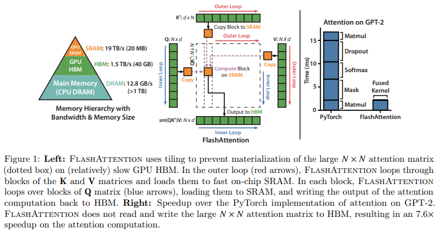
</p>

<p align="center">
    <em>Flash Attention computes exact attention without materializing the full attention matrix.</em>
</p>

---

# 2. Vấn đề của Self-Attention truyền thống

Cho:

$$
Q,K,V \in \mathbb{R}^{N\times d}
$$

trong đó:

* (N): sequence length
* (d): head dimension

Attention được tính:

$$
S=QK^T
$$

$$
P=Softmax(S)
$$

$$
O=PV
$$

---

## Vấn đề bộ nhớ

Attention score:

$$
S\in\mathbb{R}^{N\times N}
$$

Softmax matrix:

$$
P\in\mathbb{R}^{N\times N}
$$

Do đó:

$$
Memory=O(N^2)
$$

---

### Ví dụ

| Sequence Length | Attention Elements |
| --------------- | ------------------ |
| 2048            | 4M                 |
| 4096            | 16M                |
| 8192            | 67M                |
| 16384           | 268M               |

---

## Standard Attention vs Flash Attention

<p align="center">
    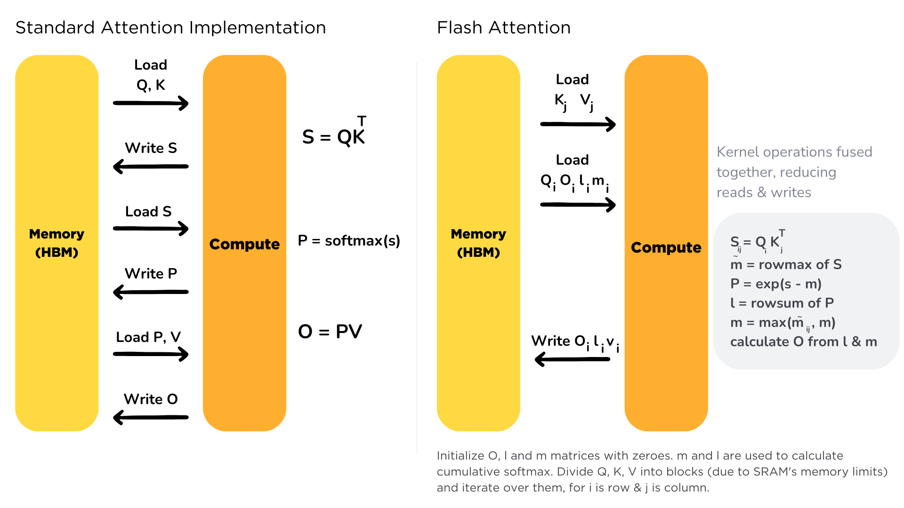
</p>

<p align="center">
    <em>Traditional attention materializes an N×N matrix while Flash Attention computes attention block-by-block.</em>
</p>

---

# 3. Ý tưởng cốt lõi của Flash Attention

Quan sát quan trọng:

Mục tiêu cuối cùng là:

$$
Softmax(QK^T)V
$$

không phải:

$$
QK^T
$$

Do đó không nhất thiết phải lưu toàn bộ:

$$
N\times N
$$

attention matrix.

Flash Attention thực hiện tính toán từng phần và chỉ lưu các thống kê cần thiết cho Softmax.

---

# 4. GPU Memory Hierarchy

Hiệu năng của Flash Attention đến từ việc tối ưu luồng dữ liệu trong GPU.

---

## High Bandwidth Memory (HBM)

Đặc điểm:

* Dung lượng lớn.
* Băng thông cao.
* Độ trễ lớn.

Ví dụ:

```text
40GB – 80GB
```

---

## Shared Memory (SRAM)

Đặc điểm:

* Dung lượng nhỏ.
* Tốc độ rất cao.
* Truy cập nhanh hơn HBM nhiều lần.

Ví dụ:

```text
64KB – 192KB
```

---

Flash Attention được thiết kế để tối đa hóa việc sử dụng SRAM.

---

# 5. Tiled Attention

Thay vì tính toàn bộ:

$$
QK^T
$$

Flash Attention chia:

$$
Q
$$

thành:

$$
Q_1,Q_2,\ldots
$$

và:

$$
K,V
$$

thành:

$$
K_1,K_2,\ldots
$$

---

## Tiled Attention

<p align="center">
    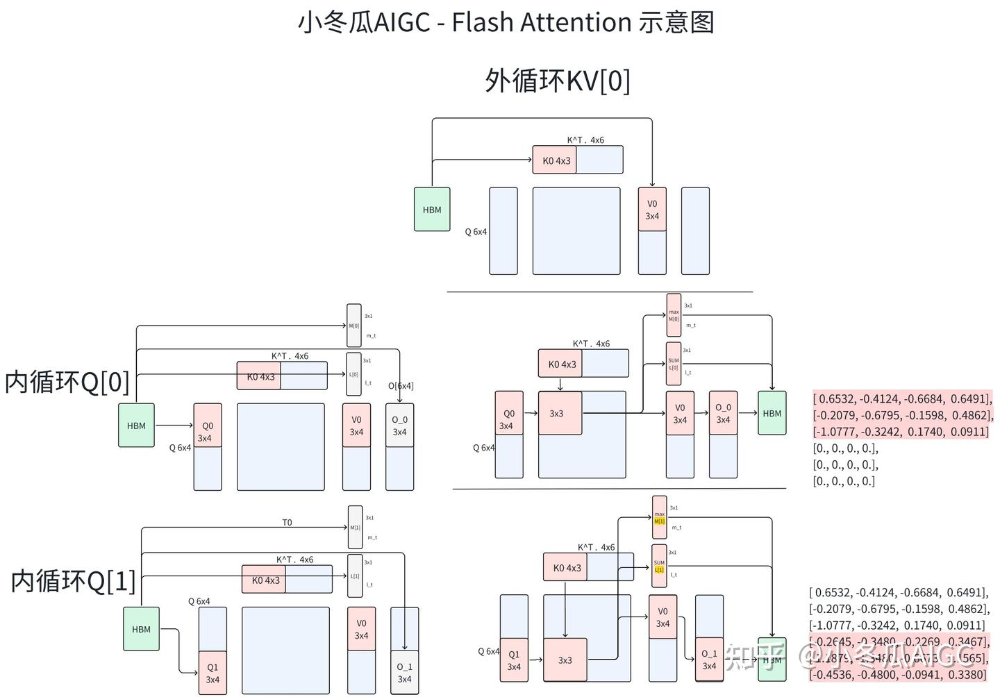
</p>

<p align="center">
    <em>Attention matrix is processed tile-by-tile instead of being materialized entirely.</em>
</p>

---

Mỗi tile được xử lý độc lập:

```text
Qi
 ├── K1,V1
 ├── K2,V2
 ├── K3,V3
 └── ...
```

Không cần tạo toàn bộ ma trận attention.

---

# 6. Online Softmax

Softmax thông thường:

$$
Softmax (x_i)=\frac {e^{x_i}} {\sum_j e^{x_j}}
$$

dường như yêu cầu toàn bộ vector đầu vào.

---

Flash Attention sử dụng:

## Running Maximum

$$
m_i=\max(x_1,\ldots,x_i)
$$

---

## Running Normalizer

$$
l_i=\sum_j e^{x_j-m_i}
$$

---

Khi xuất hiện tile mới:

$$
m_{new}=\max(m_{old},m_{tile})
$$

$$
l_{new}=e^{m_{old}-m_{new}}l_{old}+e^{m_{tile}-m_{new}}l_{tile}
$$

---

## Online Softmax

<p align="center">
    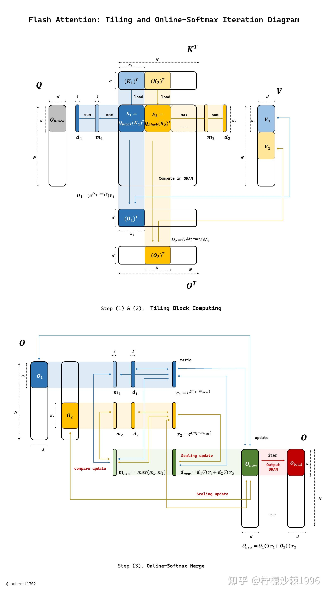
</p>

<p align="center">
    <em>Running maximum and running normalization allow exact softmax computation across tiles.</em>
</p>

---

Đây là chìa khóa giúp Flash Attention tính được:

$$
Softmax(QK^T)
$$

mà không cần lưu toàn bộ ma trận.

---

# 7. Thuật toán Flash Attention

Cho mỗi tile:

### Bước 1

Load:

$$
Q_i
$$

vào SRAM.

### Bước 2

Load:

$$
K_j,V_j
$$

vào SRAM.

### Bước 3

Tính:

$$
S_{ij}=Q_iK_j^T
$$

### Bước 4

Cập nhật:

$$
m_i
$$

và

$$
l_i
$$

### Bước 5

Tính đóng góp:

$$
P_{ij}V_j
$$

### Bước 6

Cập nhật:

$$
O_i
$$

---

## Forward Pass

<p align="center">
    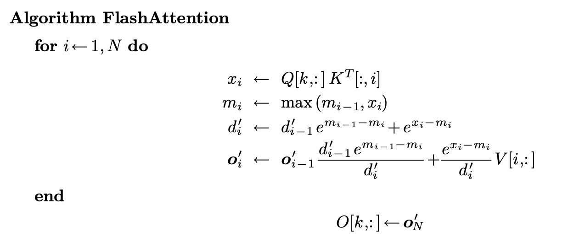
</p>

<p align="center">
    <em>Forward pass of Flash Attention.</em>
</p>

---

### Pseudocode

```text
for Qi:

    m = -inf
    l = 0
    O = 0

    for Kj,Vj:

        S = QiKjᵀ

        update m

        update l

        update O

    write O
```

---

# 8. Độ phức tạp bộ nhớ

Attention truyền thống:

$$
Memory=O(N^2)
$$

---

Flash Attention:

$$
Memory=O(N)
$$

---

## So sánh

| Method             | Memory   |
| ------------------ | -------- |
| Standard Attention | (O(N^2)) |
| Flash Attention    | (O(N))   |

---

## Memory Scaling

<p align="center">
    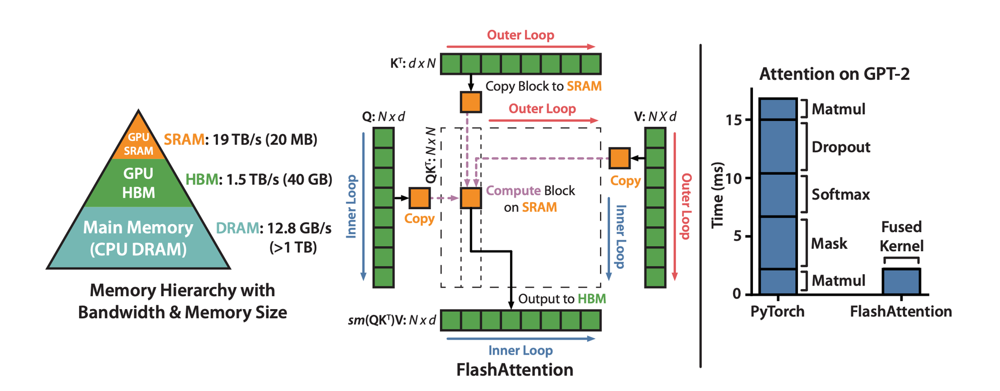
</p>

<p align="center">
    <em>Memory growth comparison between standard attention and Flash Attention.</em>
</p>

---

# 9. Backward Pass và Recomputation

Attention truyền thống lưu:

$$
QK^T
$$

và

$$
Softmax(QK^T)
$$

cho backward.

---

Flash Attention không lưu chúng.

Backward sẽ:

* Load lại tile.
* Tính toán lại attention.
* Tính gradient.

---

## Recomputation

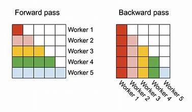

<p align="center">
    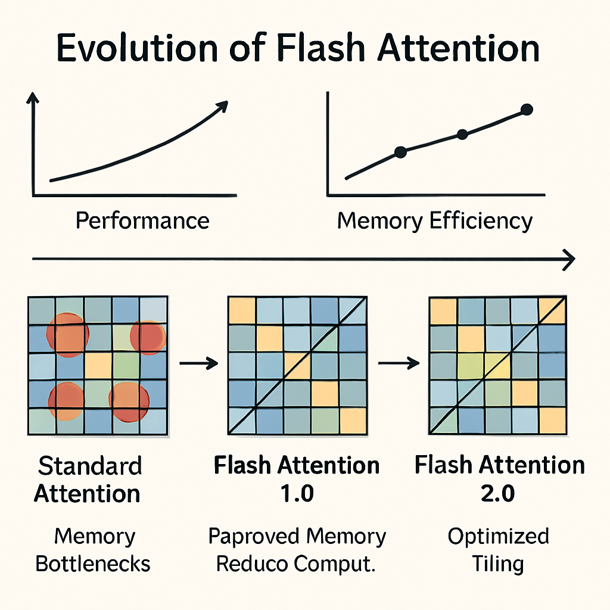
</p>

<p align="center">
    <em>Flash Attention recomputes tiles during the backward pass instead of storing them.</em>
</p>

---

Đây là sự đánh đổi:

$$
Memory \leftrightarrow FLOPs
$$

trong đó memory được tiết kiệm đáng kể.

---

# 10. IO-Aware Optimization

Đóng góp quan trọng nhất của Flash Attention là:

> IO-Aware Algorithm

---

Thời gian thực thi GPU:

$$
T=T_{compute} + T_{memory}
$$

Trong nhiều trường hợp:

$$
T_{memory} \gt T_{compute}
$$

---

Flash Attention tối ưu:

$$
HBM \leftrightarrow SRAM
$$

data movement.

---

## IO-Aware Design

<p align="center">
    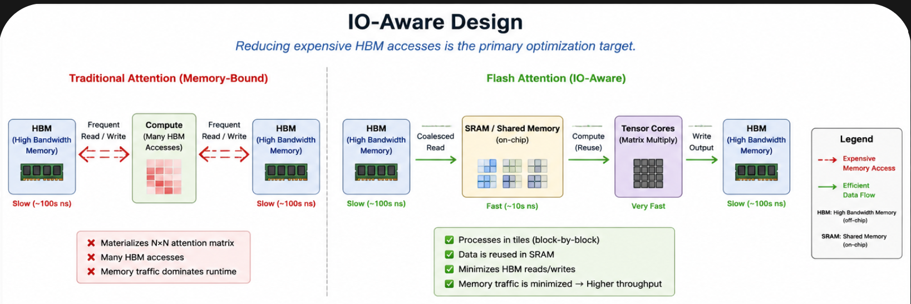
</p>

<p align="center">
    <em>Reducing expensive HBM accesses is the primary optimization target.</em>
</p>

---

# 11. Flash Attention v2

FlashAttention-2 tiếp tục cải thiện:

* Parallelism.
* Work partitioning.
* Warp scheduling.
* GPU occupancy.

---

## Flash Attention v2

<p align="center">
    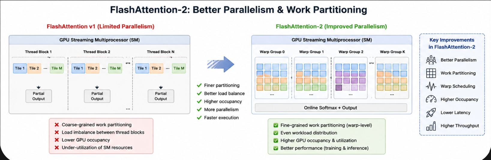
</p>

<p align="center">
    <em>Improved parallelism and workload partitioning.</em>
</p>

---

Lợi ích:

* Faster training.
* Faster inference.
* Better hardware utilization.

---

# 12. PyTorch Scaled Dot Product Attention

PyTorch 2.x cung cấp:

```python
torch.nn.functional.scaled_dot_product_attention
```

Ví dụ:

```python
import torch.nn.functional as F

y = F.scaled_dot_product_attention(
    q,
    k,
    v,
    is_causal=True
)
```

PyTorch sẽ tự động chọn:

1. Flash Attention
2. Memory Efficient Attention
3. Math Attention

phụ thuộc phần cứng.

---

# 13. Flash Attention trong x-transformers

Trong x-transformers:

```python
from x_transformers import Decoder
```

Kích hoạt:

```python
model = Decoder(
    dim = 1024,
    depth = 24,
    heads = 16,
    attn_flash = True
)
```

Framework sẽ sử dụng:

```python
scaled_dot_product_attention()
```

và gọi Flash Attention kernel nếu GPU hỗ trợ.

---

# 14. Flash Attention trong LLaMA

<p align="center">
    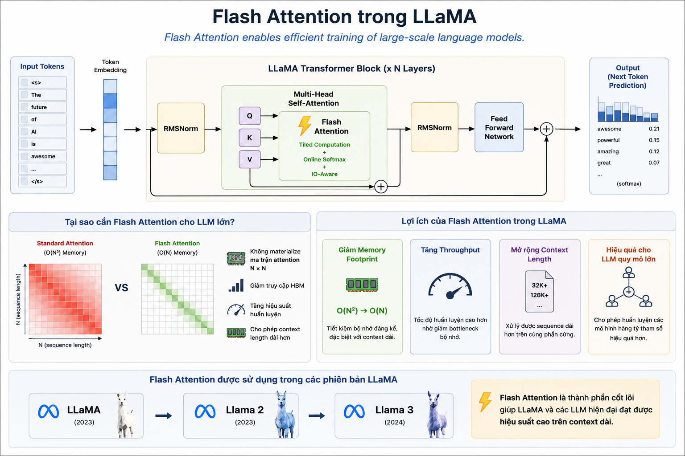
</p>

<p align="center">
    <em>Flash Attention enables efficient training of large-scale language models.</em>
</p>


---

# 15. Hạn chế

Flash Attention hoạt động tốt khi attention được tính hoàn toàn bên trong CUDA kernel.

Một số kỹ thuật khó tương thích:

* Dynamic Position Bias
* Talking Heads Attention
* Residual Attention
* Attention Matrix Manipulation

vì các phương pháp này yêu cầu truy cập trực tiếp:

$$
A= Softmax (QK^T)
$$

---

# 16. Tổng kết

Flash Attention là một trong những cải tiến quan trọng nhất trong lịch sử Transformer.

Các ý tưởng cốt lõi:

1. Tile-based Attention.
2. Online Softmax.
3. IO-Aware Optimization.
4. Recomputation During Backpropagation.
5. HBM Access Reduction.
6. Exact Attention Computation.

Kết quả:

$$
Memory: O(N^2) \rightarrow O(N)
$$

đồng thời tăng tốc đáng kể huấn luyện và suy luận.

Ngày nay Flash Attention gần như là thành phần mặc định của các hệ thống Transformer hiện đại.

---

# 17. Tài liệu tham khảo

```bibtex
@article{dao2022flashattention,
  title={FlashAttention: Fast and Memory-Efficient Exact Attention with IO-Awareness},
  author={Dao, Tri and Fu, Daniel and Ermon, Stefano and Rudra, Atri and Re, Christopher},
  journal={NeurIPS},
  year={2022}
}

@article{dao2023flashattention2,
  title={FlashAttention-2: Faster Attention with Better Parallelism and Work Partitioning},
  author={Dao, Tri},
  journal={ICML},
  year={2023}
}
```

* https://arxiv.org/abs/2205.14135
* https://arxiv.org/abs/2307.08691
* https://github.com/Dao-AILab/flash-attention
* https://github.com/lucidrains/x-transformers
* https://docs.pytorch.org/docs/stable/generated/torch.nn.functional.scaled_dot_product_attention.html


# 18. Thư viện tham khảo

```python
import torch
from x_transformers import TransformerWrapper, Decoder, Encoder

model = TransformerWrapper(
    num_tokens = 20000,
    max_seq_len = 1024,
    attn_layers = Decoder(
        dim = 512,
        depth = 6,
        heads = 8,
        attn_flash = True # just set this to True if you have pytorch 2.0 installed
    )
)
```
