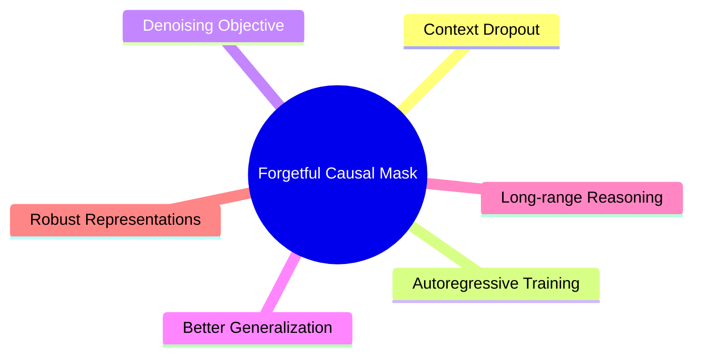
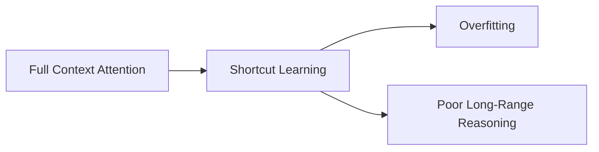
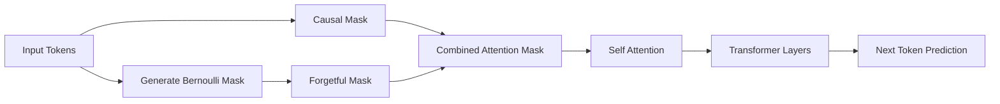
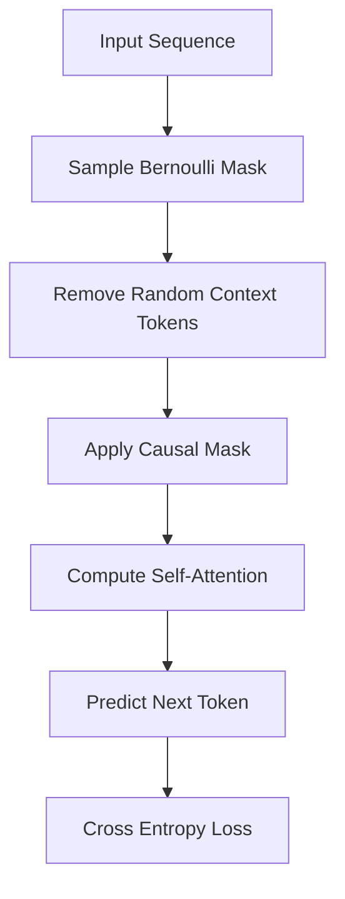
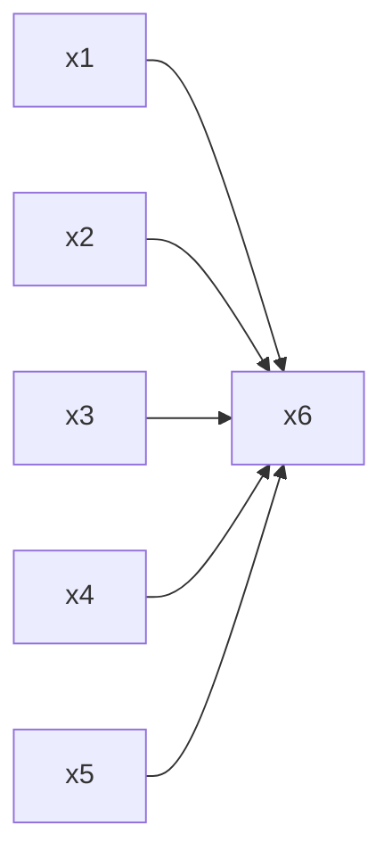
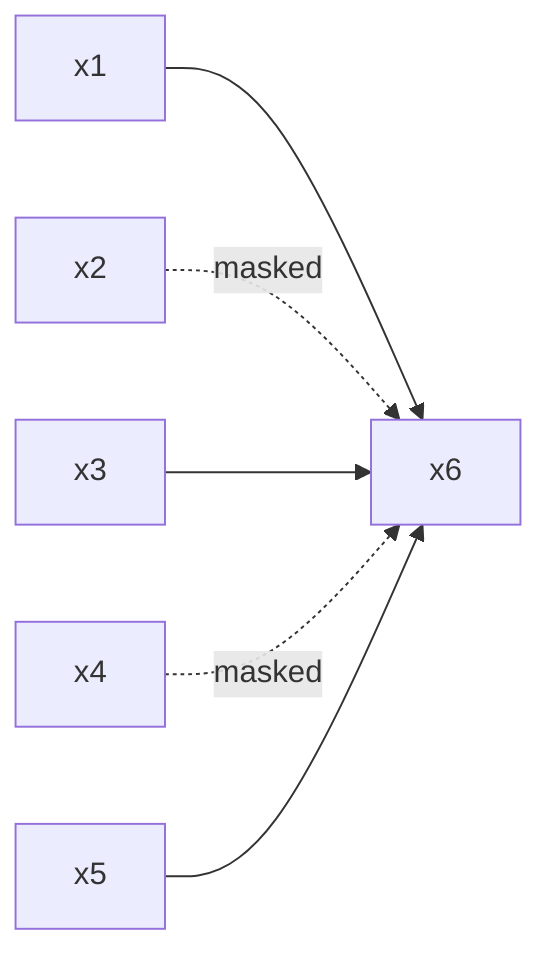
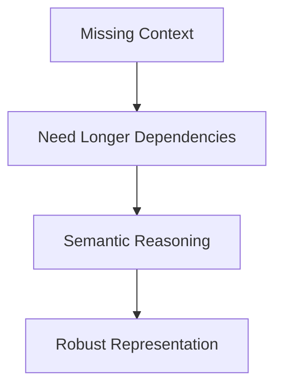
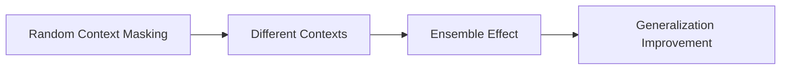
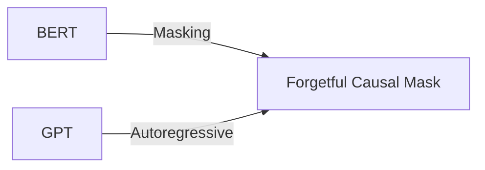
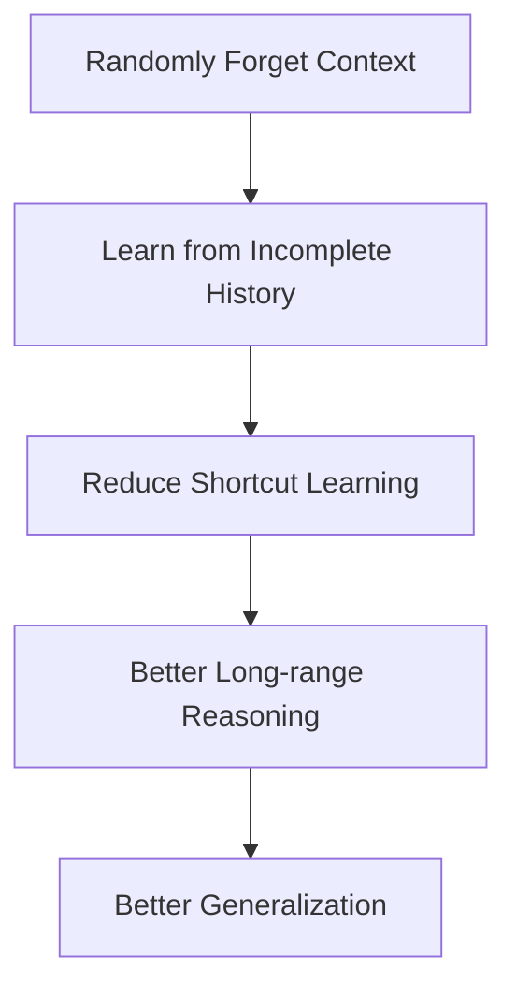

# Forgetful Causal Mask (FCM) – Overview

> **Idea cốt lõi**
>
> Thay vì luôn cho Transformer nhìn toàn bộ ngữ cảnh quá khứ, Forgetful Causal Mask (FCM) sẽ **ngẫu nhiên che đi một phần các token trong quá khứ** khi huấn luyện, buộc mô hình phải học cách suy luận từ ngữ cảnh không hoàn chỉnh.

---

# 1. Tổng quan

```text
Standard GPT:
x1 x2 x3 x4 x5 → predict x6

Forgetful Causal Mask:
x1  Ø  x3  Ø  x5 → predict x6
```

Trong đó:

```text
Ø = token bị loại khỏi attention context.
```

---

# 2. Ý tưởng chính



---

# 3. Động cơ nghiên cứu



FCM được đề xuất nhằm:

* giảm phụ thuộc vào token gần nhất;
* giảm shortcut learning;
* tăng khả năng suy luận dài hạn;
* cải thiện tính tổng quát hóa.

---

# 4. Kiến trúc tổng quát



---

# 5. Quy trình hoạt động



---

# 6. Mô hình toán học

## Sinh Forgetful Mask

```math
z_j \sim Bernoulli (1-p)
```

với:

```math
p = \text{mask\_prob}
```

---

## Xây dựng Attention Mask

```math
M_{\text{forget}}(i,j)= \begin{cases}
0, & z_j=1 \\
-\infty, & z_j=0
\end{cases}
```

---

## Attention cuối cùng

```math
A= Softmax \left( \frac{QK^{\top}}{\sqrt d} + M_{\text{causal}} + M_{\text{forget}} \right)
```

---

# 7. Minh họa Attention

## GPT thông thường



---

## Forgetful Causal Mask



---

# 8. Cơ chế học biểu diễn



FCM buộc mô hình:

1. sử dụng ngữ cảnh xa;
2. học biểu diễn ngữ nghĩa sâu hơn;
3. giảm phụ thuộc vào token gần nhất.

---

# 9. FCM như một dạng Regularization



Loss huấn luyện:

```math
\mathcal L = \mathbb E_M \left[ -\log p(x_t \mid x_{\lt t},M) \right]
```

trong đó:

```math
M
```

là Forgetful Mask ngẫu nhiên.

---

# 10. Quan hệ với các phương pháp khác



FCM kết hợp:

```text
BERT-style Masking
          +
GPT-style Autoregression
          =
Better Representations
```

---

# 11. So sánh các phương pháp

| Phương pháp | Tự hồi quy | Mask token | Regularization |
| ----------- | ---------- | ---------- | -------------- |
| GPT         | ✓          | ✗          | Thấp           |
| BERT        | ✗          | ✓          | Cao            |
| Dropout     | ✓          | ✗          | Trung bình     |
| FCM         | ✓          | ✓          | Cao            |

---

# 12. Hyperparameter quan trọng

```text
mask_prob = p
```

| p    | Context còn lại |
| ---- | --------------- |
| 0.0  | 100%            |
| 0.1  | 90%             |
| 0.15 | 85%             |
| 0.3  | 70%             |
| 0.5  | 50%             |

Theo bài báo:

```python
mask_prob = 0.15
```

là lựa chọn tốt trên nhiều thực nghiệm.

---

# 13. Triển khai trong x-transformers

```python
from x_transformers import (
    TransformerWrapper,
    Decoder,
    AutoregressiveWrapper
)

model = TransformerWrapper(
    num_tokens=20000,
    max_seq_len=1024,
    attn_layers=Decoder(
        dim=512,
        depth=12,
        heads=8
    )
)

model = AutoregressiveWrapper(
    model,
    mask_prob=0.15
)
```

---

# 14. Tổng kết



---

# Công thức cốt lõi

```math
A= Softmax \left( \frac{QK^{\top}}{\sqrt d} + M_{\text{causal}} + M_{\text{forget}} \right)
```

```text
Forgetful Causal Mask
        =
Context Dropout
        +
Denoising Objective
        +
Autoregressive Training
```

---

# Tài liệu tham khảo

1. Sun et al. (2022), *The Benefits of Masking in Autoregressive Transformers*, arXiv:2210.13432.

2. Vaswani et al. (2017), *Attention Is All You Need*.

3. x-transformers:
   https://github.com/lucidrains/x-transformers
