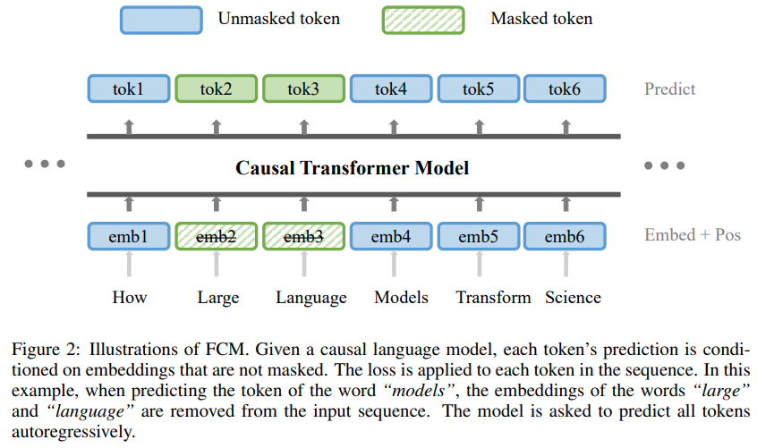
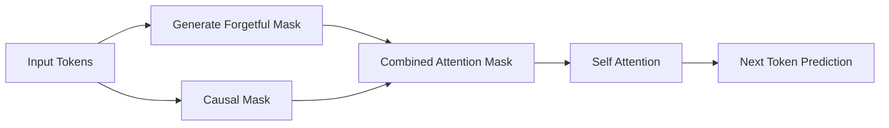
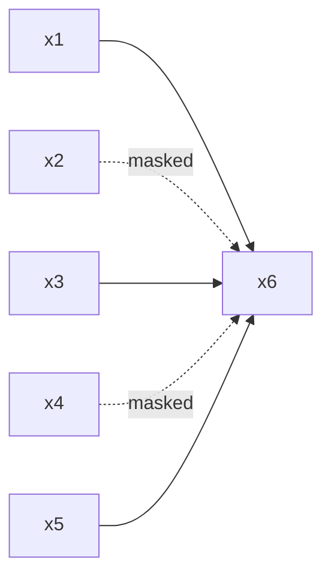

# Forgetful Causal Mask (FCM)

> **The Benefits of Masking in Autoregressive Transformers**
> Sun et al., 2022
> Paper: https://arxiv.org/abs/2210.13432
> Implementation: https://github.com/lucidrains/x-transformers

<p align="center">
  
</p>

---

# Mục lục

1. Giới thiệu
2. Động cơ nghiên cứu
3. Causal Attention truyền thống
4. Kiến trúc Forgetful Causal Mask
5. Mô hình toán học
6. Thuật toán
7. Phân tích cơ chế hoạt động
8. Quan hệ với Masked Language Modeling
9. Ưu điểm và hạn chế
10. Triển khai trong x-transformers
11. Tài liệu tham khảo

---

# 1. Giới thiệu

**Forgetful Causal Mask (FCM)** là một phương pháp regularization dành cho Transformer tự hồi quy (autoregressive Transformer), được đề xuất trong công trình:

> *The Benefits of Masking in Autoregressive Transformers* (2022).

Ý tưởng cốt lõi:

> Trong quá trình huấn luyện, mô hình sẽ ngẫu nhiên loại bỏ (forget) một phần các token quá khứ khỏi attention context.

Mặc dù GPT sử dụng cơ chế dự đoán token tiếp theo:

```math
p(x_t \mid x_{ \lt t}),
```

nghiên cứu cho thấy rằng việc huấn luyện trên **ngữ cảnh không hoàn chỉnh** lại giúp mô hình:

* học biểu diễn mạnh hơn;
* giảm phụ thuộc vào ngữ cảnh cục bộ;
* cải thiện khả năng tổng quát hóa;
* tăng hiệu quả học dài hạn.

---

# 2. Động cơ nghiên cứu

Trong Transformer decoder truyền thống, token tại vị trí (t) có thể truy cập toàn bộ lịch sử:

```math
\{x_1,x_2,\dots,x_{t-1}\}.
```

Do đó mô hình có xu hướng:

* phụ thuộc vào token gần nhất;
* học các shortcut thống kê;
* ít tận dụng thông tin dài hạn;
* dễ overfitting.

Mục tiêu của FCM là:

> Ép mô hình học cách suy luận khi một phần ngữ cảnh bị thiếu.

Điều này tương tự cơ chế:

* denoising;
* masked modeling;
* data augmentation.

---

# 3. Causal Attention truyền thống

Attention của decoder:

```math
A= Softmax \left( \frac{QK^{\top}}{\sqrt d} + M_{\text{causal}} \right).
```

Trong đó:

```math
M_{\text{causal}}(i,j) = \begin{cases}
0, & j \le i \\
-\infty, & j \gt i
\end{cases}
```

Token tại vị trí (i) chỉ bị cấm nhìn về tương lai, nhưng vẫn nhìn được toàn bộ quá khứ.

---

# 4. Kiến trúc Forgetful Causal Mask

FCM bổ sung thêm một mặt nạ ngẫu nhiên:

```math
M_{\text{forget}}.
```

Attention trở thành:

```math
A= Softmax \left( \frac{QK^{\top}}{\sqrt d} + M_{\text{causal}} + M_{\text{forget}} \right).
```

Các token quá khứ sẽ bị loại bỏ ngẫu nhiên khỏi attention context.

---

## Minh họa

```text
Original Context

x1 x2 x3 x4 x5 -> predict x6
```

```text
Forgetful Context

x1  Ø  x3  Ø  x5 -> predict x6
```

Trong đó:

```text
Ø = token bị che khỏi attention.
```

---

# 5. Mô hình toán học

## 5.1 Sinh mặt nạ ngẫu nhiên

Cho:

```math
z_j \sim Bernoulli (1-p),
```

trong đó:

```math
p = \text{mask\_prob}.
```

Ta có:

```math
z_j = \begin{cases}
1, & \text{giữ token} \\
0, & \text{quên token}
\end{cases}
```

---

## 5.2 Forgetful Mask

```math
M_{\text{forget}}(i,j) = \begin{cases}
0, & z_j = 1 \\
-\infty, & z_j = 0
\end{cases}
```

Do đó:

```math
P(\text{token visible}) = 1-p
```

và:

```math
P(\text{token forgotten}) = p.
```

Trong bài báo:

```math
p=0.15.
```

---

# 6. Thuật toán

## Training Procedure

```text
Input sequence:
x1, x2, ..., xn

1. Sample Bernoulli mask
2. Construct Forgetful Mask
3. Combine with Causal Mask
4. Compute Self-Attention
5. Compute autoregressive loss
6. Update parameters
```

---

## Pseudocode

```python
mask = Bernoulli(1 - p)

attn_mask = (
    causal_mask &
    mask
)

attention = softmax(
    qk + attn_mask
)
```

---

# 7. Minh họa kiến trúc



---

# Minh họa Attention



---

# 8. Phân tích cơ chế hoạt động

## 8.1 Context Dropout

FCM có thể được xem là:

```math
\text{Context Dropout}.
```

Khác với Dropout truyền thống:

```math
h = m \odot x,
```

FCM loại bỏ:

* không phải activation,
* mà là thông tin ngữ cảnh.

---

## 8.2 Denoising Objective

Mô hình phải dự đoán:

```math
p(x_t \mid \tilde x_{\lt t}),
```

với:

```math
\tilde x_{\lt t}
```

là ngữ cảnh bị che ngẫu nhiên.

Điều này tương tự:

* Denoising Autoencoder;
* BERT;
* Masked Language Modeling.

---

## 8.3 Giảm Shortcut Learning

Nếu:

```text
x_{t-1}
```

bị loại bỏ, mô hình buộc phải:

* khai thác ngữ cảnh xa;
* học cấu trúc ngôn ngữ tốt hơn;
* hình thành biểu diễn ngữ nghĩa mạnh hơn.

---

## 8.4 Regularization

Loss huấn luyện trở thành kỳ vọng:

```math
\mathcal L = \mathbb E_M \left[ -\log p(x_t \mid x_{<t}, M) \right],
```

trong đó:

```math
M
```

là Forgetful Mask ngẫu nhiên.

Đây là một dạng:

```math
\text{stochastic regularization}.
```

---

# 9. Quan hệ với Masked Language Modeling

| Phương pháp | Tự hồi quy | Mask token |
| ----------- | ---------- | ---------- |
| GPT         | ✓          | ✗          |
| BERT        | ✗          | ✓          |
| FCM         | ✓          | ✓          |

FCM cho thấy:

> Masking và Autoregressive Modeling không đối lập mà có thể bổ trợ lẫn nhau.

---

# 10. Ưu điểm

* cải thiện khả năng tổng quát hóa;
* tăng robustness;
* giảm overfitting;
* cải thiện biểu diễn dài hạn;
* không thay đổi kiến trúc Transformer;
* dễ tích hợp vào GPT.

---

# 11. Hạn chế

* không giảm độ phức tạp:

```math
O(n^2)
```

* không tăng tốc suy luận;
* giá trị `mask_prob` quá lớn có thể gây underfitting;
* cần tinh chỉnh siêu tham số.

---

# 12. Triển khai trong x-transformers

```python
from x_transformers import (
    TransformerWrapper,
    Decoder,
    AutoregressiveWrapper
)

model = TransformerWrapper(
    num_tokens = 20000,
    max_seq_len = 1024,
    attn_layers = Decoder(
        dim = 512,
        depth = 12,
        heads = 8
    )
)

model = AutoregressiveWrapper(
    model,
    mask_prob = 0.15
)
```

---

## Ý nghĩa của `mask_prob`

| mask_prob | Context còn lại |
| --------- | --------------- |
| 0.0       | 100%            |
| 0.1       | 90%             |
| 0.15      | 85%             |
| 0.3       | 70%             |
| 0.5       | 50%             |

Theo bài báo, giá trị:

```python
mask_prob = 0.15
```

cho kết quả tốt nhất trên nhiều thiết lập thực nghiệm.

---

# Kết luận

Forgetful Causal Mask là một cơ chế regularization đơn giản nhưng hiệu quả:

```text
Autoregressive Modeling
            +
Masked Context
            +
Denoising Objective
            =
Better Representations
```

Phương pháp này chứng minh rằng:

> Huấn luyện Transformer trên ngữ cảnh không hoàn chỉnh có thể cải thiện đáng kể chất lượng học biểu diễn mà không cần thay đổi kiến trúc cơ bản của mô hình.

---

# Tài liệu tham khảo

```bibtex
@article{sun2022benefits,
  title={The Benefits of Masking in Autoregressive Transformers},
  author={Sun, Simeng and others},
  journal={arXiv preprint arXiv:2210.13432},
  year={2022}
}
```

```bibtex
@article{vaswani2017attention,
  title={Attention Is All You Need},
  author={Vaswani, Ashish and others},
  journal={Advances in Neural Information Processing Systems},
  year={2017}
}
```

* Sun et al. (2022), *The Benefits of Masking in Autoregressive Transformers*, arXiv:2210.13432.
* Vaswani et al. (2017), *Attention Is All You Need*.
* x-transformers implementation: https://github.com/lucidrains/x-transformers
