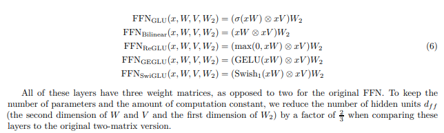

# GLU Variants Improve Transformer

> Gated Feed Forward Networks trong Transformer hiện đại



---

## Mục lục

1. Giới thiệu
2. Vấn đề của Feed Forward Network truyền thống
3. Ý tưởng Gating
4. Gated Linear Unit (GLU)
5. GLU trong Transformer
6. Các biến thể GLU
7. Phân tích toán học
8. GEGLU và SwiGLU
9. Hiệu quả thực nghiệm
10. GLU trong x-transformers
11. GLU trong mT5
12. GLU trong PaLM
13. GLU trong LLaMA
14. Độ phức tạp tính toán
15. Vai trò trong sự tiến hóa của Transformer
16. Tài liệu tham khảo

---

# 1. Giới thiệu

Trong Transformer nguyên thủy (Vaswani et al., 2017), mỗi khối Transformer bao gồm hai thành phần chính:

* Multi-Head Self-Attention
* Position-wise Feed Forward Network (FFN)

Trong nhiều năm, phần lớn nghiên cứu tập trung vào cơ chế Attention.

Tuy nhiên, công trình:

> **GLU Variants Improve Transformer**
>
> Noam Shazeer (2020)

chỉ ra rằng:

* FFN chiếm phần lớn tham số của Transformer.
* FFN tiêu thụ phần lớn FLOPs trong quá trình huấn luyện.
* Cải thiện FFN có thể mang lại hiệu quả lớn hơn nhiều cải tiến Attention.

Nghiên cứu này đề xuất sử dụng các cơ chế **Gated Feed Forward Network** thay cho FFN truyền thống.

Các biến thể quan trọng gồm:

* GLU
* ReGLU
* GEGLU
* SwiGLU

Hiện nay chúng được sử dụng rộng rãi trong:

* mT5
* PaLM
* LLaMA
* x-transformers
* nhiều Large Language Models hiện đại

---

# 2. Feed Forward Network Truyền Thống

Trong Transformer gốc:

$$
FFN(x)= W_2 \left( \phi(W_1x) \right)
$$

với:

$$
W_1 \in \mathbb{R}^{d \times d_{ff}}
$$

$$
W_2 \in \mathbb{R}^{d_{ff} \times d}
$$

Thông thường:

$$
\phi = ReLU
$$

---

## Luồng xử lý

```text
Input
  │
  ▼
Linear (W1)
  │
  ▼
Activation
 (ReLU)
  │
  ▼
Linear (W2)
  │
  ▼
Output
```

---

## Hạn chế

FFN chỉ thực hiện:

$$
y=f(x)
$$

không có cơ chế:

* lựa chọn đặc trưng
* điều tiết thông tin
* kiểm soát luồng gradient

Mọi chiều đặc trưng đều được xử lý giống nhau.

---

# 3. Ý Tưởng Gating

Ý tưởng được lấy cảm hứng từ:

* LSTM
* GRU

Trong đó mạng học cách quyết định:

```text
Thông tin nào được giữ lại
Thông tin nào bị loại bỏ
Thông tin nào được tăng cường
```

Thay vì:

$$
y=f(x)
$$

ta sử dụng:

$$
y=f(x)\odot g(x)
$$

với:

$$
g(x)
$$

là một hàm gate.

---

## Minh họa trực quan

```text
Feature Stream
      │
      ▼
   Feature
      │
      │
      ▼
      ×
      ▲
      │
    Gate
      ▲
      │
 Gate Stream
```

Gate đóng vai trò như một bộ điều tiết thông tin.

---

# 4. Gated Linear Unit (GLU)

GLU được giới thiệu bởi:

> Dauphin et al. (2017)

Công thức:

$$
GLU(x)= (Ax+b) \odot \sigma(Cx+d)
$$

---

## Kiến trúc

```text
                    Input
                      │
        ┌─────────────┴─────────────┐
        │                           │
        ▼                           ▼
     Linear A                    Linear B
        │                           │
        ▼                           ▼
      Feature                   Sigmoid
        │                           │
        └───────────⊙───────────────┘
                    │
                    ▼
                  Output
```

---

## Ý nghĩa

Nhánh trái:

```text
Tạo đặc trưng (Feature)
```

Nhánh phải:

```text
Tạo tín hiệu điều khiển (Gate)
```

Output:

$$
Output= Feature \times Gate
$$

---

# 5. GLU Trong Transformer

Noam Shazeer thay thế FFN truyền thống bằng:

$$
FFN_{GLU}=  W_o ( A(x) \odot G(x) )
$$

---

## Luồng xử lý

```text
Input
  │
  ├──────────────┐
  │              │
  ▼              ▼
Linear A     Linear G
  │              │
  ▼              ▼
Feature       Gate
  │              │
  └──────⊙───────┘
         │
         ▼
      Linear
         │
         ▼
      Output
```

---

# 6. Các Biến Thể GLU

---

## 6.1 Bilinear

$$
Bilinear(x)= (W_1x) \odot (W_2x)
$$

Không sử dụng activation.

---

## 6.2 ReGLU

$$
ReGLU(x)= (W_1x) \odot ReLU(W_2x)
$$

---

## 6.3 GEGLU

$$
GEGLU(x)= (W_1x) \odot GELU(W_2x)
$$

---

### Sơ đồ GEGLU

```text
                     Input
                       │
          ┌────────────┴────────────┐
          │                         │
          ▼                         ▼
      Linear A                 Linear B
          │                         │
          ▼                         ▼
       Feature                   GELU
          │                         │
          └──────────⊙──────────────┘
                     │
                     ▼
                  Linear
                     │
                     ▼
                   Output
```

---

## 6.4 SwiGLU

$$
SwiGLU(x)= (W_1x) \odot Swish(W_2x)
$$

với:

$$
Swish(x)= x\sigma(x)
$$

---

### Sơ đồ SwiGLU

```text
                     Input
                       │
          ┌────────────┴────────────┐
          │                         │
          ▼                         ▼
      Linear A                 Linear B
          │                         │
          ▼                         ▼
       Feature                  Swish
          │                         │
          └──────────⊙──────────────┘
                     │
                     ▼
                  Linear
                     │
                     ▼
                   Output
```

---

# 7. Phân Tích Toán Học

Giả sử:

$$
h=A(x)
$$

$$
g=G(x)
$$

Khi đó:

$$
y=h\odot g
$$

Gradient:

$$
\frac{\partial y}{\partial h}= g
$$

$$
\frac{\partial y}{\partial g}= h
$$

Gradient được truyền đồng thời qua:

* nhánh Feature
* nhánh Gate

giúp:

* ổn định huấn luyện
* cải thiện khả năng tối ưu
* giảm hiện tượng mất gradient

---

# 8. Tại Sao GEGLU Và SwiGLU Hiệu Quả?

ReLU:

$$
ReLU(x)=\max(0,x)
$$

gây:

* mất gradient phía âm
* activation cứng

---

GELU:

$$
GELU(x)= x\Phi(x)
$$

mượt hơn.

---

Swish:

$$
Swish(x)= x\sigma(x)
$$

liên tục trên toàn miền.

---

## So sánh

```text
ReLU
  │
  ├─ Đơn giản
  ├─ Gradient chết
  └─ Activation cứng

GELU
  │
  ├─ Mượt hơn
  ├─ Gradient ổn định
  └─ Tối ưu tốt hơn

Swish
  │
  ├─ Khả vi hoàn toàn
  ├─ Gradient mạnh
  └─ Hiệu quả cao nhất
```

---

# 9. Kết Quả Thực Nghiệm

Bài báo huấn luyện nhiều Transformer với cùng ngân sách tính toán.

Kết quả:

| Feed Forward | Hiệu năng |
| ------------ | --------- |
| ReLU FFN     | Baseline  |
| Bilinear     | Tốt hơn   |
| ReGLU        | Tốt hơn   |
| GEGLU        | Rất tốt   |
| SwiGLU       | Tốt nhất  |

---

## Thứ bậc hiệu năng

```text
ReLU
  │
  ▼
Bilinear
  │
  ▼
ReGLU
  │
  ▼
GEGLU
  │
  ▼
SwiGLU
```

---

# 10. GLU Trong x-transformers

Kích hoạt GLU:

```python
ff_glu = True
```

x-transformers sẽ thay toàn bộ FFN bằng:

$$
GEGLU
$$

---

Kích hoạt SwiGLU:

```python
ff_glu = True
ff_swish = True
```

sử dụng:

$$
SwiGLU
$$

---

# 11. GLU Trong mT5

mT5 loại bỏ ReLU FFN.

Thay vào đó:

$$
GEGLU
$$

Mục tiêu:

* cải thiện multilingual learning
* tăng khả năng tổng quát hóa
* ổn định huấn luyện quy mô lớn

---

# 12. GLU Trong PaLM

PaLM 540B lựa chọn:

$$
SwiGLU
$$

làm kiến trúc Feed Forward chính thức.

Đây là một trong các thành phần quan trọng nhất giúp PaLM đạt hiệu năng SOTA.

---

# 13. GLU Trong LLaMA

Các phiên bản:

* LLaMA 1
* LLaMA 2
* LLaMA 3

đều sử dụng:

$$
SwiGLU
$$

---

## Decoder Block Hiện Đại

```text
Input
  │
  ▼
RMSNorm
  │
  ▼
Self-Attention
  │
  ▼
Residual
  │
  ▼
RMSNorm
  │
  ▼
SwiGLU FFN
  │
  ▼
Residual
  │
  ▼
Output
```

---

# 14. Độ Phức Tạp Tính Toán

FFN truyền thống:

$$
O(d,d_{ff})
$$

GLU:

$$
O(2d,d_{ff})
$$

Tăng thêm:

* một phép chiếu tuyến tính
* một activation gate

Đổi lại:

* chất lượng mô hình cao hơn
* hội tụ nhanh hơn
* tối ưu ổn định hơn

---

# 15. Vai Trò Trong Sự Tiến Hóa Của Transformer

```text
Transformer (2017)
        │
        ▼
GLU
        │
        ▼
ReGLU
        │
        ▼
GEGLU
        │
        ▼
SwiGLU
        │
        ▼
PaLM
        │
        ▼
LLaMA
        │
        ▼
Modern LLMs
```

GLU Variants chứng minh rằng:

> Feed Forward Network không chỉ là thành phần phụ trợ cho Attention mà là một trong những nguồn năng lực biểu diễn quan trọng nhất của Transformer.

---

# 16. Kết Luận

Sự thay đổi từ:

$$
FFN(x)= W_2(\phi(W_1x))
$$

sang:

$$
FFN(x)= W_o \left( Feature(x) \odot Gate(x) \right)
$$

đã trở thành một trong những cải tiến có ảnh hưởng lớn nhất tới Transformer hiện đại.

Các mô hình quy mô lớn hiện nay:

* PaLM
* LLaMA
* mT5
* x-transformers

đều sử dụng các biến thể GLU, đặc biệt là:

$$
\boxed{SwiGLU} \quad \text{và} \quad \boxed{GEGLU}
$$

như một thành phần mặc định của Feed Forward Network.

---

# Tài Liệu Tham Khảo

```bibtex
@article{shazeer2020glu,
  title={GLU Variants Improve Transformer},
  author={Shazeer, Noam},
  journal={arXiv preprint arXiv:2002.05202},
  year={2020}
}

@article{chowdhery2022palm,
  title={PaLM: Scaling Language Modeling with Pathways},
  author={Chowdhery et al.},
  journal={arXiv preprint arXiv:2204.02311},
  year={2022}
}

@article{xue2021mt5,
  title={mT5: A Massively Multilingual Pre-trained Text-to-Text Transformer},
  author={Xue et al.},
  year={2021}
}

@article{xtransformers,
  title={x-transformers},
  author={Phil Wang},
  year={2024},
  url={https://github.com/lucidrains/x-transformers}
}
```
