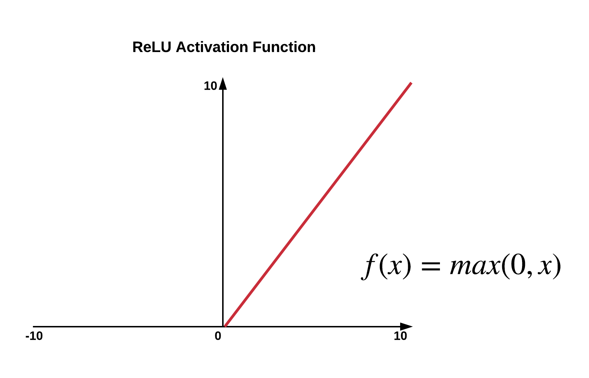
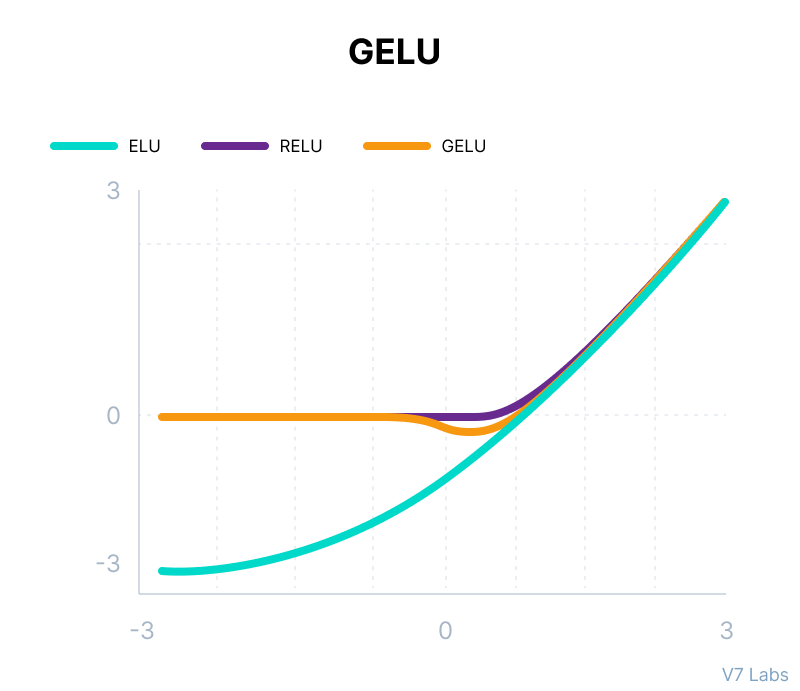
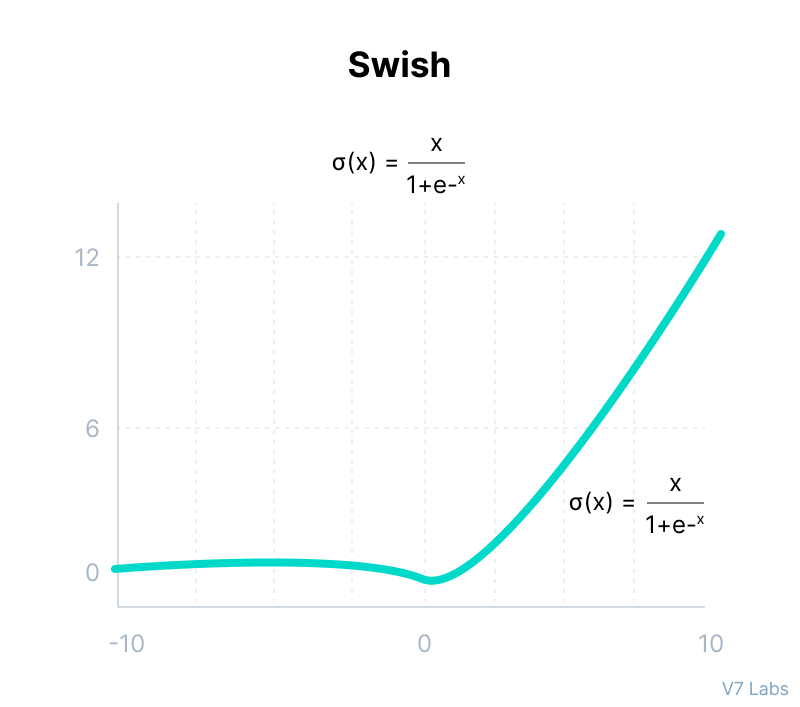

# Appendix: Activation Functions in GLU Variants

> Mathematical Foundations of ReLU, GELU and Swish in Modern Transformer Feed Forward Networks

---

# Mục lục

1. Vai trò của Activation Function
2. Activation trong Feed Forward Network
3. ReLU
4. GELU
5. Swish
6. So sánh trực quan
7. Activation và Gradient Flow
8. Activation trong GLU Variants
9. Tại sao SwiGLU chiến thắng?
10. Tóm tắt

---

# 1. Vai Trò Của Activation Function

Trong mạng neural, nếu chỉ sử dụng Linear Layer:

$$
y = Wx+b
$$

thì toàn bộ mạng nhiều lớp vẫn chỉ tương đương với một phép biến đổi tuyến tính duy nhất.

Do đó cần Activation Function để tạo tính phi tuyến:

$$
y = \phi(x)
$$

giúp mạng học được:

* Pattern phức tạp
* Feature abstraction
* Hierarchical representation

---

## Trong Transformer

Feed Forward Network:

$$
FFN(x)=W_2 \left( \phi(W_1x) \right)
$$

Activation chính là nguồn tạo phi tuyến lớn nhất trong toàn bộ FFN.

---

# 2. Activation Trong Feed Forward Network

Luồng dữ liệu:

```text
Input
  │
  ▼
Linear Projection
  │
  ▼
Activation
  │
  ▼
Linear Projection
  │
  ▼
Output
```

---

## Ý nghĩa

Linear Layer:

```text
Biến đổi không gian đặc trưng
```

Activation:

```text
Tạo năng lực biểu diễn phi tuyến
```

---

# 3. ReLU

## Công thức

$$
ReLU(x)= \max(0,x)
$$

---

## Đồ thị trực quan

```text
y
↑
│
│            /
│           /
│          /
│         /
│        /
│_______/____________→ x
        0
```

<p align="center">
  
</p>

---

## Hành vi

```text
x < 0  → 0

x > 0  → x
```

---

## Minh họa thực tiễn

Giả sử neuron phát hiện đặc trưng:

```text
"có tín hiệu"
```

Nếu:

```text
x = -3
```

ReLU:

```text
Output = 0
```

Nếu:

```text
x = +3
```

ReLU:

```text
Output = 3
```

---

## Ưu điểm

```text
Đơn giản
Nhanh
Ít FLOPs
```

---

## Nhược điểm

### Dead Neuron

Khi:

```text
x < 0
```

Gradient:

$$
\frac{d}{dx}ReLU(x)=0
$$

Neuron không còn được cập nhật.

---

## Minh họa

```text
Negative Region

x ──────► ReLU

Output = 0
Gradient = 0

Learning Stops
```

---

# 4. GELU

## Gaussian Error Linear Unit

Được sử dụng trong:

* BERT
* T5
* mT5
* GEGLU

---

## Công thức

$$
GELU(x)= x\Phi(x)
$$

Trong đó:

$$
\Phi(x)
$$

là hàm phân phối chuẩn tích lũy.

---

## Xấp xỉ thực tế

$$
GELU(x)= 0.5x \left( 1+\tanh \left( \sqrt{\frac{2}{\pi}} (x+0.044715x^3) \right) \right)
$$

---

## Đồ thị trực quan

```text
y
↑
│
│             /
│           /
│         /
│       /
│     /
│___/
│
└────────────────→ x
```

Khác với ReLU:

```text
Không cắt đột ngột
```

<p align="center">
  
</p>
---

## Ý tưởng

Thay vì:

```text
Bỏ hoàn toàn tín hiệu âm
```

GELU:

```text
Giảm dần tín hiệu âm
```

---

## Minh họa

```text
Input = -1

ReLU  → 0

GELU  → -0.16
```

Thông tin vẫn được giữ lại một phần.

---

## Ý nghĩa đối với Transformer

Token embedding thường phân bố gần Gaussian.

Do đó GELU phù hợp hơn ReLU.

---

# 5. Swish

Được đề xuất bởi Google.

Sử dụng trong:

* EfficientNet
* PaLM
* LLaMA
* SwiGLU

---

## Công thức

$$
Swish(x)=x\sigma(x)
$$

với:

$$
\sigma(x)= \frac{1}{1+e^{-x}}
$$

---

## Đồ thị

```text
y
↑
│
│              /
│            /
│          /
│        /
│      /
│____/
│
└────────────────→ x
```

<p align="center">
  
</p>

---

## Phân tích

Khi:

$$
x>>0
$$

ta có:

$$
Swish(x)\approx x
$$

---

Khi:

$$
x<<0
$$

ta có:

$$
Swish(x)\approx 0
$$

nhưng không bị cắt hoàn toàn.

---

## Minh họa

```text
Input = -2

ReLU
  Output = 0

Swish
  Output ≈ -0.24
```

Thông tin vẫn tồn tại.

---

# 6. So Sánh Trực Quan

```text
ReLU

        /
       /
      /
_____/

------------------------------------------------

GELU

      __
    /
  /
_/

------------------------------------------------

Swish

      __
    /
  /
_/


Smooth hơn
```

---

# 7. Activation Và Gradient Flow

---

## ReLU

Gradient:

$$
0
$$

ở toàn bộ vùng âm.

```text
Negative Inputs
       │
       ▼

 Gradient = 0

 Learning Stops
```

---

## GELU

Gradient liên tục:

```text
Gradient luôn tồn tại
```

---

## Swish

Gradient:

```text
Mượt nhất
```

---

## So sánh

```text
Gradient Quality

ReLU
  ███

GELU
  ███████

Swish
  ██████████
```

---

# 8. Activation Trong GLU Variants

GLU tổng quát:

$$
Output= Feature \odot Activation(Gate)
$$

---

## ReGLU

```text
Gate
  │
  ▼
 ReLU
  │
  ▼
 Multiplication
```

$$
Feature \times ReLU(Gate)
$$

---

## GEGLU

```text
Gate
  │
  ▼
 GELU
  │
  ▼
 Multiplication
```

$$
Feature \times GELU(Gate)
$$

---

## SwiGLU

```text
Gate
  │
  ▼
 Swish
  │
  ▼
 Multiplication
```

$$
Feature\times Swish(Gate)
$$

---

# 9. Tại Sao SwiGLU Chiến Thắng?

## FFN truyền thống

```text
Feature
   │
   ▼
 ReLU
   │
   ▼
 Output
```

Không có khả năng điều tiết.

---

## GEGLU

```text
Feature
   │
   ▼
 × GELU(Gate)
   │
   ▼
 Output
```

Có khả năng điều tiết mềm.

---

## SwiGLU

```text
Feature
   │
   ▼
 × Swish(Gate)
   │
   ▼
 Output
```

Điều tiết mềm + gradient tốt nhất.

---

## Thứ tự hiệu năng thực nghiệm

```text
ReLU
  │
  ▼
ReGLU
  │
  ▼
GEGLU
  │
  ▼
SwiGLU
```

Đây chính là lý do:

* PaLM dùng SwiGLU
* LLaMA dùng SwiGLU
* x-transformers khuyến nghị SwiGLU
* nhiều LLM hiện đại mặc định sử dụng SwiGLU

---

# 10. Tóm Tắt

| Activation | Smooth | Gradient   | LLM Hiện Đại  |
| ---------- | ------ | ---------- | ------------- |
| ReLU       | ✗      | Trung bình | Ít dùng       |
| GELU       | ✓      | Tốt        | BERT, T5, mT5 |
| Swish      | ✓✓     | Rất tốt    | PaLM, LLaMA   |

---

## Kết luận

Sự tiến hóa của Feed Forward Network có thể được mô tả như:

```text
ReLU
  │
  ▼
GELU
  │
  ▼
Swish
  │
  ▼
GEGLU
  │
  ▼
SwiGLU
  │
  ▼
Modern LLMs
```

Trong các Transformer hiện đại, chất lượng của Activation Function quyết định trực tiếp tới:

* Gradient Flow
* Training Stability
* Optimization Efficiency
* Scaling Performance

và đó là lý do **SwiGLU đã trở thành chuẩn mặc định của các mô hình ngôn ngữ quy mô lớn hiện nay.**
