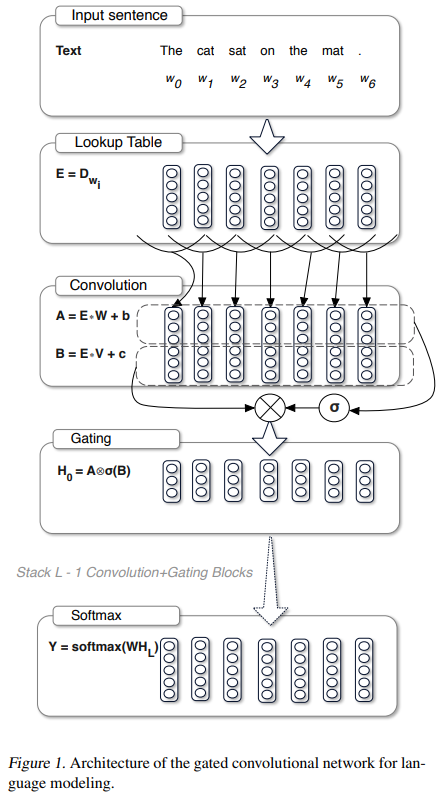
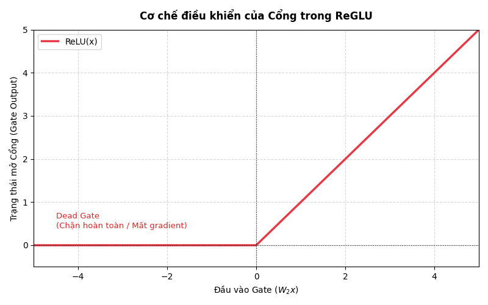
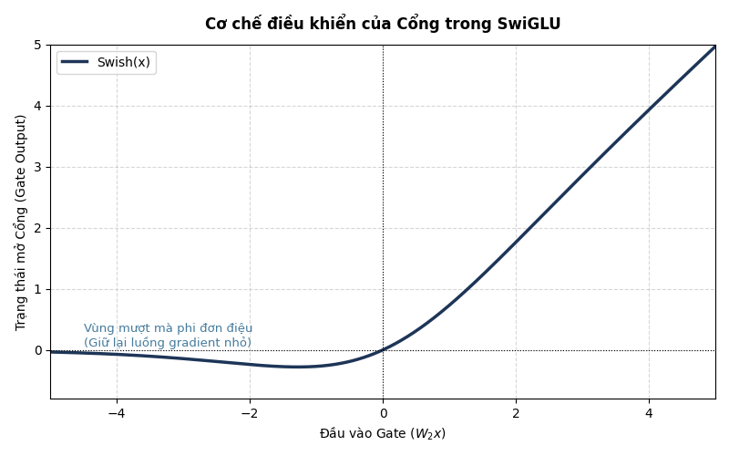

# Appendix: GLU Variants and Gated Feed Forward Networks

> A Scientific Survey of Gated Linear Unit Variants from CNNs to Modern Large Language Models


<p align="center">
  
</p>

---

# Mục lục

1. Giới thiệu
2. Nguồn gốc của Gating
3. Sự ra đời của GLU
4. Họ kiến trúc GLU
5. Bilinear Unit
6. GLU
7. ReGLU
8. GEGLU
9. SwiGLU
10. Các biến thể mở rộng
11. Gating và Mixture of Experts
12. Gating trong LLM hiện đại
13. So sánh toàn diện
14. Hướng nghiên cứu tương lai
15. Tài liệu tham khảo

---

# 1. Giới Thiệu

Khi đọc bài báo:

> GLU Variants Improve Transformer (Noam Shazeer, 2020)

nhiều người thường nghĩ rằng GLU là một kỹ thuật mới xuất hiện trong Transformer.

Thực tế không phải vậy.

Ý tưởng Gating đã tồn tại từ rất lâu trong:

* Neural Networks
* Recurrent Neural Networks
* Highway Networks
* CNN Language Models
* Mixture of Experts

Transformer chỉ là giai đoạn mới nhất của sự tiến hóa này.

---

# 2. Nguồn Gốc Của Gating

Trong Machine Learning, một trong những vấn đề quan trọng là:

> Làm thế nào để mạng tự quyết định thông tin nào nên được truyền tiếp?

Một lớp tuyến tính thông thường:

$$
y = Wx
$$

không có khả năng lựa chọn thông tin.

Mọi đặc trưng đều được xử lý như nhau.

---

## Ý tưởng Gating

Thêm một tín hiệu điều khiển:

$$
y=f(x)\odot g(x)
$$

Trong đó:

* (f(x)): Feature Stream
* (g(x)): Gate Stream

---

## Minh họa

```text
                Feature Stream
                       │
                       ▼
                    Feature
                       │
                       ▼
                       ×
                       ▲
                       │
                     Gate
                       ▲
                       │
                 Gate Stream
```

Gate quyết định:

```text
0  → chặn hoàn toàn

1  → truyền hoàn toàn

0.5 → truyền một phần
```

---

# 3. Sự Ra Đời Của GLU

Bài báo:

> Language Modeling with Gated Convolutional Networks
>
> Dauphin et al. (2017)

đề xuất:

## Gated Linear Unit

$$
GLU(x)= (Ax+b) \odot \sigma(Cx+d)
$$

---

## Kiến trúc

```text
                     Input
                       │
        ┌──────────────┴──────────────┐
        │                             │
        ▼                             ▼
     Linear A                      Linear B
        │                             │
        ▼                             ▼
     Feature                      Sigmoid
        │                             │
        └────────────⊙────────────────┘
                     │
                     ▼
                  Output
```

Đây là biến thể GLU nguyên thủy.

---

# 4. Họ Kiến Trúc GLU

Sau nhiều năm nghiên cứu, GLU phát triển thành một họ kiến trúc.

```text
GLU Family

                GLU
                 │
      ┌──────────┼──────────┐
      │          │          │
      ▼          ▼          ▼
 Bilinear     ReGLU      GEGLU
                              │
                              ▼
                           SwiGLU
                              │
                              ▼
                      Modern LLMs
```

---

# 5. Bilinear Unit

Đây là dạng đơn giản nhất.

$$
Bilinear(x)= (W_1x) \odot (W_2x)
$$

---

## Đặc điểm

Không sử dụng activation.

```text
Feature × Feature
```

---

## Minh họa

```text
Input
 │
 ├──────────────┐
 │              │
 ▼              ▼
Linear      Linear
 │              │
 ▼              ▼
Feature A   Feature B
 │              │
 └──────⊙───────┘
        │
        ▼
      Output
```

---

## Ý nghĩa

Đây là phép tương tác bậc hai:

$$
x_i x_j
$$

giữa các đặc trưng.

---

# 6. GLU

GLU sử dụng Sigmoid làm gate.

$$
GLU(x)= (W_1x) \odot \sigma(W_2x)
$$

---

## Ưu điểm

Gate luôn nằm trong:

$$
[0,1]
$$

---

## Nhược điểm

Sigmoid dễ bão hòa.

```text
x << 0

Gate ≈ 0

Gradient ≈ 0
```

---

```text
x >> 0

Gate ≈ 1

Gradient ≈ 0
```

---

## Hệ quả

Gradient bị suy giảm.

Khó mở rộng lên mô hình cực lớn.

---

# 7. ReGLU

Noam Shazeer thay thế Sigmoid bằng ReLU.

$$
ReGLU(x)= (W_1x) \odot ReLU(W_2x)
$$

---

## Ý tưởng

Loại bỏ vấn đề saturation của Sigmoid.

---

## Minh họa

```text
Gate

        /
       /
      /
_____/
```



---

## Hạn chế

Vẫn tồn tại:

```text
Dead Gate
```

ở vùng âm.

---

# 8. GEGLU

GEGLU:

$$
GEGLU(x)= (W_1x) \odot GELU(W_2x)
$$

---

## Động cơ

GELU là activation của:

* BERT
* T5

và đã chứng minh khả năng tối ưu vượt ReLU.

---

## Kiến trúc

```text
Input
 │
 ├──────────────┐
 │              │
 ▼              ▼
Linear      Linear
 │              │
 ▼              ▼
Feature      GELU
 │              │
 └──────⊙───────┘
        │
        ▼
      Output
```

---

## Ý nghĩa hình học

Thay vì:

```text
Keep / Drop
```

GEGLU thực hiện:

```text
Soft Selection
```

---

## Vai trò

GEGLU trở thành FFN chính thức trong:

* T5
* mT5
* UL2

---

# 9. SwiGLU

Bước tiến hóa tiếp theo.

$$
SwiGLU(x)= (W_1x) \odot Swish(W_2x)
$$

---

với:

$$
Swish(x)= x\sigma(x)
$$

---

## Minh họa

```text
Gate

          /
        /
      /
____/
```



---

## Đặc điểm

Swish:

* smooth
* differentiable
* non-monotonic

---

## Ý nghĩa

Gate không còn là:

```text
On / Off
```

mà trở thành:

```text
Continuous Controller
```

---

## Hiện trạng

SwiGLU hiện là tiêu chuẩn của:

* PaLM
* LLaMA
* Gemma
* Mistral
* Mixtral
* DeepSeek
* Qwen
* Phi

---

# 10. Các Biến Thể Mở Rộng

Ngoài bài báo của Shazeer còn xuất hiện nhiều biến thể nghiên cứu.

---

## ELU-GLU

$$
Feature \times ELU(Gate)
$$

---

## MishGLU

$$
Feature \times Mish(Gate)
$$

---

Mish:

$$
x\tanh(softplus(x))
$$

---

## SnakeGLU

Dùng Snake Activation.

Thường gặp trong:

* Audio Models
* Speech Models

---

## RationalGLU

Sử dụng Rational Activation.

Mục tiêu:

```text
Gần đúng activation phức tạp
nhưng rẻ hơn.
```

---

# 11. Gating Và Mixture of Experts

Một góc nhìn thú vị:

GLU thực chất là một phiên bản đơn giản của:

> Mixture of Experts

---

## GLU

```text
Feature
 ×
Gate
```

---

## MoE

```text
Expert
 ×
Router
```

---

So sánh:

```text
GLU
 └─ Token-level gating

MoE
 └─ Expert-level gating
```

---

## Quan hệ tiến hóa

```text
GLU
  │
  ▼
Conditional Computation
  │
  ▼
Sparse Gating
  │
  ▼
Mixture of Experts
```

---

# 12. Gating Trong LLM Hiện Đại

Một Transformer Block hiện đại:

```text
Input
 │
 ▼
RMSNorm
 │
 ▼
Attention
 │
 ▼
Residual
 │
 ▼
RMSNorm
 │
 ▼
SwiGLU
 │
 ▼
Residual
 │
 ▼
Output
```

---

Trong thực tế:

```text
Attention
  → tìm thông tin

SwiGLU
  → xử lý thông tin
```

Nhiều nghiên cứu gần đây cho thấy:

FFN đóng góp phần lớn năng lực biểu diễn của LLM.

---

# 13. So Sánh Toàn Diện

| Variant  | Gate    | Smooth | Saturation    | LLM Modern     |
| -------- | ------- | ------ | ------------- | -------------- |
| Bilinear | None    | ✓      | Không         | Không          |
| GLU      | Sigmoid | ✓      | Có            | Không          |
| ReGLU    | ReLU    | ✗      | Không         | Hiếm           |
| GEGLU    | GELU    | ✓      | Rất ít        | Có             |
| SwiGLU   | Swish   | ✓✓     | Gần như không | Chuẩn hiện nay |

---

## Thứ tự phát triển

```text
Bilinear
   │
   ▼
GLU
   │
   ▼
ReGLU
   │
   ▼
GEGLU
   │
   ▼
SwiGLU
   │
   ▼
Modern LLMs
```

---

# 14. Hướng Nghiên Cứu Tương Lai

Các hướng nghiên cứu hiện nay:

### Adaptive Gating

Gate thay đổi theo:

```text
Layer
Token
Context
```

---

### Dynamic Activation

Tự học activation function.

---

### Neural Gate Search

Tự động tìm gate tối ưu.

---

### MoE + SwiGLU

Kết hợp:

```text
Sparse Expert Routing
+
Continuous Gating
```

---

# 15. Kết Luận

Lịch sử của GLU thực chất là lịch sử tiến hóa của cơ chế kiểm soát thông tin trong mạng neural.

```text
LSTM / GRU
      │
      ▼
Highway Networks
      │
      ▼
GLU
      │
      ▼
GEGLU
      │
      ▼
SwiGLU
      │
      ▼
PaLM
      │
      ▼
LLaMA
      │
      ▼
Modern LLMs
```

Từ góc nhìn hiện đại:

> Attention quyết định thông tin cần truy xuất.

> SwiGLU quyết định thông tin được xử lý như thế nào.

Hai thành phần này tạo nên nền tảng của hầu hết các kiến trúc Transformer quy mô lớn hiện nay.

---

# Tài Liệu Tham Khảo

```bibtex
@article{dauphin2017glu,
  title={Language Modeling with Gated Convolutional Networks},
  author={Dauphin et al.},
  year={2017}
}

@article{shazeer2020glu,
  title={GLU Variants Improve Transformer},
  author={Noam Shazeer},
  year={2020}
}

@article{xue2021mt5,
  title={mT5},
  author={Xue et al.},
  year={2021}
}

@article{chowdhery2022palm,
  title={PaLM},
  author={Chowdhery et al.},
  year={2022}
}
```
