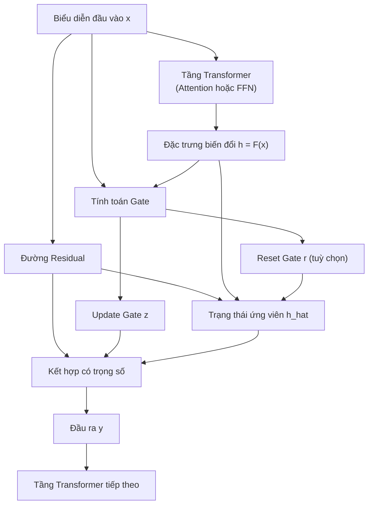
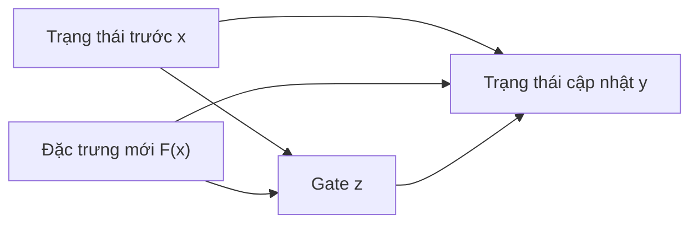
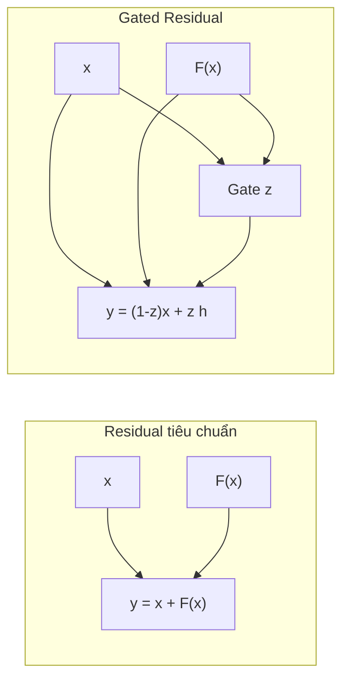
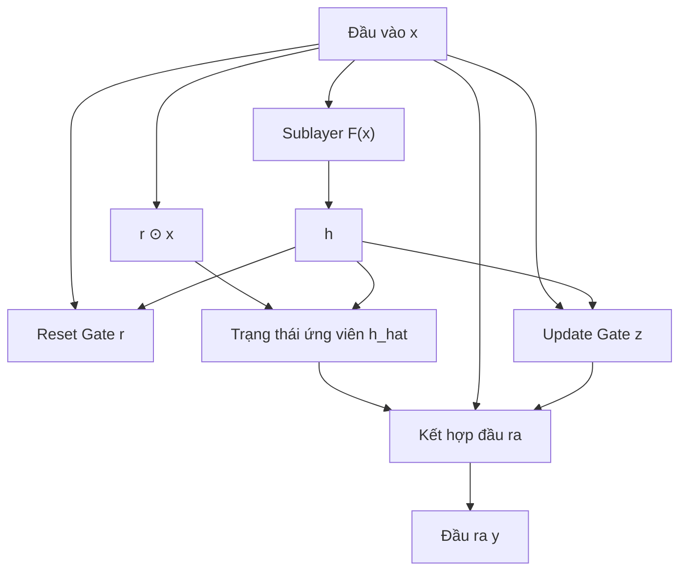
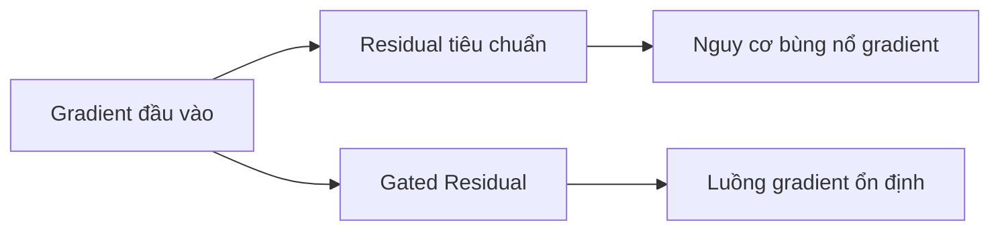
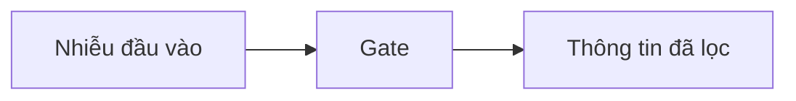
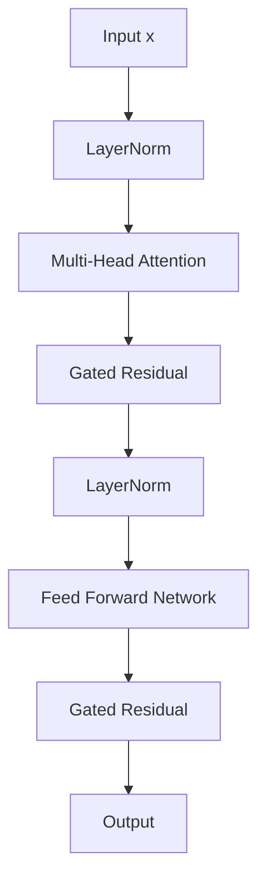
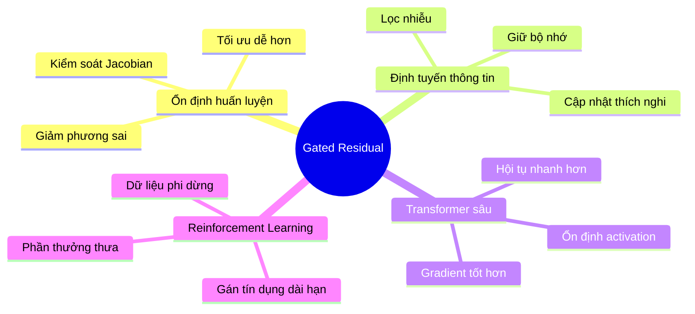
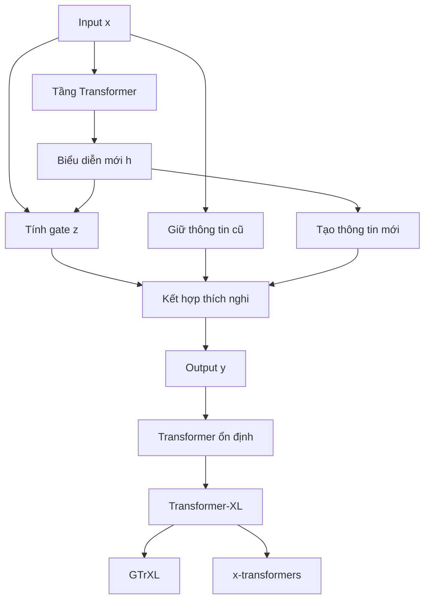

# Gated Residual Connections - Overview Diagram

> Tổng quan kiến trúc, luồng thông tin, công thức toán học và vai trò của Gated Residual trong Transformer và GTrXL.

---

# 1. Big Picture



---

# 2. Information Flow



Residual connection trở thành:

```math
y = (1-z)\odot x + z\odot h
```

thay vì:

```math
y = x + h
```

---

# 3. Comparison with Standard Residual



---

# 4. Mathematical Overview

```text
Đầu vào:
    x

1. h = F(x)

2. Tính gate

       z = sigmoid(W[x, h] + b)

3. Kết hợp residual có cổng

       y = (1-z) ⊙ x
           + z ⊙ h
```

---

# 5. GRU-Style Gated Residual (GTrXL)



Mathematically,

```math
r=\sigma(W_r[h,x])
```

```math
z=\sigma(W_z[h,x]-b_g)
```

```math
\hat h=\tanh(W_g(r\odot x)+U_gh)
```

```math
y=(1-z)\odot x + z\odot \hat h
```

---

# 6. Gradient Stabilization Mechanism



Jacobian:

```math
\frac{\partial y}{\partial x} = (1-z) + z \frac{\partial \hat h}{\partial x}
```

The gate acts as an adaptive regulator of gradient magnitude.

---

# 7. Information Filtering Perspective



Gate học được:

- giữ lại thông tin quan trọng;
- loại bỏ cập nhật nhiễu;
- điều khiển luồng đặc trưng.

---

# 8. Position inside a Transformer Block



---

# 9. Why Gated Residual Works



---

# 10. Overall Summary



---

# Key Takeaways

```text
Standard Residual:
y = x + F(x)

Gated Residual:
y = (1-z)x + zh

GRU-Gated Residual:
y = (1-z)x + z h_hat
```

Gated Residual transforms the residual pathway from a fixed additive operation into a learnable information routing mechanism that:

✓ stabilizes optimization

✓ improves gradient propagation

✓ filters noisy updates

✓ enables deeper Transformers

✓ forms one of the core ideas behind GTrXL and modern x-transformers.
