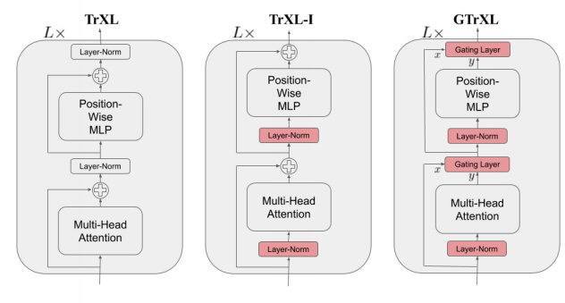
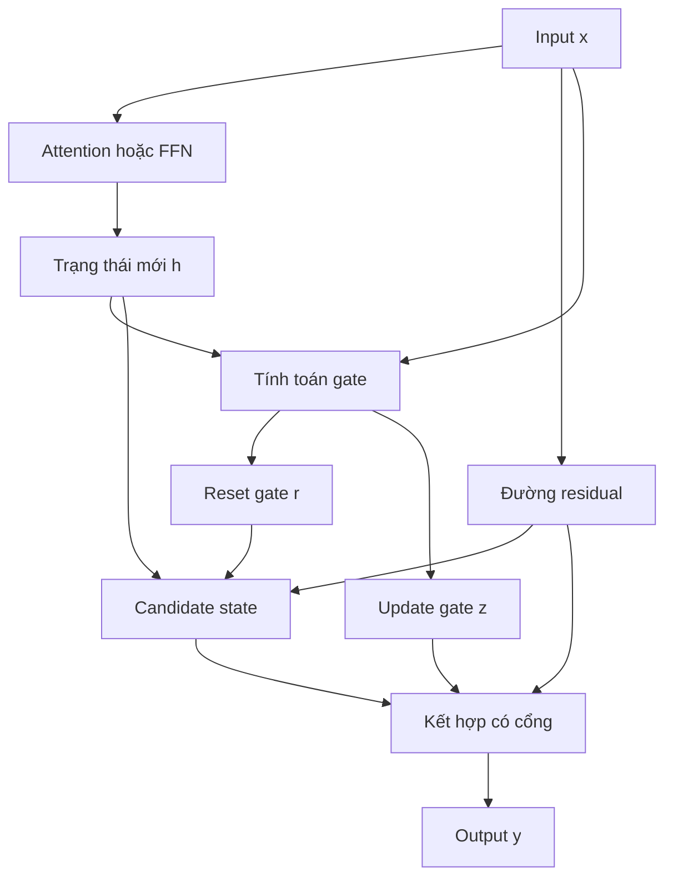

# Kết Nối Tắt Có Cổng (Gated Residual Connections) trong Transformer

> Cơ chế định tuyến thông tin động giúp tối ưu hóa ổn định và xây dựng các Transformer rất sâu.

<p align="center">
  
</p>

---

# 1. Giới thiệu

Kết nối tắt (Residual Connection) là một trong những thành phần nền tảng của kiến trúc Transformer. Trong một tầng Transformer tiêu chuẩn, đầu ra được tính bởi:

```math
\mathbf{y} = \mathbf{x} + F(\mathbf{x})
```

trong đó:

* $\mathbf{x}$ là biểu diễn đầu vào;
* $F(\cdot)$ là phép biến đổi, chẳng hạn như Multi-Head Self-Attention (MHSA) hoặc Feed Forward Network (FFN).

Residual connection giúp:

* giảm hiện tượng tiêu biến gradient (vanishing gradient);
* cho phép huấn luyện các mạng rất sâu;
* cải thiện khả năng lan truyền gradient.

Tuy nhiên, đối với các Transformer rất sâu hoặc các môi trường phi dừng như Reinforcement Learning (RL), phép cộng residual đơn giản có thể gây ra nhiều vấn đề:

1. Tích lũy các biểu diễn nhiễu.
2. Bùng nổ phương sai của activation.
3. Gradient không ổn định.
4. Hiện tượng over-smoothing của các trạng thái ẩn.

Để khắc phục các hạn chế này, Parisotto và cộng sự (2019) đã đề xuất **Gated Residual Connections**, đưa vào một cơ chế học được nhằm điều khiển động lượng thông tin mới được đưa vào dòng residual.

---

# 2. Động cơ khoa học

Residual tiêu chuẩn giả định rằng mọi tầng đều đóng góp như nhau:

```math
\mathbf{y} = \mathbf{x} + F(\mathbf{x})
```

Giả định này thường không tối ưu vì:

* một số tầng tạo ra thông tin dư thừa;
* một số cập nhật mang nhiều nhiễu;
* một số đặc trưng nên được bảo toàn thay vì bị ghi đè.

Ý tưởng cốt lõi của Gated Residual là:

> Mô hình phải học được **bao nhiêu thông tin cần được giữ lại** và **bao nhiêu thông tin cần được cập nhật**.

Kết nối residual trở thành:

```math
\mathbf{y} = (1-\mathbf{z}) \odot \mathbf{x} + \mathbf{z} \odot \mathbf{h}
```

trong đó:

* $\mathbf{h}$ là biểu diễn mới sau phép biến đổi;
* $\mathbf{z}$ là vector cổng (gate) có thể học được;
* $\odot$ là phép nhân từng phần tử.

Khi:

```math
\mathbf{z}\approx 0
```

mô hình gần như giữ nguyên thông tin cũ.

Khi:

```math
\mathbf{z}\approx 1
```

mô hình cập nhật mạnh bằng thông tin mới.

---

# 3. Tổng quan kiến trúc

```text
Input x
   │
   ├─────────────┐
   │             │
   │             ▼
   │         Sublayer F(x)
   │             │
   │             ▼
   │        Gate Computation
   │             │
   └──────► Gated Merge
                  │
                  ▼
               Output
```

---

# 4. Công thức toán học

## Bước 1: Biến đổi qua Sublayer

```math
\mathbf{h} = F(\mathbf{x})
```

---

## Bước 2: Tính toán Gate

```math
\mathbf{z} = \sigma \left( W_z [\mathbf{x};\mathbf{h}] + b_z \right)
```

trong đó:

* $[\mathbf{x};\mathbf{h}]$ là phép nối vector;
* $W_z$ là ma trận trọng số của gate;
* $\sigma(\cdot)$ là hàm sigmoid.

---

## Bước 3: Kết hợp Residual

```math
\mathbf{y} = (1-\mathbf{z})\odot\mathbf{x} + \mathbf{z}\odot\mathbf{h}
```

Công thức này biến residual connection thành một cơ chế định tuyến thông tin thích nghi.

---

# 5. Gated Residual kiểu GRU (GTrXL)

Bài báo gốc sử dụng cơ chế lấy cảm hứng từ GRU.

## Reset Gate

```math
\mathbf{r} = \sigma \left( W_r[\mathbf{h};\mathbf{x}] \right)
```

## Update Gate

```math
\mathbf{z} = \sigma \left( W_z[\mathbf{h};\mathbf{x}] - b_g \right)
```

## Candidate State

```math
\hat{\mathbf{h}} = \tanh \left( W_g (\mathbf{r}\odot\mathbf{x}) + U_g\mathbf{h} \right)
```

## Trạng thái đầu ra

```math
\mathbf{y} = (1-\mathbf{z})\odot\mathbf{x} + \mathbf{z}\odot\hat{\mathbf{h}}
```

Kiến trúc này được gọi là **Gated Transformer-XL (GTrXL)**.

---

# 6. Phân tích Gradient

Đối với residual tiêu chuẩn:

```math
\frac{\partial \mathbf{y}} {\partial \mathbf{x}} = I + \frac{\partial F} {\partial \mathbf{x}}
```

Đối với mạng rất sâu:

```math
\prod_{l} \left( I + \frac{\partial F_l} {\partial \mathbf{x}} \right)
```

có thể dẫn đến:

* bùng nổ activation;
* gradient không ổn định.

Đối với Gated Residual:

```math
\frac{\partial \mathbf{y}} {\partial \mathbf{x}} = (1-\mathbf{z}) + \mathbf{z} \frac{\partial \hat{\mathbf{h}}} {\partial \mathbf{x}}
```

Gate hoạt động như một bộ điều tiết phổ Jacobian, từ đó cải thiện đáng kể tính ổn định của quá trình tối ưu.

---

# 7. Diễn giải luồng thông tin

Residual tiêu chuẩn:

```text
x ─────────► y
 \
  \
   F(x)
```

Gated Residual:

```text
                 z
                  │
x ───────┐         ▼
         ├──► Weighted Sum ───► y
h = F(x) ┘
```

Mô hình học được:

* khi nào nên ghi nhớ;
* khi nào nên cập nhật;
* khi nào nên loại bỏ nhiễu.

---

# 8. Thuật toán

```text
Input:
    x

1. h = F(x)

2. r = sigmoid(Wr[h, x])

3. z = sigmoid(Wz[h, x] - bg)

4. h_hat =
       tanh(
            Wg(r ⊙ x)
            +
            Ug h
           )

5. y =
       (1 - z) ⊙ x
       +
       z ⊙ h_hat

Return y
```

---

# 9. Độ phức tạp tính toán

Giả sử chiều ẩn là $d$.

### Residual tiêu chuẩn

```math
\mathcal{O}(d)
```

### Gated Residual

```math
\mathcal{O}(d^2)
```

do cần thêm các phép chiếu tuyến tính.

Tuy nhiên, so với độ phức tạp của self-attention:

```math
\mathcal{O}(n^2 d)
```

chi phí bổ sung là tương đối nhỏ.

---

# 10. Tại sao Gated Residual giúp tăng tính ổn định?

Các bài toán Reinforcement Learning thường có:

* gradient phương sai cao;
* phần thưởng thưa;
* phân phối dữ liệu phi dừng.

Residual tiêu chuẩn truyền nhiễu qua toàn bộ các tầng:

```text
noise
  ↓
layer1
  ↓
layer2
  ↓
layer3
```

Trong khi đó, Gated Residual hoạt động như một bộ lọc thích nghi:

```text
noise
  ↓
gate
  ↓
filtered update
```

Do đó, nó cải thiện đáng kể:

* tính ổn định tối ưu;
* khả năng gán tín dụng dài hạn (long-horizon credit assignment).

---

# 11. Tích hợp trong x-transformers

```python
from x_transformers import TransformerWrapper, Decoder

model = TransformerWrapper(
    num_tokens = 20000,
    max_seq_len = 1024,
    max_mem_len = 2048,
    attn_layers = Decoder(
        dim = 512,
        depth = 6,
        heads = 16,
        gate_residual = True
    )
)
```

Thiết lập:

```python
gate_residual = True
```

sẽ thay thế:

```math
\mathbf{x} + F(\mathbf{x})
```

bằng cơ chế residual có cổng theo kiểu GRU.

---

# 12. Kiến trúc tổng thể



---

# 13. So sánh với Residual tiêu chuẩn

| Thuộc tính             | Residual      | Gated Residual |
| ---------------------- | ------------- | -------------- |
| Cập nhật thích nghi    | Không         | Có             |
| Điều tiết gradient     | Không         | Có             |
| Lọc thông tin          | Không         | Có             |
| Độ ổn định huấn luyện  | Trung bình    | Cao            |
| Transformer rất sâu    | Khó           | Tốt hơn        |
| Reinforcement Learning | Không ổn định | Ổn định        |

---

# 14. Kết luận

Gated Residual biến phép cộng residual:

```math
\mathbf{x} + F(\mathbf{x})
```

thành:

```math
(1-\mathbf{z})\odot\mathbf{x} + \mathbf{z}\odot\hat{\mathbf{h}}
```

Nhờ đó, mô hình có khả năng:

1. bảo toàn thông tin hữu ích;
2. loại bỏ cập nhật nhiễu;
3. ổn định quá trình lan truyền gradient;
4. hỗ trợ huấn luyện các Transformer rất sâu.

Vì vậy, Gated Residual trở thành một trong những cải tiến quan trọng trên con đường phát triển từ Transformer-XL đến các kiến trúc hiện đại như `x-transformers`.

---

# Tài liệu tham khảo

```bibtex
@article{parisotto2019stabilizing,
  title={Stabilizing Transformers for Reinforcement Learning},
  author={Parisotto, Emilio and Song, Francis and Rae, Jack and Pascanu, Razvan and Gulcehre, Caglar and Jayakumar, Siddhant and Jaderberg, Max and Kaufman, Raphael and Clark, Aidan and Lillicrap, Timothy and others},
  journal={arXiv preprint arXiv:1910.06764},
  year={2019}
}
```

```bibtex
@misc{wang2024xtransformers,
  author = {Phil Wang},
  title = {x-transformers},
  howpublished = {\url{https://github.com/lucidrains/x-transformers}},
  year = {2024}
}
```
