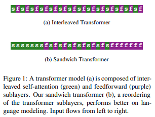
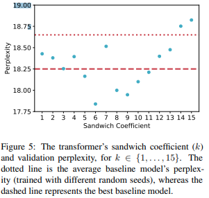

# Improving Transformer Models by Reordering their Sublayers

> **Paper:** Improving Transformer Models by Reordering their Sublayers
> **Authors:** Ofir Press, Noah A. Smith, Mike Lewis
> **Year:** 2019
> **ArXiv:** https://arxiv.org/abs/1911.03864

<p align="center">
  
</p>

<p align="center">
  
</p>

---

# 1. Introduction

Kiến trúc Transformer nguyên bản được giới thiệu trong *Attention Is All You Need* (Vaswani et al., 2017) sử dụng một cấu trúc cố định gồm hai phép biến đổi chính:

1. Multi-Head Self-Attention (MHA)
2. Position-wise Feed Forward Network (FFN)

Mỗi tầng Transformer được xây dựng theo dạng:

$$
\text{Layer}(x)= \text{FFN} \left( \text{Attention}(x) \right)
$$

và toàn bộ mô hình được tạo thành bằng cách lặp lại mẫu:

$$
A \rightarrow F \rightarrow A \rightarrow F \rightarrow \cdots
$$

trong đó:

* (A): Self-Attention
* (F): FeedForward Network

Cấu trúc này đã trở thành tiêu chuẩn trong BERT, GPT, T5, RoBERTa và hầu hết các kiến trúc Transformer hiện đại.

Tuy nhiên, Press et al. (2019) đặt ra câu hỏi:

> Liệu việc xen kẽ Attention và FeedForward theo tỷ lệ 1:1 có thực sự là lựa chọn tối ưu?

---

# 2. Motivation

Transformer bao gồm hai cơ chế có bản chất hoàn toàn khác nhau.

## 2.1 Self-Attention

Self-Attention thực hiện quá trình truyền thông tin giữa các token.

Cho tập biểu diễn:

$$
X \in \mathbb{R}^{n \times d}
$$

Attention được tính bằng:

$$
Q = XW_Q
$$

$$
K = XW_K
$$

$$
V = XW_V
$$

và:

$$
\text{Attention}(Q,K,V)= \text{softmax} \left( \frac{QK^T}{\sqrt{d_k}} \right) V
$$

Bản chất của Attention là:

$$
\text{Information Routing}
$$

hay quá trình trao đổi thông tin toàn cục giữa các token.

---

## 2.2 FeedForward Network

FFN hoạt động độc lập trên từng token:

$$
\text{FFN}(x)= W_2 \sigma(W_1 x)
$$

Trong đó:

* Không có tương tác giữa các token.
* Không thực hiện truyền thông tin.

Vai trò của FFN là:

$$
\text{Information Processing}
$$

hay biến đổi phi tuyến biểu diễn đã được Attention tổng hợp.

---

Do đó có thể xem:

$$
\text{Attention}= \text{Communication}
$$

$$
\text{FeedForward}= \text{Computation}
$$

Đây chính là cơ sở hình thành giả thuyết của bài báo.

---

# 3. Central Hypothesis

Các tác giả lập luận rằng:

> Nếu mục tiêu của Attention là trao đổi thông tin toàn cục, thì có thể nên thực hiện nhiều bước Attention liên tiếp trước khi áp dụng các bước xử lý phi tuyến của FFN.

Thay vì:

$$
A \rightarrow F \rightarrow A \rightarrow F
$$

ta có thể tổ chức:

$$
A \rightarrow A \rightarrow A
$$

sau đó:

$$
F \rightarrow F \rightarrow F
$$

Ý tưởng này dẫn tới kiến trúc **Sandwich Transformer**.

---

# 4. Sandwich Transformer

## 4.1 Core Idea

Thay vì duy trì tỷ lệ:

$$
1:1
$$

giữa Attention và FeedForward, mô hình cho phép gom các lớp Attention về phía đầu mạng và các lớp FeedForward về phía cuối mạng.

Kiến trúc tổng quát:

```text
Input
  │
  ▼

Attention Block
Attention Block
Attention Block
...
Attention Block

  │
  ▼

FeedForward Block
FeedForward Block
FeedForward Block
...
FeedForward Block

  │
  ▼

Output
```

Điều này tạo thành cấu trúc giống một chiếc sandwich, từ đó xuất hiện tên gọi:

$$
\textbf{Sandwich Transformer}
$$

---

# 5. Sandwich Coefficient

Bài báo giới thiệu tham số:

$$
c
$$

gọi là **Sandwich Coefficient**.

Tham số này xác định mức độ tái sắp xếp giữa các lớp Attention và FeedForward.

Trong thư viện x-transformers:

```python
Encoder(
    dim = 512,
    depth = 12,
    sandwich_coef = 6
)
```

các tầng sẽ được phân bố lại thay vì xen kẽ hoàn toàn.

Các tác giả quan sát rằng:

$$
c = 6
$$

là một giá trị gần tối ưu trên nhiều tập dữ liệu thực nghiệm.

---

# 6. Information Flow Perspective

Có thể mô tả Transformer chuẩn như:

```text
Communicate
↓
Compute
↓
Communicate
↓
Compute
↓
Communicate
↓
Compute
```

Trong khi Sandwich Transformer hoạt động theo:

```text
Communicate
↓
Communicate
↓
Communicate
↓
Communicate

=

Compute
↓
Compute
↓
Compute
↓
Compute
```

Từ góc nhìn đồ thị:

* Attention tương đương Message Passing.
* FFN tương đương Node Update.

Transformer chuẩn thực hiện:

$$
M \rightarrow U \rightarrow M \rightarrow U
$$

Trong khi Sandwich Transformer thực hiện:

$$
M^k \rightarrow U^m
$$

với:

$$
k,m > 1
$$

Điều này giúp thông tin lan truyền xa hơn trước khi bước xử lý phi tuyến được áp dụng.

---

# 7. Mathematical Formulation

Transformer chuẩn:

$$
h_{l+1}= F(A(h_l))
$$

Sau (L) tầng:

$$
h_L= (F \circ A)^L(h_0)
$$

---

Sandwich Transformer:

$$
h_L= F^m \circ A^n (h_0)
$$

trong đó:

$$
n+m=L
$$

và thông thường:

$$
n > m
$$

ở phần đầu mạng.

---

# 8. Why Does It Work?

## 8.1 Better Context Mixing

Nhiều Attention liên tiếp cho phép thông tin lan truyền xa hơn trong đồ thị token.

Sau (k) lớp Attention:

$$
x_i
$$

có thể tiếp nhận thông tin từ một tập token rộng hơn nhiều so với chỉ một bước truyền thông tin.

---

## 8.2 Stronger Utilization of FFN Capacity

Trong hầu hết các Transformer hiện đại:

$$
\text{Parameters}_{FFN} > \text{Parameters}_{Attention}
$$

Thực tế:

$$
60%-80%
$$

tham số thường nằm trong FFN.

Điều này cho thấy phần lớn năng lực biểu diễn của Transformer nằm ở FeedForward Network chứ không phải Attention.

---

## 8.3 Computational Efficiency

Chi phí của Self-Attention:

$$
O(n^2)
$$

theo chiều dài chuỗi.

Trong khi FFN có độ phức tạp:

$$
O(n)
$$

theo chiều sequence.

Do đó giảm số lượng lớp Attention thường giúp:

* Giảm FLOPs.
* Giảm bộ nhớ.
* Tăng tốc huấn luyện.

---

# 9. Connection to Later Research

Ý tưởng của Sandwich Transformer được xác nhận bởi nhiều nghiên cứu sau này.

Đặc biệt, các nghiên cứu quy mô lớn của NVIDIA chỉ ra rằng:

> Chỉ cần khoảng một phần ba số lớp Attention so với số lớp FeedForward vẫn duy trì hiệu năng tương đương.

Điều này củng cố nhận định rằng:

$$
\text{Attention Layers}
$$

không nhất thiết phải xuất hiện với tần suất giống FFN.

---

# 10. Impact on x-transformers

Một trong những mục tiêu của thư viện x-transformers là mở rộng không gian thiết kế của Transformer.

Thay vì cố định:

$$
A \rightarrow F
$$

x-transformers cho phép:

* Reordering
* Parallelization
* Layer Sharing
* Layer Reduction
* Sandwich Architectures

Thông qua:

```python
sandwich_coef = 6
```

người dùng có thể trực tiếp áp dụng kết quả từ Press et al. (2019).

Điều này phản ánh triết lý cốt lõi của x-transformers:

> Attention và FeedForward nên được xem như các primitive độc lập có thể được tái tổ chức để tạo ra những kiến trúc hiệu quả hơn.

---

# 11. Scientific Significance

Đóng góp quan trọng nhất của bài báo không nằm ở việc tăng điểm benchmark.

Đóng góp lớn nhất là:

> Chứng minh rằng cấu trúc Attention → FeedForward xen kẽ cố định không phải là nguyên lý bắt buộc của Transformer.

Nghiên cứu này mở rộng không gian thiết kế của Transformer từ:

$$
(A \rightarrow F)^L
$$

sang:

$$
\mathcal{P}(A,F)
$$

trong đó thứ tự và tần suất xuất hiện của Attention và FeedForward trở thành các siêu tham số kiến trúc.

Đây là một trong những bước đầu tiên dẫn tới các hướng nghiên cứu hiện đại như:

* x-transformers
* DeepNet
* PaLM
* Parallel Transformer
* Universal Transformer
* Sparse Transformer Variants

---

# References

```bibtex
@article{press2019improving,
  title={Improving Transformer Models by Reordering their Sublayers},
  author={Press, Ofir and Smith, Noah A. and Lewis, Mike},
  journal={arXiv preprint arXiv:1911.03864},
  year={2019}
}
```

```bibtex
@article{vaswani2017attention,
  title={Attention Is All You Need},
  author={Vaswani, Ashish and others},
  journal={NeurIPS},
  year={2017}
}
```
