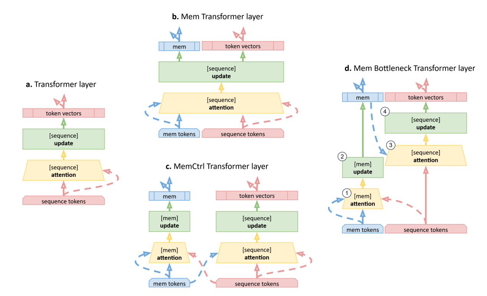

# Memory Transformers
> Learnable Global Memory for Transformer Architectures

---

<p align="center"> 
  
</p> 

<p align="center"> 
 <em>Memory tokens act as persistent information carriers shared across all layers.</em> 
</p>

#### Hình: Các biến thể sửa đổi bộ nhớ của kiến trúc Transformer.
- (a) _Lớp Transformer tiêu chuẩn (Transformer layer)_: Đối với mỗi phần tử trong một chuỗi (mũi tên liền), cơ chế tự chú ý (self-attention) sẽ tạo ra một biểu diễn tổng hợp từ tất cả các phần tử khác (mũi tên đứt nét). Sau đó, biểu diễn tổng hợp này và các biểu diễn phần tử sẽ được kết hợp lại và cập nhật thông qua một lớp mạng kết nối đầy đủ chuyển tiếp (fully-connected feed-forward network layer).

- (b) _Memory Transformer (MemTransformer)_: Thêm các token bộ nhớ [mem] chuyên dụng vào trước chuỗi đầu vào. Chuỗi mở rộng này sau đó được xử lý bằng một lớp Transformer tiêu chuẩn mà không có sự phân biệt nào giữa token [mem] và các phần tử khác của đầu vào.

- (c) _MemCtrl Transformer_: So với MemTransformer, MemCtrl Transformer có thêm một mạng con điều khiển bộ nhớ chuyên dụng (dedicated memory controller sub-network).

- (d) _Memory Bottleneck Transformer (MemBottleneck Transformer)_: Biến thể này cũng sử dụng các token [mem] nhưng tách biệt luồng chú ý của bộ nhớ và luồng chú ý của đầu vào.

    - Bước 1: Các biểu diễn của token [mem] được cập nhật (2) với phạm vi chú ý (1) bao phủ cả phân đoạn bộ nhớ và phân đoạn đầu vào của chuỗi.

    - Bước 2: Các biểu diễn của các phần tử đầu vào được cập nhật (4) chỉ với cơ chế chú ý bộ nhớ (3).

    - Do đó, dòng chảy thông tin được phân phối đến biểu diễn của các phần tử chỉ thông qua bộ nhớ (đóng vai trò như một nút thắt cổ chai - bottleneck).

---

# 1. Giới thiệu

Transformer nguyên thủy chỉ xử lý chuỗi token đầu vào:

$$
X = [x_1,x_2,\ldots,x_n]
$$

Mỗi token phải tự mang theo thông tin của chính nó và trao đổi với các token khác thông qua Self-Attention.

Điều này dẫn đến một số hạn chế:

* Không tồn tại vùng nhớ chuyên dụng.
* Thông tin toàn cục phải lan truyền qua nhiều tầng attention.
* Các token dữ liệu vừa đóng vai trò biểu diễn nội dung vừa đóng vai trò lưu trữ thông tin.
* Attention phải tự học cách phân bổ nơi lưu trữ tri thức.

Để giải quyết vấn đề này, bài báo **Memory Transformers** đề xuất bổ sung một tập các token học được gọi là:

* Memory Tokens
* Register Tokens
* Meta Tokens
* Persistent Memory Tokens

Các token này hoạt động như một vùng nhớ toàn cục bên trong mạng.

---

# 2. Ý tưởng cốt lõi

Transformer chuẩn:

$$
[x_1,x_2,\ldots,x_n]
$$

Memory Transformer:

$$
[m_1,m_2,\ldots,m_k,x_1,x_2,\ldots,x_n]
$$

trong đó:

$$
k \ll n
$$

với:

* $m_i$: memory token
* $x_i$: data token

Memory token không đại diện cho dữ liệu đầu vào.

Chúng là các vector tham số được học trong quá trình huấn luyện.

---

# 3. Kiến trúc tổng quát

```text
                 INPUT TOKENS

        x1  x2  x3  x4 ... xn

                  │
                  ▼

          MEMORY TOKENS

        m1  m2  m3 ... mk

                  │
                  ▼

      ┌───────────────────────┐
      │     Concatenate       │
      └───────────────────────┘

                  │

                  ▼

      [m1 ... mk x1 ... xn]

                  │

          Transformer Layer 1

                  │

          Transformer Layer 2

                  │

                 ...

                  │

          Transformer Layer L

                  │

                  ▼

      Memory Tokens chứa
      thông tin toàn cục

      Data Tokens chứa
      thông tin cục bộ
```

---

# 4. Biểu diễn toán học

Giả sử:

$$
M \in \mathbb{R}^{k\times d}
$$

là ma trận memory.

$$
T \in \mathbb{R}^{n\times d}
$$

là ma trận token đầu vào.

Khi đó:

$$
X = [M;T]
$$

với:

$$
X \in \mathbb{R}^{(k+n)\times d}
$$

Attention được tính như bình thường:

$$
Q=XW_Q
$$

$$
K=XW_K
$$

$$
V=XW_V
$$

$$
A= Softmax \left( \frac{QK^T}{\sqrt d} \right)
$$

Điểm khác biệt duy nhất là memory token hiện tham gia trực tiếp vào attention.

---

# 5. Memory như một bộ nhớ toàn cục

Memory token có thể đọc thông tin từ toàn bộ chuỗi.

```text
          x1
           \
            \
x2 ----------> m1
            /
           /
         xn
```

Sau đó memory token truyền lại thông tin đã tổng hợp cho các token khác.

```text
            m1
          /  |  \
         /   |   \
        ▼    ▼    ▼

       x1   x2   xn
```

Quá trình này tạo thành hai cơ chế:

```text
READ

Data Tokens
      │
      ▼

Memory Tokens
```

```text
WRITE

Memory Tokens
      │
      ▼

Data Tokens
```

---

# 6. Global Information Routing

Trong Transformer chuẩn:

```text
x1 ↔ x2 ↔ x3 ↔ x4 ↔ ...
```

Thông tin phải lan truyền từng bước qua attention.

Memory Transformer tạo thêm đường tắt:

```text
x1
 │
 ▼

Memory

 │
 ▼

xn
```

Khi đó luồng thông tin trở thành:

```text
LOCAL PATH

Token
  │
  ▼
Token


GLOBAL PATH

Token
  │
  ▼

Memory

  │
  ▼

Token
```

Memory token đóng vai trò như một "global workspace".

---

# 7. Memory Tokens như Global Workspace

Có thể xem mỗi token là một tác nhân xử lý thông tin.

```text
Token 1
Token 2
Token 3
...
Token n
```

Memory token hoạt động như bộ nhớ chia sẻ:

```text
          GLOBAL MEMORY

         m1   m2   m3

          ▲   ▲   ▲
         /    |    \
        /     |     \

      Tokens ...
```

Mọi token đều có thể trao đổi thông tin thông qua vùng nhớ này.

---

# 8. So sánh với CLS Token

Trong BERT:

```text
[CLS] x1 x2 x3 ...
```

CLS token được thiết kế để tổng hợp thông tin cuối cùng cho tác vụ phân loại.

Memory Transformer:

```text
m1 m2 m3 m4 x1 x2 x3 ...
```

Khác biệt:

| CLS Token              | Memory Token                  |
| ---------------------- | ----------------------------- |
| Một token              | Nhiều token                   |
| Dùng cho output        | Dùng cho toàn bộ mạng         |
| Chỉ tổng hợp thông tin | Lưu trữ và trao đổi thông tin |
| Thường dùng ở encoder  | Dùng cho encoder và decoder   |

---

# 9. Memory Matrix

Memory token thực chất là các tham số học được:

$$
M= \begin{bmatrix} m_1\ m_2\ \vdots\ m_k \end{bmatrix}
$$

Ví dụ:

$$
k=20
$$

$$
d=512
$$

sẽ tạo:

$$
M\in \mathbb{R}^{20\times512}
$$

Các vector này được tối ưu cùng toàn bộ mô hình bằng backpropagation.

---

# 10. Attention Structure

Attention matrix lúc này có dạng:

```text
          MEMORY      DATA

        ┌───────┬───────────┐
MEMORY  │ M→M   │ M→D       │
        ├───────┼───────────┤
DATA    │ D→M   │ D→D       │
        └───────┴───────────┘
```

Trong đó:

### Memory → Memory

Trao đổi thông tin giữa các memory token.

### Memory → Data

Memory ghi thông tin xuống token dữ liệu.

### Data → Memory

Token dữ liệu cập nhật bộ nhớ.

### Data → Data

Attention chuẩn.

---

# 11. Register Tokens của Meta AI

Meta AI phát hiện hiện tượng:

```text
Activation Outliers
```

Một số token mang giá trị cực lớn.

Giả thuyết được đưa ra:

> Transformer đang thiếu nơi lưu trữ thông tin tạm thời.

Do đó mô hình buộc phải biến một số token dữ liệu thành vùng nhớ bất đắc dĩ.

Meta đề xuất:

```text
Register Tokens
```

thực chất là một dạng Memory Tokens.

```text
Register Tokens

       │
       ▼

Temporary Storage

       │
       ▼

Reduced Outliers
```

Kết quả cho thấy chất lượng attention được cải thiện đáng kể.

---

# 12. Persistent Memory

Một hướng mở rộng hiện đại là:

```text
Persistent Memory
```

Ý tưởng:

Memory token không chỉ là vùng nhớ tạm thời.

Chúng trở thành tri thức được học lâu dài.

```text
Persistent Memory
      │
      ▼

Learned Knowledge
      │
      ▼

Attention Retrieval
```

Memory hoạt động tương tự một cơ sở tri thức nhỏ nằm bên trong mô hình.

---

# 13. Meta Tokens trong Hymba

Kiến trúc Hymba của Nvidia mở rộng ý tưởng này sang mô hình autoregressive.

```text
Past Tokens
      │
      ▼

Current Token
      │
      ▼

Meta Tokens
      │
      ▼

Attention
      │
      ▼

Prediction
```

Meta token đóng vai trò vùng nhớ cố định hỗ trợ quá trình sinh token tiếp theo.

---

# 14. Độ phức tạp tính toán

Chiều dài chuỗi:

$$
n
$$

Số memory token:

$$
k
$$

Độ dài mới:

$$
N=n+k
$$

Attention cost:

$$
O(N^2)
$$

hay:

$$
O((n+k)^2)
$$

Khai triển:

$$
(n+k)^2 = n^2+2nk+k^2
$$

Do:

$$
k \ll n
$$

nên chi phí tăng thêm rất nhỏ.

Ví dụ:

```text
n = 1024
k = 20
```

Overhead thường chỉ vài phần trăm.

---

# 15. Triển khai trong x-transformers

```python
from x_transformers import (
    TransformerWrapper,
    Encoder
)

model = TransformerWrapper(
    num_tokens = 20000,
    max_seq_len = 1024,

    num_memory_tokens = 20,

    attn_layers = Encoder(
        dim = 512,
        depth = 6,
        heads = 8
    )
)
```

Bên trong thư viện:

```text
Learnable Memory Matrix

M ∈ R^(20×512)

          │
          ▼

Input Tokens

X ∈ R^(1024×512)

          │
          ▼

Concatenate

[M ; X]

          │
          ▼

Transformer Layers
```

---

# 16. Quan hệ với các kiến trúc bộ nhớ khác

| Architecture            | Memory Type               |
| ----------------------- | ------------------------- |
| Transformer             | None                      |
| Relative Attention      | Positional Memory         |
| Transformer-XL          | Segment Memory            |
| Compressive Transformer | Compressed Memory         |
| Memorizing Transformer  | Retrieval Memory          |
| RETRO                   | External Database         |
| Memory Transformer      | Learnable Memory Tokens   |
| Register Transformer    | Register Tokens           |
| Persistent Memory       | Persistent Learned Memory |
| Hymba                   | Meta Tokens               |

---

# 17. Góc nhìn lý thuyết

Transformer chuẩn:

$$
\text{Representation}= \text{Attention}
$$

Memory Transformer:

$$
\text{Representation}= \text{Attention} + \text{Global Memory}
$$

Hay tổng quát hơn:

$$
\text{Transformer}= \text{Token Processing} + \text{Persistent Information Routing}
$$

Memory token tạo ra một lớp trung gian chuyên trách cho việc lưu trữ và phân phối thông tin.

Đây là bước chuyển quan trọng từ:

```text
Token-Centric Computation
```

sang:

```text
Token + Memory Computation
```

và là nền tảng cho các hướng nghiên cứu hiện đại như:

* Register Transformers
* Persistent Memory
* Meta Tokens
* Hymba
* x-transformers Memory Layers

---

# 18. Kết luận

Memory Transformers bổ sung một tập các **learnable memory tokens** vào chuỗi đầu vào nhằm tạo ra bộ nhớ toàn cục bên trong mạng Transformer.

Các memory token:

* Tham gia attention ở mọi tầng.
* Thu thập thông tin từ toàn bộ chuỗi.
* Truyền thông tin ngược trở lại token dữ liệu.
* Tạo vùng nhớ chuyên dụng cho mô hình.
* Giảm áp lực lưu trữ lên token dữ liệu.
* Giảm activation outliers.
* Mở đường cho Register Tokens, Persistent Memory và Meta Tokens.

Tư tưởng trung tâm của kiến trúc có thể tóm tắt bằng:

$$
\boxed{ \text{Transformer}= \text{Attention} + \text{Persistent Global Memory} }
$$

Đây là một trong những bước tiến quan trọng trong quá trình phát triển từ Transformer truyền thống đến các kiến trúc bộ nhớ hiện đại trong hệ sinh thái x-transformers và các Large Language Models thế hệ mới.
