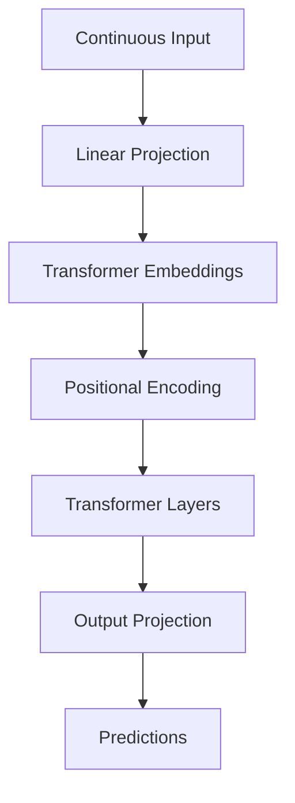
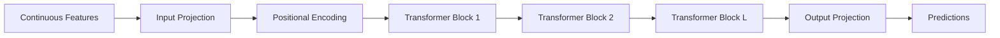

# Continuous Embeddings trong x-Transformers

> Mở rộng Transformer từ dữ liệu rời rạc (Discrete Tokens) sang dữ liệu liên tục (Continuous Signals).

---

# 1. Giới thiệu

## Hạn chế của Embedding truyền thống

Transformer ban đầu được thiết kế cho ngôn ngữ tự nhiên, trong đó đầu vào là các token rời rạc:

$$
x_i \in {1,\dots,V}
$$

Embedding được tra cứu từ bảng:

$$
e_i = E[x_i]
$$

với:

$$
E \in \mathbb{R}^{V\times d}
$$

Cơ chế này giả định:

* đầu vào là chỉ số nguyên;
* không gian đầu vào là hữu hạn;
* số lượng token đã biết trước.

Tuy nhiên nhiều bài toán thực tế không thỏa mãn các giả định trên:

* chuỗi thời gian;
* tín hiệu cảm biến;
* dữ liệu tài chính;
* vector đặc trưng;
* latent representations;
* audio;
* video features;
* embeddings từ mô hình khác.

Trong các trường hợp này, đầu vào là:

$$
x_i \in \mathbb{R}^{d_{in}}
$$

và không thể sử dụng embedding lookup.

---

# 2. Ý tưởng của Continuous Embeddings

Thay vì:

```text
Token ID
     ↓
Embedding Lookup
     ↓
Transformer
```

ta sử dụng:

```text
Continuous Vector
        ↓
Linear Projection
        ↓
Transformer
```

Hay:

$$
h_i = x_iW+b
$$

trong đó:

$$
W \in \mathbb{R}^{d_{in}\times d_{model}}
$$

$$
b \in \mathbb{R}^{d_{model}}
$$

---

# 3. Kiến trúc tổng quát

```text
Input Features
(B,N,din)
       │
       ▼
Linear Projection
       │
       ▼
Model Dimension
(B,N,dmodel)
       │
       ▼
Positional Encoding
       │
       ▼
Transformer Layers
       │
       ▼
Output Projection
       │
       ▼
(B,N,dout)
```

---

# 4. Minh họa bằng Mermaid



---

# 5. Continuous Transformer Wrapper

Trong `x-transformers`:

```python
ContinuousTransformerWrapper(
    dim_in=32,
    dim_out=100,
    max_seq_len=1024,
    attn_layers=Decoder(...)
)
```

Kiến trúc:

```text
Input
(32)
   ↓
Linear
   ↓
Transformer
(512)
   ↓
Linear
   ↓
Output
(100)
```

---

# 6. Phép chiếu đầu vào

Cho:

$$
X \in \mathbb{R}^{B\times N\times d_{in}}
$$

chiếu sang không gian Transformer:

$$
H_0= XW_{in} +b_{in}
$$

với:

$$
W_{in} \in \mathbb{R}^{d_{in}\times d_{model}}
$$

Kết quả:

$$
H_0 \in \mathbb{R}^{B\times N\times d_{model}}
$$

---

# 7. Positional Encoding

Sau khi chiếu:

$$
H = H_0 + P
$$

trong đó:

$$
P \in \mathbb{R}^{N\times d_{model}}
$$

có thể là:

* Absolute Position Embedding;
* Rotary Embedding;
* ALiBi;
* Dynamic Positional Bias.

---

# 8. Attention trên Continuous Embeddings

Sau bước projection, cơ chế attention hoàn toàn giống Transformer chuẩn.

## Query

$$
Q=HW_Q
$$

## Key

$$
K=HW_K
$$

## Value

$$
V=HW_V
$$

Attention:

$$
A = softmax \left( \frac{QK^T} {\sqrt d} \right)
$$

Output:

$$
O=AV
$$

---

# 9. Phép chiếu đầu ra

Transformer sinh:

$$
H_L \in \mathbb{R}^{B\times N\times d_{model}}
$$

Output layer:

$$
Y=H_LW_{out} +b_{out}
$$

với:

$$
W_{out} \in \mathbb{R}^{d_{model}\times d_{out}}
$$

---

# 10. Thuật toán tổng quát

```text
Input:
    X ∈ R(B,N,din)

H0 = X Win + bin

H = H0 + PositionalEmbedding

for l = 1...L:
    H = TransformerLayer(H)

Y = H Wout + bout

return Y
```

---

# 11. Sơ đồ toàn bộ kiến trúc



---

# 12. Kích thước Tensor

Cho:

```text
B : batch size
N : sequence length
din : input dimension
d : model dimension
dout : output dimension
```

Input:

$$
X \in \mathbb{R}^{B\times N\times d_{in}}
$$

Sau projection:

$$
H \in \mathbb{R}^{B\times N\times d}
$$

Output:

$$
Y \in \mathbb{R}^{B\times N\times d_{out}}
$$

---

# 13. Độ phức tạp tính toán

Projection:

$$
O(BNd_{in}d)
$$

Attention:

$$
O(BN^2d)
$$

Output:

$$
O(BNdd_{out})
$$

Do đó bottleneck vẫn là:

$$
O(N^2)
$$

của Self-Attention.

---

# 14. Ý nghĩa khoa học

Continuous Embeddings biến Transformer từ:

```text
Discrete Sequence Model
```

thành:

```text
General Sequence Learner
```

cho phép mô hình xử lý:

* vector liên tục;
* embeddings từ mô hình khác;
* latent space;
* sensor streams;
* time series;
* multimodal features;
* scientific signals.

Đây là bước quan trọng giúp Transformer trở thành kiến trúc học biểu diễn tổng quát thay vì chỉ là mô hình ngôn ngữ.

---

# 15. Vai trò trong x-Transformer

`ContinuousTransformerWrapper` cung cấp:

1. Input Projection
2. Positional Encoding
3. Transformer Layers
4. Output Projection

để biến mọi chuỗi:

$$
X \in \mathbb{R}^{B\times N\times d_{in}}
$$

thành:

$$
Y \in \mathbb{R}^{B\times N\times d_{out}}
$$

mà không cần rời rạc hóa dữ liệu.

Nó là thành phần nền tảng cho:

* Time-Series Transformer
* Audio Transformer
* Diffusion Transformer
* Perceiver-style Models
* Latent Transformer
* Scientific Foundation Models
* Multi-modal Architectures.

---

# Tài liệu tham khảo

1. Vaswani et al., *Attention Is All You Need*, 2017.

2. Tay et al., *x-transformers: A Modular Transformer Library*, 2022.

3. Jaegle et al., *Perceiver IO*, 2021.

4. Dosovitskiy et al., *An Image is Worth 16x16 Words*, 2021.

5. Peebles and Xie, *Scalable Diffusion Models with Transformers*, 2023.

6. https://github.com/lucidrains/x-transformers

7. https://arxiv.org/abs/2112.05329
