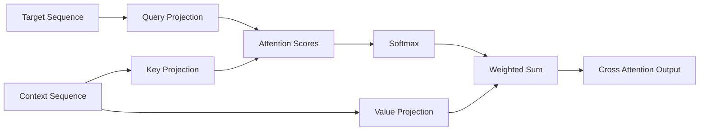
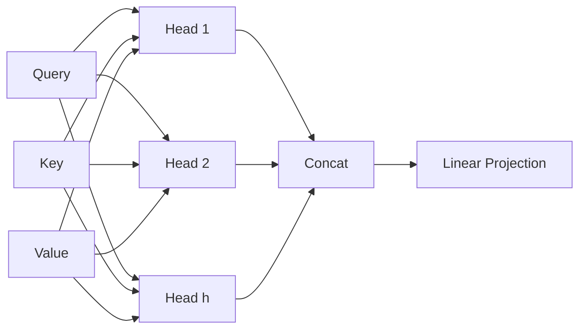
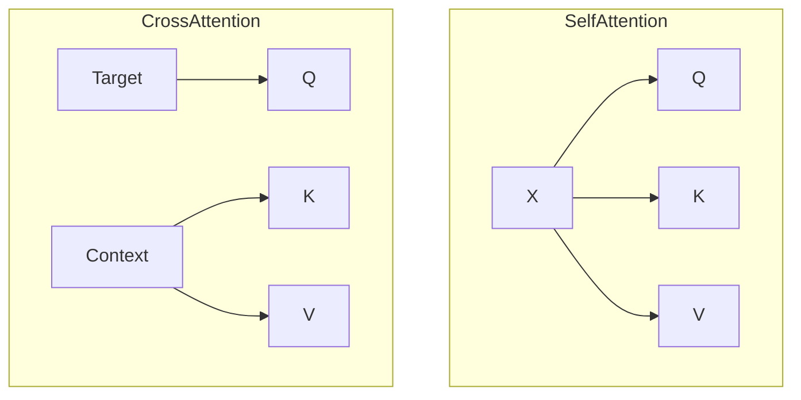
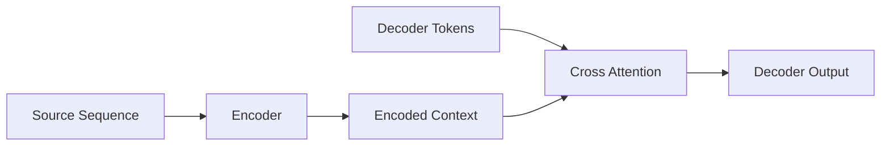
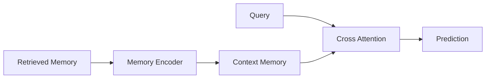
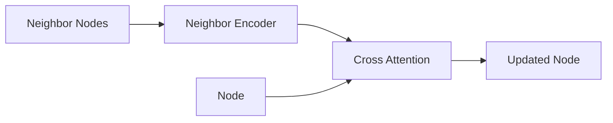
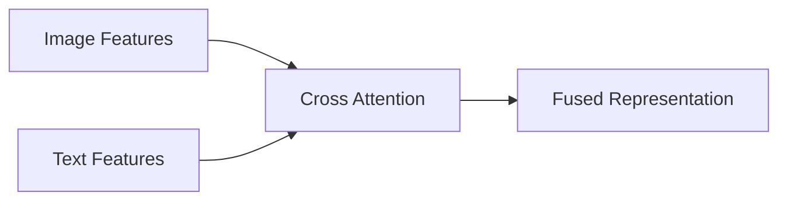
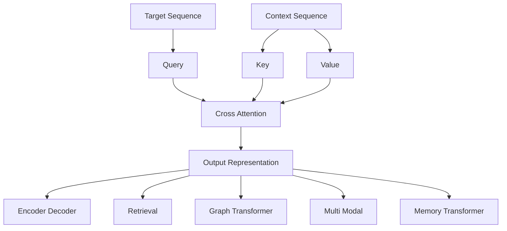

# Cross Attention – Overview

> Minh họa tổng quát kiến trúc **Cross Attention** trong `x-transformers`, nguyên lý toán học, luồng dữ liệu và vai trò trong các kiến trúc Transformer hiện đại.

---

# 1. Cross Attention là gì?

Cross Attention là cơ chế Attention mà:

* **Query (Q)** được sinh từ một chuỗi đích (**Target Sequence**).
* **Key (K)** và **Value (V)** được sinh từ một chuỗi ngữ cảnh (**Context Sequence**).

Khác với Self-Attention:

| Cơ chế          | Query | Key | Value |
| --------------- | ----- | --- | ----- |
| Self-Attention  | X     | X   | X     |
| Cross Attention | X     | C   | C     |

trong đó:

* $X$: Target Sequence
* $C$: Context Sequence

---

# 2. Ý tưởng cốt lõi

```text
Target Sequence
      │
      └───► Query

Context Sequence
      ├───► Key
      └───► Value
```

Mục tiêu:

```math
Target Tokens
      ↓
Tìm kiếm thông tin
      ↓
Context Tokens
      ↓
Tổng hợp biểu diễn mới
```

---

# 3. Kiến trúc tổng quát



---

# 4. Công thức toán học

## Bước 1: Sinh Query

```math
Q = XW_Q
```

## Bước 2: Sinh Key và Value

```math
K = CW_K
```

```math
V = CW_V
```

## Bước 3: Tính Attention Score

```math
S = \frac{QK^T}{\sqrt{d_k}}
```

## Bước 4: Chuẩn hóa

```math
A = softmax(S)
```

## Bước 5: Tổng hợp thông tin

```math
O = AV
```

---

# 5. Pipeline tính toán

```mermaid
flowchart TD

A[Target Sequence]
B[Context Sequence]

A --> C[Linear Q]

B --> D[Linear K]
B --> E[Linear V]

C --> F[QKᵀ]
D --> F

F --> G[Scale by sqrt(d)]
G --> H[Mask]

H --> I[Softmax]

I --> J[Attention Weights]

E --> K[Weighted Sum]

J --> K

K --> L[Output]
```

---

# 6. Multi-Head Cross Attention



---

# 7. Kích thước Tensor

Cho:

```text
B : Batch size
N : Target length
M : Context length
D : Hidden dimension
H : Number of heads
d = D/H
```

### Query

```math
Q \in \mathbb{R}^{B\times N\times D}
```

### Key

```math
K \in \mathbb{R}^{B\times M\times D}
```

### Value

```math
V \in \mathbb{R}^{B\times M\times D}
```

### Attention Matrix

```math
A \in \mathbb{R}^{B\times H\times N\times M}
```

### Output

```math
O \in \mathbb{R}^{B\times N\times D}
```

---

# 8. Cross Attention vs Self Attention



| Thuộc tính                   | Self Attention | Cross Attention |
| ---------------------------- | -------------- | --------------- |
| Nguồn Query                  | Chính nó       | Target          |
| Nguồn Key                    | Chính nó       | Context         |
| Nguồn Value                  | Chính nó       | Context         |
| Tích hợp nhiều nguồn dữ liệu | Không          | Có              |
| Encoder-Decoder              | Không          | Có              |

---

# 9. Độ phức tạp tính toán

Attention Matrix:

```math
A \in \mathbb{R}^{N\times M}
```

Chi phí:

### FLOPs

```math
O(NMd)
```

### Bộ nhớ

```math
O(NM)
```

Nếu:

```math
M \gg N
```

thì chi phí chủ yếu nằm ở context sequence.

---

# 10. Cross Attention trong Encoder-Decoder



---

# 11. Cross Attention trong Retrieval Transformer



---

# 12. Cross Attention trong Graph Transformer



Phương trình Message Passing:

```math
h_i' = \sum_j \alpha_{ij} W_V h_j
```

với:

```math
\alpha_{ij} = softmax \left( \frac{q_i^Tk_j} {\sqrt d} \right)
```

---

# 13. Cross Attention trong Multi-Modal Learning



---

# 14. Cross Attention trong x-transformers

```python
model(
    x,
    context=context,
    mask=mask,
    context_mask=context_mask
)
```

Ý nghĩa:

```text
x               → Query Source
context         → Key/Value Source
mask            → Target Mask
context_mask    → Context Mask
```

---

# 15. Thuật toán tổng quát

```text
Input:
    X : Target Sequence
    C : Context Sequence

Q = XWQ
K = CWK
V = CWV

S = QKᵀ / sqrt(d)

S = S + Mask

A = Softmax(S)

O = AV

return O
```

---

# 16. Tổng kết kiến trúc



---

# Ghi nhớ

* Query đến từ **Target**.
* Key và Value đến từ **Context**.
* Cho phép một tập token truy xuất thông tin từ tập token khác.
* Là thành phần nền tảng của:

  * Encoder-Decoder Transformer.
  * Retrieval-Augmented Transformer.
  * Graph Transformer.
  * Multi-modal Transformer.
  * Memory-Augmented Transformer.
  * Perceiver Architecture.

Cross Attention là cơ chế giúp Transformer tiến hóa từ mô hình xử lý một chuỗi đơn lẻ thành kiến trúc học biểu diễn tổng quát có khả năng tích hợp nhiều nguồn thông tin khác nhau.
