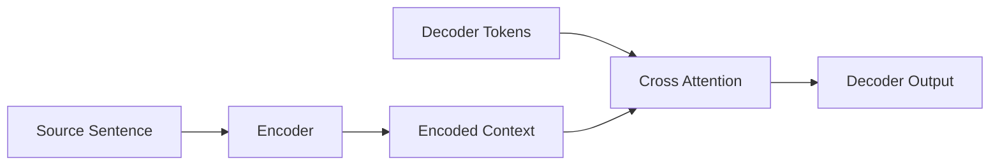
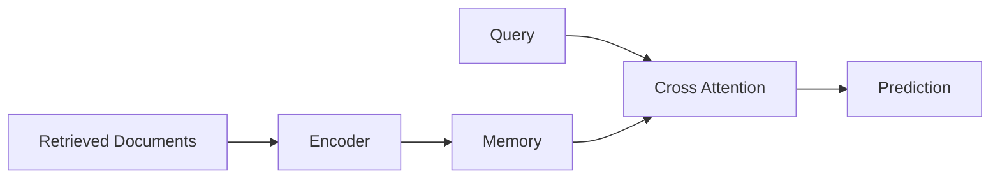
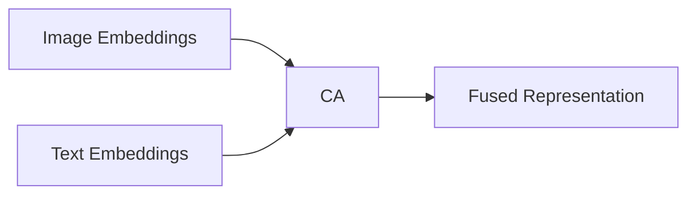

# Cross Attention trong x-Transformers

> Kiến trúc nền tảng cho Encoder-Decoder Transformer, Retrieval-Augmented Models, Multi-Modal Learning và Graph Transformers.

---

# 1. Giới thiệu

## Cross Attention là gì?

Cross Attention (hay Context Attention) là cơ chế Attention mà trong đó:

* **Query (Q)** được sinh từ một chuỗi mục tiêu (target sequence).
* **Key (K)** và **Value (V)** được sinh từ một chuỗi ngữ cảnh khác (context sequence).

Khác với Self-Attention:

| Cơ chế          | Query | Key | Value |
| --------------- | ----- | --- | ----- |
| Self-Attention  | X     | X   | X     |
| Cross-Attention | X     | C   | C     |

với:

* $X$: target sequence
* $C$: context sequence

Cross Attention cho phép một tập token truy xuất thông tin từ một tập token khác.

---

# 2. Động cơ khoa học

Self-Attention chỉ mô hình hóa:

$$
p(x_i | x_{\lt i})
$$

hoặc:

$$
f(X)
$$

trên cùng một không gian token.

Tuy nhiên nhiều bài toán thực tế yêu cầu:

$$
f(X,C)
$$

trong đó:

* $X$: sequence cần xử lý.
* $C$: nguồn thông tin bên ngoài.

Ví dụ:

* Machine Translation
* Retrieval-Augmented Generation (RAG)
* Multi-modal Learning
* Graph Message Passing
* Memory-Augmented Transformer
* Diffusion Models
* Perceiver Architecture

Cross Attention được thiết kế để giải quyết vấn đề này.

---

# 3. Kiến trúc toán học

## Bước 1: sinh Query

Từ target:

$$
Q = XW_Q
$$

---

## Bước 2: sinh Key và Value

Từ context:

$$
K = CW_K
$$

$$
V = CW_V
$$

---

## Bước 3: tính Attention Score

$$
S= \frac{QK^T}{\sqrt{d_k}}
$$

---

## Bước 4: áp dụng mask

$$
S'= S+M
$$

trong đó:

$$
M_{ij}= \begin{cases}
0 & \text{valid}\\
-\infty & \text{padding}
\end{cases}
$$

---

## Bước 5: chuẩn hóa

$$
A= softmax(S')
$$

---

## Bước 6: tổng hợp thông tin

$$
O= AV
$$

---

# 4. Multi-Head Cross Attention

Mỗi head:

$$
head_i= Attention(Q_i,K_i,V_i)
$$

Sau đó:

$$
MultiHead(Q,K,V)= Concat(head_1,\dots,head_h)W_O
$$

---

# 5. Kiến trúc tổng quát

```text
Target Sequence
        │
        ▼
       Query
        │
        │
        ├─────────────┐
        │             │
        ▼             ▼
    Context       Context
      Key           Value
        │             │
        └──────┬──────┘
               ▼
         Attention Scores
               ▼
            Softmax
               ▼
        Weighted Sum(V)
               ▼
             Output
```

---

# 6. Minh họa bằng Mermaid

```mermaid
flowchart TD

A[Target Sequence X]
B[Context Sequence C]

A --> Q[Query Projection]
B --> K[Key Projection]
B --> V[Value Projection]

Q --> S[QKᵀ / sqrt(d)]
K --> S

S --> SM[Softmax]
V --> O[Weighted Sum]

SM --> O
O --> Y[Cross Attention Output]
```

---

# 7. Kích thước Tensor

Cho:

```text
B : batch size
N : target length
M : context length
D : hidden dimension
H : number of heads
d = D/H
```

Kích thước:

```text
Q : (B,N,D)
K : (B,M,D)
V : (B,M,D)
```

Sau chia head:

```text
Q : (B,H,N,d)
K : (B,H,M,d)
V : (B,H,M,d)
```

Attention matrix:

```text
A : (B,H,N,M)
```

Output:

```text
O : (B,N,D)
```

---

# 8. Độ phức tạp tính toán

Attention matrix:

$$
A \in \mathbb{R}^{N\times M}
$$

Chi phí:

## Bộ nhớ

$$
O(NM)
$$

## FLOPs

$$
O(NMd)
$$

---

# 9. Cross Attention trong Encoder-Decoder Transformer



Decoder dùng:

1. Masked Self-Attention
2. Cross Attention
3. Feed Forward

---

# 10. Cross Attention trong Retrieval Models



Mô hình:

* RAG
* RETRO
* Atlas
* Memory Transformer

đều dựa trên Cross Attention.

---

# 11. Cross Attention trong Graph Transformer

Ví dụ trong `x-transformers`:

```python
encoded_neighbors = enc(neighbors)
model(
    nodes,
    context=encoded_neighbors
)
```

Ta có:

```text
node
    ↓
 Query

neighbors
    ↓
 Key, Value
```

Node truy xuất thông tin từ các node lân cận.

Đây chính là:

### Message Passing bằng Attention

$$
h_i'= \sum_j \alpha_{ij}W_Vh_j
$$

với:

$$
\alpha_{ij}= softmax \left( \frac{q_i^Tk_j} {\sqrt d} \right)
$$

---

# 12. Cross Attention trong Multi-Modal Learning



Ứng dụng:

* Flamingo
* BLIP-2
* Perceiver IO
* Kosmos
* GPT-4V style architectures

---

# 13. Cross Attention trong x-Transformers

Thư viện cung cấp:

```python
CrossAttender(
    dim=512,
    depth=6
)
```

Forward:

```python
model(
    x,
    context=context,
    mask=x_mask,
    context_mask=context_mask
)
```

trong đó:

```text
x            → Query source
context      → Key/Value source
mask         → target mask
context_mask → context mask
```

---

# 14. Thuật toán

```text
Input:
    X : target sequence
    C : context sequence

Q = XWQ
K = CWK
V = CWV

S = QKᵀ / sqrt(d)

S = S + Mask

A = Softmax(S)

O = AV

return O
```

---

# 15. Vai trò trong x-Transformer

Cross Attention là thành phần nền tảng giúp Transformer:

* kết hợp nhiều nguồn thông tin;
* thực hiện truy xuất bộ nhớ;
* xử lý dữ liệu đa phương thức;
* xây dựng encoder-decoder;
* mô hình hóa đồ thị;
* mở rộng ngữ cảnh ngoài cửa sổ attention.

Nó là một trong những cơ chế quan trọng nhất giúp Transformer tiến hóa từ mô hình ngôn ngữ đơn thuần thành kiến trúc học biểu diễn tổng quát (General Representation Learning Architecture).

---

# Tài liệu tham khảo

1. Vaswani et al., *Attention Is All You Need*, 2017.

2. Tay et al., *x-transformers: A Modular Transformer Library*, 2022.

3. Luong et al., *Effective Approaches to Attention-based Neural Machine Translation*, 2015.

4. Jaegle et al., *Perceiver IO: A General Architecture for Structured Inputs and Outputs*, 2021.

5. Borgeaud et al., *Improving Language Models by Retrieving From Trillions of Tokens*, 2022.

6. https://github.com/lucidrains/x-transformers

7. https://arxiv.org/abs/2112.05329
