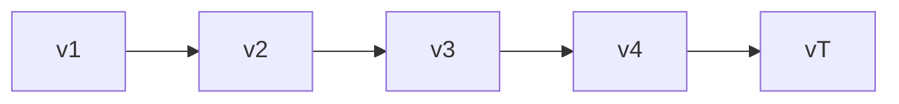
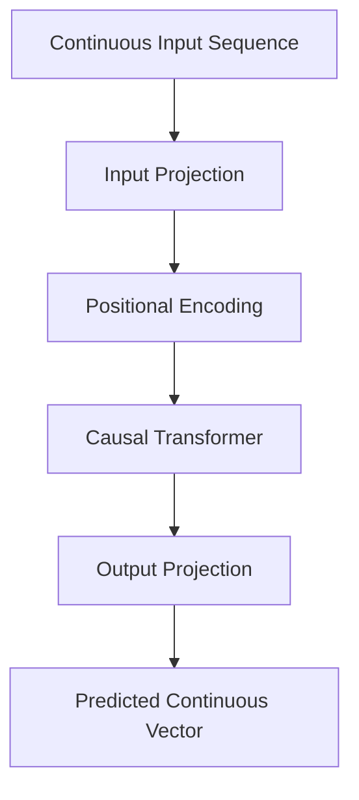
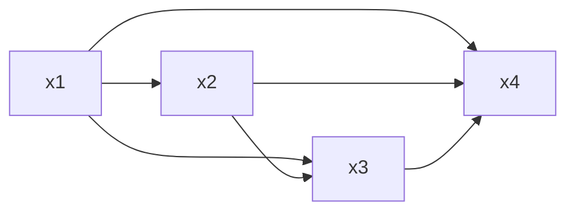
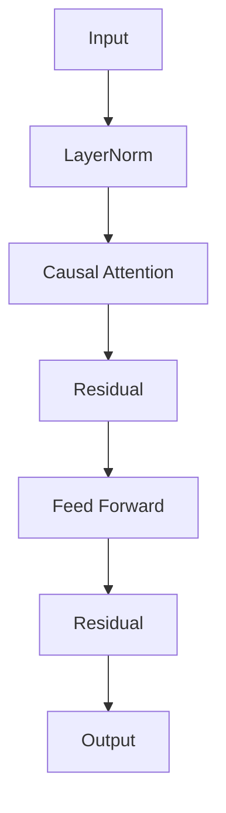
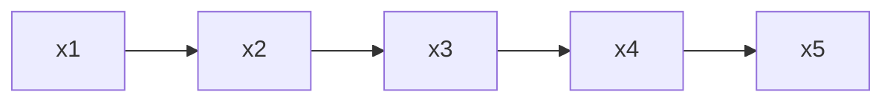
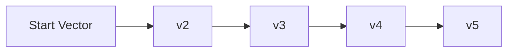
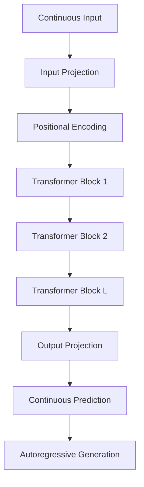
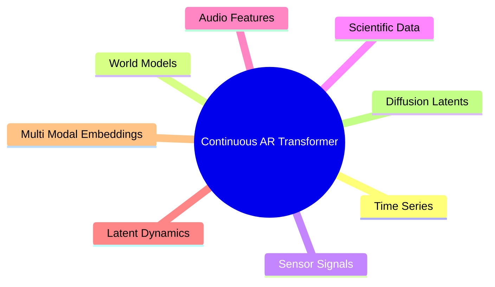
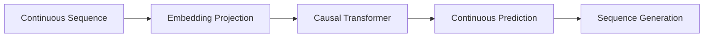

# Miscellaneous – Continuous Autoregressive Transformer Overview

> Minh họa tổng quát kiến trúc **Continuous Autoregressive Transformer** trong `x-transformers`, bao gồm Continuous Embeddings, Causal Self-Attention và Continuous Sequence Generation.

---

# 1. Mục tiêu của kiến trúc

Transformer truyền thống được thiết kế cho:

```text
Discrete Tokens
x₁, x₂, ..., xₜ
```

với:

```math
x_t \in \{1,\dots,V\}
```

Trong khi đó, nhiều bài toán thực tế yêu cầu:

```text
Continuous Vectors
v₁, v₂, ..., vₜ
```

với:

```math
v_t \in \mathbb{R}^{d}
```

Continuous Autoregressive Transformer mở rộng Transformer để mô hình hóa:

```math
p(v_1,\dots,v_T) = \prod_{t=1}^{T} p(v_t|v_{\lt t})
```

---

# 2. Ý tưởng cốt lõi



Mỗi vector tiếp theo được dự đoán từ toàn bộ lịch sử trước đó.

---

# 3. Kiến trúc tổng quát



---

# 4. Pipeline toàn bộ hệ thống

```text
Continuous Input
       │
       ▼
Input Projection
       │
       ▼
Transformer Embedding Space
       │
       ▼
Causal Self-Attention
       │
       ▼
Feed Forward Network
       │
       ▼
Output Projection
       │
       ▼
Continuous Prediction
```

---

# 5. Continuous Embedding

Thay vì:

```text
Token ID
    ↓
Embedding Lookup
```

sử dụng:

```text
Continuous Vector
      ↓
Linear Projection
```

Công thức:

```math
H_0 = XW_{in}+b_{in}
```

với:

```math
X \in \mathbb{R}^{B\times N\times d_{in}}
```

```math
W_{in} \in \mathbb{R}^{d_{in}\times d_{model}}
```

---

# 6. Positional Encoding

Sau khi chiếu:

```math
H = H_0 + P
```

với:

```math
P \in \mathbb{R}^{N\times d_{model}}
```

Có thể sử dụng:

* Absolute Position Embedding
* Rotary Embedding
* ALiBi
* Dynamic Positional Bias

---

# 7. Causal Self-Attention



Token tại thời điểm:

```math
t
```

chỉ được quan sát:

```math
1,\dots,t
```

---

## Causal Mask

```math
M_{ij} = \begin{cases}
0, & j \le i \\
-\infty, & j \gt i
\end{cases}
```

Attention:

```math
A = softmax \left( \frac{QK^T}{\sqrt d} + M \right)
```

---

# 8. Transformer Block



---

# 9. Output Projection

Transformer sinh:

```math
H_L \in \mathbb{R}^{B\times N\times d}
```

Projection:

```math
Y = H_LW_{out}+b_{out}
```

với:

```math
Y \in \mathbb{R}^{B\times N\times d_{out}}
```

Thông thường:

```math
d_{out} = d_{in}
```

---

# 10. Huấn luyện Autoregressive

Chuỗi:

```text
x1 x2 x3 x4 x5
```

được dịch:

```text
Input:
x1 x2 x3 x4

Target:
x2 x3 x4 x5
```

---

## Minh họa



---

# 11. Thuật toán huấn luyện

```text
Xin = X[:-1]

Target = X[1:]

Prediction =
    Transformer(Xin)

Loss =
    Distance(
        Prediction,
        Target
    )

Backpropagation
```

---

# 12. Hàm mất mát

Khác với Language Modeling:

```math
-\log p(x_t|x_{\lt t})
```

Continuous Transformer thường sử dụng:

### Mean Squared Error

```math
L = ||y-\hat y||_2^2
```

### Mean Absolute Error

```math
L = ||y-\hat y||_1
```

### Gaussian NLL

```math
L = -\log p(y|\hat y)
```

---

# 13. Sinh chuỗi (Generation)



---

## Thuật toán

```text
context = start_embedding

for t in range(T):

    next =
        Transformer(context)

    append(next)

    context =
        concat(context, next)
```

---

# 14. Kích thước Tensor

Cho:

```text
B : Batch Size
N : Sequence Length
din : Input Dimension
d : Model Dimension
```

Input:

```math
X \in \mathbb R^{B\times N\times d_{in}}
```

Hidden:

```math
H \in \mathbb R^{B\times N\times d}
```

Output:

```math
Y \in \mathbb R^{B\times N\times d_{out}}
```

---

# 15. Độ phức tạp tính toán

### Projection

```math
O(BNd_{in}d)
```

### Attention

```math
O(BN^2d)
```

### Output Projection

```math
O(BNdd_{out})
```

Bottleneck:

```math
O(N^2)
```

---

# 16. Toàn bộ kiến trúc



---

# 17. Vai trò trong x-transformers

```text
Continuous Embedding
            +
Causal Self-Attention
            +
Autoregressive Training
            +
Continuous Generation
            =
Continuous Autoregressive Transformer
```

---

# 18. Ứng dụng



---

# 19. Tổng kết



Continuous Autoregressive Transformer là sự mở rộng của GPT sang không gian vector liên tục, cho phép Transformer:

* mô hình hóa chuỗi không rời rạc;
* dự đoán vector tương lai;
* sinh chuỗi liên tục;
* học động lực học của hệ thống;
* xây dựng các Foundation Models cho dữ liệu phi ngôn ngữ.

Đây là một trong những hướng mở rộng quan trọng giúp Transformer trở thành kiến trúc học biểu diễn tổng quát cho mọi loại dữ liệu tuần tự.
