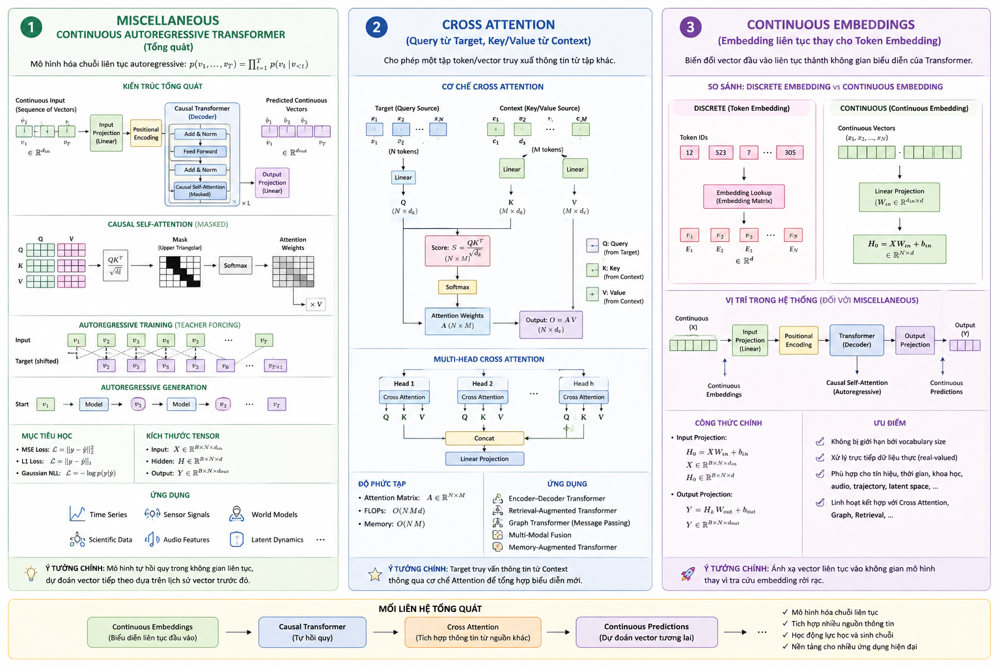
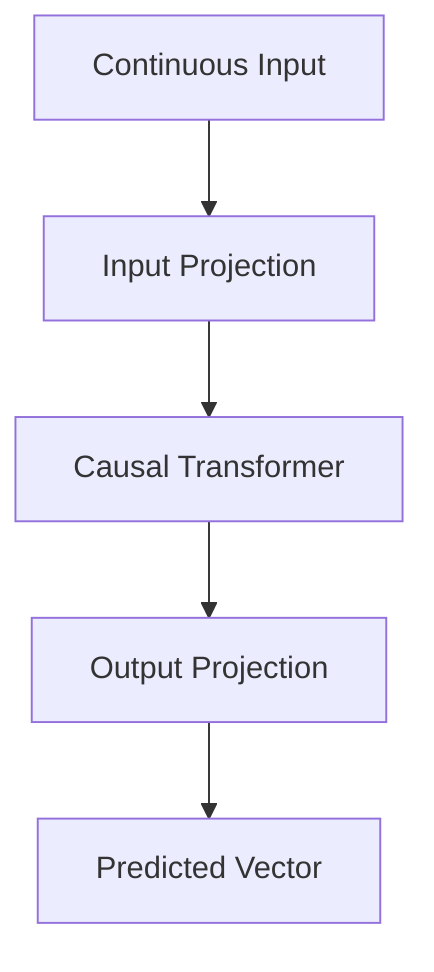
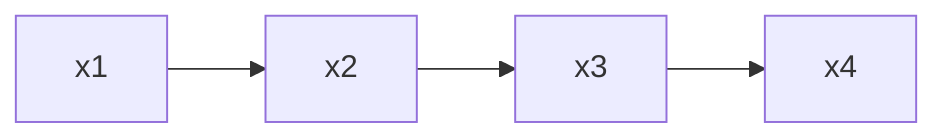
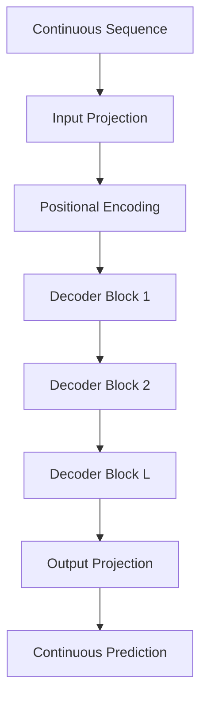
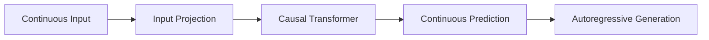

# Continuous Autoregressive Transformer trong x-Transformers

> Mở rộng Transformer tự hồi quy (Autoregressive Transformer) từ không gian token rời rạc sang không gian biểu diễn liên tục (Continuous Representation Space).

<p align="center">
  
</p>

---

# 1. Giới thiệu

## Hạn chế của Autoregressive Language Model truyền thống

Transformer tự hồi quy cổ điển được xây dựng trên chuỗi token rời rạc:

$$
x_t \in {1,\dots,V}
$$

Mô hình học phân phối:

$$
p(x_1,\dots,x_T)
$$

thông qua phân rã:

$$
p(x_1,\dots,x_T)= \prod_{t=1}^{T} p(x_t|x_{<t})
$$

Đầu ra của mô hình là phân phối xác suất trên vocabulary:

$$
p(x_t|x_{\lt t})= softmax(z_t)
$$

Cơ chế này giả định:

* không gian đầu ra hữu hạn;
* đầu vào là token rời rạc;
* mục tiêu học là bài toán phân loại.

Tuy nhiên nhiều bài toán thực tế yêu cầu mô hình hóa:

$$
x_t \in \mathbb{R}^{d}
$$

ví dụ:

* chuỗi thời gian;
* latent representation;
* embeddings;
* tín hiệu cảm biến;
* trajectory;
* audio feature;
* scientific signals.

Trong trường hợp này, Softmax trên vocabulary không còn phù hợp.

---

# 2. Ý tưởng của Continuous Autoregressive Transformer

Thay vì sinh token:

```text
x1 → x2 → x3 → ... → xT
```

mô hình sinh vector liên tục:

```text
v1 → v2 → v3 → ... → vT
```

với:

$$
v_t \in \mathbb{R}^{d}
$$

Mục tiêu:

$$
p(v_1,\dots,v_T)= \prod_{t=1}^{T} p(v_t|v_{<t})
$$

---

# 3. Kiến trúc tổng quát

```text
Continuous Sequence
        │
        ▼
Input Projection
        │
        ▼
Decoder Transformer
        │
        ▼
Output Projection
        │
        ▼
Predicted Continuous Vector
```

---

# 4. Minh họa bằng Mermaid



---

# 5. Causal Self-Attention

Giống GPT, mô hình chỉ được phép quan sát quá khứ.

Attention mask:

$$
M_{ij}= \begin{cases}
0, & j \le i \\
-\infty, & j \gt i
\end{cases}
$$

Attention:

$$
A= softmax \left( \frac{QK^T}{\sqrt d} + M \right)
$$

Output:

$$
O = AV
$$

---

# 6. Continuous Embedding Projection

Cho:

$$
X \in \mathbb{R}^{B\times N\times d_{in}}
$$

Input projection:

$$
H_0= XW_{in} +b_{in}
$$

với:

$$
W_{in} \in \mathbb{R}^{d_{in}\times d_{model}}
$$

---

# 7. Transformer Decoder

Sau khi thêm positional information:

$$
H= H_0+P
$$

Transformer học:

$$
H_L= f_{\theta}(H)
$$

với:

$$
f_{\theta}= L \text{ causal transformer blocks}
$$

---

# 8. Output Projection

Đầu ra:

$$
Y = H_LW_{out} +b_{out}
$$

với:

$$
Y \in \mathbb{R}^{B\times N\times d_{out}}
$$

Thông thường:

$$
d_{out}= d_{in}
$$

---

# 9. Mục tiêu học

Khác với Language Modeling:

## Discrete Transformer

$$
\mathcal L= -\log p(x_t|x_{<t})
$$

## Continuous Transformer

mục tiêu là hồi quy:

$$
\mathcal L= \sum_t D(y_t,\hat y_t)
$$

với:

* MSE Loss

$$
D= ||y_t-\hat y_t||_2^2
$$

* L1 Loss

$$
D= ||y_t-\hat y_t||_1
$$

* Gaussian NLL

$$
D = -\log p(y_t|\hat y_t)
$$

---

# 10. Continuous Autoregressive Wrapper

Trong `x-transformers`:

```python
model = ContinuousAutoregressiveWrapper(model)
```

Wrapper thực hiện:

1. tạo shifted targets;
2. causal masking;
3. autoregressive loss;
4. generation loop.

---

# 11. Thuật toán huấn luyện

Cho:

$$
X= (x_1,x_2,\dots,x_T)
$$

Input:

$$
X_{in}= x_1,\dots,x_{T-1})
$$

Target:

$$
X_{target}= (x_2,\dots,x_T)
$$

Mô hình học:

$$
p(x_t|x_{\lt t})
$$

---

## Pseudocode

```text
Input sequence X

Xin = X[:-1]
Target = X[1:]

Prediction = Transformer(Xin)

Loss =
Distance(
    Prediction,
    Target
)

Backpropagation
```

---

# 12. Thuật toán sinh chuỗi

Bắt đầu:

$$
x_1
$$

Lặp:

```text
x1
↓
Transformer
↓
x2
↓
Transformer
↓
x3
↓
...
```

---

## Pseudocode

```text
context = start_embedding

for t in range(T):

    next =
        Transformer(context)

    append(next)

    context =
        concat(context, next)
```

---

# 13. Minh họa Generation



---

# 14. Kiến trúc đầy đủ



---

# 15. Kích thước Tensor

Cho:

```text
B : batch size
N : sequence length
din : input dimension
d : model dimension
```

Input:

$$
X \in \mathbb R^{B\times N\times d_{in}}
$$

Hidden:

$$
H \in \mathbb R^{B\times N\times d}
$$

Output:

$$
Y \in \mathbb R^{B\times N\times d_{in}}
$$

---

# 16. Độ phức tạp tính toán

Projection:

$$
O(BNd_{in}d)
$$

Self-Attention:

$$
O(BN^2d)
$$

Output:

$$
O(BNdd_{out})
$$

Bottleneck:

$$
O(N^2)
$$

---

# 17. Ý nghĩa lý thuyết

Continuous Autoregressive Transformer mở rộng mô hình:

```text
Discrete Language Model
```

thành:

```text
General Continuous Sequence Model
```

Nó cho phép Transformer học:

* động lực học của hệ thống;
* latent trajectories;
* biểu diễn liên tục;
* vector sequences;
* multi-modal embeddings;
* world models;
* diffusion latent dynamics.

---

# 18. Vai trò trong x-Transformers

`ContinuousAutoregressiveWrapper` biến:

```python
ContinuousTransformerWrapper
```

thành:

```text
Continuous Generative Model
```

có khả năng:

* huấn luyện tự hồi quy;
* dự đoán vector tương lai;
* sinh chuỗi liên tục;
* mô hình hóa phân phối trên không gian liên tục.

Đây là bước quan trọng giúp Transformer vượt ra khỏi bài toán ngôn ngữ và trở thành kiến trúc tổng quát cho mô hình hóa chuỗi trong không gian vector.

---

# 19. Tổng kết



Continuous Autoregressive Transformer là sự kết hợp giữa:

1. Continuous Embedding;
2. Causal Self-Attention;
3. Autoregressive Modeling;
4. Continuous Regression Objective.

Kiến trúc này đóng vai trò nền tảng cho nhiều hướng nghiên cứu hiện đại về:

* Sequence Modeling;
* World Models;
* Scientific Foundation Models;
* Time-Series Transformers;
* Latent Generative Models.

---

# Tài liệu tham khảo

1. Vaswani et al., *Attention Is All You Need*, 2017.

2. Tay et al., *x-transformers: A Modular Transformer Library*, 2022.

3. Ha and Schmidhuber, *World Models*, 2018.

4. Peebles and Xie, *Scalable Diffusion Models with Transformers*, 2023.

5. Jaegle et al., *Perceiver IO*, 2021.

6. https://github.com/lucidrains/x-transformers

7. https://arxiv.org/abs/2112.05329
