# NormFormer - Overview Diagram

> Visual summary of the architecture, motivations, mathematical ideas and improvements proposed by NormFormer.

---

# 1. Big Picture

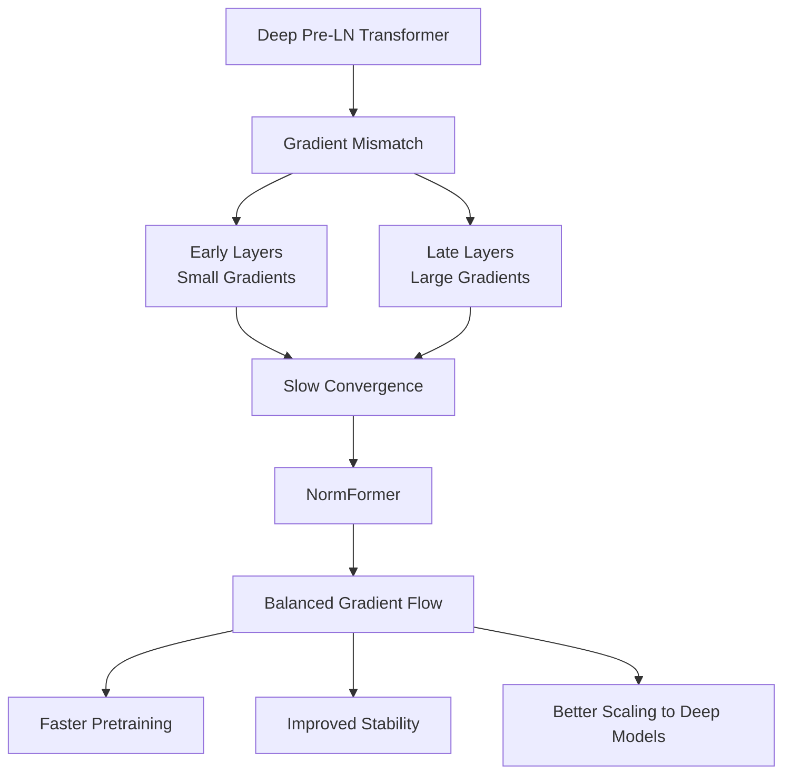

---

# 2. Gradient Problem in Pre-LN Transformers

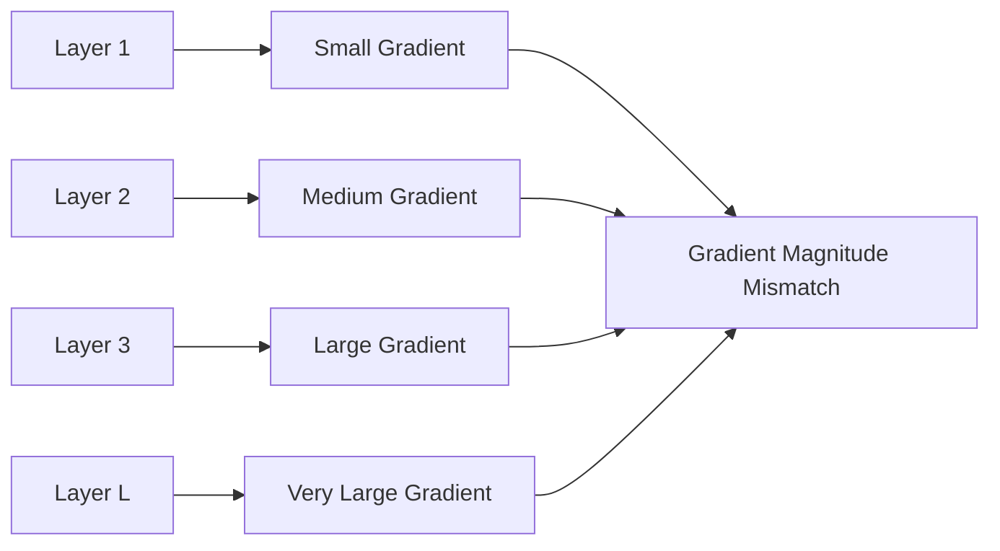

Mathematically,

```math
\left\| \nabla_{\theta_1}L \right\| \ll \left\| \nabla_{\theta_L}L \right\|
```

NormFormer aims to enforce

```math
\left\| \nabla_{\theta_1}L \right\| \approx \cdots \approx \left\| \nabla_{\theta_L}L \right\|
```

---

# 3. The Four Improvements of NormFormer

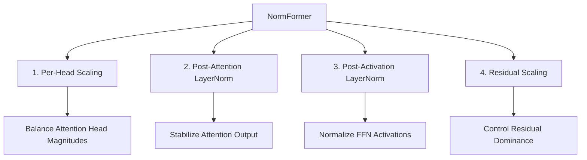

---

# 4. Per-Head Attention Scaling

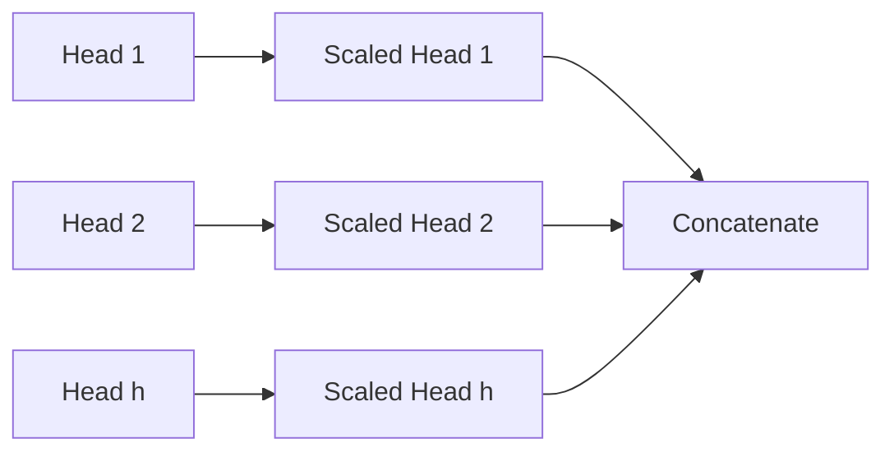

Mathematically,

```math
head_i' = g_i \cdot head_i
```

where

```math
g_i
```

is a learnable scalar.

---

# 5. Post-Attention LayerNorm

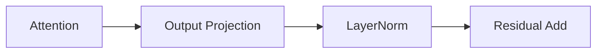

Instead of

```math
x + W_OH
```

NormFormer uses

```math
x + LN(W_OH)
```

---

# 6. Post-Activation LayerNorm in FFN

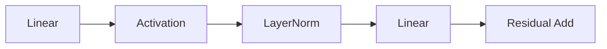

Mathematically,

```math
FFN(x) = W_2 LN \left( \sigma(W_1x) \right)
```

---

# 7. Residual Scaling

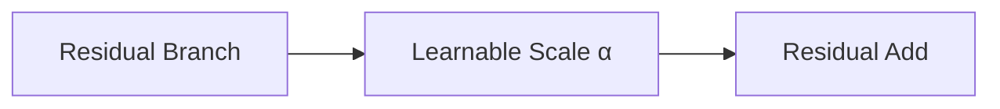

Instead of

```math
x + F(x)
```

NormFormer may use

```math
\alpha x + F(x)
```

where

```math
\alpha
```

is learnable.

---

# 8. Complete NormFormer Block

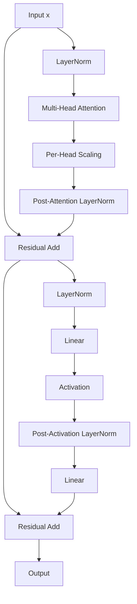

---

# 9. Mathematical View of a NormFormer Layer

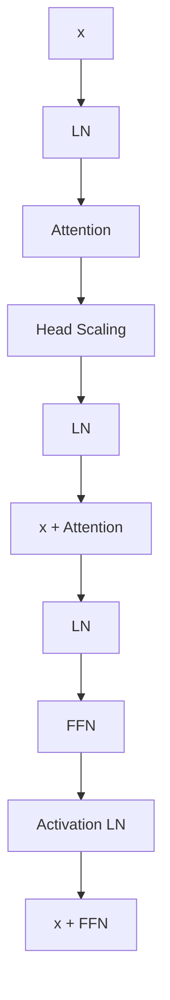

Equivalent equations:

```math
z_1 = LN(x)
```

```math
a = LN \left( Attention(z_1) \right)
```

```math
x' = x+a
```

```math
f = W_2 LN \left( \sigma(W_1LN(x')) \right)
```

```math
y = x'+f
```

---

# 10. Gradient Flow After NormFormer

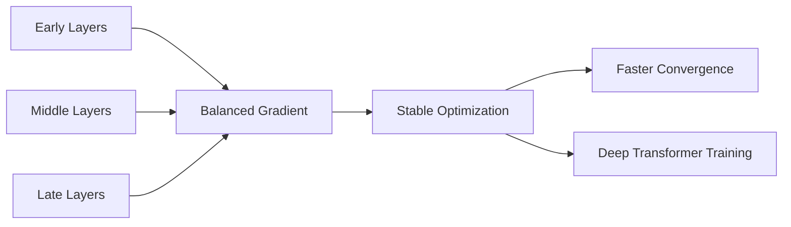

---

# 11. Position of NormFormer in x-transformers

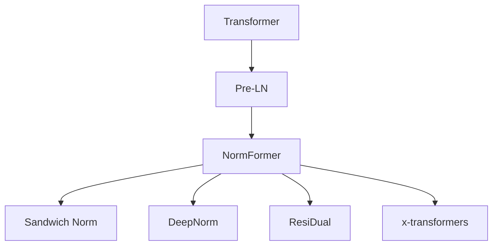

---

# 12. One-Slide Summary

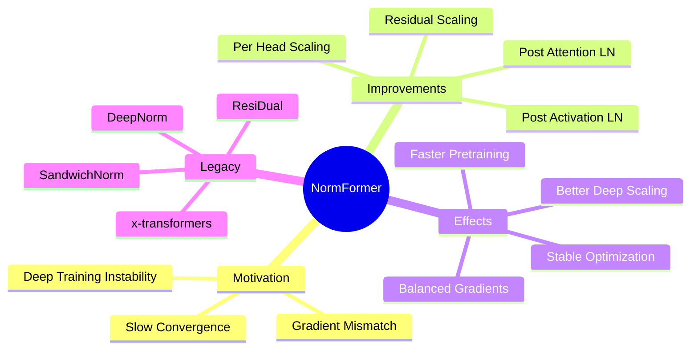

---

# Key Takeaways

* NormFormer does not change attention complexity.
* Adds only lightweight normalization and scaling.
* Significantly improves gradient balance.
* Enables more stable deep Transformer training.
* Forms an important building block of modern x-transformers.

