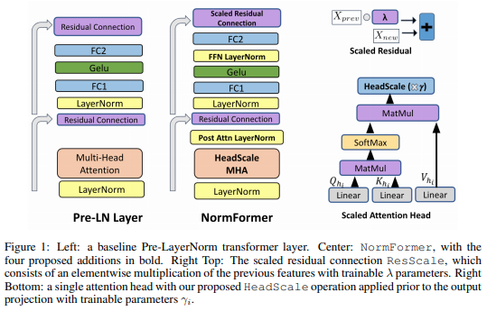
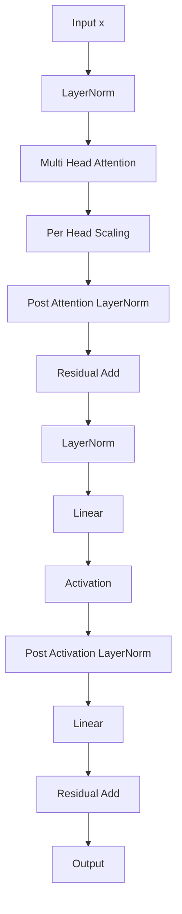
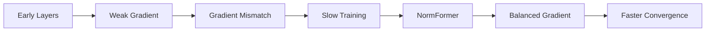

# NormFormer: Improved Transformer Pretraining with Extra Normalization and Scaling

> "Better gradient flow through strategically placed normalization layers."

**Paper:** *NormFormer: Improved Transformer Pretraining with Extra Normalization and Scaling*
Authors: Shleifer et al., 2022
Paper: https://openreview.net/pdf?id=GMYWzWztDx5

<p align="center"> 
  
</p> 

---

# 1. Giới thiệu

NormFormer là một cải tiến của kiến trúc **Pre-LayerNorm Transformer** nhằm giải quyết một vấn đề quan trọng nhưng ít được chú ý:

> **Gradient mismatch across layers**.

Các nghiên cứu thực nghiệm chỉ ra rằng trong Pre-LN Transformer:

* gradient ở các layer đầu quá nhỏ,
* gradient ở các layer cuối quá lớn,
* dẫn đến:

  * tốc độ hội tụ chậm,
  * tối ưu không ổn định,
  * cần nhiều bước pretraining hơn.

NormFormer đề xuất thêm các lớp chuẩn hóa và hệ số scale nhỏ để:

1. cân bằng gradient giữa các tầng;
2. ổn định huấn luyện sâu;
3. tăng hiệu quả pretraining mà không làm thay đổi đáng kể độ phức tạp.

---

# 2. Vấn đề của Pre-LN Transformer

Pre-LN Transformer:

```math
x_{l+1} = x_l + F(\mathrm{LN}(x_l))
```

Gradient:

```math
\frac{\partial L}{\partial x_l} = \frac{\partial L}{\partial x_{l+1}} \left( I + \frac{\partial F}{\partial x_l} \right)
```

Do residual connection:

```math
I
```

chiếm ưu thế nên:

* gradient dễ truyền tới các tầng cuối;
* các tầng đầu nhận gradient nhỏ hơn đáng kể.

Kết quả:

```text
Layer 1      : small gradients
Layer 6      : medium gradients
Layer 12     : large gradients
Layer 48     : extremely large gradients
```

Sự mất cân bằng này làm giảm hiệu quả học biểu diễn.

---

# 3. Ý tưởng cốt lõi của NormFormer

NormFormer bổ sung các phép chuẩn hóa vào bên trong block Transformer để:

```text
Input
 ↓
Pre-LN
 ↓
Attention
 ↓
Extra Normalization
 ↓
Residual
 ↓
FFN
 ↓
Extra Normalization
 ↓
Residual
```

Mục tiêu:

```math
\left\| \nabla_{\theta_1} L \right\| \approx \left\| \nabla_{\theta_2} L \right\| \approx \cdots \approx \left\| \nabla_{\theta_L} L \right\|
```

---

# 4. Bốn cải tiến của NormFormer

NormFormer đề xuất bốn thay đổi:

1. Per-head attention scaling
2. LayerNorm sau attention output projection
3. LayerNorm sau activation của FFN
4. Residual scaling

Trong `x-transformers`, ba thay đổi đầu được hỗ trợ trực tiếp và thay đổi thứ hai tương đương với Sandwich Norm.

---

# 5. Per-Head Attention Scaling

## Transformer gốc

```math
\mathrm{head}_i = \mathrm{Softmax} \left( \frac{Q_iK_i^T}{\sqrt d} \right)V_i
```

Sau đó:

```math
H = [\mathrm{head}_1;\dots;\mathrm{head}_h]
```

---

## NormFormer

Thêm hệ số học được:

```math
\mathrm{head}_i' = g_i \cdot \mathrm{head}_i
```

với:

```math
g_i \in \mathbb R
```

Kết quả:

```math
H = [g_1h_1; g_2h_2; \dots; g_hh_h]
```

---

## Ý nghĩa

Các attention head có:

* độ lớn gradient khác nhau;
* vai trò khác nhau.

Scaling giúp:

* cân bằng gradient;
* tránh một số head thống trị quá trình học.

---

# 6. Post-Attention LayerNorm

Sau phép chiếu:

```math
Y = W_OH
```

NormFormer thêm:

```math
Y' = \mathrm{LN}(Y)
```

Block trở thành:

```math
x_{l+1} = x_l + \mathrm{LN}(W_OH)
```

---

## Vai trò

Giảm:

```math
\mathrm{Var}(Y)
```

và ổn định:

```math
\mathrm{Var}(\nabla Y)
```

Điều này đặc biệt hữu ích với:

* mô hình rất sâu;
* batch size lớn;
* sequence dài.

---

# 7. Post-Activation LayerNorm trong FFN

FFN gốc:

```math
FFN(x) = W_2 \sigma(W_1x)
```

NormFormer:

```math
FFN(x) = W_2 \mathrm{LN} \left( \sigma(W_1x) \right)
```

---

## Tại sao cần?

Các activation như:

* GELU
* SwiGLU
* ReLU

có thể tạo ra:

```math
\mathrm{Var}(\sigma(W_1x)) \gg 1
```

Điều này làm:

* gradient bùng nổ cục bộ;
* tăng bất ổn trong quá trình tối ưu.

LayerNorm bổ sung:

```math
\mathrm{LN} \left( \sigma(W_1x) \right)
```

đưa phân phối trở lại ổn định.

---

# 8. Residual Scaling

Residual connection:

```math
x_{l+1} = x_l + F(x_l)
```

NormFormer sửa thành:

```math
x_{l+1} = \alpha x_l + F(x_l)
```

với:

```math
\alpha
```

là tham số học được.

---

## Ý tưởng

Residual path đôi khi quá mạnh:

```math
\|x_l\| \gg \|F(x_l)\|
```

làm mạng học gần như:

```math
x_{l+1} \approx x_l
```

Residual scaling giúp:

* tăng đóng góp của nhánh phi tuyến;
* cải thiện tốc độ học.

Tuy nhiên có thể gây:

* mất ổn định;
* divergence nếu scale quá lớn.

Do đó trong `x-transformers` tùy chọn này được khuyến nghị sử dụng cẩn thận.

---

# 9. Kiến trúc đầy đủ của NormFormer

```math
z_1 = \mathrm{LN}(x)
```

```math
a = \mathrm{Attention}(z_1)
```

```math
a = \mathrm{LN}(a)
```

```math
x' = x + a
```

```math
z_2 = \mathrm{LN}(x')
```

```math
f = W_2 \mathrm{LN} ( \sigma(W_1z_2) )
```

```math
y = x' + f
```

---

# 10. Sơ đồ kiến trúc



---

# 11. Gradient Flow



---

# 12. Độ phức tạp

NormFormer không thay đổi độ phức tạp attention:

| Thành phần      | Complexity |
| --------------- | ---------- |
| Attention       | O(n²d)     |
| FFN             | O(nd²)     |
| Extra LayerNorm | O(nd)      |
| Head Scaling    | O(h)       |

Chi phí tăng rất nhỏ:

```text
< 1% FLOPs
```

nhưng cải thiện đáng kể hiệu quả pretraining.

---

# 13. Vai trò trong x-transformers

Trong `x-transformers`:

```python
attn_head_scale=True
ff_post_act_ln=True
scale_residual=True
sandwich_norm=True
```

NormFormer trở thành một tập hợp các "micro-improvements" có thể kết hợp với:

* DeepNorm
* Sandwich Norm
* ResiDual
* RMSNorm
* ScaleNorm
* Transformer-XL
* x-transformers decoder stack.

---

# 14. Ý nghĩa đối với các Transformer rất sâu

NormFormer là một trong những nghiên cứu đầu tiên chỉ ra rằng:

> **Pre-LN không hoàn hảo về mặt tối ưu hóa.**

Đóng góp chính:

1. phân tích sự mất cân bằng gradient;
2. đề xuất cơ chế chuẩn hóa bổ sung;
3. cải thiện khả năng huấn luyện của Transformer sâu;
4. trở thành nền tảng cho nhiều biến thể trong x-transformers hiện đại.

---

# Tài liệu tham khảo

```bibtex
@inproceedings{shleifer2022normformer,
  title={NormFormer: Improved Transformer Pretraining with Extra Normalization and Scaling},
  author={Shleifer, Sam and Ott, Myle and et al.},
  booktitle={ICLR},
  year={2022}
}
```

```bibtex
@misc{xtransformers,
  author = {Phil Wang},
  title = {x-transformers},
  url = {https://github.com/lucidrains/x-transformers}
}
```

---
