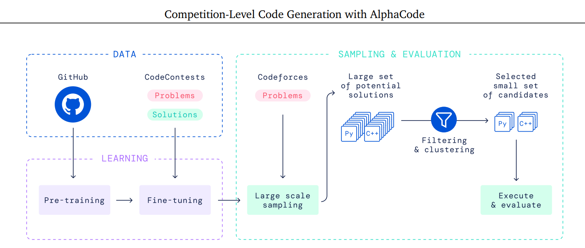

# Appendix A. AlphaCode và Sự Xác Nhận Thực Tiễn Của Multi-Query Attention

<p align="center"> 
  
</p> 

<p align="center"> 
 <em>Overview of AlphaCode.</em> 
</p>

## Mục tiêu của phụ lục

Paper:

> Competition-Level Code Generation with AlphaCode (DeepMind, 2022)

không phải là công trình đề xuất Multi-Query Attention (MQA).

MQA được đề xuất trước đó bởi:

> Noam Shazeer,
> Fast Transformer Decoding: One Write-Head is All You Need (2019)

Tuy nhiên AlphaCode là một trong những hệ thống quy mô lớn đầu tiên chứng minh rằng:

> Multi-Query Attention có thể hoạt động hiệu quả ở quy mô sản xuất mà không làm suy giảm đáng kể chất lượng mô hình.

Do đó AlphaCode thường được xem là bằng chứng thực nghiệm quan trọng cho MQA.

---

# 1. Bối cảnh

AlphaCode là hệ thống sinh mã nguồn tự động của DeepMind.

Mục tiêu:

```text
Mô tả bài toán
      ↓
Sinh hàng nghìn chương trình
      ↓
Lọc và đánh giá
      ↓
Chọn lời giải tốt nhất
```

Khác với chatbot thông thường, AlphaCode phải sinh:

* nhiều lời giải
* rất dài
* hàng nghìn token

đối với mỗi bài toán.

---

# 2. Thách thức của Transformer

Trong quá trình sinh code:

```text
Token 1
Token 2
Token 3
...
Token N
```

mỗi token mới cần truy cập toàn bộ lịch sử.

Transformer sử dụng:

$$
K
$$

và

$$
V
$$

được lưu trong KV Cache.

---

Đối với Multi-Head Attention:

$$
H
$$

attention heads tương ứng với:

$$
H
$$

bộ Key

và

$$
H
$$

bộ Value.

---

Dung lượng cache:

$$
O(HN)
$$

với:

* $H$ là số head
* $N$ là chiều dài chuỗi

---

Khi:

$$
N \rightarrow 10^4
$$

hoặc

$$
N \rightarrow 10^5
$$

KV Cache trở thành nút thắt bộ nhớ.

---

# 3. Vấn đề trong sinh mã nguồn

Mã nguồn có một đặc điểm quan trọng:

```text
Context rất dài
```

Ví dụ:

```python
class Graph:
    ...

def dfs(...):
    ...

def solve():
    ...
```

Một token xuất hiện ở cuối chương trình có thể phụ thuộc vào:

* tên biến
* tên hàm
* kiểu dữ liệu

được định nghĩa từ rất xa.

Do đó mô hình cần:

```text
Long Context
```

---

Long Context dẫn tới:

```text
KV Cache lớn
```

---

# 4. Giải pháp của AlphaCode

AlphaCode sử dụng:

```text
Multi-Query Attention
```

thay vì:

```text
Multi-Head Attention
```

truyền thống.

---

# 5. Ý tưởng MQA

Transformer chuẩn:

```text
Head1 -> K1,V1
Head2 -> K2,V2
Head3 -> K3,V3
...
HeadH -> KH,VH
```

---

MQA:

```text
Head1 ----\
Head2 -----\
Head3 ------> Shared K,V
...
HeadH -----/
```

---

Các Query vẫn độc lập:

$$
Q_i= XW_i^Q
$$

---

Nhưng:

$$
K=XW^K
$$

$$
V=XW^V
$$

chỉ được tính một lần.

---

# 6. Tại sao MQA quan trọng với AlphaCode?

## Giảm bộ nhớ

Multi-Head Attention:

$$
\text{Memory}= O(HN)
$$

---

MQA:

$$
\text{Memory}= O(N)
$$

---

Tỷ lệ giảm:

$$
\frac{1}{H}
$$

---

Ví dụ:

$$
H=32
$$

thì:

$$
32\times
$$

ít bộ nhớ hơn.

---

# 7. Tăng tốc độ suy luận

Trong autoregressive decoding:

```text
token t
      ↓
đọc KV Cache
      ↓
tính attention
      ↓
sinh token t+1
```

Chi phí lớn nhất thường là:

```text
Memory Bandwidth
```

không phải FLOPs.

---

MQA làm giảm:

```text
Lượng dữ liệu phải đọc
```

nên:

```text
Latency thấp hơn
Throughput cao hơn
```

---

# 8. Vì sao chất lượng không giảm nhiều?

Một phát hiện thú vị của AlphaCode:

> Query Heads mới là thành phần tạo ra sự đa dạng trong attention.

---

Các head vẫn giữ:

$$
Q_1,Q_2,\dots,Q_H
$$

---

Nghĩa là mô hình vẫn có khả năng:

* chú ý cú pháp
* chú ý biến
* chú ý kiểu dữ liệu
* chú ý hàm

ở các không gian khác nhau.

---

Điểm bị chia sẻ chỉ là:

$$
K,V
$$

---

Trong thực nghiệm:

```text
MQA ≈ MHA
```

về chất lượng.

---

# 9. Từ AlphaCode tới PaLM

Sau AlphaCode, DeepMind tiếp tục sử dụng MQA trong:

```text
PaLM
```

---

Điều này củng cố giả thuyết:

> MQA không chỉ hoạt động cho code generation mà còn hoạt động cho language modeling quy mô rất lớn.

---

# 10. Hạn chế được phát hiện

Dù thành công, MQA vẫn tồn tại nhược điểm.

Toàn bộ Query Heads phải chia sẻ:

```text
1 Key Head
1 Value Head
```

---

Điều này làm giảm:

```text
Representation Capacity
```

---

Một số nghiên cứu sau đó chỉ ra:

$$
\text{MHA} > \text{MQA}
$$

về chất lượng mô hình.

---

# 11. Sự ra đời của GQA

Nghiên cứu tiếp theo đề xuất:

> Grouped Query Attention (GQA)

---

Thay vì:

```text
32 Query Heads
1 KV Head
```

sử dụng:

```text
32 Query Heads
8 KV Heads
```

---

Minh họa:

```text
Q1
Q2
Q3
Q4
  \
   KV1

Q5
Q6
Q7
Q8
  \
   KV2

...
```

---

Điều này tạo ra sự cân bằng giữa:

```text
Memory
Speed
Quality
```

---

# 12. Liên hệ với README chính

Trong README chính:

```text
Multi-Head Attention
        ↓
Multi-Query Attention
        ↓
Grouped Query Attention
```

AlphaCode đóng vai trò:

```text
Practical Validation
```

tức là bằng chứng thực nghiệm đầu tiên cho thấy MQA hoạt động ở quy mô rất lớn.

---

# 13. Kết luận

Đóng góp quan trọng nhất của AlphaCode đối với lịch sử Attention không nằm ở việc phát minh ra MQA.

Thay vào đó, AlphaCode chứng minh rằng:

> Một Transformer với nhiều Query Heads nhưng chỉ một Key/Value Head vẫn có thể đạt hiệu năng cạnh tranh ở quy mô cực lớn.

Kết quả này mở đường cho:

```text
PaLM
     ↓
PaLM 2
     ↓
GQA
     ↓
LLaMA-2
     ↓
Gemma
     ↓
Mistral
     ↓
Gemini
```

và biến MQA/GQA trở thành tiêu chuẩn thực tế trong các Large Language Models hiện đại.
